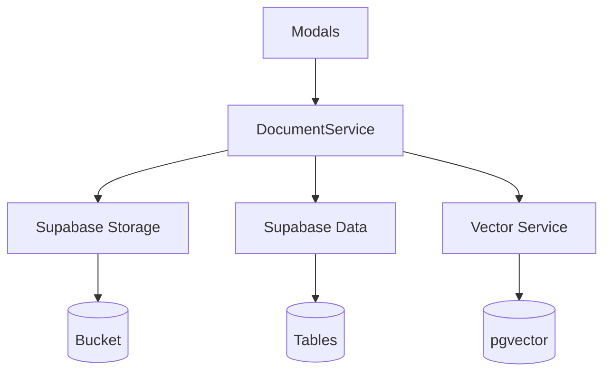

# Supabase Document Store Bypass Implementation Plan

## Overview
Temporary solution to bypass Flowise document store while maintaining compatibility for future migration.

## Architecture


## Implementation Phases

### Phase 1: Core Infrastructure (3 days)
- [ ] Configure Supabase bucket and RLS policies  
- [ ] Set up pgvector extension
- [ ] Create transaction handling procedures
- [ ] Implement document analysis service

### Phase 2: Service Layer (4 days)
- [ ] Implement SupabaseDocumentService
- [ ] Create VectorService with auto-chunking
- [ ] Develop fallback mechanism to Flowise
- [ ] Build configuration rules database

### Phase 3: Modal Integration (3 days)
- [ ] Update document-upload-service.js
- [ ] Enhance modal components with auto-config
- [ ] Implement intelligent chunking UI
- [ ] Add manual override capability

## Configuration Requirements

### Supabase Client
```javascript
// Updated configuration in supabaseClient.js
const supabase = createClient(
  process.env.SUPABASE_URL,
  process.env.SUPABASE_KEY,
  {
    auth: { persistSession: false },
    db: { 
      schema: 'public',
      pool: { max: 25 }
    }
  }
)
```

### Bucket Structure
```
documents/
├── contracts/
├── reports/
└── attachments/
```

## Testing Strategy

| Test Type | Tools | Coverage |
|-----------|-------|----------|
| Unit | Jest | Service layer & analysis |
| Integration | Cypress | Modal workflows |
| Performance | k6 | Concurrent uploads |
| Security | OWASP ZAP | Access controls |
| Accuracy | Custom | Chunking heuristics |

## Rollback Procedures
1. Maintain Flowise integration points
2. Document all changes in `docs/1363_FLOWISE_REVERT_GUIDE.md`
3. Create feature flags for easy switching

## Performance Benchmarks
| Operation | Target Latency | Throughput |
|-----------|----------------|------------|
| Document Upload | <500ms | 50 req/s |
| Vector Search | <1s | 20 req/s |  
| Metadata Query | <200ms | 100 req/s |
| Document Analysis | <300ms | 30 req/s |

## Milestones & Tracking
- [ ] Phase 1 Complete (YYYY-MM-DD)
- [ ] Phase 2 Complete (YYYY-MM-DD) 
- [ ] Phase 3 Complete (YYYY-MM-DD)
- [ ] Performance Validation (YYYY-MM-DD)
- [ ] Production Deployment (YYYY-MM-DD)

## Team Responsibilities  
| Role | Responsibilities |
|------|------------------|
| Backend | Service layer & analysis |
| Frontend | Modal integration |
| DevOps | Supabase configuration |
| QA | Test automation |
| Data | Chunking heuristics |
