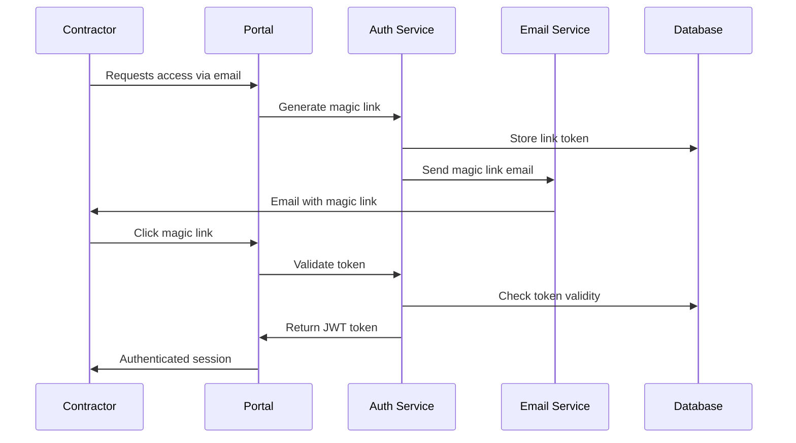
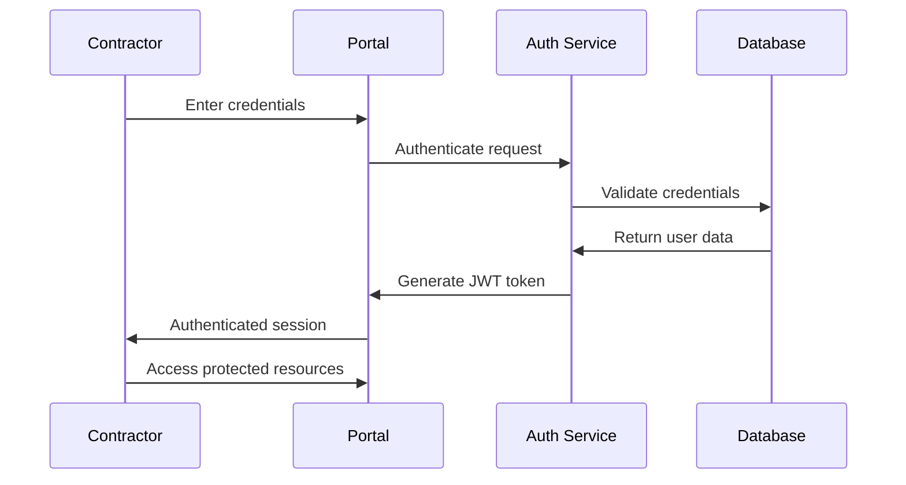

# 02401_EXTERNAL_CONTRACTOR_AUTHENTICATION_ACCESS_PLAN.md - External Contractor Authentication and Form Access Implementation Plan - Construct AI System Documentation

## Document Usage Guide

**🎯 This Document's Role**: Comprehensive implementation plan for enabling external contractors to authenticate and access their assigned evaluation forms through a secure, user-friendly interface. **Establishes the foundation for contractor self-service HSE compliance evaluation.**

**📚 Related Documents in Implementation Ecosystem:**

- **`server/src/routes/external-party-evaluation-routes.js`** → Current API endpoints for external party access
- **`client/src/pages/01850-other-parties/components/modals/01850-ContractorVettingModal.jsx`** → Internal vetting interface (separate from contractor access)
- **`docs/authentication/0020_AUTHENTICATION_OVERVIEW.md`** → Overall authentication system context
- **`docs/standards/0002_FILE_NAMING_STANDARDS.md`** → File naming conventions followed in this document

---

## Implementation Overview

### **Business Context**

External contractors need secure access to their assigned HSE evaluation forms without exposing internal systems. This implementation enables:

- ✅ Self-service HSE compliance evaluation completion
- ✅ Secure contractor authentication separate from internal users
- ✅ Limited scope access (evaluation forms only)
- ✅ Email-based invitation and access management
- ✅ Progress tracking and submission workflow

### **Current State Analysis**

- **Existing Infrastructure**: API endpoints exist for external party evaluation (`/api/external-party-evaluation/`)
- **Authentication**: Currently uses email header bypass; needs production JWT implementation
- **Access Control**: Document-level permissions based on assigned contractor emails
- **UI Gap**: No dedicated contractor login interface or form-filling frontend

### **Success Criteria**

- Contractors can authenticate using email/password or email magic links
- Contractors see only their assigned evaluation documents
- Form submissions are securely stored and tracked
- Internal teams receive submission notifications
- Audit trail maintained for compliance requirements

---

## Implementation Scope and Requirements

### **Functional Requirements**

#### **Authentication & Access Management**

- [ ] **Secure Login**: Implement JWT-based authentication for external contractors
- [ ] **Email-Based Access**: Contractors access forms via emailed invitations/links
- [ ] **Session Management**: Secure session handling with appropriate timeouts
- [ ] **Password Policies**: Secure password requirements for contractor accounts
- [ ] **Multi-Factor Support**: Optional 2FA for high-security evaluations

#### **User Interface & Experience**

- [ ] **Dedicated Contractor Portal**: Separate login interface from internal systems
- [ ] **Dashboard**: Overview of assigned evaluations and submission status
- [ ] **Form Rendering**: Dynamic form display with validation and progress tracking
- [ ] **Responsive Design**: Mobile-friendly interface for field contractors
- [ ] **Progress Indicators**: Clear visual feedback on completion status

#### **Form Management & Submission**

- [ ] **Dynamic Form Generation**: Render forms based on document schema
- [ ] **Draft Saving**: Auto-save functionality for long forms
- [ ] **Validation**: Client and server-side validation of form responses
- [ ] **File Attachments**: Support for document uploads as part of evaluations
- [ ] **Submission Workflow**: Multi-step submission with confirmation

### **Technical Requirements**

#### **Security Requirements**

- [ ] **Isolated Authentication**: Separate user table/collection for contractors
- [ ] **Scoped Permissions**: Contractors can only access their assigned documents
- [ ] **Data Encryption**: Sensitive responses encrypted at rest and in transit
- [ ] **Audit Logging**: All contractor actions logged for compliance
- [ ] **Session Security**: Secure JWT tokens with appropriate expiration

#### **Integration Requirements**

- [ ] **Email Integration**: Automated invitation and notification emails
- [ ] **Document Management**: Integration with existing evaluation system
- [ ] **Notification System**: Internal notifications on form submissions
- [ ] **Reporting**: Analytics on contractor engagement and completion rates

#### **Performance Requirements**

- [ ] **Scalability**: Support for hundreds of concurrent contractor sessions
- [ ] **Mobile Optimization**: Fast loading on mobile networks
- [ ] **Offline Capability**: Partial offline form completion with sync
- [ ] **Load Balancing**: Handle peak usage during compliance seasons

### **Non-Functional Requirements**

- **Usability**: Intuitive interface requiring minimal training
- **Accessibility**: WCAG 2.1 AA compliance for contractor accessibility
- **Internationalization**: Support for multiple languages as needed
- **Data Retention**: Compliant retention policies for contractor data

---

## Implementation Architecture

### **System Architecture Overview**

```
┌─────────────────────────────────────────────────────────────┐
│                 CONTRACTOR FACING INTERFACE                 │
│  ┌─────────────────────────────────────────────────────────┐  │
│  │  Contractor Login Portal (/contractor-access)          │  │
│  │  ├─ Authentication Module                              │  │
│  │  ├─ Dashboard Module                                   │  │
│  │  └─ Form Rendering Module                               │  │
│  └─────────────────────────────────────────────────────────┘  │
└─────────────────────────────────────────────────────────────┘
                                  │
                                  ▼
┌─────────────────────────────────────────────────────────────┐
│              API GATEWAY & AUTHENTICATION                   │
│  ┌─────────────────────────────────────────────────────────┐  │
│  │  JWT Authentication Service                            │  │
│  │  ├─ Token Generation & Validation                      │  │
│  │  ├─ Session Management                                 │  │
│  │  └─ Permission Scoping                                 │  │
│  └─────────────────────────────────────────────────────────┘  │
└─────────────────────────────────────────────────────────────┘
                                  │
                                  ▼
┌─────────────────────────────────────────────────────────────┐
│                EXTERNAL PARTY EVALUATION API                │
│  ┌─────────────────────────────────────────────────────────┐  │
│  │  Current: external-party-evaluation-routes.js          │  │
│  │  ├─ GET /documents (contractor-specific)               │  │
│  │  ├─ GET /documents/:id (form details)                  │  │
│  │  └─ PUT /documents/:id/responses (form submission)     │  │
│  └─────────────────────────────────────────────────────────┘  │
└─────────────────────────────────────────────────────────────┘
                                  │
                                  ▼
┌─────────────────────────────────────────────────────────────┐
│             DATABASE & DATA MANAGEMENT                      │
│  ┌─────────────────────────────────────────────────────────┐  │
│  │  Supabase Tables:                                      │  │
│  │  ├─ external_party_users (NEW)                         │  │
│  │  ├─ external_party_document_instances                   │  │
│  │  ├─ evaluation_packages                                │  │
│  │  └─ contractor_responses                               │  │
│  └─────────────────────────────────────────────────────────┘  │
└─────────────────────────────────────────────────────────────┘
```

### **Database Schema Extensions**

#### **New Tables Required**

```sql
-- External contractor user accounts
CREATE TABLE external_party_users (
    id UUID PRIMARY KEY DEFAULT gen_random_uuid(),
    email VARCHAR(255) UNIQUE NOT NULL,
    company_name VARCHAR(255),
    contact_name VARCHAR(255),
    user_type VARCHAR(50) DEFAULT 'contractor',
    status VARCHAR(50) DEFAULT 'active',
    invitation_sent_at TIMESTAMP WITH TIME ZONE,
    first_login_at TIMESTAMP WITH TIME ZONE,
    last_login_at TIMESTAMP WITH TIME ZONE,
    created_at TIMESTAMP WITH TIME ZONE DEFAULT NOW(),
    updated_at TIMESTAMP WITH TIME ZONE DEFAULT NOW()
);

-- Contractor session management
CREATE TABLE contractor_sessions (
    id UUID PRIMARY KEY DEFAULT gen_random_uuid(),
    user_id UUID REFERENCES external_party_users(id),
    token_hash VARCHAR(255),
    expires_at TIMESTAMP WITH TIME ZONE,
    ip_address INET,
    user_agent TEXT,
    created_at TIMESTAMP WITH TIME ZONE DEFAULT NOW()
);

-- Enhanced response storage with drafts
CREATE TABLE contractor_form_drafts (
    id UUID PRIMARY KEY DEFAULT gen_random_uuid(),
    document_instance_id UUID REFERENCES external_party_document_instances(id),
    contractor_id UUID REFERENCES external_party_users(id),
    draft_data JSONB,
    last_saved_at TIMESTAMP WITH TIME ZONE DEFAULT NOW(),
    created_at TIMESTAMP WITH TIME ZONE DEFAULT NOW()
);
```

#### **Enhanced Existing Tables**

- Add `contractor_user_id` foreign key to `external_party_document_instances`
- Add draft status tracking to `external_party_document_instances`
- Add submission metadata to `external_party_document_instances`

### **API Endpoint Extensions**

#### **Authentication Endpoints**

```javascript
// New authentication routes for contractors
POST / api / contractor / auth / login; // Email/password login
POST / api / contractor / auth / magic - link; // Magic link request
GET / api / contractor / auth / verify - link; // Magic link verification
POST / api / contractor / auth / logout; // Session termination
GET / api / contractor / auth / me; // Current user info
```

#### **Enhanced Evaluation Endpoints**

```javascript
// Enhanced existing routes
GET  /api/external-party-evaluation/documents              // Now JWT authenticated
GET  /api/external-party-evaluation/documents/:id          // Now JWT authenticated
PUT  /api/external-party-evaluation/documents/:id/responses // Now JWT authenticated
POST /api/external-party-evaluation/documents/:id/draft     // NEW: Draft saving
```

## Implementation Phases

### **Phase 1: Authentication Foundation (Week 1-2)**

#### **Objectives**

- Implement secure contractor authentication system
- Create contractor user management
- Set up JWT token handling for external users

#### **Deliverables**

1. **Database Schema Updates**
   - Create `external_party_users` table
   - Add contractor session management
   - Update existing tables for contractor linkage

2. **Authentication Service**
   - JWT token generation and validation
   - Magic link email system
   - Session management middleware

3. **API Endpoints**
   - `/api/contractor/auth/*` endpoints
   - Contractor user registration/invitation
   - Password reset functionality

#### **Testing Criteria**

- JWT tokens properly generated and validated
- Email invitations sent successfully
- Session management works across requests
- Proper separation from internal authentication

### **Phase 2: Contractor Portal Frontend (Week 3-4)**

#### **Objectives**

- Create dedicated contractor login interface
- Build evaluation dashboard and form rendering
- Implement responsive design for mobile access

#### **Deliverables**

1. **Contractor Login Interface**
   - Clean, professional login form
   - Magic link and password login options
   - Forgot password functionality
   - Terms and conditions acceptance

2. **Dashboard Module**
   - Overview of assigned evaluations
   - Progress tracking for each form
   - Due date warnings and status indicators
   - Company profile management

3. **Form Rendering Engine**
   - Dynamic form generation from document schemas
   - Real-time validation feedback
   - Auto-save draft functionality
   - File upload support for attachments

#### **Testing Criteria**

- Interface loads correctly on desktop and mobile
- Forms render properly with all field types
- Draft saving works without data loss
- Navigation flow is intuitive for end users

### **Phase 3: Integration and Security (Week 5-6)**

#### **Objectives**

- Integrate with existing evaluation system
- Implement comprehensive security measures
- Set up monitoring and logging

#### **Deliverables**

1. **System Integration**
   - Link contractor authentication with existing evaluation APIs
   - Implement proper permission scoping
   - Set up automated email notifications

2. **Security Implementation**
   - Row Level Security (RLS) policies for contractor data
   - Input validation and sanitization
   - Rate limiting for API endpoints
   - Audit logging for all contractor actions

3. **Monitoring and Analytics**
   - Contractor engagement analytics
   - Form completion tracking
   - Performance monitoring for portal
   - Error logging and alerting

#### **Testing Criteria**

- All existing evaluation functionality works with new authentication
- Security vulnerabilities identified and resolved
- Performance meets requirements under load
- Audit logs capture all required actions

### **Phase 4: Testing and Deployment (Week 7-8)**

#### **Objectives**

- Comprehensive testing across all user scenarios
- Performance optimization and scalability testing
- Production deployment preparation

#### **Deliverables**

1. **User Acceptance Testing**
   - Contractor user journey testing
   - Internal staff notification testing
   - Edge case handling (expired links, invalid data, etc.)

2. **Performance Optimization**
   - Load testing with multiple concurrent users
   - Database query optimization
   - Frontend performance improvements

3. **Deployment Preparation**
   - Production configuration setup
   - Database migration scripts
   - Rollback procedures and monitoring

#### **Testing Criteria**

- All user acceptance criteria met
- Performance benchmarks achieved
- Zero critical security vulnerabilities
- Successful production deployment

---

## Technical Implementation Details

### **Authentication Flow Design**

#### **Magic Link Authentication (Recommended)**



#### **Password-Based Authentication (Alternative)**



### **Frontend Component Architecture**

#### **Component Hierarchy**

```
ContractorPortal/
├── Auth/
│   ├── LoginForm.jsx
│   ├── MagicLinkRequest.jsx
│   ├── PasswordReset.jsx
│   └── AuthGuard.jsx
├── Dashboard/
│   ├── EvaluationOverview.jsx
│   ├── ProgressTracker.jsx
│   └── NotificationCenter.jsx
├── Forms/
│   ├── FormRenderer.jsx
│   ├── FieldComponents/
│   │   ├── TextInput.jsx
│   │   ├── RadioGroup.jsx
│   │   ├── FileUpload.jsx
│   │   └── SignaturePad.jsx
│   ├── ValidationEngine.jsx
│   └── DraftManager.jsx
└── Shared/
    ├── Header.jsx
    ├── Navigation.jsx
    └── LoadingSpinner.jsx
```

### **Security Implementation**

#### **JWT Token Structure**

```json
{
  "sub": "contractor-uuid",
  "email": "contractor@company.com",
  "type": "external_party",
  "scope": "evaluation_access",
  "permissions": ["read_assigned_documents", "submit_responses"],
  "exp": 1638360000,
  "iat": 1638273600,
  "iss": "construct-ai-contractor-portal"
}
```

#### **Row Level Security Policies**

```sql
-- Only allow contractors to see their own assigned documents
CREATE POLICY contractor_document_access ON external_party_document_instances
FOR SELECT USING (
  assigned_to_party_email = (SELECT email FROM external_party_users WHERE id = current_contractor_id())
);

-- Only allow contractors to update their own responses
CREATE POLICY contractor_response_update ON external_party_document_instances
FOR UPDATE USING (
  assigned_to_party_email = (SELECT email FROM external_party_users WHERE id = current_contractor_id())
);
```

### **Performance Optimization Strategies**

#### **Frontend Optimizations**

- Code splitting for route-based loading
- Lazy loading of heavy components (file upload, rich text editors)
- Service worker for offline capability
- Progressive Web App features for mobile users

#### **Backend Optimizations**

- Database query result caching
- Efficient pagination for large document lists
- Background processing for heavy operations (file processing, notifications)
- CDN integration for static assets

---

## Risk Assessment and Mitigation

### **Technical Risks**

| Risk                              | Probability | Impact | Mitigation Strategy                                       |
| --------------------------------- | ----------- | ------ | --------------------------------------------------------- |
| JWT Token Vulnerabilities         | Medium      | High   | Regular security audits, token rotation, secure storage   |
| Session Hijacking                 | Low         | High   | HTTPS only, secure cookie flags, session monitoring       |
| Database Performance Issues       | Medium      | Medium | Query optimization, indexing, load testing                |
| Third-party Email Service Outages | Low         | Medium | Multiple email providers, retry mechanisms, notifications |
| Mobile Compatibility Issues       | Low         | Medium | Cross-browser testing, responsive design framework        |

### **Business Risks**

| Risk                              | Probability | Impact   | Mitigation Strategy                                    |
| --------------------------------- | ----------- | -------- | ------------------------------------------------------ |
| Low Contractor Adoption           | Medium      | High     | User training, clear documentation, incentive programs |
| Data Privacy Compliance Issues    | Low         | High     | Legal review, GDPR compliance, data minimization       |
| Integration with Existing Systems | Medium      | High     | Thorough API testing, phased rollout, rollback plans   |
| Security Breaches                 | Low         | Critical | Multi-layer security, regular penetration testing      |
| Performance Issues Under Load     | Medium      | Medium   | Scalability testing, monitoring, auto-scaling setup    |

### **Operational Risks**

| Risk                         | Probability | Impact | Mitigation Strategy                                           |
| ---------------------------- | ----------- | ------ | ------------------------------------------------------------- |
| Email Delivery Issues        | Medium      | Medium | Email monitoring, delivery statistics, alternative channels   |
| User Support Requirements    | High        | Medium | Self-service documentation, help system, support ticketing    |
| Change Management Challenges | Medium      | Medium | Stakeholder communication, training programs, phased rollout  |
| Vendor Dependency Issues     | Low         | Medium | Service level agreements, backup providers, contingency plans |

---

## Success Metrics and KPIs

### **Technical Metrics**

- **Uptime**: >99.5% portal availability
- **Response Times**: <2 seconds for page loads, <500ms for API responses
- **Error Rates**: <1% of requests result in errors
- **Security Incidents**: Zero security breaches
- **Performance**: Support 500+ concurrent users

### **User Experience Metrics**

- **Task Completion Rate**: >95% of assigned forms completed successfully
- **User Satisfaction**: >4.5/5 user satisfaction rating
- **Time to Complete**: Average form completion <30 minutes
- **Mobile Usage**: >60% of sessions from mobile devices
- **Return Usage**: >80% return rate for multi-form evaluations

### **Business Metrics**

- **Contractor Onboarding Time**: <24 hours from invitation to first access
- **Evaluation Submission Rate**: >90% of evaluations submitted on time
- **Internal Processing Time**: >50% reduction in internal vetting time
- **Compliance Improvement**: Measurable improvement in contractor compliance scores

---

## Deployment and Rollout Plan

### **Pre-Deployment Activities**

- [ ] Security penetration testing completed
- [ ] Load testing with production-like data volumes
- [ ] User acceptance testing with pilot contractors
- [ ] Database migration scripts tested
- [ ] Rollback procedures documented
- [ ] Monitoring and alerting configured

### **Deployment Strategy**

1. **Blue-Green Deployment**: Separate staging environment for testing
2. **Canary Release**: Gradual rollout to subset of contractors
3. **Feature Flags**: Ability to disable features without rollback
4. **Database Migration**: Zero-downtime schema updates
5. **Traffic Management**: Load balancer configuration for scaling

### **Post-Deployment Support**

- [ ] 24/7 monitoring for first 48 hours
- [ ] On-call engineering support
- [ ] Contractor support hotline
- [ ] Emergency rollback procedures ready
- [ ] Performance monitoring and optimization

### **Training and Documentation**

- [ ] Contractor user guides and tutorials
- [ ] Internal staff training on new workflow
- [ ] Video walkthroughs for complex forms
- [ ] FAQ and troubleshooting guides
- [ ] Multi-language support as needed

---

## Maintenance and Evolution Plan

### **Ongoing Maintenance**

- **Security Updates**: Monthly security patches and updates
- **Performance Monitoring**: Continuous performance tracking and optimization
- **User Feedback Integration**: Monthly review of user feedback and improvements
- **Compliance Audits**: Quarterly security and compliance reviews

### **Feature Evolution**

- **Phase 2**: Mobile app development for offline form completion
- **Phase 3**: Advanced analytics and reporting for internal teams
- **Phase 4**: Integration with contractor management systems
- **Phase 5**: AI-powered form assistance and validation

### **Scalability Planning**

- **Horizontal Scaling**: Auto-scaling based on demand
- **Database Optimization**: Query performance monitoring and optimization
- **CDN Integration**: Global content delivery for international contractors
- **Microservices Migration**: Component extraction for independent scaling

---

## Document Information

- **Document ID**: `02401_EXTERNAL_CONTRACTOR_AUTHENTICATION_ACCESS_PLAN`
- **Version**: 1.0
- **Created**: 2025-02-05
- **Author**: AI Assistant (Construct AI)
- **Review Cycle**: Monthly during implementation, Quarterly post-launch
- **Related Documents**:
  - `server/src/routes/external-party-evaluation-routes.js`
  - `docs/authentication/0020_AUTHENTICATION_OVERVIEW.md`
  - `docs/procedures/human-workflows/0000_FILE_NAMING_PROCEDURE.md`

---

## Quality Assurance Checklist

### **Pre-Implementation**

- [ ] Security review completed by external auditor
- [ ] Privacy impact assessment completed
- [ ] Accessibility compliance verified (WCAG 2.1 AA)
- [ ] Performance benchmarks established
- [ ] Integration testing completed
- [ ] User acceptance criteria defined

### **Post-Implementation**

- [ ] All functional requirements implemented
- [ ] Security testing passed (penetration testing)
- [ ] Performance requirements met
- [ ] Accessibility requirements met
- [ ] Internationalization support complete
- [ ] Documentation updated and accurate

### **Launch Readiness**

- [ ] Contractor communication plan executed
- [ ] Support processes established
- [ ] Monitoring and alerting active
- [ ] Rollback procedures tested
- [ ] Emergency contact lists distributed

---

**Navigation**: This implementation plan provides the roadmap for enabling secure external contractor access to HSE evaluation forms. For technical details on current API endpoints, see `server/src/routes/external-party-evaluation-routes.js`.
