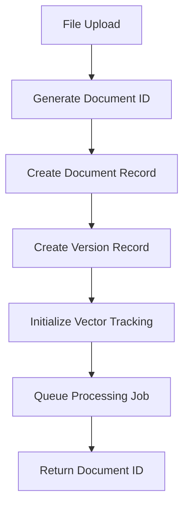
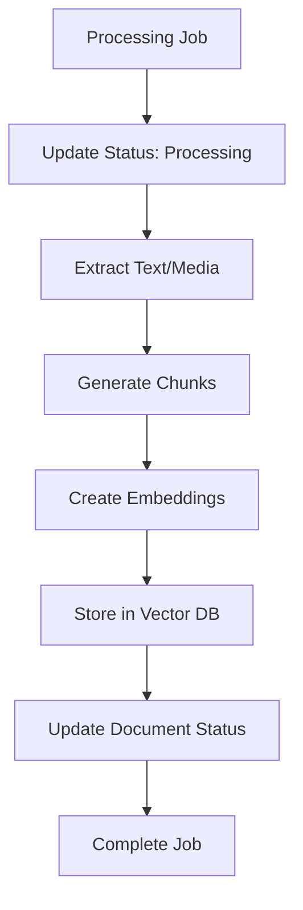
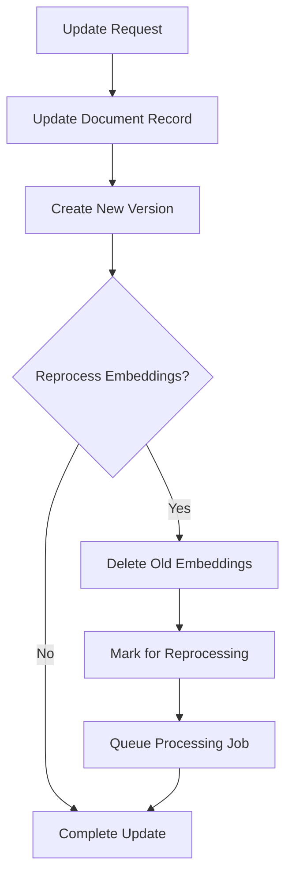
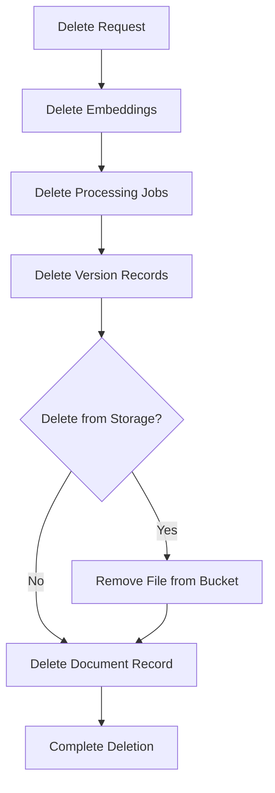

# LangChain Record Manager Documentation

## 🎯 **Overview**

The LangChain Record Manager is a comprehensive system that manages the complete lifecycle of documents and their vector embeddings. It handles upload, editing, deletion, and vector store synchronization, ensuring data integrity and consistency across the entire document processing pipeline.

## 📋 **Core Features**

### **Document Lifecycle Management**
- ✅ **Create**: Initialize document records with vector tracking and isolation settings
- ✅ **Update**: Modify documents with optional reprocessing and isolation policy updates
- ✅ **Delete**: Remove documents and associated vectors with isolation-aware cleanup
- ✅ **Version Control**: Track document versions and changes with isolation inheritance

### **Vector Store Management**
- ✅ **Embedding Storage**: Store and manage vector embeddings in discipline-specific tables
- ✅ **Synchronization**: Keep vectors in sync with document changes and isolation policies
- ✅ **Cleanup**: Remove orphaned embeddings and records respecting isolation constraints
- ✅ **Integrity Checks**: Verify embedding consistency and isolation enforcement

### **Vector Data Isolation**
- ✅ **Access Control**: Enforce granular access controls (private/team/shared/public/temporary)
- ✅ **Discipline-Specific Storage**: Route embeddings to appropriate discipline tables (e.g., a_01900_procurement_vector)
- ✅ **Workspace Management**: Organize documents within collaborative workspaces
- ✅ **Cross-Discipline Sharing**: Controlled sharing between authorized disciplines
- ✅ **Audit Compliance**: Complete audit trail of access and isolation changes

### **Bulk Operations**
- ✅ **Bulk Delete**: Remove multiple documents efficiently with isolation validation
- ✅ **Bulk Reprocess**: Reprocess multiple documents respecting isolation settings
- ✅ **Batch Processing**: Handle large-scale operations with access control

### **Monitoring & Analytics**
- ✅ **Document Statistics**: Track processing status and metrics with isolation analytics
- ✅ **Job Management**: Monitor processing jobs and status with security context
- ✅ **Error Handling**: Comprehensive error tracking and recovery with audit logging
- ✅ **Access Analytics**: Monitor document access patterns and isolation effectiveness

## 🔧 **Implementation Architecture**

### **Core Components**

#### **1. LangChain Record Manager Service**
**Location**: `server/services/langchainRecordManager.js`

```javascript
// Singleton service for document lifecycle management
import langchainRecordManager from './langchainRecordManager.js';

// Create document with vector tracking
await langchainRecordManager.createDocument({
  documentId,
  filePath,
  metadata,
  userSettings,
  organizationId,
  projectId
});

// Update document and optionally reprocess
await langchainRecordManager.updateDocument(
  documentId, 
  updates, 
  reprocessEmbeddings
);

// Delete document and all associated data
await langchainRecordManager.deleteDocument(documentId, options);
```

#### **2. Document Management API**
**Location**: `server/api/documents/manage.js`

```javascript
// RESTful API for document management operations
GET    /api/documents/manage?documentId=xxx&action=stats
PUT    /api/documents/manage
DELETE /api/documents/manage
POST   /api/documents/manage
```

#### **3. Processing Service Integration**
**Location**: `server/services/langchainProcessingService.js`

```javascript
// Integrated with LangChain processing pipeline
import langchainRecordManager from './langchainRecordManager.js';

// Automatic record management during processing
await langchainProcessingService.processDocument({
  documentId,
  filePath,
  metadata,
  userSettings
});
```

## 📊 **Database Schema Integration**

### **Enhanced Documents Table**
```sql
-- LangChain-specific columns
langchain_metadata JSONB DEFAULT '{}'
langchain_loader_type VARCHAR(100)
langchain_processing_status VARCHAR(50) DEFAULT 'pending'
langchain_trace_id UUID
langchain_chunk_count INTEGER DEFAULT 0
langchain_embedding_model VARCHAR(100)
langchain_embedding_provider VARCHAR(50)
langchain_processed_at TIMESTAMP WITH TIME ZONE

-- Vector tracking
is_embedded BOOLEAN DEFAULT FALSE
vector_store_refs JSONB DEFAULT '[]'

-- Vector Isolation columns
access_scope VARCHAR(50) DEFAULT 'private' CHECK (access_scope IN ('private', 'team', 'shared', 'public', 'temporary'))
created_by_user_id UUID REFERENCES auth.users(id)
shared_with_disciplines TEXT[] DEFAULT ARRAY[]::TEXT[]
workspace_id UUID REFERENCES vector_workspaces(id)
workspace_type VARCHAR(50) DEFAULT 'personal' CHECK (workspace_type IN ('personal', 'team', 'temporary', 'archive'))
document_type VARCHAR(100)
auto_cleanup VARCHAR(50)
deleted_at TIMESTAMP WITH TIME ZONE
deleted_by UUID REFERENCES auth.users(id)
deletion_reason TEXT
scheduled_hard_delete_at TIMESTAMP WITH TIME ZONE
organisation_id UUID
project_id UUID
discipline_code VARCHAR(10)
```

### **Vector Embeddings Table**
```sql
CREATE TABLE a_00900_doccontrol_document_embeddings (
    id UUID PRIMARY KEY DEFAULT gen_random_uuid(),
    document_id UUID NOT NULL REFERENCES a_00900_doccontrol_documents(id) ON DELETE CASCADE,
    chunk_index INTEGER NOT NULL,
    chunk_text TEXT NOT NULL,
    chunk_metadata JSONB DEFAULT '{}',
    embedding VECTOR(1536),
    embedding_model VARCHAR(100) NOT NULL,
    embedding_provider VARCHAR(50) NOT NULL,
    created_at TIMESTAMP WITH TIME ZONE DEFAULT NOW(),
    updated_at TIMESTAMP WITH TIME ZONE DEFAULT NOW(),
    UNIQUE(document_id, chunk_index)
);
```

### **Processing Jobs Table**
```sql
CREATE TABLE a_00900_doccontrol_langchain_jobs (
    id UUID PRIMARY KEY DEFAULT gen_random_uuid(),
    document_id UUID NOT NULL REFERENCES a_00900_doccontrol_documents(id) ON DELETE CASCADE,
    job_type VARCHAR(50) NOT NULL,
    status VARCHAR(50) NOT NULL DEFAULT 'pending',
    priority INTEGER DEFAULT 5,
    job_config JSONB DEFAULT '{}',
    started_at TIMESTAMP WITH TIME ZONE,
    completed_at TIMESTAMP WITH TIME ZONE,
    error_message TEXT,
    retry_count INTEGER DEFAULT 0,
    max_retries INTEGER DEFAULT 3,
    trace_id UUID,
    langsmith_run_id VARCHAR(255),
    created_at TIMESTAMP WITH TIME ZONE DEFAULT NOW(),
    updated_at TIMESTAMP WITH TIME ZONE DEFAULT NOW()
);
```

## 🔄 **Document Lifecycle Workflows**

### **1. Document Creation**


### **2. Document Processing**


### **3. Document Update**


### **4. Document Deletion**


## 🚀 **API Usage Examples**

### **Document Statistics**
```javascript
// Get comprehensive document statistics
const response = await fetch('/api/documents/manage?documentId=xxx&action=stats');
const { stats } = await response.json();

console.log(stats);
// {
//   documentId: "xxx",
//   status: "completed",
//   chunkCount: 25,
//   embeddingCount: 25,
//   jobCount: 1,
//   versionCount: 3,
//   isEmbedded: true,
//   lastProcessed: "2025-01-07T06:00:00Z",
//   lastUpdated: "2025-01-07T06:05:00Z"
// }
```

### **Document Update with Reprocessing**
```javascript
// Update document and trigger reprocessing
const response = await fetch('/api/documents/manage', {
  method: 'PUT',
  headers: { 'Content-Type': 'application/json' },
  body: JSON.stringify({
    documentId: 'xxx',
    updates: {
      title: 'Updated Contract Title',
      langchain_metadata: {
        updated_reason: 'Title correction'
      }
    },
    reprocessEmbeddings: true
  })
});

const result = await response.json();
// { success: true, message: "Document updated and marked for reprocessing" }
```

### **Bulk Operations**
```javascript
// Bulk delete multiple documents
const response = await fetch('/api/documents/manage', {
  method: 'POST',
  headers: { 'Content-Type': 'application/json' },
  body: JSON.stringify({
    action: 'bulk-delete',
    documentIds: ['doc1', 'doc2', 'doc3'],
    options: { deleteFromStorage: true }
  })
});

const result = await response.json();
// {
//   success: true,
//   message: "Bulk delete completed for 3 documents",
//   results: [
//     { documentId: "doc1", success: true },
//     { documentId: "doc2", success: true },
//     { documentId: "doc3", success: false, error: "Document not found" }
//   ]
// }
```

### **Vector Store Synchronization**
```javascript
// Synchronize vector store for a document
const response = await fetch('/api/documents/manage', {
  method: 'POST',
  headers: { 'Content-Type': 'application/json' },
  body: JSON.stringify({
    action: 'sync-vector-store',
    documentId: 'xxx'
  })
});

const result = await response.json();
// { success: true, message: "Vector store synchronized" }
```

### **Cleanup Orphaned Records**
```javascript
// Clean up orphaned embeddings and jobs
const response = await fetch('/api/documents/manage', {
  method: 'POST',
  headers: { 'Content-Type': 'application/json' },
  body: JSON.stringify({
    action: 'cleanup-orphaned'
  })
});

const result = await response.json();
// { success: true, message: "Orphaned records cleanup completed" }
```

## 🔒 **Data Integrity & Consistency**

### **Foreign Key Constraints**
- **Embeddings**: Cascade delete when document is removed
- **Jobs**: Cascade delete when document is removed
- **Versions**: Cascade delete when document is removed

### **Synchronization Checks**
```javascript
// Automatic synchronization verification
await langchainRecordManager.synchronizeVectorStore(documentId);

// Checks performed:
// 1. Document update time vs embedding update time
// 2. Expected chunk count vs actual embedding count
// 3. Orphaned embedding detection
// 4. Processing job status verification
```

### **Batch Processing**
```javascript
// Embeddings stored in batches to prevent timeouts
const batchSize = 100;
for (let i = 0; i < embeddingRecords.length; i += batchSize) {
  const batch = embeddingRecords.slice(i, i + batchSize);
  await supabase.from('a_00900_doccontrol_document_embeddings').insert(batch);
}
```

## 📈 **Performance Optimizations**

### **Database Indexes**
```sql
-- Optimized queries for document management
CREATE INDEX idx_documents_langchain_status ON a_00900_doccontrol_documents(langchain_processing_status);
CREATE INDEX idx_documents_langchain_trace_id ON a_00900_doccontrol_documents(langchain_trace_id);
CREATE INDEX idx_embeddings_document_id ON a_00900_doccontrol_document_embeddings(document_id);
CREATE INDEX idx_jobs_status ON a_00900_doccontrol_langchain_jobs(status);
```

### **Batch Operations**
- **Bulk Delete**: Process multiple documents in parallel
- **Bulk Reprocess**: Queue multiple jobs efficiently
- **Embedding Storage**: Insert embeddings in configurable batches

### **Memory Management**
- **Temporary Storage**: Use memory for intermediate processing
- **Cleanup**: Automatic cleanup of temporary files and data
- **Resource Limits**: Configurable limits for concurrent operations

## 🛡️ **Error Handling & Recovery**

### **Comprehensive Error Handling**
```javascript
try {
  await langchainRecordManager.deleteDocument(documentId);
} catch (error) {
  console.error('Document deletion failed:', error);
  // Automatic rollback and cleanup
  await langchainRecordManager.cleanupOrphanedRecords();
}
```

### **Retry Logic**
- **Processing Jobs**: Automatic retry with exponential backoff
- **Database Operations**: Retry on transient failures
- **Storage Operations**: Retry on network issues

### **Rollback Mechanisms**
- **Failed Updates**: Automatic rollback to previous state
- **Partial Deletions**: Cleanup incomplete operations
- **Orphaned Records**: Regular cleanup of inconsistent data

## 🔧 **Configuration & Customization**

### **Environment Variables**
```bash
# Required for Record Manager
SUPABASE_URL=your_supabase_url
SUPABASE_SERVICE_KEY=your_service_key

# Optional configuration
LANGCHAIN_BATCH_SIZE=100
LANGCHAIN_MAX_RETRIES=3
LANGCHAIN_CLEANUP_INTERVAL=3600
```

### **Customizable Settings**
```javascript
// Configurable batch sizes and limits
const config = {
  embeddingBatchSize: 100,
  maxConcurrentJobs: 5,
  retryAttempts: 3,
  cleanupInterval: 3600000 // 1 hour
};
```

## 📋 **Monitoring & Observability**

### **Document Statistics**
- **Processing Status**: Track document processing states
- **Embedding Counts**: Monitor vector storage utilization
- **Job Metrics**: Track processing job performance
- **Version History**: Maintain complete audit trail

### **Health Checks**
```javascript
// Regular health checks for data consistency
const healthCheck = await langchainRecordManager.performHealthCheck();
// {
//   totalDocuments: 1250,
//   embeddedDocuments: 1200,
//   pendingJobs: 15,
//   orphanedEmbeddings: 0,
//   lastCleanup: "2025-01-07T05:00:00Z"
// }
```

### **LangSmith Integration**
- **Trace IDs**: Link documents to LangSmith traces
- **Processing Metrics**: Track processing performance
- **Error Tracking**: Monitor and analyze failures

## 🎉 **Benefits & Advantages**

### **Data Integrity**
- **Consistent State**: Ensures documents and vectors stay synchronized
- **Atomic Operations**: All-or-nothing operations prevent partial states
- **Referential Integrity**: Foreign key constraints maintain relationships

### **Scalability**
- **Batch Processing**: Efficient handling of large document sets
- **Async Operations**: Non-blocking processing for better performance
- **Resource Management**: Configurable limits prevent resource exhaustion

### **Maintainability**
- **Centralized Management**: Single point of control for document lifecycle
- **Comprehensive Logging**: Detailed logging for debugging and monitoring
- **Modular Design**: Easy to extend and customize for specific needs

### **Enterprise Ready**
- **Audit Trail**: Complete history of document changes and processing
- **Error Recovery**: Robust error handling and recovery mechanisms
- **Monitoring**: Comprehensive metrics and health monitoring

The LangChain Record Manager provides a robust, scalable, and maintainable solution for managing the complete lifecycle of documents and their vector embeddings, ensuring data integrity and consistency across the entire document processing pipeline.
