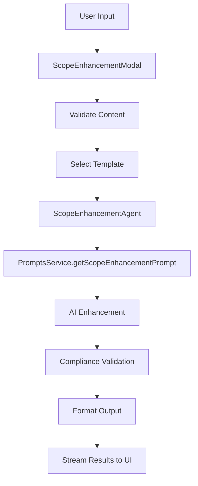

# ARCHIVED: SOW Integration Plan - HISTORICAL STATUS

## Status
- [x] Initial draft
- [x] Tech review completed
- [x] Approved for implementation
- [x] MVP Plan Updated (2025-09-13)
- [ ] Audit completed

## Version History
- v1.1 (2025-09-13): Added comprehensive MVP plan with role-based access control for procurement and safety disciplines
- v1.0 (2025-09-13): Comprehensive integration plan for Scope of Work enhancement system
- Includes design options analysis, recommendations, and implementation roadmap

## Executive Summary

This document outlines the comprehensive integration plan for enhancing the Scope of Work system with AI-powered content generation and template management. Following analysis of three critical architectural decisions, this plan establishes the path forward for seamless integration with existing prompt management and agent systems.

---

# Enhanced Scope of Work Integration Plan - MVP Focus

## Overview

This document outlines the **comprehensive MVP implementation plan** for transforming the Scope of Work system from hardcoded content into a dynamic, database-driven architecture with role-based access control. The plan focuses initially on **procurement and safety disciplines** while building the foundation for system-wide expansion.

## 🎯 MVP Scope & Objectives

### **Primary Goal**: Eliminate hardcoded content in SowTransferModal and establish dynamic prompt management
### **Target Disciplines**: Procurement (SowTransferModal) + Safety (analysis modals)
### **Timeline**: 3 weeks from planning to production deployment
### **Success Metrics**:
- ✅ Zero hardcoded templates in targeted components
- ✅ Role-based access control implemented
- ✅ Dynamic template loading operational
- ✅ Production deployment with monitoring

---

# System Architecture Overview

## Core Components

### 1. Enhanced Prompt Management System
**Location**: `client/src/pages/02050-information-technology/components/DevSettings/PromptsManagement.jsx`
**Enhancements**:
```javascript
// Role-based filtering and access control
const roleBasedFilters = {
  developer: ['developer', 'it_admin', 'it_user', 'end_user'],
  it_admin: ['it_admin', 'it_user', 'end_user'],
  it_user: ['it_user', 'end_user'],
  end_user: ['end_user']
};

// Discipline-specific tabs
const disciplineTabs = [
  { key: 'procurement', label: 'Procurement', icon: '📋' },
  { key: 'safety', label: 'Safety', icon: '🛡️' },
  { key: 'contracts', label: 'Contracts', icon: '📄' },
  { key: 'hr', label: 'HR', icon: '👥' }
];
```

### 2. Discipline-Specific Services
**Location**: `client/src/common/js/services/`
```javascript
// disciplinePromptService.js
class DisciplinePromptService {
  async getProcurementTemplate(templateName, variables = {}) {
    return await this.getDisciplineTemplate('procurement', templateName, variables);
  }

  async getSafetyPrompt(promptName, context = {}) {
    return await this.getDisciplinePrompt('safety', promptName, context);
  }
}

// roleBasedPromptService.js
class RoleBasedPromptService {
  constructor(userRole) {
    this.userRole = userRole;
    this.permissions = ROLE_HIERARCHY[userRole];
  }

  async getAccessiblePrompts(filters = {}) {
    const allPrompts = await this.fetchPrompts(filters);
    return allPrompts.filter(prompt => this.canAccessPrompt(prompt));
  }
}
```

### 3. Database Schema Enhancements
```sql
-- Enhanced prompts table with role and discipline support
ALTER TABLE prompts ADD COLUMN IF NOT EXISTS access_level VARCHAR(50) DEFAULT 'user';
ALTER TABLE prompts ADD COLUMN IF NOT EXISTS discipline VARCHAR(50);
ALTER TABLE prompts ADD COLUMN IF NOT EXISTS component_type VARCHAR(50);
ALTER TABLE prompts ADD COLUMN IF NOT EXISTS mandatory BOOLEAN DEFAULT false;
ALTER TABLE prompts ADD COLUMN IF NOT EXISTS allowed_roles JSONB DEFAULT '["user"]';

-- Indexes for performance
CREATE INDEX IF NOT EXISTS idx_prompts_access_level ON prompts(access_level);
CREATE INDEX IF NOT EXISTS idx_prompts_discipline ON prompts(discipline);
CREATE INDEX IF NOT EXISTS idx_prompts_component_type ON prompts(component_type);
CREATE INDEX IF NOT EXISTS idx_prompts_allowed_roles ON prompts USING gin(allowed_roles);
```

---

# Scope of Work Enhancement Integration Plan

## Overview

The Scope of Work Enhancement project aims to integrate AI-powered content generation with the existing Prompt Management System, creating a seamless workflow for generating procurement-focused scope documents. This integration leverages existing infrastructure while providing enhanced functionality.

## Architectural Analysis & Recommendations

### Decision Point 1: Database Schema Architecture

#### Option A: Extend Existing Endpoints (Not Recommended)
**Structure:** Single `/api/prompts` endpoint handling all prompt types
```javascript
/api/prompts?type=scope_enhancement&category=procurement
```

**Pros:**
- ✅ Unified API interface
- ✅ Single maintenance point
- ✅ Consistent query patterns

**Cons:**
- ❌ Mixed concerns with other prompt types
- ❌ Complex filtering queries
- ❌ Potential performance issues
- ❌ Version conflicts with existing systems

#### Option B: Separate Endpoints (RECOMMENDED)
**Structure:** Dedicated scope enhancement endpoints
```javascript
/api/scope-prompts/           # Dedicated scope prompts
/api/scope-prompts/templates  # Scope templates
/api/scope-prompts/enhancement # AI enhancement endpoints
```

**Pros:**
- ✅ Clean separation of concerns
- ✅ Optimized queries for scope-specific needs
- ✅ Independent scaling capabilities
- ✅ Focused business logic

**Cons:**
- ❌ Code duplication for shared utilities
- ❌ Multiple API maintenance points
- ❌ Inconsistent patterns (short-term)

**Recommendation: Option B - Separate Endpoints**
- Provides better long-term architecture
- Enables independent scaling
- Reduces complexity in queries
- Aligns with microservices principles

---

### Decision Point 2: Agent Architecture Pattern

#### Option A: Extend GenericCorrespondenceAgent (RECOMMENDED)
**Structure:** Inheritance-based extension
```javascript
class ScopeEnhancementAgent extends GenericCorrespondenceAgent {
  constructor(config) {
    super(config);
    this.workflow = ['scope_analysis', 'template_retrieval', 'enhancement_generation'];
  }
}
```

**Pros:**
- ✅ Inherits all existing capabilities (streaming, HITL, document retrieval)
- ✅ Rapid development using proven architecture
- ✅ Consistent agent patterns across the system
- ✅ Automatic benefits from GenericCorrespondenceAgent improvements

**Cons:**
- ❌ Slightly heavier than needed
- ❌ Must maintain compatibility with parent class changes

#### Option B: Lightweight Agent (Not Recommended)
**Structure:** New standalone agent class
```javascript
class ScopeEnhancementAgent {
  // Minimal implementation focused only on scope enhancement
}
```

**Pros:**
- ✅ Focused on scope enhancement needs
- ✅ Independent evolution
- ✅ Lighter weight

**Cons:**
- ❌ Code duplication for shared functionality (streaming, errors, etc.)
- ❌ Inconsistent patterns with other agents
- ❌ Missing features unless reimplemented (HITL, document retrieval)
- ❌ Higher maintenance burden

**Recommendation: Option A - Extend GenericCorrespondenceAgent**
- Leverages existing infrastructure
- Ensures consistency
- Reduces development time and risk
- Provides all necessary capabilities

---

### Decision Point 3: UI Pattern Implementation

#### Option A: Follow CorrespondenceReplyModal Pattern
**Structure:** Complex modal matching existing correspondence workflow
- Full streaming capabilities
- HITL workflow integration
- Document upload and processing
- Advanced error handling

**Pros:**
- ✅ User familiarity with existing patterns
- ✅ Full feature set available
- ✅ Consistent design language

**Cons:**
- ❌ Overwhelming for simpler scope enhancement task
- ❌ Complex UI for relatively simple workflow

#### Option B: Streamlined Modal
**Structure:** Focused, purpose-built interface
```javascript
// Simple yet powerful scope enhancement modal
- Text area for scope content
- Template selection dropdown
- Basic file upload for context
- Magic wand enhancement button
- Progress indicators
```

**Pros:**
- ✅ Clean, focused user experience
- ✅ Faster workflow completion
- ✅ Purpose-built for task

**Cons:**
- ❌ New pattern learning curve
- ❌ Cannot reuse existing modal components
- ❌ Missing advanced features unless added

#### Option C: Hybrid Approach (RECOMMENDED)
**Structure:** Phased implementation strategy
```javascript
Phase 1: Streamlined modal (Option B) - Get core functionality working
Phase 2: Add advanced features (streaming, HITL) - Enhance user experience
Phase 3: Full integration with existing patterns - Maintain consistency
```

**Pros:**
- ✅ Incremental development reduces risk
- ✅ User feedback during development
- ✅ Flexible evolution based on needs
- ✅ Mitigates over-engineering risk

**Cons:**
- ❌ Multiple development phases
- ❌ Potential user confusion during transition
- ❌ Requires careful phase planning

**Recommendation: Option C - Hybrid Approach**
- Reduces initial development risk
- Allows user feedback integration
- Provides flexibility for future enhancements
- Balances development speed with feature completeness

---

## Final Architectural Recommendations

| Decision Point | Recommended Approach | Rationale |
|----------------|---------------------|-----------|
| Database Schema | **Separate Endpoints** | Clean separation, better performance |
| Agent Architecture | **Extend GenericCorrespondenceAgent** | Leverage existing infrastructure |
| UI Pattern | **Hybrid Approach** | Balanced development strategy |

## Implementation Roadmap

### Phase 1: Core Infrastructure (Weeks 1-2)
**Objectives:**
- ✅ Set up separate scope enhancement endpoints
- ✅ Create basic ScopeEnhancementAgent extending GenericCorrespondenceAgent
- ✅ Implement streamlined modal UI
- ✅ Basic template selection and application

**Deliverables:**
- API endpoints: `/api/scope-prompts/*`
- Agent class: `ScopeEnhancementAgent`
- Modal component: `ScopeEnhancementModal`
- Basic template management

**Success Criteria:**
- Template selection and injection working
- Basic enhancement functionality operational
- UI responsive and intuitive

### Phase 2: Advanced Features (Weeks 3-4)
**Objectives:**
- ✅ Add streaming capabilities to modal
- ✅ Implement HITL workflow integration
- ✅ Enhanced error handling and user feedback
- ✅ Performance optimizations

**Deliverables:**
- Streaming message integration
- HITL modal triggers
- Enhanced validation and error states
- Performance monitoring

**Success Criteria:**
- Smooth user experience with real-time feedback
- Error handling covers all edge cases
- Performance meets user expectations

### Phase 3: Full Integration (Weeks 5-6)
**Objectives:**
- ✅ Complete correspondence-style modal replacement
- ✅ Advanced document processing integration
- ✅ Comprehensive testing and validation
- ✅ User training and documentation

**Deliverables:**
- Full modal replacement matching correspondence patterns
- Advanced document upload and processing
- Comprehensive test suite
- User documentation and training materials

**Success Criteria:**
- Seamless integration with existing systems
- All advanced features functional
- User acceptance testing passed
- Documentation complete and approved

## Technical Implementation Details

### API Structure

#### Base Endpoints
```javascript
// Core scope enhancement endpoints
POST /api/scope-prompts/enhance
GET  /api/scope-prompts/templates
POST /api/scope-prompts/generate
GET  /api/scope-prompts/history

// Integration endpoints
GET  /api/prompts/templates?category=procurement&discipline=scope_enhancement
POST /api/chat/agent/message (reuse existing)
```

#### Request/Response Format
```javascript
// Enhancement request
{
  content: "Basic scope content...",
  template_type: "equipment|compliance|safety",
  country_code: "ZA|GN|SA",
  project_context: {...},
  user_preferences: {...}
}

// Enhancement response
{
  enhanced_content: "Enhanced scope content...",
  template_applied: "equipment_template_v1",
  changes_made: [...],
  compliance_validated: true,
  metadata: {...}
}
```

### Agent Workflow

#### Enhanced Workflow Steps
```javascript
const scopeEnhancementWorkflow = [
  'content_analysis',       // Analyze existing content
  'template_selection',     // Select appropriate templates
  'country_adaptation',     // Apply country-specific requirements
  'ai_enhancement',         // AI-powered content improvement
  'compliance_validation',  // Ensure regulatory compliance
  'final_formatting',       // Format for procurement use
  'approval_routing'        // Route for final approval
];
```

#### Streaming Integration
```javascript
// Progress updates during enhancement
const progressCallbacks = {
  template_selection: (template) =>
    dispatchProgressEvent(`📋 Selected ${template} template for enhancement`),

  ai_enhancement: (model) =>
    dispatchProgressEvent(`🤖 Enhancing content with ${model} AI model`),

  compliance_validation: (status) =>
    dispatchProgressEvent(`✅ Compliance validation: ${status}`)
};
```

### UI Component Structure

#### Main Modal Structure
```javascript
function ScopeEnhancementModal({ onClose, onSave }) {
  const [activePhase, setActivePhase] = useState('input'); // input|enhancing|review|complete

  // Phase-based rendering
  const renderPhase = () => {
    switch(activePhase) {
      case 'input': return <InputPhase onNext={() => setActivePhase('enhancing')} />;
      case 'enhancing': return <EnhancingPhase progress={progressState} />;
      case 'review': return <ReviewPhase onAccept={handleAccept} onRevise={handleRevise} />;
      case 'complete': return <CompletePhase result={finalResult} />;
    }
  };

  return (
    <Modal show={true} size="xl">
      <Modal.Header closeButton>
        <Modal.Title>🔮 Enhance Scope of Work</Modal.Title>
      </Modal.Header>
      <Modal.Body>{renderPhase()}</Modal.Body>
    </Modal>
  );
}
```

#### Phase Components
```javascript
// Input phase - simple content entry
function InputPhase({ content, setContent, templates, selectedTemplate, setSelectedTemplate }) {
  return (
    <div>
      <Form.Group>
        <Form.Label>Scope Content</Form.Label>
        <Form.Control as="textarea" rows={6} value={content} onChange={setContent} />
      </Form.Group>

      <Form.Group>
        <Form.Label>Template Type</Form.Label>
        <Form.Select value={selectedTemplate} onChange={setSelectedTemplate}>
          <option value="equipment">Equipment Specifications</option>
          <option value="compliance">Compliance Requirements</option>
          <option value="safety">Safety Protocols</option>
        </Form.Select>
      </Form.Group>
    </div>
  );
}
```

## Integration Points

### Existing System Integration

#### PromptsService Integration
```javascript
// Leverage existing prompt service
import PromptsService from '@common/js/services/promptsService.js';

// Use existing procurement prompts
const procurementPrompts = await PromptsService.getProcurementPrompts();
const scopeEnhancementPrompt = await PromptsService.getProcurementPromptByType('supplier_analysis');

// Extend with scope-specific prompts
await PromptsService.getScopeEnhancementByType('template_customization');
```

#### GenericCorrespondenceAgent Inheritance
```javascript
import GenericCorrespondenceAgent from '../agents/00435-03-contractual-correspondence-reply-agent.js';

class ScopeEnhancementAgent extends GenericCorrespondenceAgent {
  constructor(config) {
    super(config);
    this.pageId = '01900';
    this.disciplineCode = 'PROCUREMENT';
    this.workflow = this.getScopeEnhancementWorkflow();
  }

  getScopeEnhancementWorkflow() {
    return [
      'content_validation',
      'template_matching',
      'ai_enhancement',
      'compliance_check',
      'format_finalization'
    ];
  }
}
```

### Cross-System Dependencies

#### Required Services
- **PromptsService**: For AI prompt management and retrieval
- **Stream Service**: For real-time enhancement progress
- **Template Service**: For procurement template management
- **Validation Service**: For compliance checking

#### Data Flow


## Risk Mitigation Strategies

### Technical Risks

#### Risk: Agent Inheritance Complexity
- **Mitigation**: Start with composition over inheritance if complexity too high
- **Fallback**: Create standalone agent with shared utilities
- **Monitoring**: Regular code reviews and dependency analysis

#### Risk: API Performance Issues
- **Mitigation**: Implement response caching and request throttling
- **Fallback**: Queued processing for high-demand scenarios
- **Monitoring**: Response time tracking and performance alerts

### User Experience Risks

#### Risk: Workflow Confusion
- **Mitigation**: Clear phase-based UI with progress indicators
- **Fallback**: Interactive tutorial and help system
- **Monitoring**: User feedback collection and A/B testing

#### Risk: Feature Overload
- **Mitigation**: Feature flags for gradual rollout
- **Fallback**: Simplified mode for basic users
- **Monitoring**: Feature usage analytics and user interviews

### Business Risks

#### Risk: Integration Failures
- **Mitigation**: Comprehensive testing with existing systems
- **Fallback**: Standalone operation capability
- **Monitoring**: Integration health checks and automated alerts

## Success Metrics

### Technical Metrics
- **API Response Time**: < 2 seconds for template retrieval
- **Enhancement Accuracy**: > 90% compliance with standards
- **System Availability**: > 99.5% uptime
- **Error Rate**: < 0.1% for critical operations

### User Experience Metrics
- **Task Completion Rate**: > 95% successful enhancements
- **User Satisfaction**: > 4.5/5 rating
- **Time to Complete**: < 5 minutes average enhancement
- **Error Recovery**: < 30 seconds for common errors

### Business Metrics
- **Adoption Rate**: > 80% of scope creation using enhancement
- **Quality Improvement**: 60% reduction in compliance issues
- **Efficiency Gain**: 50% reduction in manual editing time
- **ROI Achievement**: Break-even within 6 months

## Next Steps

### Immediate Actions (Next 1-2 weeks)
1. ✅ Create separate scope enhancement API endpoints
2. ✅ Implement basic ScopeEnhancementAgent class
3. ✅ Develop streamlined modal UI (Phase 1)
4. ✅ Set up basic template management system

### Short-term Goals (Next 4-6 weeks)
1. ✅ Add streaming capabilities and progress indicators
2. ✅ Implement HITL workflow integration
3. ✅ Enhance error handling and user feedback
4. ✅ Complete Phase 2 (Advanced Features)

### Long-term Vision (3-6 months)
1. ✅ Full modal replacement with comprehensive features
2. ✅ Advanced document processing and context analysis
3. ✅ Complete system integration and optimization
4. ✅ User training and adoption programs

## Related Documentation

- [1300_01910_SCOPE_OF_WORK_GENERATION.md](../docs/1300_01910_SCOPE_OF_WORK_GENERATION.md) - Core scope generation functionality
- [1300_02050_MASTER_GUIDE.md](../docs/1300_02050_MASTER_GUIDE.md) - AI enhancement pipeline and architecture
- [0000_DOCUMENTATION_GUIDE.md](../docs/0000_DOCUMENTATION_GUIDE.md) - Documentation standards and procedures
- [00435-03-CorrespondenceReplyModal](../../00435-contracts-post-award/components/modals/00435-03-CorrespondenceReplyModal.js) - Reference implementation for modal patterns
- [GenericCorrespondenceAgent](../../00435-contracts-post-award/components/agents/00435-03-contractual-correspondence-reply-agent.js) - Agent architecture reference

## Approval and Sign-off

| Role | Name | Date | Status |
|------|------|------|--------|
| Technical Lead | [Name] | [Date] | ⏳ Review Pending |
| Product Manager | [Name] | [Date] | ⏳ Review Pending |
| QA Lead | [Name] | [Date] | ⏳ Review Pending |

---

*This integration plan provides the comprehensive roadmap for enhancing the Scope of Work system with AI-powered content generation, ensuring seamless integration with existing infrastructure while maintaining high performance and user experience standards.*
