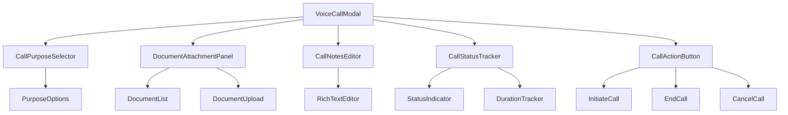
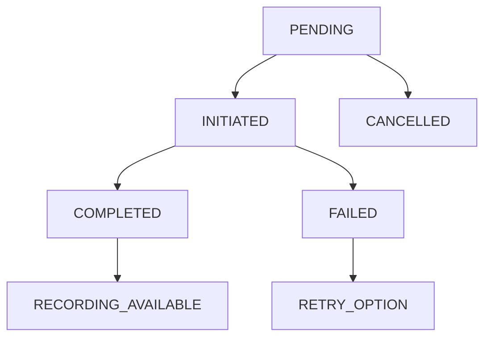

# Voice Call Modal Documentation (1300.01900)

## Table of Contents

- [1. Overview](#1-overview)
- [2. Implementation Details](#2-implementation-details)
- [3. Database Schema](#3-database-schema)
- [4. Component Structure](#4-component-structure)
- [5. Integration Points](#5-integration-points)
- [6. Access Control](#6-access-control)
- [7. Workflow](#7-workflow)
- [8. Validation Rules](#8-validation-rules)
- [9. Dependencies](#9-dependencies)
- [10. Testing](#10-testing)
- [11. Maintenance](#11-maintenance)

---

## 1. Overview

The Voice Call Modal provides integrated telephony functionality within the Supplier Directory, allowing authorized users to:

- Initiate voice calls to suppliers directly from the application
- Document call purposes and outcomes
- Attach relevant documents for call context
- Track call status and duration
- Integrate with Twilio for reliable voice communication
- Maintain audit trails through Supabase RLS policies
- Follow UI/UX patterns from [Procurement Page Standards](/docs/1300_01900_PROCUREMENT_PAGE.md)


---

## 2. Implementation Details

**Core Technologies**:

- React 18.2+ functional components
- Supabase JS Client v2.22+
- Twilio Client SDK v2.0+
- Bootstrap React v5.3+ components

**Key Files**:

- Modal Component: [`client/src/pages/01900-procurement/components/modals/01900-VoiceCallModal.js`]
- CSS Styles: [`client/src/pages/01900-procurement/components/modals/01900-VoiceCallModal.css`]
- Service Integration: [`client/src/common/js/services/voiceCallService.js`]
- Database Schema: [`sql/create_voice_calls_table.sql`]

---

## 3. Database Schema

```sql
-- Excerpt from create_voice_calls_table.sql
CREATE TABLE procurement_voice_calls (
  id UUID PRIMARY KEY DEFAULT gen_random_uuid(),
  supplier_id UUID REFERENCES suppliers(id),
  supplier_name VARCHAR(255),
  contact_person VARCHAR(255),
  phone VARCHAR(50),
  user_id UUID REFERENCES user_management(user_id),
  call_purpose VARCHAR(100) NOT NULL,
  call_notes TEXT,
  call_status VARCHAR(50) DEFAULT 'pending' CHECK (call_status IN ('pending', 'initiated', 'completed', 'failed', 'cancelled')),
  call_duration INTEGER DEFAULT 0,
  call_recording_url TEXT,
  documents UUID[], -- Array of document IDs for reference
  twilio_call_sid VARCHAR(255),
  created_at TIMESTAMP WITH TIME ZONE DEFAULT NOW(),
  updated_at TIMESTAMP WITH TIME ZONE DEFAULT NOW()
);
```

---

## 4. Component Structure



## Core Features

### Call Purpose Selection

**Predefined Purpose Categories:**
The system provides standardized call purposes for consistent documentation:

1. **Price Negotiation**
   - Context: Supplier pricing discussions
   - Template: Standard negotiation framework
   - Follow-up: Quotation tracking integration

2. **Contract Discussion**
   - Context: Terms and conditions review
   - Template: Contract clause references
   - Follow-up: Legal review workflow

3. **Delivery Coordination**
   - Context: Logistics and scheduling
   - Template: Delivery timeline framework
   - Follow-up: Project scheduling integration

4. **Quality Issues**
   - Context: Product/service quality concerns
   - Template: Quality assurance protocols
   - Follow-up: Defect tracking integration

5. **Compliance Review**
   - Context: Regulatory and safety compliance
   - Template: Compliance checklist framework
   - Follow-up: Audit trail documentation

### Document Attachment System

**Document Integration Features:**

1. **Document Control Integration**
   - Direct linking to existing documents in Document Control system
   - Real-time document metadata display
   - Version history access

2. **URL Reference Support**
   - External document URL attachment
   - Link validation and preview
   - Access permission checking

3. **Document Type Categorization**
   - Contracts and agreements
   - Technical specifications
   - Quality certificates
   - Compliance documentation
   - Correspondence records

### Call Status Management

**Status Transition Workflow:**



**Status Behavior Rules:**

- **Pending**: Call ready for initiation
- **Initiated**: Call in progress, timer active
- **Completed**: Call finished successfully
- **Failed**: Call encountered technical issues
- **Cancelled**: Call aborted before connection

### Call Recording Integration

**Twilio Recording Features:**

1. **Automatic Recording**
   - Start/stop recording with call status
   - Secure storage with access controls
   - Recording URL generation and storage

2. **Recording Management**
   - Recording duration tracking
   - Storage quota monitoring
   - Access permission validation

3. **Compliance Features**
   - Recording consent tracking
   - Jurisdiction-specific compliance
   - Retention policy enforcement

---

## 5. Integration Points

1. **Supabase Services**:
   ```js
   import { createVoiceCall, updateCallStatus } from "@services/voiceCallService";
   ```
2. **Twilio Integration** ([Configuration](/client/src/common/js/services/voiceCallService.js)):
   ```javascript
   import { Twilio } from 'twilio';
   const client = new Twilio(accountSid, authToken);
   ```
3. **Document Control System** ([00900 Document Control](/client/src/pages/00900-document-control)):
   ```javascript
   import { getDocumentMetadata } from "@services/documentControlService";
   ```
4. **Accordion Navigation** ([Configuration](/server/src/routes/accordion-sections-routes.js)):
   ```javascript
   {
     path: 'supplier-directory',
     label: 'Supplier Directory',
     icon: 'PeopleOutlined'
   }
   ```
5. **Authentication** ([Auth Config](/client/src/common/js/auth/00175-auth-config.js))

---

## 6. Access Control

```sql
-- RLS Policies
CREATE POLICY "Users can view their own voice calls" ON procurement_voice_calls
FOR ALL USING (auth.uid() = user_id);

CREATE POLICY "Users can view voice calls for their suppliers" ON procurement_voice_calls
FOR SELECT USING (
  EXISTS (
    SELECT 1 
    FROM suppliers s 
    WHERE s.id = procurement_voice_calls.supplier_id 
    AND EXISTS (
      SELECT 1 
      FROM user_role_assignments ura
      WHERE ura.user_id = auth.uid() 
      AND ura.company_id::text = s.company_id::text
      AND ura.is_active = true
    )
  )
);

CREATE POLICY "Admins can view all voice calls" ON procurement_voice_calls
FOR SELECT USING (
  EXISTS (
    SELECT 1 
    FROM user_role_assignments ura
    WHERE ura.user_id = auth.uid() 
    AND ura.role_name = 'admin'
    AND ura.is_active = true
  )
);
```

---

## 7. Workflow

1. User opens Supplier Directory page
2. Selects supplier from directory table
3. Clicks voice call button in supplier actions
4. Voice Call Modal opens with supplier information pre-filled
5. User selects call purpose from dropdown
6. Attaches relevant documents (optional):
   - Select from Document Control system
   - Add external document URLs
7. Adds call notes/context (optional)
8. Clicks "Initiate Call" button
9. Twilio connection established:
   - Call status updates to "Initiated"
   - Call timer starts
   - Recording begins automatically
10. Call in progress:
    - Real-time status updates
    - Duration tracking
    - Recording management
11. Call completion:
    - Status updates to "Completed" or "Failed"
    - Duration recorded
    - Recording URL stored
12. Post-call documentation:
    - Additional notes can be added
    - Documents can be updated
    - Follow-up actions tracked
13. Call record saved to database with full audit trail

---

## 8. Validation Rules

**Structured Validation Schema:**

```javascript
const validationSchema = yup.object().shape({
  supplier_id: yup.string().required("Supplier selection required"),
  
  call_purpose: yup.string().required("Call purpose required").oneOf([
    "price_negotiation",
    "contract_discussion", 
    "delivery_coordination",
    "quality_issues",
    "compliance_review",
    "general_inquiry"
  ]),

  phone: yup.string().required("Phone number required").matches(
    /^\+?[1-9]\d{1,14}$/,
    "Invalid phone number format"
  ),

  documents: yup.array().of(
    yup.object({
      id: yup.string().required(),
      type: yup.string().oneOf(["document_control", "external_url"]),
      title: yup.string().required(),
      url: yup.string().url().required()
    })
  ),

  call_notes: yup.string().max(2000, "Notes limited to 2000 characters"),

  // Twilio integration validation
  twilio_config: yup.object().shape({
    account_sid: yup.string().required("Twilio Account SID required"),
    auth_token: yup.string().required("Twilio Auth Token required"),
    phone_number: yup.string().required("Twilio phone number required")
  }),

  // Recording compliance validation
  recording_consent: yup.boolean().oneOf([true], "Recording consent required"),

  // Duration validation
  call_duration: yup.number().min(0).max(14400, "Call duration cannot exceed 4 hours")
});
```

**Runtime Validation Functions:**

```javascript
// Phone number validation
const validatePhoneNumber = async (phone, countryCode) => {
  const patterns = {
    ZA: /^(\+27|27)[6-8][0-9]{8}$/,
    GN: /^(\+224|224)[6-7][0-9]{7}$/,
    SA: /^(\+966|966)5[0-9]{8}$/
  };

  const pattern = patterns[countryCode] || patterns.ZA;
  return pattern.test(phone);
};

// Document access validation
const validateDocumentAccess = async (documentId, userId) => {
  const document = await getDocumentMetadata(documentId);
  return document.access_permissions.includes(userId) || document.is_public;
};

// Twilio configuration validation
const validateTwilioConfig = async (config) => {
  try {
    const client = new Twilio(config.account_sid, config.auth_token);
    await client.api.accounts(config.account_sid).fetch();
    return { valid: true };
  } catch (error) {
    return { valid: false, error: error.message };
  }
};
```

---

## 9. Dependencies

```json
"dependencies": {
  "@supabase/supabase-js": "^2.22.0",
  "twilio": "^4.12.0",
  "react-bootstrap": "^2.8.0",
  "yup": "^1.2.0",
  "react-hook-form": "^7.45.0"
}
```

**Environment Variables Required:**

```env
TWILIO_ACCOUNT_SID=your_account_sid
TWILIO_AUTH_TOKEN=your_auth_token
TWILIO_PHONE_NUMBER=your_phone_number
```

---

## 10. Testing

**Key Test Files**:

- `client/src/__tests__/01900-voice-call-modal.test.js`
- `server/src/tests/procurement_voice_calls_rls.test.js`
- `client/src/__tests__/voiceCallService.test.js`

**Modal Component Test Cases:**

```javascript
describe("Voice Call Modal", () => {
  test('Purpose selection validation', async () => {
    const { getByLabelText } = render(<VoiceCallModal />);
    const purposeSelect = getByLabelText('call-purpose');
    
    fireEvent.change(purposeSelect, { target: { value: 'invalid_purpose' } });
    await waitFor(() => {
      expect(screen.getByText('Invalid call purpose')).toBeInTheDocument();
    });
  });

  test('Phone number format validation', () => {
    const { getByLabelText } = render(<VoiceCallModal />);
    const phoneInput = getByLabelText('phone-number');
    
    fireEvent.change(phoneInput, { target: { value: 'invalid-phone' } });
    fireEvent.blur(phoneInput);
    
    expect(screen.getByText('Invalid phone number format')).toBeInTheDocument();
  });

  test('Document attachment integration', async () => {
    const mockDocument = { id: 'doc-123', title: 'Contract Agreement' };
    jest.spyOn(documentService, 'getDocument').mockResolvedValue(mockDocument);

    const { getByLabelText } = render(<VoiceCallModal />);
    fireEvent.click(getByLabelText('attach-document'));
    
    await waitFor(() => {
      expect(screen.getByText('Contract Agreement')).toBeInTheDocument();
    });
  });

  test('Call initiation workflow', async () => {
    const mockTwilioResponse = { callSid: 'CA1234567890' };
    jest.spyOn(voiceCallService, 'initiateCall').mockResolvedValue(mockTwilioResponse);

    const { getByLabelText } = render(<VoiceCallModal />);
    fireEvent.click(getByLabelText('initiate-call'));
    
    await waitFor(() => {
      expect(screen.getByText('Call initiated')).toBeInTheDocument();
      expect(screen.getByText('Recording started')).toBeInTheDocument();
    });
  });

  test('Status tracking updates', async () => {
    const { container } = render(<VoiceCallModal />);
    
    act(() => {
      // Simulate call completion
      fireEvent.click(container.querySelector('.end-call-button'));
    });
    
    await waitFor(() => {
      expect(container.querySelector('.call-status')).toHaveTextContent('Completed');
      expect(container.querySelector('.duration-display')).toHaveTextContent(/\d+:\d+/);
    });
  });
});

**Integration Test Cases:**

```javascript
describe("Voice Call Integration", () => {
  test('Database record creation', async () => {
    const callData = {
      supplier_id: 'sup-123',
      call_purpose: 'price_negotiation',
      phone: '+27123456789'
    };

    const result = await createVoiceCall(callData);
    expect(result.id).toBeDefined();
    expect(result.call_status).toBe('pending');
  });

  test('Twilio integration', async () => {
    const twilioConfig = {
      account_sid: process.env.TWILIO_ACCOUNT_SID,
      auth_token: process.env.TWILIO_AUTH_TOKEN
    };

    const validation = await validateTwilioConfig(twilioConfig);
    expect(validation.valid).toBe(true);
  });

  test('Document attachment validation', async () => {
    const documentId = 'doc-456';
    const userId = 'user-789';
    
    const hasAccess = await validateDocumentAccess(documentId, userId);
    expect(typeof hasAccess).toBe('boolean');
  });

  test('RLS policy enforcement', async () => {
    const userId = 'user-111';
    const calls = await getVoiceCallsForUser(userId);
    
    // Should only return calls belonging to user
    expect(calls.every(call => call.user_id === userId)).toBe(true);
  });
});
```

**Accessibility Test Cases:**

```javascript
describe("Voice Call Modal Accessibility", () => {
  test('Keyboard navigation support', () => {
    const { getByLabelText } = render(<VoiceCallModal />);
    
    // Tab through focusable elements
    fireEvent.keyDown(document, { key: 'Tab' });
    expect(getByLabelText('call-purpose')).toHaveFocus();
    
    fireEvent.keyDown(document, { key: 'Tab' });
    expect(getByLabelText('phone-number')).toHaveFocus();
  });

  test('Screen reader labels', () => {
    const { getByLabelText } = render(<VoiceCallModal />);
    
    expect(getByLabelText('Call Purpose')).toBeInTheDocument();
    expect(getByLabelText('Supplier Phone Number')).toBeInTheDocument();
    expect(getByLabelText('Call Notes')).toBeInTheDocument();
  });

  test('ARIA attributes', () => {
    const { container } = render(<VoiceCallModal />);
    
    const modal = container.querySelector('[role="dialog"]');
    expect(modal).toHaveAttribute('aria-labelledby');
    expect(modal).toHaveAttribute('aria-describedby');
  });
});
```

---

## 11. Maintenance

**Scheduled Tasks**:

- Daily backup of voice call records
- Weekly validation of Twilio integration
- Monthly review of RLS policies
- Quarterly Twilio account audit
- Biannual compliance review:
  - Recording retention policies
  - Jurisdiction-specific requirements
  - Access control validation
- Monthly performance monitoring:
  - Call success rates
  - Average call duration
  - Twilio API usage
  - Database query performance
- Annual security audit:
  - Twilio credential rotation
  - Database connection security
  - Recording storage encryption
  - Access log analysis

## 12. AI Prompt Integration

**Voice Call Assistant Prompt**:

The Voice Call Modal integrates with the AI prompt management system to provide intelligent call assistance. The following prompt should be created in the Prompts Management system:

**Prompt Name**: `voice_call_assistant`
**Category**: `procurement`
**Description**: AI assistant for supplier voice calls providing real-time guidance and documentation support

**Prompt Content**:
```markdown
You are an AI Procurement Assistant specializing in supplier voice call support. Your role is to provide real-time assistance during supplier calls to enhance communication effectiveness and documentation quality.

**Key Responsibilities**:
1. **Call Preparation**:
   - Analyze supplier history and previous interactions
   - Suggest relevant talking points based on call purpose
   - Provide key supplier information and contract details
   - Review attached documents for context

2. **Real-time Call Support**:
   - Offer guidance on negotiation strategies
   - Suggest responses to common supplier questions
   - Flag important discussion points for documentation
   - Provide compliance reminders when relevant

3. **Post-call Documentation**:
   - Summarize key call outcomes and action items
   - Extract important quotes and commitments
   - Suggest follow-up actions and timelines
   - Generate structured call notes for database storage

**Response Guidelines**:
- Keep responses concise and actionable
- Focus on procurement-specific terminology and processes
- Reference supplier contracts and agreements when applicable
- Maintain professional and business-appropriate tone
- Escalate complex legal or compliance issues appropriately

**Input Context**:
- Supplier name and contact information
- Call purpose (price negotiation, contract discussion, etc.)
- Call notes and real-time transcription (if available)
- Attached documents and reference materials
- Supplier history and relationship status

**Output Format**:
Provide responses in clear, structured format with actionable recommendations. Use bullet points for key points and numbered lists for sequential actions.
```

This prompt should be managed through the Information Technology → Prompts Management section and can be enhanced using the Context Enhancement Feature described in the Prompt Management System documentation.
