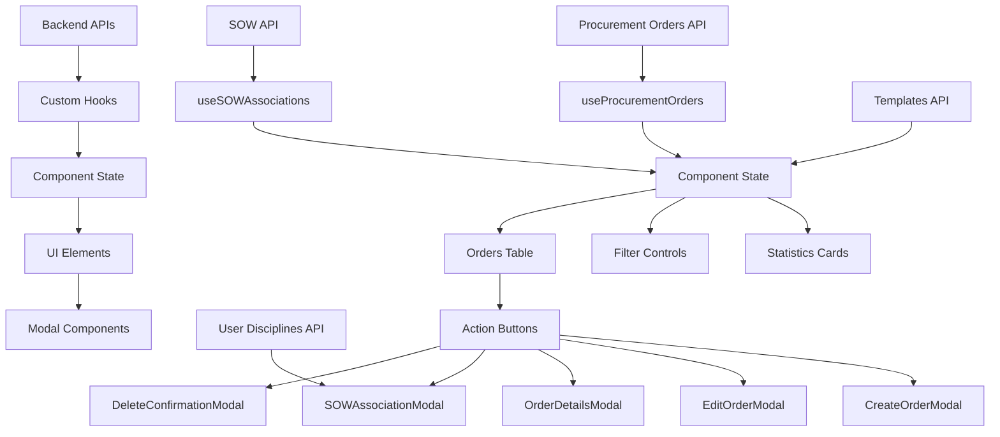

# Procurement Orders UI Data Flow & Document Structure Determination



## Data Flow Explanation

### 1. **API Layer → Hooks Layer**
```
Backend APIs provide standardized responses:
- {success: true, orders: []}
- {success: true, sows: []}
- {success: true, data: []} (templates)
- {success: true, disciplines: []}
```

### 2. **Hooks Layer → Component State**
```javascript
// Custom hooks manage data fetching and state
const {
  procurementOrders,    // Array of order objects
  isLoading,           // Loading states
  orderStats           // Computed statistics
} = useProcurementOrders();

const {
  availableSOWs,       // Array of SOW objects
  sowAssociationStats  // Association statistics
} = useSOWAssociations(procurementOrders);
```

### 3. **Component State → UI Rendering**
```javascript
// Component state drives rendering
const [searchTerm, setSearchTerm] = useState("");
const [statusFilter, setStatusFilter] = useState("all");
const [departmentFilter, setDepartmentFilter] = useState("all");

// Filtered data for display
const filteredOrders = procurementOrders.filter(order => {
  const matchesSearch = searchTerm === "" ||
    order.title?.toLowerCase().includes(searchTerm.toLowerCase());
  const matchesStatus = statusFilter === "all" || order.approval_status === statusFilter;
  const matchesDepartment = departmentFilter === "all" || order.department === departmentFilter;

  return matchesSearch && matchesStatus && matchesDepartment;
});
```

### 4. **User Interactions → State Updates**
```javascript
// Template selection updates form data
const handleTemplateSelection = (templateId) => {
  const selectedTemplate = availableTemplates.find(t => t.id === templateId);
  if (selectedTemplate) {
    setFormData(prev => ({
      ...prev,
      templateId: selectedTemplate.id,
      title: selectedTemplate.title || prev.title,
      description: selectedTemplate.description || prev.description,
      // ... other fields auto-populated
    }));
  }
};

// SOW association triggers modal and updates data
const handleOpenSOWAssociation = (order) => {
  setSelectedOrder(order);
  setSelectedSOW(order.sow_id || null);
  setShowSOWAssociationModal(true);
};
```

### 5. **Modal Data Flow**
```javascript
// SOW Association Modal receives data via props
<SOWAssociationModal
  show={showSOWAssociationModal}
  selectedOrder={selectedOrder}
  availableSOWs={availableSOWs}
  selectedSOW={selectedSOW}
  setSelectedSOW={setSelectedSOW}
  handleSOWAssociation={handleSOWAssociation}
  fetchAvailableSOWs={() => {}}
/>
```

## Document Structure Determination Points

### **A. Order Type Selection (Create Modal)**
```javascript
// Order type determines template filtering
<select name="orderType" onChange={handleInputChange}>
  <option value="purchase_order">Purchase Order</option>
  <option value="service_order">Service Order</option>
  <option value="work_order">Work Order</option>
</select>

// Dynamic template loading based on order type
useEffect(() => {
  if (formData.orderType) {
    loadAvailableTemplatesLocal(formData.orderType);
  }
}, [formData.orderType]);
```

### **B. Template Selection (Create Modal)**
```javascript
// Template auto-populates form fields
const handleTemplateSelection = (templateId) => {
  const selectedTemplate = availableTemplates.find(t => t.id === templateId);
  if (selectedTemplate) {
    // Auto-fill form based on template data
    setFormData(prev => ({
      ...prev,
      ...selectedTemplate, // Spread template data
    }));
  }
};
```

### **C. SOW Association (Association Modal)**
```javascript
// SOW selection determines document hierarchy
const handleSOWAssociation = async (associationData) => {
  const { sowId, assignedUsers, notes } = associationData;

  // Update order with SOW reference
  await associateSOW(orderId, sowId);

  // This creates the hierarchical relationship:
  // Procurement Order → Scope of Work
};
```

### **D. Discipline Assignment (Association Modal)**
```javascript
// User assignment by discipline
const [disciplinesWithUsers, setDisciplinesWithUsers] = useState([]);

// Fetched from /api/user-discipline
// Determines workflow participants and responsibilities
```

## Key Data Transformation Points

### **1. Statistics Calculation**
```javascript
// Computed in useProcurementOrders hook
const orderStats = useMemo(() => ({
  purchaseOrders: orders.filter(o => o.order_type === 'purchase_order').length,
  serviceOrders: orders.filter(o => o.order_type === 'service_order').length,
  workOrders: orders.filter(o => o.order_type === 'work_order').length,
  pendingApproval: orders.filter(o => o.approval_status === 'pending_approval').length,
}), [orders]);
```

### **2. Data Filtering**
```javascript
// Applied in component render
const filteredOrders = orders.filter(order => {
  // Search, status, department filters applied here
  return matchesSearch && matchesStatus && matchesDepartment;
});
```

### **3. Status Badge Generation**
```javascript
// Status determines visual styling
const statusClasses = {
  draft: 'status-badge draft',
  pending_approval: 'status-badge pending_approval',
  approved: 'status-badge approved',
  completed: 'status-badge completed',
  rejected: 'status-badge rejected'
};
```

## Component Communication Flow

### **Props Flow**
```
PurchaseOrdersPage
├── useProcurementOrders() → orders[], loading, stats
├── useSOWAssociations() → sows[], associationStats
├── State → selectedOrder, filters, modalStates
└── Modals
    ├── CreateOrderModal → templates, formData, submitHandler
    ├── SOWAssociationModal → sows[], users[], associationHandler
    └── EditOrderModal → orderData, updateHandler
```

### **Event Flow**
```
User Action → Component Method → Hook Action → API Call → State Update → Re-render
    ↓              ↓              ↓           ↓          ↓           ↓
  Click        handleSubmit    createOrder   POST       setOrders   UI Update
  Filter       setStatusFilter N/A          N/A        setFilter   Filter UI
  Associate    handleSOWAssoc  associateSOW PUT        updateOrder Modal Close
```

This diagram shows how the procurement orders UI determines document structure through a combination of user selections (order type, template, SOW association) and data transformations (filtering, statistics calculation, status determination).
