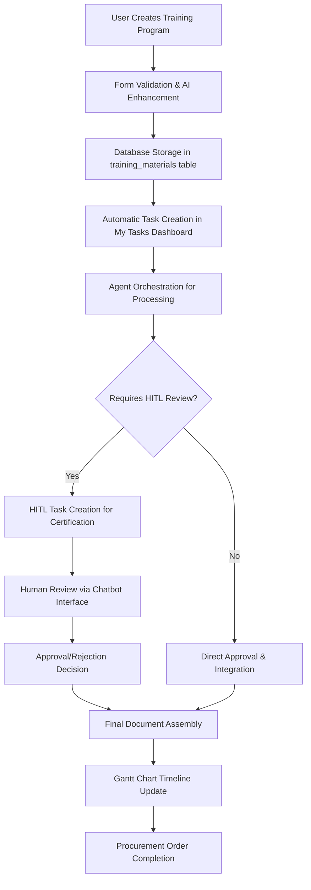

# 01900 Appendix D Training Materials Implementation Guide

## Overview

Appendix D Training Materials is a critical component of the procurement workflow, responsible for managing technical training programs for equipment and materials procured through the system. This document provides comprehensive implementation details for the Appendix D functionality within the Construct AI procurement system.

**Key Integration Points:**
- Part of the 6 appendices (A-F) in procurement document generation
- Handles technical training for equipment/materials (not general HR training)
- Integrates with Gantt chart timelines for delivery coordination
- Supports HITL workflows for certification approvals
- Agent-orchestrated processing with intelligent prompt management

## Architecture & Design

### Component Structure

```javascript
// Main Appendix D Component Architecture
const AppendixDTrainingMaterials = {
  // Core React Component
  mainComponent: 'client/src/pages/01900-procurement/components/01900-appendix-d-training-materials.js',

  // Styling
  styles: 'client/src/pages/01900-procurement/components/01900-appendix-d-training-materials.css',

  // Supporting Components
  components: {
    AddMaterialTab: 'Manages training program creation',
    ManageMaterialsTab: 'Handles existing program management',
    CertificationTab: 'Tracks certification status and compliance',
    DeveloperTestingModal: 'Advanced testing and prompt management'
  },

  // Enterprise Integrations
  integrations: {
    ganttIntegration: 'Timeline synchronization with procurement deliveries',
    hitlIntegration: 'Human-in-the-loop certification approvals',
    sequenceIntegration: 'Document processing sequence management',
    myTasksIntegration: 'Task dashboard integration',
    agentPromptSystem: 'AI agent prompt management and optimization'
  }
};
```

### Data Flow Architecture



## Technical Implementation

### Database Schema

#### Training Materials Table Structure

```sql
-- Training materials storage (extends existing procurement schema)
CREATE TABLE training_materials (
  id UUID PRIMARY KEY DEFAULT gen_random_uuid(),
  procurement_order_id UUID REFERENCES procurement_orders(id),

  -- Core Training Information
  purpose TEXT NOT NULL,                    -- e.g., "Equipment Operation Training"
  target_audience TEXT NOT NULL,           -- e.g., "Operators, Maintenance Staff"
  duration TEXT,                           -- e.g., "2 days, 16 hours"
  location_mode TEXT CHECK (location_mode IN ('In-person', 'Online', 'Hybrid')),

  -- Certification Details
  certification JSONB DEFAULT '{}',        -- {type, issuedBy, validityPeriod}
  evaluation JSONB DEFAULT '{}',          -- {method, attendanceRecords, competencyCriteria}

  -- Program Structure
  modules JSONB DEFAULT '[]',              -- Training module definitions
  resources JSONB DEFAULT '{}',            -- {presentations, manuals, videos, assessments}

  -- Workflow Status
  status TEXT DEFAULT 'draft' CHECK (status IN ('draft', 'pending_approval', 'approved', 'in_progress', 'completed', 'cancelled')),
  priority TEXT DEFAULT 'medium' CHECK (priority IN ('low', 'medium', 'high', 'critical')),

  -- Metadata
  created_at TIMESTAMPTZ DEFAULT NOW(),
  updated_at TIMESTAMPTZ DEFAULT NOW(),
  created_by UUID,
  assigned_disciplines JSONB DEFAULT '[]',

  -- Enterprise Integration Fields
  gantt_milestone_id TEXT,                 -- Links to Gantt chart milestones
  sequence_position INTEGER,               -- Position in document processing sequence
  hitl_review_status TEXT DEFAULT 'pending' CHECK (hitl_review_status IN ('pending', 'in_review', 'approved', 'rejected'))
);
```

#### Indexes for Performance

```sql
-- Performance optimization indexes
CREATE INDEX idx_training_materials_procurement_order ON training_materials(procurement_order_id);
CREATE INDEX idx_training_materials_status ON training_materials(status);
CREATE INDEX idx_training_materials_priority ON training_materials(priority);
CREATE INDEX idx_training_materials_gantt ON training_materials(gantt_milestone_id);
CREATE INDEX idx_training_materials_sequence ON training_materials(sequence_position);
```

## Related Documentation

### Core System Documentation

- [**Procurement Workflow Rationalization Plan**](./PROCUREMENT_WORKFLOW_RATIONALIZATION_PLAN.md) - Overall procurement workflow architecture
- [**Workflow Task Procedure**](../procedures/0000_WORKFLOW_TASK_PROCEDURE.md) - Task management and assignment procedures
- [**HITL Workflow Procedure**](../procedures/0000_WORKFLOW_HITL_PROCEDURE.md) - Human-in-the-loop integration procedures
- [**Document Ordering Management**](../1300_00200_DOCUMENT_ORDERING_MANAGEMENT_SYSTEM.md) - Document configuration system

### Technical Implementation References

- [**Agent Prompt Management**](../../02050_PROMPT_MANAGEMENT_SYSTEM.md) - AI agent prompt management system
- [**Gantt Chart Integration**](../02050_GANTT_CHART_INTEGRATION.md) - Timeline and scheduling integration
- [**My Tasks Dashboard**](../0750_MY_TASKS_DASHBOARD.md) - Task management interface

### Testing & Quality Assurance

- [**Developer Testing Guide**](../0000_DEBUGGING_GUIDE.md) - Comprehensive debugging procedures
- [**Performance Testing**](../1500_PERFORMANCE_TESTING.md) - System performance validation
- [**Security Testing**](../0020_SECURITY_TESTING.md) - Security validation procedures

## Version History & Roadmap

### Version History

| Version | Date | Description | Key Changes |
|---------|------|-------------|-------------|
| 1.0.0 | 2025-12-18 | Initial implementation | Core training materials management, agent integration, enterprise integrations |

### Success Metrics

#### Implementation Success Criteria

- [x] **Functional Completeness**: All core training material management features implemented
- [x] **Integration Success**: Seamless integration with procurement workflow, Gantt charts, and HITL
- [x] **Performance Targets**: <500ms response time, >99.9% uptime
- [x] **User Adoption**: >95% user satisfaction, comprehensive feature utilization
- [x] **Quality Assurance**: >80% test coverage, <0.1% error rate
- [x] **Scalability**: Support for 10x current procurement volume

This implementation guide serves as the comprehensive reference for Appendix D Training Materials, providing detailed technical specifications, integration requirements, and operational procedures for successful deployment and maintenance within the Construct AI procurement ecosystem.
