# Procurement Workflow Rationalization Plan

## Executive Summary

Following comprehensive review of the procurement document generation workflow against the Workflow Optimization Guide and agent-friendliness requirements, this document outlines the rationalization needed to streamline the process given the introduction of the Document Ordering Management page where template variations are selected during order creation.

**Key Enhancement**: Based on detailed analysis of manual document templates (6 appendices A-F) and user clarifications, this plan now includes:

- **Complete Technical Team Definition**: Design disciplines (00800-00872) + Construction Management (00300) + Landscaping (03000) + Environmental (01000)
- **Dedicated Gantt Chart UI**: For Appendix C delivery schedule management with advanced timeline visualization
- **Technical Training Assignment**: Appendix D equipment/material training handled by technical team (not general HR)
- **Enhanced Appendix Routing**: Discipline-specific assignment based on technical expertise requirements

## 🔧 **Revised Approach: Explicit Complexity Specification (2025-12-16)**

### Template Creation Process (Business-Driven, Not AI-Inferred)

**Critical Revision**: Complexity is now explicitly specified by business stakeholders during template creation, rather than being inferred by AI algorithms. This ensures predictable workflow behavior and proper business control over process complexity.

#### Template Complexity Specification

**Template creators explicitly define complexity level through metadata**:

```json
{
  "complexity_level": "complex",
  "workflow_metadata": {
    "appendices_required": ["A", "B", "C", "D", "E", "F"],
    "disciplines_required": ["01900", "02400", "00800", "01300"],
    "approval_levels": 3,
    "estimated_duration_hours": 12,
    "business_rules": {
      "requires_multi_discipline": true,
      "requires_executive_approval": true,
      "requires_compliance_review": false
    }
  }
}
```

#### Template Categories by Explicit Complexity

**1. Simple Procurement Templates**
```json
{
  "complexity_level": "simple",
  "workflow_metadata": {
    "appendices_required": ["A", "C"],
    "disciplines_required": ["01900"],
    "approval_levels": 1,
    "estimated_duration_hours": 3
  }
}
```
*Templates for: Office supplies, basic materials, routine services*

**2. Standard Procurement Templates**
```json
{
  "complexity_level": "standard",
  "workflow_metadata": {
    "appendices_required": ["A", "B", "C", "E"],
    "disciplines_required": ["01900", "02400"],
    "approval_levels": 2,
    "estimated_duration_hours": 6
  }
}
```
*Templates for: IT equipment, professional services, construction materials*

**3. Complex Procurement Templates**
```json
{
  "complexity_level": "complex",
  "workflow_metadata": {
    "appendices_required": ["A", "B", "C", "D", "E", "F"],
    "disciplines_required": ["01900", "02400", "00800", "01300", "02200"],
    "approval_levels": 3,
    "estimated_duration_hours": 12
  }
}
```
*Templates for: Major equipment, turnkey systems, multi-discipline projects*

**4. Emergency Procurement Templates**
```json
{
  "complexity_level": "emergency",
  "workflow_metadata": {
    "appendices_required": ["A", "B", "C"],
    "disciplines_required": ["01900", "02400"],
    "approval_levels": 1,
    "estimated_duration_hours": 2,
    "business_rules": {
      "priority_routing": true,
      "skip_non_critical_reviews": true
    }
  }
}
```
*Templates for: Critical repairs, disaster recovery, urgent requirements*

**5. Compliance Procurement Templates**
```json
{
  "complexity_level": "compliance",
  "workflow_metadata": {
    "appendices_required": ["A", "B", "C", "F"],
    "disciplines_required": ["01900", "01300", "02400"],
    "approval_levels": 3,
    "estimated_duration_hours": 9,
    "business_rules": {
      "requires_compliance_review": true,
      "requires_audit_trail": true,
      "requires_regulatory_approval": true
    }
  }
}
```
*Templates for: Medical equipment, environmental compliance, government-regulated procurement*

#### Implementation Changes

**1. Template Creation UI Enhancement**
- Add explicit complexity level selector during template creation
- Show workflow implications of selected complexity
- Require business justification for complexity selection

**2. Metadata Validation**
- Validate that template metadata matches declared complexity level
- Ensure appendices_required aligns with complexity expectations
- Verify disciplines_required matches workflow needs

**3. Business Rules Engine**
```javascript
// Explicit business rules based on declared complexity
const getWorkflowRules = (complexityLevel, metadata) => {
  const rules = {
    simple: {
      maxAppendices: 3,
      maxDisciplines: 1,
      maxApprovalLevels: 1,
      requiresHITL: false
    },
    standard: {
      maxAppendices: 5,
      maxDisciplines: 3,
      maxApprovalLevels: 2,
      requiresHITL: true
    },
    complex: {
      maxAppendices: 10,
      maxDisciplines: 5,
      maxApprovalLevels: 4,
      requiresHITL: true
    },
    emergency: {
      maxAppendices: 4,
      maxDisciplines: 2,
      maxApprovalLevels: 2,
      requiresHITL: false,
      priorityRouting: true
    },
    compliance: {
      maxAppendices: 10,
      maxDisciplines: 4,
      maxApprovalLevels: 4,
      requiresHITL: true,
      requiresAudit: true
    }
  };

  return rules[complexityLevel] || rules.standard;
};
```

#### Benefits of Explicit Approach

1. **Business Control**: Procurement managers explicitly decide workflow complexity
2. **Auditability**: Complexity decisions are documented and traceable
3. **Consistency**: Same complexity level always triggers same workflow
4. **Quality Assurance**: Templates validated against complexity requirements
5. **Training**: Clear guidelines for template creators

---

## Implementation Status Summary

### ✅ **COMPLETED DELIVERABLES**

#### **Phase 1A: Foundation Services Development**
- **Agent Orchestration Service** (`server/src/services/agentOrchestrationService.js`)
  - Real-time agent capability monitoring and detection
  - Immediate task assignment upon capability availability
  - Dynamic reassignment based on changing agent status
  - WebSocket integration for real-time updates

- **Sequence Intelligence Engine** (`server/src/services/sequenceIntelligenceEngine.js`)
  - Intelligent document dependency analysis and graph building
  - Optimal processing sequence calculation with learning adjustments
  - Resource-aware sequencing with parallel processing optimization
  - Real-time sequence execution monitoring and bottleneck detection

- **HITL Management System** (Complete Implementation)
  - **HITL Manager Service** (`server/src/services/hitlManager.js`)
    - Multi-criteria HITL requirement assessment (confidence, complexity, regulatory, stakeholder)
    - Intelligent HITL task creation with priority-based due dates
    - Content complexity analysis (length, technical terms, financial/legal content)
    - Context preservation across AI-to-human handoff
  - **HITL Reviewer Assignment Engine** (`server/src/services/hitlReviewerAssignmentEngine.js`)
    - Expertise-based reviewer selection with multi-factor suitability scoring
    - Availability optimization and performance history analysis
    - Role-based access control for different review types
    - Real-time assignment statistics and bottleneck detection
  - **HITL Review Interface** (`client/src/pages/01900-procurement/components/01900-hitl-review-interface.js`)
    - Tabbed interface for content review, context understanding, and decision making
    - AI confidence scoring display with processing metrics
    - Structured decision framework (approve, minor/major revisions, reject)
    - Time tracking, validation rules, and irreversible action warnings

- **Agent Capability Monitor** (`server/src/services/agentCapabilityMonitor.js`)
  - Real-time agent status tracking and capability assessment
  - Workload balancing and availability monitoring
  - Performance metrics collection and optimization

- **Task Dispatcher** (`server/src/services/taskDispatcher.js`)
  - Intelligent task distribution based on agent capabilities
  - Priority-based queuing and assignment optimization
  - Failure handling and task reassignment logic

#### **Phase 1B: Enhanced UI Components**
- **Agent Orchestration Dashboard** (`client/src/pages/01900-procurement/components/01900-agent-orchestration-dashboard.js`)
  - Real-time agent status visualization and capability monitoring
  - Interactive task assignment with manual override capabilities
  - WebSocket-powered live updates and activity feeds
  - Bulk assignment automation and performance metrics

- **Gantt Chart Integration** (Multiple Components)
  - **Procurement Gantt Page** (`client/src/pages/01900-procurement/ProcurementGanttPage.js`)
  - **Delivery Schedule Gantt** (`client/src/pages/01900-procurement/components/DeliveryScheduleGantt.js`)
  - **Gantt Controller** (`server/src/controllers/ganttController.js`)
  - Timeline visualization, dependency management, and resource allocation

- **Enhanced Procurement Components**
  - **Document Ordering Management** (`client/src/pages/01900-procurement/components/document-ordering-management-page.js`)
  - **SOW Generation Interface** (`client/src/pages/01900-procurement/components/01900-sow-generation-interface.js`)
  - **Appendix A Product Specifications** (`client/src/pages/01900-procurement/components/01900-appendix-a-product-specifications.js`)
  - **Supplier Directory** (`client/src/pages/01900-procurement/components/01900-supplier-directory-page.js`)

#### **Phase 2A: Database & Configuration**
- **Agent Prompt Management Integration**
  - Extended existing prompt management system for agent-specific prompts
  - A/B testing infrastructure for prompt optimization
  - Performance tracking and analytics for agent effectiveness
  - Security controls and version management for prompts

- **Procurement Order Extensions**
  - AI analysis metadata storage and retrieval
  - Discipline assignment persistence and tracking
  - Complexity scoring and predictive analytics integration

#### **Phase 2B: Integration & Testing**
- **Workflow Integration Services**
  - **Document Ordering Integration** (`server/src/services/documentOrderingIntegrationService.js`)
  - **Gantt Synchronization** (`server/src/services/ganttSynchronizationService.js`)
  - **Real-time Sync Engine** (`server/src/services/realTimeSyncEngine.js`)
  - **Workflow Integration Optimization** (`server/src/services/workflowIntegrationOptimizationService.js`)

- **Comprehensive Testing Infrastructure**
  - Procurement workflow E2E testing framework
  - Agent performance testing and validation
  - HITL workflow simulation and verification
  - Sequence execution testing and optimization

#### **Legacy Completed Components**
- **Restructured Appendix D Technical Training Assignment System**
  - Database schema: `technical_training_assignments` and `training_curriculum_templates` tables
  - Backend services: `TechnicalTrainingService` with curriculum management
  - Frontend component: `TechnicalTrainingAssignment` with full training lifecycle
  - API endpoints: Complete REST API for training assignment operations

- **Template Variation Pre-Selection Enhancement**
  - Database schema: Template variation columns added to procurement orders
  - Enhanced CreateOrderModal: Required template selection with auto-discipline assignment
  - SOW generation: Uses pre-selected template variations
  - Middleware: Enforces template selection and prevents unauthorized changes

- **Technical Team Discipline Configuration**
  - Database tables: `technical_discipline_mappings` with complete team definitions
  - Backend services: `TechnicalDisciplineService` with routing logic
  - Frontend component: `TechnicalTeamSelector` with validation
  - Appendix routing: A, D, F assignments to appropriate technical disciplines

### 🔄 **PHASE 2 IMPLEMENTATION IN PROGRESS**

#### **Phase 2: Automated Section Population & Appendix Integration + Agent-Friendly Task Distribution & HITL Integration (Weeks 5-10)**

**Phase 2 Core Deliverables**:
- **Automated SOW Section Population**: Intelligent auto-population from Document Ordering Management configurations with AI content generation
- **Advanced Gantt Chart Integration**: Bidirectional synchronization with Primavera P6, MS Project, and Asta Powerproject
- **Agent Orchestration System**: Real-time capability detection with immediate task assignment (<30 second response time)
- **HITL Integration**: Completion-triggered human review workflows with intelligent reviewer assignment
- **Sequence Management**: Intelligent processing order optimization with dependency resolution
- **Performance Monitoring**: Comprehensive metrics, automated alerts, and optimization recommendations

**Technical Implementation Status**:
- **Gantt Chart Component Integration**: ✅ Enterprise integration completed with real-time sync, conflict resolution, and import/export capabilities
- **Agent Orchestration System**: ✅ Real-time capability monitoring, immediate task assignment, and dynamic reassignment implemented
- **HITL Integration**: ✅ Completion-triggered task creation, intelligent reviewer assignment, and context preservation completed
- **Sequence Intelligence Engine**: ✅ Dependency analysis, learning algorithms, and real-time execution monitoring implemented
- **Performance Monitoring Setup**: ✅ Comprehensive metrics collection, automated alerts, and AI-powered optimization recommendations

**Phase 2 Week 8 - HITL Integration - COMPLETED** ✅

### 10. HITL Manager Service ✅

- __File__: `server/src/services/hitlManager.js`

- __Features__:

  - Intelligent HITL requirement assessment based on confidence, complexity, regulatory needs, and stakeholder preferences
  - Multi-criteria content complexity analysis (length, technical terms, financial/legal content)
  - Automatic HITL task creation with priority-based due dates
  - Comprehensive review workflow management (approve, minor/major revisions, reject)
  - Context preservation for seamless human-AI handoff
  - Queue management with priority-based processing

### 11. HITL Reviewer Assignment Engine ✅

- __File__: `server/src/services/hitlReviewerAssignmentEngine.js`

- __Features__:

  - Intelligent reviewer selection based on expertise matching, availability, and performance history
  - Multi-factor suitability scoring (expertise 50%, availability 30%, response time 20%)
  - Role-based access control for different review types (safety, compliance, technical, legal)
  - Transparent ranking with detailed reasoning for assignment decisions
  - Performance analytics and bottleneck detection
  - Assignment history tracking and success rate analysis

### 12. HITL Review Interface ✅

- __File__: `client/src/pages/01900-procurement/components/01900-hitl-review-interface.js`

- __Features__:

  - Tabbed interface for content review, context understanding, and decision making
  - Confidence scoring display with AI processing metrics
  - Structured decision framework (approve, minor/major revisions, reject)
  - Validation rules for different decision types
  - Time tracking and deadline monitoring
  - Comprehensive confirmation workflow with irreversible action warnings

## Key Technical Achievements:

### Intelligent HITL Decision Making:

- __Multi-Factor Assessment__: Confidence thresholds, content complexity analysis, regulatory requirements, and stakeholder preferences
- __Dynamic Priority Assignment__: Critical, high, normal, low priority levels with corresponding SLA requirements
- __Context Preservation__: Complete context retention across AI-to-human handoff for informed decision making

### Smart Reviewer Matching:

- __Expertise-Based Assignment__: Skill matching with level requirements and role-based permissions
- __Availability Optimization__: Current workload and response time capacity analysis
- __Performance Learning__: Historical success rates and completion time analytics
- __Bottleneck Prevention__: Automatic detection of overloaded reviewers and slow performers

### User Experience Excellence:

- __Guided Review Process__: Tabbed interface with clear content, context, and decision sections
- __Decision Transparency__: Detailed explanations of AI confidence and review requirements
- __Validation & Safety__: Mandatory fields, confirmation modals, and irreversible action warnings
- __Time Management__: Real-time tracking of review duration and remaining time to deadlines

The HITL integration system now provides seamless human oversight of AI-generated content with intelligent reviewer assignment and comprehensive review workflows, ensuring quality control while maintaining efficiency.

### 📋 **READY FOR TESTING**
- **Multi-Discipline Collaboration**: ✅ Services implemented with enhanced UI integration and cross-discipline communication
- **Sequence Management**: ✅ Backend logic complete with interactive frontend controls and real-time progress tracking
- **Prompt Management**: ✅ Agent-specific prompts fully integrated with A/B testing and performance optimization
- **Automated Feedback Loops**: ✅ Continuous improvement system with real-time user behavior analytics and AI optimization
- **Comprehensive Testing Framework**: ✅ Procurement-specific testing, debugging tools, and quality assurance procedures

### 🎯 **SUCCESS METRICS ACHIEVED**
- **Code Reuse**: >85% extension of existing codebase without breaking changes (enhanced from >80%)
- **Database Integrity**: All Phase 2 schema changes backward-compatible with comprehensive migration scripts
- **API Compatibility**: 100% existing endpoint preservation with intelligent extensions
- **Feature Flags**: All Phase 2 features behind controllable flags with gradual rollout capabilities
- **Testing Coverage**: Comprehensive test suites implemented with procurement-specific scenarios
- **Performance Benchmarks**: Sub-second response times maintained with AI enhancements
- **User Experience**: Intuitive workflows with comprehensive error handling and guided navigation
- **Scalability**: Enterprise-grade architecture supporting 10x current procurement volumes

## Current Workflow Analysis

### Existing Workflow Structure
The current procurement workflow consists of 5 phases:

1. **Phase 1**: Procurement Order Foundation (CreateOrderModal with user assignments)
2. **Phase 2**: SOW Generation (AI-enhanced content creation)
3. **Phase 3**: Collaborative Development (Multi-user appendix contributions)
4. **Phase 4**: Approval & Finalization (Automated routing and document assembly)
5. **Phase 5**: Logistics Processing (Automatic export/import document generation for international shipments)

### Manual Document Templates Integration

**Critical Finding**: Analysis of manual procurement templates revealed 6 specialized appendices requiring dedicated UI treatment:

- **Appendix A**: Product Specification Sheets (Technical specifications, quality assurance, packaging)
- **Appendix B**: Safety Data Sheets (16-section SDS with hazard identification, first aid, disposal)
- **Appendix C**: Delivery Schedule (Timeline and milestone management - requires Gantt chart UI)
- **Appendix D**: Training Materials (Technical training for equipment/material - technical team assignment)
- **Appendix E**: Logistics Documents Specification (Transport and documentation requirements)
- **Appendix F**: Packing and Marking Specification (Packaging standards and labeling)

### Key Issues Identified

1. **Redundant Template Selection**: Template variations are selected twice - once during order creation (new) and once during SOW generation (legacy)
2. **Manual Section Ordering**: Users must manually order document sections despite pre-configured ordering in Document Ordering Management
3. **Complex User Assignment Flow**: Discipline-to-user assignment happens at order creation, then appendix-specific assignment during SOW generation
4. **Non-Agent-Friendly Architecture**: Current workflow requires extensive manual intervention and lacks intelligent automation
5. **Appendix Discipline Routing**: Current system doesn't account for specialized technical expertise required for different appendices
6. **Schedule Management Gap**: No visual timeline tools for complex delivery schedules (Appendix C)
7. **Training Assignment Confusion**: Technical equipment training (Appendix D) not properly routed to technical disciplines

## Proposed Rationalization

### Streamlined Workflow Architecture

```mermaid
graph TD
    subgraph "⚙️ Configuration Layer"
        CONFIG[Document Ordering Management<br/>Configure Section Ordering & Templates]
    end

    subgraph "Phase 1: Intelligent Order Creation"
        ORDER[CreateOrderModal with Template Variation<br/>Auto-select based on order type]
        ASSIGN[Smart User Assignment<br/>AI-powered discipline matching]
        TASKS[Parallel Task Generation<br/>SOW + Appendix tasks simultaneous]
    end

    subgraph "Phase 2: Automated SOW Generation"
        SOW[AI-Enhanced SOW Creation<br/>Using pre-selected template variation]
        SECTIONS[Auto-populated Sections<br/>From Document Ordering Management]
        VALIDATE[Content Validation<br/>Against configured templates]
    end

    subgraph "Phase 3: Streamlined Collaboration"
        COLLAB[Smart Task Distribution<br/>Agent-aware user assignments]
        REVIEW[Automated Review Routing<br/>Based on user expertise levels]
        APPROVE[Progressive Approval<br/>Parallel where possible]
    end

    subgraph "Phase 4: Intelligent Assembly"
        ASSEMBLE[Auto-generated Package<br/>Pre-configured section ordering]
        DISTRIBUTE[Smart Distribution<br/>Role-based recipient targeting]
    end

    CONFIG --> ORDER
    ORDER --> ASSIGN
    ASSIGN --> TASKS
    TASKS --> SOW
    SOW --> SECTIONS
    SECTIONS --> VALIDATE
    VALIDATE --> COLLAB
    COLLAB --> REVIEW
    REVIEW --> APPROVE
    APPROVE --> ASSEMBLE
    ASSEMBLE --> DISTRIBUTE

    classDef config fill:#e3f2fd,stroke:#1976d2
    classDef phase1 fill:#f3e5f5,stroke:#7b1fa2
    classDef phase2 fill:#e8f5e8,stroke:#388e3c
    classDef phase3 fill:#fff3e0,stroke:#f57c00
    classDef phase4 fill:#ffebee,stroke:#d32f2f

    class CONFIG config
    class ORDER,ASSIGN,TASKS phase1
    class SOW,SECTIONS,VALIDATE phase2
    class COLLAB,REVIEW,APPROVE phase3
    class ASSEMBLE,DISTRIBUTE phase4
```



## Enhanced Appendix Management System

### Generic Discipline Allocation Architecture - Document Ordering Management Integration

**Critical Architectural Change**: Discipline allocation must be configured as a **generic, scalable framework** in the Document Ordering Management page that works across ALL disciplines, not just procurement-specific appendices. This creates a universal system where any discipline can configure multi-discipline collaboration for their document workflows.

## Generic Document Ordering Management - Universal Discipline Configuration Layer

### Universal Discipline Allocation Interface

**Generic Discipline Allocation System**:
```javascript
// Generic Enhanced Document Ordering Management
const UniversalDocumentOrderingManagement = {
  features: {
    sectionConfiguration: 'Configure section ordering and templates for any discipline',
    universalDisciplineAllocation: 'Generic discipline assignment system applicable to all document types',
    crossDisciplineCollaboration: 'Multi-discipline workflow orchestration framework',
    templateVariationIntegration: 'Flexible template variations with discipline assignments',
    validationEngine: 'Generic validation rules for multi-discipline coverage',
    inheritanceFramework: 'Reusable discipline configurations across document types'
  },

  universalWorkflow: {
    step1: 'Select primary discipline and document type',
    step2: 'Configure section ordering and naming conventions',
    step3: 'Assign collaborating disciplines with roles (primary/secondary/support)',
    step4: 'Set collaboration rules and notification workflows',
    step5: 'Configure complexity-based automatic assignments',
    step6: 'Save universal configuration for automated workflow use'
  },

  genericDataStructure: {
    disciplineConfigurations: {
      // Any discipline can configure multi-discipline collaboration
      'safety_02400': { /* Safety document multi-discipline setup */ },
      'engineering_00850': { /* Engineering document collaboration */ },
      'finance_01200': { /* Financial document multi-discipline review */ },
      'procurement_01900': { /* Procurement appendices collaboration */ },
      'legal_01750': { /* Legal document cross-discipline review */ }
      // Extensible to any discipline combination
    },

    universalCollaborationRoles: {
      primary: 'Lead discipline with primary responsibility',
      secondary: 'Supporting disciplines with specific expertise',
      review: 'Disciplines providing review and approval',
      coordination: 'Disciplines handling inter-discipline coordination',
      notification: 'Disciplines receiving notifications and updates'
    }
  }
};
```

### Discipline Allocation Rules Engine

**Automated Discipline Assignment Based on Complexity**:
```javascript
// Discipline Allocation Rules Engine
const disciplineAllocationRules = {
  // Simple procurement (basic materials, office supplies)
  simpleProcurement: {
    disciplineCount: '2-3',
    requiredDisciplines: ['01900'], // Procurement
    optionalDisciplines: ['01200'], // Finance for approvals
    appendices: {
      'A': ['01900'], // Basic specs handled by procurement
      'C': ['01900', '01700'] // Basic delivery coordination
    }
  },

  // Complex procurement (equipment, specialized materials)
  complexProcurement: {
    disciplineCount: '6-12',
    requiredDisciplines: ['01900', '00800-00872', '02400'], // Procurement + Technical + Safety
    coordinationDisciplines: ['00300', '01700', '01200', '01750'], // Construction + Logistics + Finance + Legal
    appendices: {
      'A': ['00800-00872', '02200', '01800', '02400', '00300'], // Multi-engineering + quality + safety
      'B': ['02400', '00800-00872', '01800', '02200', '01750'], // Safety + engineering + legal
      'C': ['00300', '01900', '01700', '02000', '00800-00872'], // Construction + procurement + logistics + project controls
      'D': ['00800-00872', '01800', '02400', '02200', '01500'], // Engineering + safety + quality + HR
      'E': ['01700', '01900', '00300', '01800', '01750', '01300'], // Logistics + procurement + construction + legal
      'F': ['00800-00872', '02200', '01700', '01800', '02400', '01300', '01750'] // Technical + quality + logistics + safety + legal
    }
  },

  // Template variation modifiers
  templateModifiers: {
    'standard': { multiplier: 1.0, focus: 'efficiency' },
    'compliance': { multiplier: 1.3, focus: 'safety_legal', additionalDisciplines: ['01750', '01300'] },
    'technical': { multiplier: 1.5, focus: 'engineering', additionalDisciplines: ['00872', '02075'] }
  }
};
```

## Procurement Order Creation - Discipline Inheritance

### Simplified Order Creation with Pre-configured Discipline Assignments

**New Workflow Architecture**:
```javascript
// Procurement Order Creation with Discipline Inheritance
const procurementOrderCreationFlow = {
  phase1: {
    orderDetails: 'Basic order information (PO/WO/SO)',
    templateSelection: 'Choose template variation',
    automaticDisciplineInheritance: 'Inherit pre-configured discipline assignments from Document Ordering Management'
  },

  phase2: {
    disciplineReview: 'Review inherited discipline assignments (read-only)',
    manualOverrides: 'Limited ability to add disciplines (not remove required ones)',
    validation: 'Ensure minimum discipline coverage based on template complexity'
  },

  phase3: {
    userAssignment: 'Assign specific users within pre-assigned disciplines',
    taskGeneration: 'Create tasks based on discipline assignments',
    workflowActivation: 'Activate multi-discipline collaboration workflow'
  }
};
```

### Discipline Assignment Inheritance Rules

**Template-Based Discipline Assignment**:
- **Source**: Document Ordering Management configurations
- **Inheritance**: Automatic application during order creation
- **Overrides**: Limited ability to add disciplines, cannot remove required ones
- **Validation**: Minimum discipline coverage requirements based on template complexity

## Discipline Default Configuration System

### Administrator Discipline Assignment Setup

**Critical Enhancement**: System administrators must be able to configure default discipline assignments for each template variation to ensure proper automatic assignment during order creation.

#### Discipline Default Configuration Interface

```
⚙️ Discipline Default Configuration - Administrator Interface
├── 🎯 Template Variation Selection
│   ├── Standard Procurement Template
│   ├── Compliance Procurement Template
│   ├── Technical Procurement Template
│   └── Custom Templates (organization-specific)
├── 👥 Discipline Assignment Matrix
│   ├── Available Disciplines: All 25+ system disciplines with descriptions
│   ├── Assignment Types:
│   │   ├── Required: Always assigned, cannot be removed by users
│   │   ├── Recommended: Assigned by default, can be removed by users
│   │   └── Optional: Available for selection, not assigned by default
│   └── Role-Based Permissions: Primary/Secondary/Review/Notification roles
├── 📊 Business Rules Configuration
│   ├── Order Value Thresholds: Automatic discipline assignment based on order value
│   ├── Complexity Triggers: Equipment vs. materials vs. services
│   ├── Regulatory Requirements: Industry-specific compliance disciplines
│   └── Geographic Considerations: Location-based discipline requirements
└── ✅ Validation & Testing
    ├── Completeness Validation: Ensure all required disciplines are assigned
    ├── Conflict Detection: Identify discipline assignment conflicts
    ├── Test Scenarios: Simulate order creation with different parameters
    └── Impact Analysis: Show downstream effects of discipline assignments
```

#### Integration with Existing Approval Matrix System (01300)

**Critical Architecture Integration**: The procurement workflow rationalization leverages the existing comprehensive Approval Matrix Management Interface (`/01300-approval-matrix`) which provides the governance-controlled, flowchart-based approval workflow system you referenced. This eliminates the need for a separate business rules engine.

#### Approval Matrix System Integration Architecture

```javascript
// Procurement Workflow Integration with Existing Approval Matrix (01300)
const procurementApprovalMatrixIntegration = {
  // Leverages existing approval matrix infrastructure
  approvalMatrixService: {
    // Load organization-specific procurement approval matrices
    loadProcurementMatrices: async (organizationId, procurementType) => {
      return await approvalMatrixService.getMatrices({
        organization_id: organizationId,
        document_type: 'procurement',
        category: procurementType // 'equipment', 'construction', 'service', etc.
      });
    },

    // Evaluate procurement orders against approval matrices
    evaluateApprovalRequirements: async (orderDetails, matrixConfig) => {
      // Use existing approval matrix evaluation engine
      return await approvalMatrixService.evaluateApproval({
        document_value: orderDetails.value,
        document_type: orderDetails.type,
        department_code: orderDetails.disciplines,
        urgency_level: orderDetails.urgency,
        matrix_config: matrixConfig
      });
    },

    // Route to appropriate approval workflow
    routeForApproval: async (orderId, approvalRequirements) => {
      // Use existing approval routing engine
      return await approvalMatrixService.createApprovalWorkflow({
        document_id: orderId,
        document_type: 'procurement_order',
        approval_matrix: approvalRequirements.matrix,
        parallel_processing: approvalRequirements.parallel,
        deadline_days: approvalRequirements.deadline,
        escalation_rules: approvalRequirements.escalation
      });
    }
  },

  // Procurement-specific matrix configurations
  procurementMatrixTypes: {
    equipment_procurement: {
      matrix_type: 'contract_approval',
      auto_approval_threshold: 25000,
      approval_levels: [
        { level: 1, role: 'procurement_officer', deadline_days: 2 },
        { level: 2, role: 'procurement_manager', deadline_days: 3, condition: 'value > 100000' },
        { level: 3, role: 'executive', deadline_days: 5, condition: 'value > 500000' }
      ]
    },

    construction_procurement: {
      matrix_type: 'contract_approval',
      auto_approval_threshold: 50000,
      approval_levels: [
        { level: 1, role: 'procurement_officer', deadline_days: 3 },
        { level: 2, role: 'construction_manager', deadline_days: 5, parallel: true },
        { level: 3, role: 'executive', deadline_days: 7, condition: 'value > 250000' }
      ]
    }
  }
};
```

#### Leveraging Existing Approval Matrix Features

**Dynamic Approval Workflow Designer** (from 01300 system):
```
🎨 Existing Visual Workflow Designer Integration
├── Multi-Level Approvals: Sequential or parallel processing ✓
├── Role-Based Routing: Based on user roles and permissions ✓
├── Conditional Logic: Approval paths based on document value/type ✓
├── Deadline Management: Time-based escalation and enforcement ✓
├── Auto-Escalation: Automatic escalation when deadlines exceeded ✓
└── Parallel Processing: Multiple approvers review simultaneously ✓
```

**Auto-Approval Threshold Management** (from 01300 system):
```
⚡ Existing Auto-Approval Integration
├── Value-Based Thresholds: Monetary thresholds for auto-approval ✓
├── Category-Specific Rules: Different rules for procurement types ✓
├── Risk Assessment: Automated risk scoring ✓
├── Audit Compliance: Complete audit trail ✓
├── Threshold Overrides: Manual override capabilities ✓
└── Dynamic Adjustment: ML-based threshold optimization ✓
```

**Task-Based Notification System** (from Workflow Task Procedure):
```
📋 Task-Centric Notification Integration
├── MyTasksDashboard: Primary notification interface for all workflow tasks ✓
├── Task Assignment Alerts: Immediate task assignment notifications ✓
├── HITL Task Notifications: Human intervention required alerts ✓
├── Deadline Reminders: Task-based deadline notifications ✓
├── Escalation Alerts: Task reassignment and escalation notifications ✓
└── Status Update Notifications: Workflow progress and completion alerts ✓
```

**Email Usage Policy:**
```
📧 Email-Only-as-Reminder Policy
├── Primary Notifications: All workflow notifications through MyTasksDashboard tasks
├── Email Reminders: Only sent when HITL task deadlines are missed
├── Escalation Notifications: Email alerts for critical deadline breaches
├── Stakeholder Updates: Email summaries for major workflow milestones
└── System Alerts: Email notifications for system-level issues and failures
```

#### Procurement-Specific Approval Matrix Configuration

**Matrix Configuration Through Existing 01300 Interface**:
```
⚙️ Procurement Approval Matrix Setup (/01300-approval-matrix)
├── Organization Selection: Choose organization for matrix configuration
├── Procurement Category: Equipment, Construction, Service, Basic procurement
├── Auto-Approval Thresholds: Value-based automatic approval limits
├── Approval Levels Configuration:
│   ├── Level 1: Procurement Officer (routine approvals)
│   ├── Level 2: Procurement Manager (medium complexity/value)
│   ├── Level 3: Executive (high complexity/value/strategic)
│   └── Technical Reviews: Engineering, Safety, Legal as needed
├── Conditional Routing: Based on order value, technical complexity, urgency
├── Parallel Approvals: Multiple disciplines can approve simultaneously
├── Escalation Rules: Automatic escalation for delayed approvals
└── Email Templates: Customized notifications for procurement stakeholders
```

#### Integration with Procurement Order Creation

**Seamless Integration with CreateOrderModal**:
```javascript
// Enhanced CreateOrderModal with Approval Matrix Integration
const EnhancedCreateOrderModal = {
  // Existing order creation logic
  createOrder: async (orderData) => {
    // Create basic order (existing functionality)
    const order = await procurementService.createOrder(orderData);

    // NEW: Evaluate against approval matrix
    const approvalMatrix = await approvalMatrixService.loadProcurementMatrices(
      order.organization_id,
      order.procurement_type
    );

    const approvalRequirements = await approvalMatrixService.evaluateApprovalRequirements(
      order,
      approvalMatrix
    );

    // NEW: Route for approval if required
    if (!approvalRequirements.autoApproved) {
      await approvalMatrixService.routeForApproval(order.id, approvalRequirements);
      order.status = 'pending_approval';
      order.approval_workflow_id = approvalRequirements.workflowId;
    } else {
      order.status = 'approved';
      // Proceed with workflow activation
      await this.activateProcurementWorkflow(order);
    }

    return order;
  }
};
```

#### Organization-Specific Discipline Defaults

**Enterprise Configuration Capabilities**:

```javascript
// Organization-Specific Discipline Configuration
const organizationDisciplineDefaults = {
  // Global organization settings
  organizationId: 'org_123',
  industrySector: 'construction',

  // Sector-specific discipline defaults
  sectorDefaults: {
    construction: {
      standard: {
        additionalRequired: ['00300'], // Construction Management
        regionalVariations: {
          'us-west': { additionalOptional: ['03000'] }, // Landscaping
          'us-east': { additionalOptional: ['01000'] }  // Environmental
        }
      }
    },

    manufacturing: {
      technical: {
        additionalRequired: ['02200'], // Quality Assurance
        industrySpecific: ['01800'] // Manufacturing-specific disciplines
      }
    }
  },

  // Project-specific overrides
  projectOverrides: {
    'project_456': {
      template: 'compliance',
      additionalDisciplines: ['02500'], // Special project requirements
      removeDisciplines: [] // Disciplines to exclude
    }
  },

  // User role-based permissions for discipline configuration
  configurationPermissions: {
    admin: {
      canModifyRequired: true,
      canModifyRecommended: true,
      canModifyOptional: true,
      canSetBusinessRules: true
    },

    manager: {
      canModifyRequired: false,
      canModifyRecommended: true,
      canModifyOptional: true,
      canSetBusinessRules: false
    },

    user: {
      canModifyRequired: false,
      canModifyRecommended: false,
      canModifyOptional: true,
      canSetBusinessRules: false
    }
  }
};
```

### Discipline Configuration Workflow

#### Administrator Setup Process

```
🔧 Discipline Default Configuration Workflow
├── 1. Access Configuration Interface
│   ├── Navigate to Admin → Procurement → Discipline Defaults
│   ├── Select organization and industry sector
│   └── Choose template variation to configure
├── 2. Review Current Defaults
│   ├── View existing discipline assignments
│   ├── Analyze usage statistics and success rates
│   └── Identify areas for optimization
├── 3. Modify Discipline Assignments
│   ├── Add or remove disciplines from each category
│   ├── Set role-based permissions (Primary/Secondary/Review)
│   ├── Configure business rules and thresholds
│   └── Test assignments with sample orders
├── 4. Business Rules Configuration
│   ├── Set order value thresholds for automatic assignments
│   ├── Configure complexity-based triggers
│   ├── Define regulatory compliance requirements
│   └── Set geographic or project-specific rules
├── 5. Validation & Testing
│   ├── Validate completeness of discipline coverage
│   ├── Test with various order scenarios
│   ├── Check for conflicts or gaps
│   └── Simulate order creation process
├── 6. Deployment & Monitoring
│   ├── Gradual rollout with feature flags
│   ├── Monitor impact on order creation success
│   ├── Track discipline assignment effectiveness
│   └── Continuous optimization based on usage data
└── 7. Audit & Compliance
    ├── Maintain audit trail of configuration changes
    ├── Ensure compliance with organizational policies
    ├── Document rationale for discipline assignments
    └── Regular review and update cycles
```

#### Dynamic Discipline Assignment Logic

```javascript
// Dynamic Discipline Assignment During Order Creation
const dynamicDisciplineAssignment = {
  // Main assignment function
  assignDisciplinesToOrder: async (orderDetails, userId, organizationId) => {
    // Get template variation (from user selection or auto-detection)
    const templateVariation = await this.determineTemplateVariation(orderDetails);

    // Load organization-specific defaults
    const orgDefaults = await this.loadOrganizationDefaults(organizationId, templateVariation);

    // Apply business rules and conditional logic
    const baseAssignment = await this.applyBusinessRules(orderDetails, orgDefaults);

    // Add user-specific customizations if allowed
    const userCustomizations = await this.applyUserCustomizations(userId, baseAssignment);

    // Validate final assignment
    const validatedAssignment = await this.validateDisciplineAssignment(baseAssignment, orderDetails);

    // Return comprehensive assignment with metadata
    return {
      assignedDisciplines: validatedAssignment,
      templateVariation,
      businessRulesApplied: baseAssignment.rulesApplied,
      customizationsApplied: userCustomizations.applied,
      validationResults: validatedAssignment.validation
    };
  },

  // Template variation auto-detection
  determineTemplateVariation: async (orderDetails) => {
    // Auto-detect based on order characteristics
    if (orderDetails.requiresCompliance || orderDetails.value > 100000) {
      return 'compliance';
    }

    if (orderDetails.technicalComplexity === 'high' || orderDetails.equipmentInvolved) {
      return 'technical';
    }

    return 'standard'; // Default fallback
  },

  // Business rules application
  applyBusinessRules: async (orderDetails, defaults) => {
    const assignment = {
      required: [...defaults.required],
      recommended: [...defaults.recommended],
      optional: [...defaults.optional],
      rulesApplied: []
    };

    // Apply order value rules
    if (orderDetails.value >= defaults.businessRules.orderValueThreshold) {
      assignment.required.push('01200'); // Add Finance for high-value orders
      assignment.rulesApplied.push('order_value_threshold');
    }

    // Apply complexity rules
    if (this.isComplexOrder(orderDetails)) {
      assignment.recommended.push('00800-00872'); // Add Engineering
      assignment.rulesApplied.push('complexity_based');
    }

    // Apply regulatory rules
    if (this.requiresRegulatoryApproval(orderDetails)) {
      assignment.required.push('01750'); // Add Legal
      assignment.rulesApplied.push('regulatory_compliance');
    }

    return assignment;
  }
};
```

### Configuration Management & Governance

#### Change Management for Discipline Defaults

```javascript
// Discipline Configuration Change Management
const disciplineConfigChangeManagement = {
  // Change request process
  requestDisciplineChange: async (changeRequest) => {
    const request = {
      id: generateUUID(),
      type: 'discipline_default_change',
      requestedBy: changeRequest.userId,
      templateVariation: changeRequest.templateVariation,
      changes: changeRequest.disciplineChanges,
      rationale: changeRequest.businessJustification,
      impactAssessment: await this.assessImpact(changeRequest),
      status: 'pending_review',
      createdAt: new Date()
    };

    await this.saveChangeRequest(request);
    await this.notifyApprovers(request);

    return request;
  },

  // Impact assessment
  assessImpact: async (changeRequest) => {
    return {
      affectedOrders: await this.countAffectedOrders(changeRequest),
      riskLevel: this.calculateRiskLevel(changeRequest),
      recommendedTesting: this.generateTestingRequirements(changeRequest),
      rollbackPlan: this.createRollbackPlan(changeRequest)
    };
  },

  // Approval workflow
  approveDisciplineChange: async (requestId, approverId, approvalDecision) => {
    const request = await this.getChangeRequest(requestId);

    if (approvalDecision.approved) {
      // Apply changes with audit trail
      await this.applyDisciplineChanges(request.changes);
      await this.logChangeApproval(request, approverId);

      // Schedule testing and monitoring
      await this.schedulePostChangeMonitoring(request);
    } else {
      // Record rejection with feedback
      await this.recordRejection(request, approvalDecision.feedback);
    }

    await this.notifyRequestor(request, approvalDecision);
  }
};
```

#### Quality Assurance for Discipline Configurations

```javascript
// Discipline Configuration Quality Assurance
const disciplineConfigQA = {
  // Automated validation
  validateDisciplineConfiguration: async (configuration) => {
    const validationResults = {
      completeness: this.checkCompleteness(configuration),
      consistency: this.checkConsistency(configuration),
      performance: await this.checkPerformance(configuration),
      compliance: this.checkCompliance(configuration)
    };

    return validationResults;
  },

  // Completeness check
  checkCompleteness: (config) => {
    const issues = [];

    // Ensure all template variations have discipline assignments
    if (!config.templateVariations.standard.required.length) {
      issues.push('Standard template missing required disciplines');
    }

    // Check for orphaned disciplines
    const assignedDisciplines = this.getAllAssignedDisciplines(config);
    const validDisciplines = await this.getValidDisciplineCodes();

    assignedDisciplines.forEach(discipline => {
      if (!validDisciplines.includes(discipline)) {
        issues.push(`Invalid discipline code: ${discipline}`);
      }
    });

    return issues;
  },

  // Consistency validation
  checkConsistency: (config) => {
    const issues = [];

    // Ensure logical progression between template variations
    if (config.compliance.required.length < config.standard.required.length) {
      issues.push('Compliance template should not have fewer required disciplines than standard');
    }

    // Check for conflicting role assignments
    const roleConflicts = this.detectRoleConflicts(config);
    if (roleConflicts.length > 0) {
      issues.push(`Role conflicts detected: ${roleConflicts.join(', ')}`);
    }

    return issues;
  }
};
```

### Success Metrics for Discipline Default Configuration

#### Configuration Effectiveness Metrics
- **Assignment Accuracy**: >95% of auto-assigned disciplines are appropriate for the order
- **User Override Rate**: <20% of users modify auto-assigned disciplines
- **Order Success Rate**: >90% of orders with auto-assigned disciplines complete successfully
- **Configuration Update Frequency**: Discipline defaults reviewed and updated quarterly

#### Quality Assurance Metrics
- **Validation Pass Rate**: >98% of discipline configurations pass automated validation
- **Change Approval Time**: Average < 48 hours for discipline configuration changes
- **Configuration Drift**: <5% deviation from approved discipline assignments over time
- **Audit Compliance**: 100% of discipline changes properly documented and approved

This discipline default configuration system ensures that administrators can properly set up automatic discipline assignments for different template variations, providing the intelligent defaults needed for optimal procurement order creation while maintaining flexibility for organization-specific requirements.

## Enhanced Multi-Discipline Involvement Matrix

### Configuration-Driven Discipline Participation

**Document Ordering Management - Discipline Configuration Interface**:
```
🔧 Document Ordering Management - Discipline Configuration
├── 🎯 Discipline Selection Panel
│   ├── Available Disciplines: All 25+ system disciplines
│   ├── Complexity-Based Assignment: Simple/Complex workflow toggles
│   └── Template Variation Modifiers: Standard/Compliance/Technical adjustments
├── 📋 Appendix-Specific Discipline Assignment
│   ├── Appendix A: Multi-select discipline assignment with roles
│   ├── Appendix B: Safety-focused with legal coordination
│   ├── Appendix C: Construction + procurement coordination
│   ├── Appendix D: Technical team + training coordination
│   ├── Appendix E: Logistics + customs compliance
│   └── Appendix F: Technical standards + quality assurance
└── ✅ Validation & Save
    ├── Completeness Check: Required disciplines assigned
    ├── Collaboration Rules: Primary/secondary/additional roles defined
    └── Template Inheritance: Apply to all orders using this configuration
```

**Pre-configured Discipline Assignment Templates**:
```
📋 Discipline Assignment Templates (Configured in Document Ordering Management)
├── Basic Procurement Template
│   ├── Disciplines: Procurement (01900), Finance (01200)
│   ├── Complexity Level: Simple (2-3 disciplines)
│   └── Use Case: Office supplies, basic materials
├── Equipment Procurement Template
│   ├── Disciplines: Procurement, Engineering, Safety, Construction, Logistics, Quality, Legal
│   ├── Complexity Level: Complex (7-9 disciplines)
│   └── Use Case: Heavy equipment, specialized machinery
├── Construction Procurement Template
│   ├── Disciplines: Procurement, Construction, Engineering, Safety, Quality, Logistics
│   ├── Complexity Level: Complex (6-8 disciplines)
│   └── Use Case: Construction materials, subcontractor services
└── Technical Services Template
    ├── Disciplines: Procurement, Engineering, Operations, Safety, Quality, Legal, Finance
    ├── Complexity Level: Complex (7-9 disciplines)
    └── Use Case: Consulting services, technical support, maintenance contracts
```

### Agent-HITL-Human Collaboration for Appendix Processing

**Critical Enhancement**: AI agents handle initial content generation for appendices, followed by Human-in-the-Loop (HITL) review and approval with integrated chatbot collaboration for iterative refinement.

### Accordion Navigation Integration & User Experience

**Objective**: Update accordion navigation to include dedicated appendix interfaces following established naming conventions and alphabetical ordering standards.

**Accordion Navigation Updates** (Following `docs/user-interface/0975_ACCORDION_MASTER_GUIDE.md`):

```javascript
// server/src/routes/accordion-sections-routes.js - Procurement Section Update
{
  id: 'accordion-button-01900',
  title: 'Procurement',
  display_order: 1900,
  sector: 'global',
  links: [
    // ✅ MANDATORY: Section title first (per 0975_ACCORDION_MASTER_GUIDE.md)
    { title: 'Procurement', url: '/procurement' },

    // ✅ ALPHABETICAL ORDERING: Appendix A comes first (A before C)
    { title: 'Appendix A: Product Specifications', url: '/product-specifications' },

    // Appendix C comes after Appendix A (A before C alphabetically)
    { title: 'Appendix C: Delivery Schedules', url: '/procurement/gantt-chart' },

    // Continue alphabetical ordering (C before D, E, M, P, S, T)
    { title: 'Contractor Vetting', url: '/contractor-vetting' },
    { title: 'Document Ordering Management', url: '/document-ordering-management?discipline=01900' },
    { title: 'Documents', url: '/all-documents' },
    { title: 'Email Management', url: '/email-management' },
    { title: 'My Tasks Dashboard', url: '/my-tasks' },
    { title: 'Purchase/Service/Work Orders', url: '/purchase-orders', icon: 'briefcase' },
    { title: 'Scope of Work Generation', url: '/scope-of-work' },
    { title: 'Supplier Directory', url: '/supplier-directory' },
    { title: 'Template & Form Management', url: '/templates-forms-management?discipline=01900' }
  ],
  subsections: {}
}

// Safety Section Update (Consistent Appendix Naming)
{
  id: 'accordion-button-02400',
  title: 'Safety',
  display_order: 2400,
  sector: 'global',
  links: [
    { title: 'Safety', url: '/safety' },
    { title: 'Contractor Vetting', url: '/contractor-vetting' },
    { title: 'Appendix B: Safety Data Sheets', url: '/appendix-b-sds-review' }, // ✅ Consistent naming
    { title: 'Documents', url: '/all-documents' },
    { title: 'Email Management', url: '/email-management' },
    { title: 'Inspections', url: '/inspections' },
    { title: 'My Tasks Dashboard', url: '/my-tasks' },
    { title: 'Template & Form Management', url: '/templates-forms-management?discipline=02400' }
  ],
  subsections: {}
}
```

**Source Documentation References**:
- **Navigation Standards**: `docs/user-interface/0975_ACCORDION_MASTER_GUIDE.md` (Section 3.2: Link Ordering Standards)
- **Naming Conventions**: `docs/0000_DOCUMENTATION_MASTER_GUIDE.md` (Section: Documentation Organization Structure)
- **Alphabetical Ordering**: `docs/user-interface/0975_ACCORDION_MASTER_GUIDE.md` (MANDATORY Link Ordering Standards)

**Success Criteria**:
- [ ] Procurement section includes "Appendix A: Product Specifications" link in correct alphabetical position
- [ ] Safety section uses consistent "Appendix B: Safety Data Sheets" naming
- [ ] All appendix links follow "Appendix X: Description" format for consistency
- [ ] Links are ordered alphabetically after main section title per 0975 standards
- [ ] Navigation updates deployed to both server template and client fallback

#### **Appendix B Safety Data Sheets - HITL Workflow**

**Phase 1: AI Agent Processing**
- Procurement order assigns Appendix B to Safety discipline
- AI agent receives task via MyTasksDashboard
- Agent analyzes procurement order requirements and generates initial SDS content
- Agent populates 16-section SDS structure with available data
- Agent flags areas requiring human expertise (hazard identification, PPE requirements)

**Phase 2: HITL Task Creation**
- Upon AI completion, system creates HITL task for safety team
- Task assigned to safety officer via MyTasksDashboard
- Task includes AI-generated content and flagged areas needing review

**Phase 3: Human-AI Collaborative Review**
- Safety officer accesses dedicated appendix review interface
- Interface shows AI-generated content with confidence scores
- Integrated chatbot allows safety officer to:
  - Ask AI agent questions about content generation
  - Request revisions to specific SDS sections
  - Get explanations for AI recommendations
  - Validate compliance with regulatory requirements

**Phase 4: Iterative Refinement**
- Safety officer can chat with AI agent to refine content:
  - "Update Section 2 with specific hazard identification for this equipment"
  - "Add PPE requirements for electrical work"
  - "Verify compliance with local safety regulations"
- AI agent processes feedback and regenerates content
- Process continues until safety officer approves

**Phase 5: Final Approval & Integration**
- Safety officer marks appendix complete
- Approved content integrates into final procurement document
- Status updates trigger compilation workflow

#### **Appendix Review Interface**

```
┌─ Appendix B: Safety Data Sheets ──────────────────────────────────────────────┐
│ AI Agent: Safety Compliance Assistant                                        │
│ Status: Awaiting Human Review (Iteration 2/3)                               │
├──────────────────────────────────────────────────────────────────────────────┤
│ 📋 SDS Content Preview                                                      │
│ ┌─ Section 1: Identification ──────────────────────────────────────────────┐ │
│ │ Product: Caterpillar 320 Excavator                                      │ │
│ │ AI Confidence: 95% ✓                                                    │ │
│ └─────────────────────────────────────────────────────────────────────────┘ │
│ ┌─ Section 2: Hazard Identification ───────────────────────────────────────┐ │
│ │ ⚠️ NEEDS REVIEW: AI flagged for human validation                        │ │
│ │ Hazards: Mechanical, Electrical, Noise, Vibration                       │ │
│ │ AI Confidence: 78% ⚠️                                                   │ │
│ └─────────────────────────────────────────────────────────────────────────┘ │
├──────────────────────────────────────────────────────────────────────────────┤
│ 💬 Chat with AI Agent                                                      │
│ ├─ You: "Add specific PPE requirements for electrical work"               │
│ ├─ 🤖 Agent: "Added Section 8 PPE requirements for electrical hazards..."  │
│ ├─ You: "Verify compliance with OSHA standards"                           │
│ └─ 🤖 Agent: "Content updated to meet OSHA 1910.132 requirements..."       │
├──────────────────────────────────────────────────────────────────────────────┤
│ [🔄 Request Revision] [✅ Approve Content] [📋 View Full SDS] [💾 Save Draft] │
└──────────────────────────────────────────────────────────────────────────────┘
```

#### **Cross-Discipline Appendix Processing**

**Engineering Team (Appendix A - Technical Specifications):**
- AI agent generates technical specifications from equipment data
- Engineering team reviews via HITL interface
- Collaborative chat for specification refinement
- Final approval integrates specs into procurement package

**Procurement Team (Appendix C - Delivery Schedules):**
- AI agent creates initial timeline based on order requirements
- Procurement team reviews via Gantt Chart interface
- Timeline adjustments and supplier coordination
- Final schedule approval and integration

**Quality Team (Appendix F - Standards Compliance):**
- AI agent analyzes compliance requirements
- Quality team validates standards application
- Chat-based clarification of compliance interpretations
- Final compliance certification

### Dedicated Gantt Chart UI for Appendix C

**Critical Enhancement**: Appendix C delivery schedules require advanced timeline visualization beyond simple tables.

**Proposed Gantt Chart Implementation**:
```javascript
// Advanced Gantt Chart Component for Appendix C Delivery Schedules
const DeliveryScheduleGanttChart = {
  features: {
    timelineView: 'Month/Week/Day views with zoom and pan',
    dependencyManagement: 'Predecessor/successor relationships with critical path analysis',
    resourceAllocation: 'Equipment/material availability tracking with conflicts detection',
    progressTracking: 'Real-time % complete indicators with baseline comparisons',
    milestoneVisualization: 'Key delivery dates with automatic notifications',
    riskAssessment: 'Automated delay probability calculations with mitigation suggestions',
    importExportIntegration: 'Seamless integration with project-wide scheduling systems'
  },

  importExportCapabilities: {
    supportedFormats: {
      microsoftProject: ['.mpp', '.xml'],  // MS Project integration
      primavera: ['.xer', '.xml'],         // Primavera P6 integration
      oraclePrimavera: ['.ppx'],           // Oracle Primavera integration
      astaPowerproject: ['.pp'],           // Asta Powerproject integration
      json: ['.json'],                     // Generic JSON format
      csv: ['.csv'],                       // CSV schedule data
      icalendar: ['.ics'],                 // iCalendar integration
      excel: ['.xlsx']                     // Excel Gantt templates
    },

    bidirectionalSync: {
      importModes: ['merge', 'replace', 'append'],  // How to handle incoming data
      exportModes: ['full', 'filtered', 'selected'], // What data to export
      conflictResolution: ['manual', 'automatic', 'prompt'], // Handle data conflicts
      versionControl: 'Track changes and maintain audit trail'
    },

    apiIntegration: {
      restfulEndpoints: 'Standard REST APIs for schedule data exchange',
      webhookSupport: 'Real-time notifications for schedule changes',
      oauthIntegration: 'Secure authentication with external systems',
      rateLimiting: 'Prevent system overload during bulk operations'
    }
  },

  projectWideIntegration: {
    enterpriseFeatures: {
      masterScheduleSync: 'Automatic synchronization with master project schedules',
      resourcePooling: 'Shared resource management across multiple projects',
      crossProjectDependencies: 'Dependencies between different project schedules',
      portfolioManagement: 'Integration with project portfolio management systems'
    },

    advancedScheduling: {
      resourceLeveling: 'Automatic resource leveling across project portfolio',
      criticalPathOptimization: 'Multi-project critical path analysis',
      whatIfAnalysis: 'Scenario planning and risk analysis',
      monteCarloSimulation: 'Probabilistic schedule risk assessment'
    }
  },

  integrationPoints: {
    projectManagement: 'Sync with main project timelines and critical paths',
    procurementOrders: 'Link to PO/SO delivery requirements with automatic updates',
    sowAppendixC: 'Bi-directional sync with technical specification timelines',
    stakeholderAlerts: 'Automated delivery status notifications and escalation rules',
    enterpriseSystems: 'Integration with ERP, PLM, and project management platforms'
  },

  dataStructure: {
    milestones: [
      {
        id: 'milestone-1',
        name: 'Equipment Delivery Phase 1',
        start: '2025-01-15',
        end: '2025-02-28',
        progress: 75,
        dependencies: ['procurement-approval', 'logistics-clearance'],
        resources: ['supplier-abc', 'transport-co', 'warehouse-beta'],
        riskLevel: 'medium',
        delayImpact: 'high',
        externalId: 'PROJ-2025-001-M1',  // Links to master project
        integrationStatus: 'synced'        // Sync status with external systems
      }
    ]
  },

  uiComponents: {
    toolbar: 'View controls, filter options, export functions',
    importExportPanel: 'Dedicated panel for import/export operations',
    timeline: 'Interactive Gantt bars with drag-and-drop editing',
    legend: 'Color-coded task types, dependency indicators, progress states',
    detailsPanel: 'Task properties, resource assignments, notes, integration status',
    notifications: 'Real-time alerts for delays, conflicts, completions, sync status',
    conflictResolutionDialog: 'Handle data conflicts during import operations'
  },

  workflowIntegration: {
    automatedProcesses: {
      scheduleValidation: 'Cross-reference with master project schedules',
      dependencyChecking: 'Validate dependencies against project constraints',
      resourceAvailability: 'Check resource availability across project portfolio',
      riskAssessment: 'Automated risk scoring based on schedule dependencies'
    },

    stakeholderCommunication: {
      automatedNotifications: 'Alert stakeholders of schedule changes and conflicts',
      collaborationTools: 'Shared schedule views with commenting and approval workflows',
      reportingDashboards: 'Real-time schedule status and performance metrics',
      escalationProcedures: 'Automatic escalation for critical schedule delays'
    }
  }
};
```

**Technical Implementation**:
- **Library**: React-based Gantt chart library with enterprise extensions (react-gantt-timeline or dhtmlx-gantt with custom plugins)
- **Data Flow**: Real-time sync with procurement order updates, project timelines, and enterprise scheduling systems
- **Import/Export Engine**: Robust file parsing and generation with format validation and error handling
- **API Integration Layer**: RESTful APIs with OAuth authentication and webhook support for real-time data sync
- **Conflict Resolution System**: Intelligent merging algorithms for handling schedule conflicts and data discrepancies
- **Version Control**: Git-like versioning for schedule changes with audit trails and rollback capabilities
- **Performance Optimization**: Lazy loading, caching, and background processing for large schedule datasets
- **Security**: End-to-end encryption for data in transit and at rest, role-based access controls
- **Scalability**: Microservices architecture supporting thousands of concurrent schedule operations
- **Mobile**: Responsive design with offline capabilities for field engineers and construction managers

### Appendix D: Technical Training Assignment Enhancement

**Critical Clarification**: Training materials (Appendix D) focus on equipment/material training and must be assigned to technical team, not general HR.

**Enhanced Assignment Logic**:
```javascript
// Technical Training Assignment System
const technicalTrainingAssignments = {
  primaryDisciplines: [
    '00800', '00825', '00835', '00850', // Design disciplines
    '00860', '00870', '00872',        // Engineering disciplines
    '00300',                          // Construction management
    '03000',                          // Landscaping
    '01000'                           // Environmental
  ],

  trainingTypes: {
    equipment: 'Design/Engineering disciplines (00800-00872) - equipment operation and maintenance',
    material: 'Technical disciplines + Construction Management - material handling and usage',
    safety: 'HSSE + relevant technical disciplines - equipment-specific hazards',
    operational: 'Construction Management + Environmental - site-specific procedures'
  },

  curriculumStructure: {
    equipmentSpecs: 'From Appendix A product specifications - direct linkage',
    operationProcedures: 'Equipment handling, startup, shutdown, emergency procedures',
    maintenanceTraining: 'Scheduled maintenance, troubleshooting, replacement procedures',
    safetyProtocols: 'Equipment-specific hazards (linked to Appendix B SDS)',
    complianceRequirements: 'Regulatory training requirements and certification tracking'
  },

  assignmentAlgorithm: {
    expertiseMatching: 'Match trainers to equipment types based on engineering background',
    availabilityScheduling: 'Coordinate with delivery schedules (Appendix C integration)',
    certificationTracking: 'Monitor training completion and competency verification',
    followUpScheduling: 'Automated refresher training based on equipment lifecycle'
  }
};
```

## Key Rationalization Changes

### 1. Template Variation Pre-Selection

**Current Problem**: Template variations selected during order creation, then re-selected during SOW generation
**Solution**: Single template variation selection during order creation, auto-applied throughout workflow

**Implementation**:
```javascript
// Enhanced CreateOrderModal with intelligent template selection
const intelligentTemplateSelection = {
  // Auto-select template variation based on order type
  selectTemplateVariation: (orderType) => {
    const templateMap = {
      'purchase_order': 'standard',     // Default for material procurement
      'work_order': 'compliance',       // Safety-focused for work orders
      'service_order': 'technical'      // Detailed for service contracts
    };
    return templateMap[orderType] || 'standard';
  },

  // Validate template compatibility
  validateTemplateSelection: (templateVariation, orderType) => {
    // Ensure selected variation supports required sections
    return checkTemplateCompatibility(templateVariation, orderType);
  }
};
```

### 2. Automated Section Population

**Current Problem**: Manual section ordering despite pre-configured document ordering
**Solution**: Auto-populate SOW sections from Document Ordering Management configuration

**Implementation**:
```javascript
// Smart SOW section population
const automatedSectionPopulation = {
  // Load pre-configured sections for selected template variation
  loadConfiguredSections: async (discipline, templateVariation) => {
    const sections = await loadDisciplineDocumentSections(
      discipline,
      null, // No contract type filter needed
      templateVariation // Use selected template variation
    );

    // Auto-order sections according to configuration
    return sections.sort((a, b) => a.display_order - b.display_order);
  },

  // Apply template-specific formatting
  applyTemplateFormatting: (sections, templateVariation) => {
    return sections.map(section => ({
      ...section,
      formatting: getTemplateFormatting(section.section_type, templateVariation)
    }));
  }
};
```

### 3. Agent-Friendly Task Distribution

**Current Problem**: Manual user assignments with limited intelligence
**Solution**: AI-powered task distribution based on user expertise and workload

**Implementation**:
```javascript
// Agent-aware task distribution system
const agentFriendlyTaskDistribution = {
  // Analyze user capabilities and availability
  analyzeUserCapabilities: async (userId, requiredDiscipline) => {
    const capabilities = await templatePermissionsService.getSectionAgentCapability(
      null, // All sections for user
      requiredDiscipline
    );

    const workload = await getCurrentUserWorkload(userId);
    const expertise = await getUserExpertiseLevel(userId, requiredDiscipline);

    return {
      canHandle: capabilities.aiAuto > 0.5, // 50%+ AI automation capability
      workloadCapacity: calculateCapacity(workload),
      expertiseLevel: expertise,
      recommendation: generateAssignmentRecommendation(capabilities, workload, expertise)
    };
  },

  // Intelligent task assignment
  assignTasksOptimally: async (requiredDisciplines, availableUsers) => {
    const assignments = {};

    for (const discipline of requiredDisciplines) {
      const eligibleUsers = await filterEligibleUsers(discipline, availableUsers);

      // Rank users by capability and availability
      const rankedUsers = await rankUsersForTask(eligibleUsers, discipline);

      // Assign optimal user for each discipline
      assignments[discipline] = rankedUsers[0]; // Best match
    }

    return assignments;
  }
};
```

### 4. Progressive Approval Workflow

**Current Problem**: Sequential approvals regardless of risk level
**Solution**: Intelligent parallel approvals for low-risk items

**Implementation**:
```javascript
// Progressive approval system
const progressiveApprovalSystem = {
  // Determine approval requirements based on order value and risk
  calculateApprovalRequirements: (orderValue, orderType, disciplines) => {
    if (orderValue < 25000) {
      return { type: 'single', approvers: ['procurement_officer'] };
    }

    if (orderValue < 250000) {
      return { type: 'parallel', approvers: ['procurement_officer', 'department_head'] };
    }

    return {
      type: 'sequential',
      approvers: ['procurement_officer', 'procurement_manager', 'executive']
    };
  },

  // Route approvals intelligently
  routeApprovals: async (approvalConfig, orderDetails) => {
    if (approvalConfig.type === 'parallel') {
      // Create parallel approval tasks
      return await createParallelApprovalTasks(approvalConfig.approvers, orderDetails);
    }

    // Create sequential approval chain
    return await createSequentialApprovalChain(approvalConfig.approvers, orderDetails);
  }
};
```

## Agent-Friendliness Enhancements

### 1. Context-Aware Automation

**Problem**: Current system requires extensive manual input
**Solution**: AI-powered context understanding and automation

```javascript
// Context-aware automation engine
const contextAwareAutomation = {
  // Analyze procurement context for intelligent defaults
  analyzeProcurementContext: (orderDetails, userHistory) => {
    return {
      recommendedTemplate: inferOptimalTemplate(orderDetails),
      suggestedUsers: predictOptimalAssignments(orderDetails, userHistory),
      riskAssessment: calculateProcurementRisk(orderDetails),
      automationLevel: determineAutomationLevel(orderDetails.complexity)
    };
  },

  // Predictive user suggestions
  predictOptimalAssignments: (orderDetails, userHistory) => {
    // Use historical data to suggest best users
    const predictions = analyzeHistoricalAssignments(orderDetails.disciplines, userHistory);

    // Consider current workload and expertise
    return rankPredictions(predictions, currentWorkloads, userExpertise);
  }
};
```

### 2. Intelligent Workflow Guidance

**Problem**: Users navigate complex workflows manually
**Solution**: AI-powered workflow guidance and next-step suggestions

```javascript
// Intelligent workflow guidance system
const intelligentWorkflowGuidance = {
  // Analyze current workflow state and suggest next steps
  analyzeWorkflowState: (currentStep, userRole, context) => {
    const possibleActions = determinePossibleActions(currentStep, userRole);
    const recommendations = scoreActionsByPriority(possibleActions, context);

    return {
      nextSteps: recommendations.slice(0, 3), // Top 3 recommendations
      reasoning: explainRecommendations(recommendations),
      automation: identifyAutomationOpportunities(context)
    };
  },

  // Proactive issue detection
  detectPotentialIssues: (workflowState, userActions) => {
    const issues = [];

    // Check for stalled workflows
    if (isWorkflowStalled(workflowState)) {
      issues.push({
        type: 'stalled_workflow',
        severity: 'high',
        suggestion: 'Escalate to supervisor or reassign tasks'
      });
    }

    // Check for overdue tasks
    const overdueTasks = findOverdueTasks(workflowState);
    if (overdueTasks.length > 0) {
      issues.push({
        type: 'overdue_tasks',
        severity: 'medium',
        suggestion: 'Send reminders and consider reassignment'
      });
    }

    return issues;
  }
};
```

## Enhanced Implementation Roadmap

### Phase 1: Core Infrastructure & Technical Team Setup (Weeks 1-3)

1. **Update Technical Team Discipline Configuration**
   - Add Construction Management (00300), Landscaping (03000), Environmental (01000) to technical disciplines
   - Implement discipline routing logic for appendices A, D, F → Technical Team
   - Update appendix assignment algorithms to recognize complete technical team

2. **Implement Gantt Chart Component for Appendix C**
   - Select and integrate React Gantt chart library (react-gantt-timeline or dhtmlx-gantt)
   - Create DeliveryScheduleGanttChart component with timeline visualization
   - Implement dependency management and critical path analysis
   - Add resource allocation and progress tracking features

3. **Restructure Appendix D Technical Training Assignment**
   - Update assignment logic to route equipment/material training to technical team
   - Remove HR/general training assignment logic
   - Implement equipment-specific training curriculum builder
   - Add certification tracking and competency verification

4. **Template Variation Pre-Selection Enhancement**
   - Remove redundant template selection from SOW generation phase
   - Update CreateOrderModal to enforce single template variation selection
   - Modify SOW generation to use pre-selected template variation
   - Update database schema for template variation persistence

### Phase 2: Automated Section Population & Appendix Integration (Weeks 4-6)

1. **Integrate Document Ordering Management with Appendix System**
   - Auto-populate SOW sections from configured ordering for all disciplines
   - Implement appendix-specific section population (A-F templates)
   - Add validation to ensure section compliance with ordering
   - Remove manual section ordering from user workflow

2. **Advanced Appendix C Gantt Chart Integration**
   - Sync Gantt chart with procurement order delivery requirements
   - Implement bi-directional sync with SOW Appendix C timelines
   - Add stakeholder notification system for delivery milestones
   - Integrate with project management timelines and critical paths

3. **Technical Training Curriculum System (Appendix D)**
   - Build equipment/material-specific training module builder
   - Implement curriculum development with assessment creation
   - Add trainer assignment based on technical expertise matching
   - Integrate training schedules with delivery timelines (Appendix C linkage)

4. **Cross-Appendix Dependency Management**
   - Implement A→D (specs to training), B→D (safety to training), C→D (delivery to training) linkages
   - Add automated notification workflows between dependent appendices
   - Create validation rules for appendix interdependencies

### Phase 3: Agent-Friendly Task Distribution & HITL Integration (Weeks 7-9)

1. **Implement Capability Analysis for Technical Team**
   - Analyze user capabilities across complete technical team disciplines
   - Add workload balancing for equipment/material training assignments
   - Create expertise tracking system for technical disciplines
   - Implement assignment recommendations based on technical background

2. **Enhanced HITL Integration for Technical Appendices**
   - Configure HITL requirements for Appendix B (SDS - always human verified)
   - Implement HITL workflows for complex technical training (Appendix D)
   - Add HITL verification for Gantt chart schedule approvals (Appendix C)
   - Create HITL dashboards with technical document complexity analysis

3. **Intelligent Workflow Guidance for Technical Workflows**
   - Implement procurement context analysis for technical team assignments
   - Add predictive user suggestions based on equipment/material expertise
   - Create technical workflow guidance with next-step recommendations
   - Add proactive issue detection for technical document delays

### Phase 4: Progressive Approvals & Quality Assurance (Weeks 10-12)

1. **Implement Risk-Based Approval Routing**
   - Add parallel approval capabilities for technical team reviews
   - Create approval workflow templates for different procurement types
   - Implement technical approval requirements (engineering reviews for equipment)
   - Add approval status tracking with technical milestone validation

2. **Quality Assurance for Technical Documentation**
   - Implement automated validation for appendix compliance (A-F structure)
   - Add technical review workflows for equipment specifications
   - Create quality checklists for SDS completeness (16-section validation)
   - Implement training effectiveness tracking and certification verification

3. **Advanced Analytics & Reporting**
   - Add delivery schedule performance analytics with Gantt-based metrics
   - Implement technical training completion tracking by equipment type
   - Create cross-discipline collaboration analytics
   - Build performance dashboards for technical team efficiency

### Phase 5: Full Integration & Optimization (Weeks 13-14)

1. **Complete System Integration**
   - Integrate all technical disciplines into unified workflow
   - Implement real-time sync between all appendices and main documents
   - Add comprehensive stakeholder notification system
   - Create unified dashboard for technical document lifecycle management

2. **Performance Optimization & Monitoring**
   - Implement performance monitoring for Gantt chart operations
   - Add caching and optimization for technical team user lookups
   - Create automated testing for appendix assignment algorithms
   - Implement continuous improvement based on usage analytics

3. **User Training & Adoption**
   - Develop comprehensive training program for technical team workflows
   - Create user guides for Gantt chart operations and appendix management
   - Implement change management procedures for technical discipline adoption
   - Add user feedback mechanisms for continuous improvement

## Enhanced Success Metrics

### Workflow Efficiency Metrics

- **Process Duration**: Reduce average procurement cycle from 24 hours to 12 hours (target: 8 hours with Gantt integration)
- **User Actions**: Reduce manual steps from 15 to 8 per procurement (target: 6 with technical team automation)
- **Error Rate**: Maintain <2% error rate with increased automation (target: <1% with enhanced validation)
- **User Satisfaction**: Achieve >4.5/5 satisfaction rating (target: >4.7/5 with improved UI)

### Agent Performance Metrics

- **Task Completion**: >95% of tasks completed within SLA (target: >98% with technical team optimization)
- **Assignment Accuracy**: >98% optimal user assignments (target: >99% with technical discipline matching)
- **Automation Level**: >60% of workflow steps automated (target: >75% with Gantt and appendix automation)
- **Issue Detection**: >90% of potential issues caught proactively (target: >95% with enhanced monitoring)

### Technical Team Performance Metrics

- **Appendix Assignment Accuracy**: 100% of appendices routed to correct technical disciplines
- **Gantt Chart Adoption**: 95% of delivery schedules using Gantt visualization
- **Technical Training Completion**: 90% of equipment/material training delivered by technical team
- **Cross-Discipline Collaboration**: Seamless integration between design disciplines and construction management
- **Schedule Optimization**: 80% improvement in delivery timeline predictability

### Quality Assurance Metrics

- **Compliance Rate**: 100% adherence to configured document ordering (target: 100% with automated validation)
- **Appendix Structure Compliance**: 100% adherence to A-F template structures
- **SDS Completeness**: 100% of safety data sheets meeting 16-section requirements
- **Template Consistency**: 100% use of pre-selected template variations
- **Technical Review Completeness**: 100% of equipment specifications reviewed by technical disciplines
- **Approval Completeness**: 100% required approvals completed
- **Document Accuracy**: <1% post-assembly corrections needed (target: <0.5% with enhanced QA)

## Automated Feedback Loops & Continuous Improvement System

### Overview
The procurement workflow rationalization implements comprehensive automated feedback collection and implementation mechanisms that continuously optimize the system based on user behavior, performance metrics, and AI learning patterns. This creates a self-improving procurement ecosystem that adapts to user needs and organizational requirements.

### Automated Feedback Collection Mechanisms

#### 1. Real-Time User Behavior Analytics
```
🤖 Automated User Behavior Tracking
├── 📊 Session Analytics
│   ├── Page interaction patterns and time spent
│   ├── Workflow step completion rates and bottlenecks
│   ├── Feature usage frequency and abandonment points
│   └── Error occurrence and user recovery patterns
├── 🎯 Workflow Performance Metrics
│   ├── Step-by-step completion times
│   ├── User decision points and choice patterns
│   ├── Collaboration efficiency across disciplines
│   └── Document processing success rates
├── 💬 Implicit Feedback Collection
│   ├── System usage patterns indicating satisfaction/dissatisfaction
│   ├── Feature adoption rates and usage frequency
│   ├── Task completion vs abandonment rates
│   └── Help system usage as indicator of confusion
└── 📈 Automated Pattern Recognition
    ├── Identification of common user workflows
    ├── Detection of inefficient processes
    ├── Recognition of successful patterns for replication
    └── Prediction of user needs and preferences
```

#### 2. Explicit User Feedback Integration
```
💬 Intelligent Feedback Collection System
├── 🎯 Contextual Feedback Prompts
│   ├── Workflow completion surveys (optional, contextual)
│   ├── Feature-specific feedback requests
│   ├── Pain point identification during usage
│   └── Success story capture and sharing
├── 📝 Smart Survey Automation
│   ├── Dynamic survey generation based on user actions
│   ├── Sentiment analysis of user comments
│   ├── Priority scoring of feedback items
│   └── Follow-up question generation based on responses
├── ⭐ Rating System Integration
│   ├── One-click satisfaction ratings on key interactions
│   ├── Feature-specific rating collection
│   ├── Comparative ratings across similar workflows
│   └── Trend analysis of satisfaction over time
└── 🎤 Voice of Customer Integration
    ├── Integration with enterprise survey systems
    ├── Customer support ticket analysis
    ├── Stakeholder meeting feedback capture
    └── Social media and internal communication monitoring
```

#### 3. System Performance & Quality Metrics
```
📊 Automated Quality Assurance Feedback
├── ⚡ Performance Monitoring
│   ├── Response time tracking and optimization triggers
│   ├── Error rate monitoring and automatic investigation
│   ├── Resource utilization patterns and alerts
│   └── Scalability testing and capacity planning
├── 🔍 Error Analysis & Learning
│   ├── Automated error categorization and root cause analysis
│   ├── Pattern recognition in error occurrences
│   ├── Proactive issue detection and prevention
│   └── Automated testing and validation triggers
├── 📈 Business Process Analytics
│   ├── Procurement cycle time trend analysis
│   ├── Cost savings measurement and optimization
│   ├── Compliance rate monitoring and improvement
│   └── Stakeholder satisfaction trend tracking
└── 🤖 AI Performance Optimization
    ├── Agent success rate tracking and prompt optimization
    ├── Model accuracy monitoring and retraining triggers
    ├── User satisfaction with AI interactions
    └── Continuous learning from user corrections
```

### Automated Feedback Implementation Engine

#### 1. Intelligent Workflow Optimization
```
🧠 Automated Process Improvement
├── 🔄 Workflow Adaptation Engine
│   ├── Real-time workflow modification based on usage patterns
│   ├── Automatic optimization of frequently used paths
│   ├── Dynamic UI adjustments based on user preferences
│   └── Proactive feature recommendations and enablement
├── 📋 Sequence Optimization
│   ├── Learning from successful procurement patterns
│   ├── Automatic adjustment of default sequences
│   ├── Optimization of parallel vs sequential processing
│   └── Predictive sequencing based on historical success
├── 🎯 User Experience Personalization
│   ├── Individual user workflow customization
│   ├── Team-based preference learning and application
│   ├── Role-specific interface optimization
│   └── Contextual help and guidance improvement
└── ⚙️ Feature Utilization Optimization
    ├── Automatic feature promotion based on value demonstration
    ├── Usage-based feature refinement and enhancement
    ├── Redundant feature identification and consolidation
    └── New feature introduction based on user needs
```

#### 2. AI Agent Continuous Learning
```
🎓 Automated Agent Improvement System
├── 📚 Prompt Optimization Engine
│   ├── A/B testing of agent prompts based on performance
│   ├── User feedback-driven prompt refinement
│   ├── Context-aware prompt adaptation
│   ├── Multi-language prompt optimization
│   └── Industry-specific prompt customization
├── 🎯 Capability Enhancement
│   ├── Skill gap identification and training recommendations
│   ├── Expertise expansion based on user needs
│   ├── Cross-domain knowledge transfer
│   └── Performance-based agent specialization
├── 🔧 Error Recovery Learning
│   ├── Common error pattern recognition and prevention
│   ├── Automated error handling improvement
│   ├── User correction learning and application
│   └── Failure mode analysis and mitigation
└── 📊 Performance Analytics Integration
    ├── Real-time performance monitoring and alerting
    ├── Predictive performance degradation detection
    ├── Automated performance optimization triggers
    └── Continuous improvement recommendation generation
```

#### 3. Proactive System Evolution
```
🚀 Automated System Enhancement
├── 🔮 Predictive Feature Development
│   ├── User need anticipation based on behavior patterns
│   ├── Gap analysis and feature prioritization
│   ├── Prototype generation and user testing automation
│   └── Feature adoption prediction and planning
├── 🏗️ Architecture Optimization
│   ├── Performance bottleneck identification and resolution
│   ├── Scalability enhancement based on usage growth
│   ├── Security improvement based on threat patterns
│   └── Reliability enhancement through failure analysis
├── 👥 User Experience Evolution
│   ├── Interface optimization based on usage analytics
│   ├── Accessibility improvement through user feedback
│   ├── Mobile experience enhancement and adaptation
│   └── Cross-device workflow continuity optimization
└── 🔗 Integration Enhancement
    ├── API optimization based on usage patterns
    ├── Third-party integration improvement
    ├── Data flow optimization and automation
    └── System interoperability enhancement
```

### Feedback Loop Architecture & Implementation

#### Core Feedback Collection Infrastructure
```javascript
// Automated Feedback Collection Service
const AutomatedFeedbackService = {
  // Real-time behavior tracking
  trackUserBehavior: async (userId, action, context) => {
    const feedback = {
      user_id: userId,
      action_type: action.type,
      context: context,
      timestamp: new Date(),
      session_id: context.sessionId,
      performance_metrics: action.metrics
    };

    // Store in feedback database
    await this.storeFeedback(feedback);

    // Trigger immediate analysis
    await this.analyzeAndAct(feedback);
  },

  // Implicit feedback from system usage
  collectImplicitFeedback: async (userId, workflowId, metrics) => {
    const implicitFeedback = {
      user_id: userId,
      workflow_id: workflowId,
      completion_rate: metrics.completionRate,
      time_spent: metrics.totalTime,
      error_count: metrics.errors,
      feature_usage: metrics.featureUsage,
      satisfaction_score: this.calculateImplicitSatisfaction(metrics)
    };

    await this.processImplicitFeedback(implicitFeedback);
  },

  // Explicit feedback collection
  collectExplicitFeedback: async (userId, feedbackType, feedback) => {
    const explicitFeedback = {
      user_id: userId,
      type: feedbackType,
      rating: feedback.rating,
      comments: feedback.comments,
      context: feedback.context,
      priority: this.calculatePriority(feedback),
      actionable: this.assessActionability(feedback)
    };

    await this.prioritizeAndRouteFeedback(explicitFeedback);
  }
};
```

#### Intelligent Feedback Processing Engine
```javascript
// Feedback Processing and Implementation Service
const FeedbackProcessingEngine = {
  // Real-time feedback analysis
  analyzeAndAct: async (feedback) => {
    // Categorize feedback type
    const category = await this.categorizeFeedback(feedback);

    // Determine actionability and priority
    const actionPlan = await this.generateActionPlan(feedback, category);

    // Execute immediate actions
    if (actionPlan.immediate) {
      await this.executeImmediateActions(actionPlan.immediate);
    }

    // Queue long-term improvements
    if (actionPlan.longTerm) {
      await this.queueLongTermImprovements(actionPlan.longTerm);
    }

    // Update learning models
    await this.updateLearningModels(feedback, category);
  },

  // Pattern recognition and trend analysis
  analyzePatterns: async (feedbackStream) => {
    const patterns = {
      userBehavior: await this.analyzeUserBehaviorPatterns(feedbackStream),
      systemPerformance: await this.analyzeSystemPerformancePatterns(feedbackStream),
      featureUsage: await this.analyzeFeatureUsagePatterns(feedbackStream),
      errorPatterns: await this.analyzeErrorPatterns(feedbackStream)
    };

    // Generate insights and recommendations
    const insights = await this.generateInsights(patterns);

    // Implement pattern-based improvements
    await this.implementPatternBasedImprovements(insights);
  },

  // Continuous learning and optimization
  continuousOptimization: async () => {
    // Collect all feedback from time window
    const recentFeedback = await this.getRecentFeedback(24 * 60 * 60 * 1000); // 24 hours

    // Analyze trends and patterns
    const trends = await this.analyzeTrends(recentFeedback);

    // Generate optimization recommendations
    const recommendations = await this.generateOptimizationRecommendations(trends);

    // Implement approved optimizations
    await this.implementOptimizations(recommendations);
  }
};
```

#### Feedback Loop Dashboard & Monitoring
```javascript
// Real-time Feedback Dashboard Service
const FeedbackDashboardService = {
  // Real-time metrics dashboard
  getRealTimeMetrics: async () => {
    return {
      userSatisfaction: await this.calculateUserSatisfaction(),
      systemPerformance: await this.getSystemPerformanceMetrics(),
      featureAdoption: await this.getFeatureAdoptionRates(),
      feedbackVolume: await this.getFeedbackVolumeMetrics(),
      improvementVelocity: await this.calculateImprovementVelocity()
    };
  },

  // Predictive analytics for feedback trends
  predictTrends: async () => {
    const historicalData = await this.getHistoricalFeedbackData();
    const predictions = {
      satisfaction: await this.predictSatisfactionTrends(historicalData),
      adoption: await this.predictFeatureAdoption(historicalData),
      issues: await this.predictPotentialIssues(historicalData),
      opportunities: await this.identifyImprovementOpportunities(historicalData)
    };

    return predictions;
  },

  // Automated alert system
  monitorAndAlert: async () => {
    const metrics = await this.getRealTimeMetrics();
    const alerts = [];

    // Check for satisfaction drops
    if (metrics.userSatisfaction < this.satisfactionThreshold) {
      alerts.push({
        type: 'satisfaction_drop',
        severity: 'high',
        message: 'User satisfaction has dropped below threshold',
        recommendedActions: await this.generateSatisfactionActions()
      });
    }

    // Check for performance degradation
    if (metrics.systemPerformance.responseTime > this.performanceThreshold) {
      alerts.push({
        type: 'performance_degradation',
        severity: 'medium',
        message: 'System response time exceeds acceptable limits',
        recommendedActions: await this.generatePerformanceActions()
      });
    }

    // Send alerts to stakeholders
    await this.sendAlerts(alerts);
  }
};
```

### Feedback Implementation Automation

#### Automated Workflow Optimization
```
🔄 Automated Workflow Enhancement
├── 📊 Usage Pattern Analysis
│   ├── Identification of frequently used but inefficient paths
│   ├── Recognition of abandoned workflows and pain points
│   ├── Analysis of successful workflow variations
│   └── Prediction of future workflow needs
├── 🔧 Automatic Optimization Implementation
│   ├── Workflow path optimization and shortcut creation
│   ├── UI element repositioning based on usage heatmaps
│   ├── Feature prominence adjustment based on value
│   └── Process automation of repetitive successful patterns
├── 🎯 Personalized User Experience
│   ├── Individual workflow customization based on behavior
│   ├── Team-based workflow optimization
│   ├── Role-specific interface adaptations
│   └── Contextual help system improvements
└── 📈 Continuous Performance Improvement
    ├── Real-time performance monitoring and alerting
    ├── Predictive bottleneck identification and resolution
    ├── Automated capacity scaling and optimization
    └── Continuous user experience refinement
```

#### AI Agent Self-Improvement
```
🤖 Automated Agent Enhancement
├── 🎓 Learning from User Interactions
│   ├── Analysis of successful agent responses and user acceptance
│   ├── Learning from user corrections and overrides
│   ├── Pattern recognition in user preferences and needs
│   ├── Context-aware response optimization
├── 📝 Prompt Evolution Engine
│   ├── A/B testing of prompt variations based on performance
│   ├── Automated prompt refinement based on user feedback
│   ├── Context-specific prompt adaptation and specialization
│   ├── Multi-language and cultural adaptation of prompts
├── 🎯 Capability Expansion
│   ├── Identification of knowledge gaps and learning opportunities
│   ├── Automated training data collection and model retraining
│   ├── Cross-domain knowledge transfer and application
│   ├── Performance-based agent specialization and optimization
└── 🔍 Quality Assurance Automation
    ├── Automated quality checking and improvement triggers
    ├── Error pattern recognition and preventive measures
    ├── User satisfaction monitoring and optimization
    └── Continuous improvement recommendation generation
```

### Success Metrics & Validation

#### Feedback Loop Effectiveness Metrics
- **Collection Rate**: >90% of user interactions captured for feedback analysis
- **Processing Speed**: <5 minutes average time from feedback to analysis completion
- **Implementation Rate**: >75% of actionable feedback items implemented within 30 days
- **User Satisfaction Impact**: >15% improvement in user satisfaction scores through optimizations
- **System Performance**: >20% improvement in key performance indicators through automation

#### Continuous Improvement Metrics
- **Optimization Velocity**: Average time from issue identification to resolution < 24 hours
- **Feature Adoption**: >85% of recommended features adopted within 60 days
- **Error Reduction**: >30% reduction in user-reported issues through proactive fixes
- **Scalability**: Support for 10x increase in feedback volume without performance degradation

#### Quality Assurance Metrics
- **Feedback Accuracy**: >95% accurate categorization and prioritization of feedback
- **Action Success Rate**: >80% of implemented changes result in measurable improvements
- **False Positive Rate**: <5% of automated optimizations that don't provide value
- **User Acceptance**: >90% user acceptance rate for automated improvements

## Risk Assessment

### High-Risk Items

1. **Template Variation Lock-in**: Users cannot change template variation after order creation
   - **Mitigation**: Allow template variation changes within first hour of order creation

2. **Automated Assignment Errors**: AI-powered assignments may not always be optimal
   - **Mitigation**: Allow manual override of automated assignments with supervisor approval

3. **Section Ordering Conflicts**: Pre-configured ordering may not suit all procurement scenarios
   - **Mitigation**: Allow governance-level overrides for exceptional cases

4. **Feedback Loop Over-Optimization**: Automated changes may disrupt established workflows
   - **Mitigation**: Implement conservative change thresholds and human oversight for major modifications

5. **Privacy Concerns**: Extensive user behavior tracking may raise privacy issues
   - **Mitigation**: Implement comprehensive data anonymization and user consent mechanisms

### Medium-Risk Items

1. **User Training Requirements**: New streamlined workflow requires user retraining
   - **Mitigation**: Comprehensive training program and user guides

2. **System Performance**: Increased automation may impact response times
   - **Mitigation**: Performance monitoring and optimization throughout implementation

3. **Feedback Signal Noise**: Automated collection may capture irrelevant or misleading feedback
   - **Mitigation**: Implement intelligent filtering and validation of feedback signals

4. **Change Fatigue**: Continuous automated improvements may overwhelm users
   - **Mitigation**: Implement change velocity controls and user communication strategies

## Migration Strategy

### Backward Compatibility

1. **Existing Orders**: Continue to support orders created before rationalization
2. **Legacy Templates**: Maintain support for orders without template variations
3. **User Preferences**: Preserve user-specific settings and preferences

### Rollout Phases

1. **Pilot Phase**: Deploy to 20% of procurement users for testing
2. **Gradual Rollout**: Increase adoption to 50%, then 100%
3. **Fallback Procedures**: Maintain ability to revert to old workflow if needed

### Training Requirements

1. **User Training**: Updated workflow procedures and interface changes
2. **Supervisor Training**: New approval routing and override procedures
3. **Administrator Training**: System configuration and monitoring procedures

## Enhanced Chatbot Integration for Intelligent Procurement Workflows

**Integration Opportunity**: The enhanced AI document analysis chatbot system provides powerful capabilities for intelligent document processing that can be deeply integrated with the procurement workflow rationalization. This creates a comprehensive AI-powered procurement ecosystem.

### Chatbot Integration Architecture

#### 1. **Document Ordering Management Intelligence**
```
🔧 AI-Enhanced Document Ordering Management
├── 🎯 Smart Template Selection
│   ├── Content Analysis: AI analyzes document content to suggest optimal template variations
│   ├── Discipline Auto-Detection: Identifies required disciplines based on document requirements
│   ├── Complexity Assessment: Determines simple vs complex workflow needs
│   └── Appendix Mapping: Automatically maps document sections to appendices A-F
├── 📋 Configuration Assistance
│   ├── Discipline Assignment Suggestions: AI recommends multi-discipline collaboration based on content
│   ├── Section Ordering Optimization: Learns from successful configurations to suggest improvements
│   ├── Validation Rules: Ensures configuration completeness before saving
│   └── Template Inheritance: Applies learned patterns to similar document types
└── 🤖 Interactive Configuration
    ├── Chat Interface: Natural language configuration assistance
    ├── What-If Scenarios: Test different discipline assignments virtually
    ├── Impact Analysis: Shows downstream effects of configuration changes
    └── Best Practice Recommendations: Suggests optimal setups based on historical success
```

#### 2. **Procurement Order Creation with AI Assistance**
```
📝 Intelligent Procurement Order Creation
├── 📤 Smart Document Upload & Analysis
│   ├── Real-Time Analysis: Instant AI processing of uploaded documents
│   ├── Template Auto-Selection: AI suggests optimal template variation based on content
│   ├── Discipline Pre-Assignment: Automatic discipline routing based on document analysis
│   └── Risk Assessment: AI flags potential issues or missing requirements
├── 🎯 Guided Order Configuration
│   ├── Chat-Based Assistance: Interactive help for complex order setup
│   ├── Missing Information Detection: AI identifies gaps in order details
│   ├── Compliance Checking: Automated regulatory requirement verification
│   └── Stakeholder Suggestion: AI recommends appropriate reviewers and approvers
├── 🔄 Automated Inheritance
│   ├── Template Configuration Application: Applies pre-configured discipline assignments
│   ├── Dynamic Adjustments: Modifies assignments based on specific order requirements
│   ├── Conflict Resolution: AI resolves discipline assignment conflicts
│   └── Validation Confirmation: Ensures all required disciplines are engaged
└── 📊 Order Intelligence Dashboard
    ├── Complexity Scoring: AI-assessed order complexity for resource planning
    ├── Timeline Estimation: Predicted processing time based on similar orders
    ├── Risk Indicators: Highlighted areas requiring extra attention
    └── Success Prediction: Confidence score for on-time delivery
```

#### 3. **Appendix-Specific AI Processing & Collaboration**
```
📎 Smart Appendix Management with AI
├── 📄 Appendix A (Product Specs) - AI Specification Extraction
│   ├── Content Analysis: Extracts technical specifications from uploaded documents
│   ├── Discipline Matching: Routes specs to appropriate engineering disciplines
│   ├── Completeness Validation: AI checks for required specification elements
│   └── Cross-Reference Linking: Connects specs to training materials (Appendix D)
├── 🛡️ Appendix B (Safety Data Sheets) - Intelligent SDS Processing
│   ├── Automated Classification: Categorizes hazards and safety requirements
│   ├── Compliance Verification: Checks against regulatory standards
│   ├── Multi-Discipline Review: Routes to safety, engineering, and operations
│   └── Training Integration: Links safety requirements to training programs
├── ⏰ Appendix C (Delivery Schedules) - AI Timeline Intelligence
│   ├── Schedule Extraction: Pulls timeline information from contracts and specs
│   ├── Gantt Auto-Population: Automatically creates Gantt chart milestones
│   ├── Dependency Analysis: Identifies critical path and resource constraints
│   ├── Stakeholder Coordination: Alerts relevant disciplines to schedule impacts
│   └── Risk Assessment: Flags schedule conflicts and delays
├── 🎓 Appendix D (Training Materials) - Smart Training Assignment
│   ├── Equipment Analysis: Identifies training requirements from specifications
│   ├── Audience Determination: Matches training to appropriate user roles
│   ├── Content Generation: AI-assisted training material creation
│   ├── Certification Tracking: Monitors training completion and competency
│   └── Schedule Integration: Coordinates with delivery timelines (Appendix C)
├── 🚚 Appendix E (Logistics Documents) - Supply Chain Intelligence
│   ├── Route Optimization: AI suggests optimal transportation routes
│   ├── Documentation Requirements: Identifies customs and compliance needs
│   ├── Cost Analysis: Compares logistics options and cost implications
│   └── Timeline Integration: Syncs with overall delivery schedules
└── 📦 Appendix F (Packing/Marking) - Technical Standards Compliance
    ├── Standards Analysis: Checks compliance with packaging regulations
    ├── Material Requirements: Suggests appropriate packaging based on content
    ├── Labeling Automation: Generates compliant marking specifications
    └── Quality Integration: Links to overall quality assurance processes
```

#### 4. **Multi-Discipline Collaboration Intelligence**
```
🤝 AI-Powered Cross-Discipline Collaboration
├── 💬 Intelligent Communication Facilitation
│   ├── Context-Aware Chat: AI understands procurement context and document requirements
│   ├── Stakeholder Identification: Automatically identifies relevant discipline experts
│   ├── Escalation Intelligence: Suggests when to escalate issues to senior reviewers
│   └── Language Translation: Supports multi-language collaboration teams
├── 📋 Smart Task Assignment & Routing
│   ├── Expertise Matching: Routes tasks to users with relevant experience
│   ├── Workload Balancing: Considers current workload when making assignments
│   ├── Availability Analysis: Factors in user availability and response times
│   └── Learning Adaptation: Improves assignments based on successful completions
├── 🔍 Quality Assurance Automation
│   ├── Document Review Intelligence: AI flags inconsistencies and missing information
│   ├── Compliance Monitoring: Automated checking against standards and regulations
│   ├── Peer Review Facilitation: Suggests appropriate reviewers based on expertise
│   └── Approval Workflow Optimization: Streamlines approval processes
└── 📊 Collaboration Analytics
    ├── Performance Metrics: Tracks cross-discipline collaboration effectiveness
    ├── Bottleneck Identification: AI detects workflow slowdowns and suggests solutions
    ├── Knowledge Sharing: Identifies and promotes best practices across disciplines
    └── Continuous Improvement: Learns from successful collaborations to optimize future workflows
```

#### 5. **Gantt Chart AI Integration**
```
📊 Intelligent Gantt Chart Ecosystem
├── 🤖 AI-Powered Schedule Creation
│   ├── Document Timeline Extraction: Automatically pulls schedules from contracts and specs
│   ├── Dependency Auto-Detection: Identifies task relationships from document analysis
│   ├── Resource Requirement Analysis: Suggests resource needs based on task complexity
│   ├── Risk Probability Calculation: AI-assessed risk levels for schedule items
│   └── Milestone Optimization: Suggests optimal milestone placement
├── 🔄 Real-Time Schedule Intelligence
│   ├── Progress Monitoring: AI analyzes progress updates and predicts completion
│   ├── Delay Prediction: Early warning system for potential schedule slips
│   ├── Impact Analysis: Shows downstream effects of schedule changes
│   ├── Resource Conflict Resolution: AI suggests solutions for resource bottlenecks
│   └── Stakeholder Communication: Automated notifications and status updates
├── 📥 Enterprise Integration Intelligence
│   ├── Import Data Analysis: Validates and cleans imported schedule data
│   ├── Conflict Resolution: Intelligent merging of conflicting schedule information
│   ├── Format Conversion: Seamless translation between different scheduling formats
│   ├── Data Quality Assurance: Automated validation of imported schedule data
│   └── Audit Trail Creation: Comprehensive tracking of all schedule changes
└── 🎯 Predictive Scheduling
    ├── Historical Analysis: Learns from past projects to improve estimates
    ├── Scenario Planning: What-if analysis for different scheduling approaches
    ├── Optimization Suggestions: AI recommends schedule improvements
    ├── Risk Mitigation Planning: Proactive suggestions for schedule protection
    └── Success Probability Scoring: Confidence levels for meeting schedule targets
```

### Implementation Integration Roadmap

#### Phase 1: Foundation Integration (Weeks 1-2)
1. **Chatbot API Integration**: Connect procurement workflows with AI document analysis endpoints
2. **Document Upload Enhancement**: Add AI analysis to procurement order creation process
3. **Template Intelligence**: Implement AI-assisted template variation selection
4. **Basic Discipline Routing**: AI-suggested discipline assignments for simple workflows

#### Phase 2: Advanced AI Features (Weeks 3-4)
1. **Appendix-Specific Processing**: Implement intelligent routing for appendices A-F
2. **Gantt Chart Integration**: AI-powered schedule extraction and milestone creation
3. **Cross-Discipline Communication**: Chatbot-facilitated collaboration between disciplines
4. **Quality Assurance Automation**: AI-powered document review and validation

#### Phase 3: Enterprise Integration (Weeks 5-6)
1. **Project Portfolio Integration**: Connect with enterprise project management systems
2. **Advanced Analytics**: Implement AI-driven performance metrics and predictions
3. **Learning Optimization**: Continuous improvement based on workflow success patterns
4. **Mobile Enhancement**: AI capabilities optimized for field engineer workflows

### Enhanced Success Metrics with AI Integration

#### AI Performance Metrics
- **Document Analysis Accuracy**: >95% correct field extraction from procurement documents
- **Discipline Assignment Accuracy**: >98% optimal multi-discipline routing decisions
- **Schedule Extraction Precision**: >90% accurate timeline and dependency identification
- **Quality Assurance Detection**: >85% of document issues caught by AI validation

#### User Experience Metrics
- **Time to Complete Orders**: 60% reduction with AI assistance
- **Error Reduction**: 80% decrease in manual correction requirements
- **User Satisfaction**: >4.8/5 satisfaction rating with AI assistance features
- **Adoption Rate**: >95% of users regularly using AI features within 3 months

#### Business Impact Metrics
- **Procurement Cycle Time**: 50% reduction in overall procurement processing time
- **Compliance Rate**: 100% automated compliance checking and documentation
- **Cross-Discipline Efficiency**: 70% improvement in multi-discipline collaboration speed
- **Schedule Predictability**: 80% improvement in delivery schedule accuracy

## Leveraging Existing Code: Optimization Strategy Without Breaking Changes

**Critical Success Factor**: The existing codebase contains substantial implemented functionality that can be leveraged and optimized rather than rebuilt. This section outlines how to achieve the full rationalization plan while preserving and enhancing existing code investments.

### Existing Code Asset Inventory & Optimization Strategy

#### 1. **AI Document Analysis System - Already Implemented**
```
🤖 Existing AI Capabilities (From 1300_01900_WORKFLOW_AI_DOCUMENT_ANALYSIS_CHATBOT_INTEGRATION.md)
├── ✅ AI Document Analysis Controller: `/api/ai/document-analysis` endpoint
├── ✅ Multi-Format Support: PDF, DOCX, XLSX, TXT processing
├── ✅ OpenAI Integration: GPT-powered field extraction
├── ✅ OCR Processing: Image-based document analysis
├── ✅ Modal Integration: 01900-UpsertFileModal with AI processing
└── ✅ Error Handling: Fallback mechanisms and graceful degradation

**Optimization Strategy**:
- **Enhance, Don't Replace**: Extend existing AI service with new procurement-specific features
- **Add Procurement Context**: Train AI on procurement document patterns for better field extraction
- **Integrate with New Workflows**: Connect existing AI endpoints to new appendix processing
- **Performance Optimization**: Cache frequently analyzed document types, add batch processing
```

#### 2. **Document Ordering Management - Partially Implemented**
```
📋 Existing Document Ordering System
├── ✅ Section Ordering Configuration: Basic section ordering exists
├── ✅ Template Variation Support: Template variations partially implemented
├── ✅ Discipline Management: Basic discipline structures in place
└── ✅ Database Schema: Supporting tables for document ordering

**Optimization Strategy**:
- **Enhance Configuration UI**: Add discipline allocation interface to existing ordering page
- **Extend Database Schema**: Add discipline assignment columns to existing tables
- **Gradual Feature Addition**: Add multi-discipline features without breaking existing ordering
- **Backward Compatibility**: Ensure existing orders continue to work with enhanced features
```

#### 3. **Procurement Modal System - Extensively Implemented**
```
📝 Existing Procurement Components
├── ✅ CreateOrderModal: Order creation with template selection
├── ✅ Procurement Workflows: Multi-phase procurement process
├── ✅ User Assignment System: Basic user assignment capabilities
├── ✅ Document Processing: File upload and processing infrastructure
└── ✅ Database Integration: Supabase integration with RLS policies

**Optimization Strategy**:
- **Wrapper Pattern**: Create enhancement wrappers around existing modals
- **Feature Flags**: Add new features behind feature flags for gradual rollout
- **Inheritance Pattern**: Extend existing components rather than replacing them
- **Service Layer Enhancement**: Add new services that enhance existing functionality
```

#### 4. **Discipline & User Management - Well-Established**
```
👥 Existing Discipline Infrastructure
├── ✅ Discipline Definitions: 25+ discipline codes with proper naming
├── ✅ User Organization Access: Multi-organization user management
├── ✅ Permission System: Role-based access controls
├── ✅ Active Entities: Context-aware user session management
└── ✅ RLS Policies: Comprehensive database security

**Optimization Strategy**:
- **Extend Discipline Model**: Add technical team groupings to existing discipline definitions
- **Enhance Assignment Logic**: Build upon existing user assignment system
- **Service Layer Integration**: Leverage existing permission services for new features
- **Database Schema Evolution**: Add new columns/tables without breaking existing queries
```

### Code Optimization Implementation Strategy

#### Phase 1A: Foundation Enhancement (Parallel to Phase 1)
```
🔧 Code Optimization - Foundation Layer
├── 📊 Service Layer Extensions
│   ├── Extend AIDocumentAnalysisService with procurement-specific methods
│   ├── Enhance DocumentOrderingService with discipline allocation features
│   ├── Add ProcurementIntelligenceService for AI-powered suggestions
│   └── Create DisciplineCollaborationService for multi-discipline workflows
├── 🗄️ Database Schema Evolution
│   ├── Add discipline_assignment columns to existing document_ordering tables
│   ├── Create appendix_discipline_mapping table (references existing structures)
│   ├── Add ai_analysis_metadata to existing procurement tables
│   └── Create feature_flags table for gradual rollout control
├── 🔌 API Enhancement Strategy
│   ├── Extend existing `/api/ai/document-analysis` with procurement context
│   ├── Add `/api/procurement/intelligence` endpoints using existing patterns
│   ├── Enhance `/api/document-ordering` with discipline allocation features
│   └── Create `/api/collaboration` endpoints for cross-discipline workflows
└── 🎨 UI Component Enhancement
    ├── Create HOC wrappers for existing modals (Higher-Order Components)
    ├── Add feature-flagged components to existing pages
    ├── Extend existing forms with new AI-assisted fields
    └── Create progressive enhancement overlays for existing interfaces
```

#### Phase 1B: Intelligent Layer Addition (Weeks 3-4)
```
🧠 AI Integration Layer
├── 🤖 Chatbot Workflow Enhancement
│   ├── Extend existing AIDocumentAnalysisService with real-time suggestions
│   ├── Add procurement-specific prompt engineering to existing OpenAI integration
│   ├── Enhance existing modal AI processing with multi-discipline awareness
│   └── Integrate existing error handling with new AI features
├── 📋 Smart Configuration Enhancement
│   ├── Add AI assistance to existing Document Ordering Management page
│   ├── Extend existing template selection with AI recommendations
│   ├── Enhance existing discipline assignment with intelligent suggestions
│   └── Add validation overlays to existing configuration interfaces
├── 📊 Analytics & Intelligence Layer
│   ├── Extend existing logging with AI performance metrics
│   ├── Add procurement intelligence tracking to existing analytics
│   ├── Enhance existing user behavior tracking with AI interaction data
│   └── Create performance dashboards using existing reporting infrastructure
└── 🔄 Workflow Intelligence
    ├── Add predictive capabilities to existing workflow engine
    ├── Enhance existing task assignment with AI optimization
    ├── Extend existing approval routing with intelligent suggestions
    └── Add proactive issue detection to existing monitoring systems
```

#### Phase 2A: Appendix-Specific Optimization (Weeks 5-6)
```
📎 Appendix Processing Enhancement
├── 📄 Appendix A Enhancement
│   ├── Extend existing AI analysis for technical specification extraction
│   ├── Add discipline routing to existing specification processing
│   ├── Enhance existing validation with procurement context awareness
│   └── Integrate with existing cross-reference systems
├── 🛡️ Appendix B Integration
│   ├── Extend existing SDS processing with enhanced safety classification
│   ├── Add multi-discipline routing to existing safety workflows
│   ├── Enhance existing compliance checking with AI assistance
│   └── Integrate with existing regulatory validation systems
├── ⏰ Appendix C Gantt Integration
│   ├── Extend existing timeline extraction with advanced Gantt features
│   ├── Add import/export capabilities to existing schedule processing
│   ├── Enhance existing dependency analysis with AI optimization
│   └── Integrate with existing project management interfaces
├── 🎓 Appendix D Training Enhancement
│   ├── Extend existing training assignment with technical expertise matching
│   ├── Add certification tracking to existing user management
│   ├── Enhance existing curriculum building with AI assistance
│   └── Integrate with existing learning management systems
├── 🚚 Appendix E Logistics Intelligence
│   ├── Extend existing logistics processing with AI route optimization
│   ├── Add compliance checking to existing documentation workflows
│   ├── Enhance existing cost analysis with predictive modeling
│   └── Integrate with existing supply chain management
└── 📦 Appendix F Standards Compliance
    ├── Extend existing standards checking with AI validation
    ├── Add automated labeling to existing marking processes
    ├── Enhance existing quality control with predictive analysis
    └── Integrate with existing compliance monitoring systems
```

### Backward Compatibility & Gradual Rollout Strategy

#### Feature Flag Implementation
```javascript
// Feature flag system for gradual rollout
const featureFlags = {
  aiDocumentAnalysis: true,        // Existing - keep enabled
  smartTemplateSelection: true,    // New - AI template suggestions
  multiDisciplineAssignment: false, // New - start disabled, enable gradually
  ganttChartIntegration: false,    // New - controlled rollout
  predictiveAnalytics: false,      // New - advanced feature
  enterpriseImportExport: false    // New - enterprise feature
};

// Usage in components
const ProcurementOrderCreation = () => {
  const { smartTemplateSelection, multiDisciplineAssignment } = useFeatureFlags();

  return (
    <div>
      {/* Existing functionality always available */}
      <BasicOrderForm />

      {/* New features behind flags */}
      {smartTemplateSelection && <AISuggestedTemplates />}
      {multiDisciplineAssignment && <MultiDisciplineAssignment />}
    </div>
  );
};
```

#### Service Layer Enhancement Pattern
```javascript
// Extend existing services without breaking changes
class EnhancedProcurementService extends ExistingProcurementService {
  // Override methods to add new functionality
  async createOrder(orderData) {
    // Call existing implementation
    const order = await super.createOrder(orderData);

    // Add new AI-powered enhancements
    if (featureFlags.smartTemplateSelection) {
      order.aiSuggestions = await this.getAISuggestions(order);
    }

    if (featureFlags.multiDisciplineAssignment) {
      order.disciplineAssignments = await this.getOptimalAssignments(order);
    }

    return order;
  }

  // Add new methods for enhanced functionality
  async getAISuggestions(order) {
    return await aiService.analyzeOrderContext(order);
  }

  async getOptimalAssignments(order) {
    return await disciplineService.calculateOptimalAssignments(order);
  }
}
```

#### Database Migration Strategy
```sql
-- Non-breaking schema additions
ALTER TABLE procurement_orders
ADD COLUMN ai_analysis_metadata JSONB,
ADD COLUMN discipline_assignments JSONB,
ADD COLUMN complexity_score DECIMAL(3,2),
ADD COLUMN predicted_completion_time INTERVAL;

-- New tables that reference existing structures
CREATE TABLE appendix_discipline_mapping (
  id UUID PRIMARY KEY DEFAULT gen_random_uuid(),
  procurement_order_id UUID REFERENCES procurement_orders(id),
  appendix_code VARCHAR(1) CHECK (appendix_code IN ('A','B','C','D','E','F')),
  primary_disciplines JSONB NOT NULL DEFAULT '[]',
  secondary_disciplines JSONB NOT NULL DEFAULT '[]',
  created_at TIMESTAMP WITH TIME ZONE DEFAULT NOW()
);

-- Backward compatibility: existing queries continue to work
-- New features use LEFT JOINs to optional new tables
```

### Performance Optimization Using Existing Infrastructure

#### Caching Strategy Leveraging Existing Systems
```javascript
// Extend existing caching infrastructure
const ProcurementCacheManager = {
  // Use existing Redis/cache setup
  async getCachedAnalysis(documentHash) {
    const cacheKey = `ai_analysis:${documentHash}`;
    return await existingCache.get(cacheKey);
  },

  async setCachedAnalysis(documentHash, analysis) {
    const cacheKey = `ai_analysis:${documentHash}`;
    // Use existing TTL settings
    await existingCache.set(cacheKey, analysis, existingTTL);
  },

  // Cache discipline assignments
  async getDisciplineAssignments(orderType, complexity) {
    const cacheKey = `discipline_assignments:${orderType}:${complexity}`;
    return await existingCache.get(cacheKey) || await this.calculateAndCache(orderType, complexity);
  }
};
```

#### Batch Processing Using Existing Queue Systems
```javascript
// Leverage existing job queue infrastructure
const ProcurementJobProcessor = {
  // Extend existing queue system
  async processBulkAnalysis(documents) {
    const jobs = documents.map(doc => ({
      type: 'ai_analysis',
      data: doc,
      priority: this.calculatePriority(doc)
    }));

    return await existingQueue.addBulk(jobs);
  },

  async processBulkAssignments(orders) {
    const jobs = orders.map(order => ({
      type: 'discipline_assignment',
      data: order,
      priority: 'normal'
    }));

    return await existingQueue.addBulk(jobs);
  }
};
```

### Risk Mitigation: Code Preservation Strategy

#### Comprehensive Testing Strategy
```javascript
// Testing approach that preserves existing functionality
const CodeOptimizationTesting = {
  regressionTests: {
    // Test existing functionality remains intact
    testExistingProcurementFlow: async () => {
      const result = await createOrder(existingOrderData);
      expect(result.status).toBe('success');
      expect(result.templateVariation).toBeDefined();
    },

    // Test new features don't break old ones
    testBackwardCompatibility: async () => {
      const result = await processDocument(existingDocument);
      expect(result.fallback).toBeUndefined(); // Should use existing processing
    }
  },

  integrationTests: {
    // Test new features with existing systems
    testAIPreservation: async () => {
      const result = await aiService.analyzeDocument(testDoc);
      expect(result.confidence).toBeGreaterThan(0.5);
      // Ensure existing AI functionality preserved
    },

    testFeatureFlagIsolation: async () => {
      // Disable new features
      featureFlags.multiDisciplineAssignment = false;

      const result = await createOrder(orderData);
      expect(result.disciplineAssignments).toBeUndefined();
      // Existing functionality unaffected
    }
  }
};
```

#### Rollback Strategy
```javascript
// Comprehensive rollback capabilities
const RollbackManager = {
  // Database rollback
  async rollbackSchemaChanges() {
    await db.query(`
      ALTER TABLE procurement_orders
      DROP COLUMN IF EXISTS ai_analysis_metadata,
      DROP COLUMN IF EXISTS discipline_assignments;
    `);
  },

  // Feature rollback
  async disableNewFeatures() {
    Object.keys(featureFlags).forEach(key => {
      if (key !== 'aiDocumentAnalysis') { // Preserve core AI
        featureFlags[key] = false;
      }
    });
  },

  // Code rollback
  async revertToPreviousVersion() {
    // Use existing deployment system to rollback
    await deploymentSystem.rollback('procurement-service', 'previous-version');
  }
};
```

### Success Metrics: Code Optimization Impact

#### Development Efficiency Metrics
- **Code Reuse Rate**: >80% of new functionality built upon existing code
- **Breaking Changes**: 0 breaking changes during implementation
- **Regression Issues**: <5% of existing functionality affected
- **Time to Implement**: 40% faster implementation using existing infrastructure

#### System Performance Metrics  
- **Response Time Impact**: <10% performance degradation with new features enabled
- **Memory Usage**: <15% increase with AI enhancements
- **Database Load**: <20% additional queries with intelligent caching
- **Scalability**: Maintain existing throughput with enhanced features

#### Maintenance & Reliability Metrics
- **Backward Compatibility**: 100% existing API compatibility maintained
- **Error Rate**: <2% increase in error rates during transition
- **Uptime**: >99.9% system availability during rollout
- **Rollback Success**: 100% successful rollback capability

## Intelligent Document Processing Sequence & Agent Orchestration

**Critical Enhancement**: Document compilation requires intelligent sequencing with default processing orders that can be overridden per procurement order, combined with autonomous agent behavior that initiates tasks immediately upon capability and automatically creates HITL verification tasks upon completion.

### Document Processing Sequence Architecture

#### Default Processing Sequence Engine
```
📋 Document Processing Sequence Management
├── 🎯 Default Sequence Templates
│   ├── Equipment Procurement: Specs → SOW → Safety → Training → Logistics
│   ├── Construction Procurement: Material Specs → SOW → Safety → Schedules → Compliance
│   ├── Service Procurement: Requirements → SOW → Compliance → Training → Documentation
│   └── Basic Procurement: Specs → SOW → Delivery → Documentation
├── 🔄 Sequence Override Capability
│   ├── Order-Level Custom Sequences: Override defaults per procurement order
│   ├── Dependency-Based Adjustments: Modify sequence based on document dependencies
│   ├── Priority-Based Reordering: Urgent documents processed first
│   └── Stakeholder-Driven Changes: Allow authorized users to adjust sequences
└── 📊 Sequence Intelligence
    ├── Learning Optimization: AI learns optimal sequences from successful orders
    ├── Predictive Sequencing: Suggest sequence improvements based on order characteristics
    ├── Bottleneck Prevention: Identify and resolve sequence conflicts
    └── Performance Analytics: Track sequence efficiency and success rates
```

#### Sequence Configuration & Override System
```javascript
// Document Processing Sequence Engine
const DocumentProcessingSequence = {
  // Default sequences by procurement type
  defaultSequences: {
    equipment: ['A_specs', 'SOW', 'B_safety', 'D_training', 'C_schedules', 'E_logistics', 'F_marking'],
    construction: ['A_material_specs', 'SOW', 'B_safety', 'C_schedules', 'F_standards', 'E_logistics', 'D_training'],
    service: ['A_requirements', 'SOW', 'F_compliance', 'D_training', 'E_documentation', 'C_schedules'],
    basic: ['A_specs', 'SOW', 'C_delivery', 'E_documentation']
  },

  // Sequence override capabilities
  overrideCapabilities: {
    orderLevel: {
      // Allow procurement officers to customize sequence
      authorizedRoles: ['procurement_officer', 'procurement_manager'],
      overrideTypes: ['reorder', 'insert', 'remove', 'parallel'],
      validationRules: ['dependency_check', 'deadline_compliance', 'resource_availability']
    },

    dependencyBased: {
      // Automatic adjustments based on document relationships
      automaticRules: [
        { trigger: 'safety_required', action: 'move_safety_early' },
        { trigger: 'equipment_complex', action: 'prioritize_training' },
        { trigger: 'international_shipment', action: 'add_customs_compliance' }
      ]
    },

    priorityBased: {
      // Urgent document processing
      priorityLevels: ['critical', 'high', 'normal', 'low'],
      escalationRules: ['skip_non_essential', 'parallel_processing', 'resource_reallocation']
    }
  },

  // Sequence execution engine
  executionEngine: {
    parallelProcessing: 'Allow multiple documents to be processed simultaneously',
    dependencyResolution: 'Ensure dependent documents are processed in correct order',
    resourceAllocation: 'Assign appropriate agents based on document complexity',
    progressTracking: 'Real-time monitoring of sequence completion',
    bottleneckDetection: 'Identify and resolve processing delays'
  }
};
```

### Autonomous Agent Orchestration System

#### Agent Capability Detection & Task Initiation
```
🤖 Autonomous Agent Orchestration
├── 🎯 Capability Assessment Engine
│   ├── Real-Time Capability Detection: Continuous monitoring of agent readiness
│   ├── Skill Matching: Match agent expertise to document requirements
│   ├── Workload Analysis: Consider current agent capacity and availability
│   ├── Context Awareness: Factor in agent location, time zone, and preferences
│   └── Predictive Readiness: Anticipate when agents will become available
├── ⚡ Immediate Task Initiation
│   ├── Zero-Latency Assignment: Assign tasks immediately upon agent capability
│   ├── Automated Notification: Instant alerts to capable agents
│   ├── Context Preservation: Maintain document context across agent handoffs
│   └── Priority-Based Queuing: Ensure critical tasks reach capable agents first
├── 🔄 Dynamic Reassignment
│   ├── Capability Degradation Handling: Reassign tasks if agent capability drops
│   ├── Load Balancing: Distribute work based on real-time capacity changes
│   ├── Backup Agent Activation: Automatically engage secondary capable agents
│   └── Escalation Protocols: Notify supervisors for prolonged unassigned tasks
└── 📊 Agent Performance Intelligence
    ├── Capability Tracking: Monitor and improve agent capability detection
    ├── Assignment Optimization: Learn from successful task assignments
    ├── Performance Analytics: Track agent response times and completion rates
    └── Continuous Learning: Adapt assignment algorithms based on outcomes
```

#### Automatic HITL Task Creation
```
🔍 Human-in-the-Loop (HITL) Orchestration
├── ✅ Completion-Triggered HITL
│   ├── Automatic Detection: Identify when AI agent completes document processing
│   ├── Quality Threshold Assessment: Evaluate if document meets HITL requirements
│   ├── Stakeholder Identification: Determine appropriate human reviewers
│   ├── Context Preservation: Pass complete processing context to human reviewer
│   └── Priority Assignment: Set HITL task priority based on document criticality
├── 🎯 HITL Task Types & Routing
│   ├── Technical Review HITL: Route to subject matter experts
│   ├── Compliance Review HITL: Route to legal/regulatory specialists
│   ├── Quality Assurance HITL: Route to QA team members
│   ├── Stakeholder Approval HITL: Route to project stakeholders
│   └── Escalation HITL: Route to senior management when needed
├── ⏱️ HITL SLA Management
│   ├── Response Time Tracking: Monitor human reviewer response times
│   ├── Escalation Rules: Automatically escalate overdue HITL tasks
│   ├── Quality Assurance: Track HITL review quality and feedback
│   └── Continuous Improvement: Learn optimal HITL assignment patterns
└── 🔄 HITL Feedback Loop
    ├── Review Outcome Processing: Handle approvals, rejections, and revisions
    ├── Learning Integration: Use HITL feedback to improve AI processing
    ├── Process Optimization: Refine HITL triggers based on review patterns
    └── Audit Trail: Complete documentation of HITL interventions
```

### Sequence Intelligence & Learning System

#### Default Sequence Optimization
```javascript
// Sequence Learning & Optimization Engine
const SequenceIntelligenceEngine = {
  // Learn from successful procurement orders
  learningMechanisms: {
    sequenceAnalysis: {
      // Analyze completed sequences for patterns
      successPatternIdentification: 'Identify sequences that lead to successful outcomes',
      failurePatternDetection: 'Detect sequence issues that cause delays or problems',
      correlationAnalysis: 'Correlate sequence choices with procurement metrics'
    },

    predictiveModeling: {
      // Predict optimal sequences for new orders
      orderCharacteristicAnalysis: 'Analyze order properties to predict best sequences',
      historicalPerformanceMatching: 'Match new orders with similar successful historical orders',
      riskAssessmentIntegration: 'Factor in sequence-related risks and mitigation strategies'
    },

    continuousOptimization: {
      // Continuously improve default sequences
      performanceFeedbackLoop: 'Use completion metrics to refine default sequences',
      stakeholderFeedbackIntegration: 'Incorporate user feedback on sequence effectiveness',
      marketTrendAdaptation: 'Adapt sequences based on changing procurement requirements'
    }
  },

  // Override management and validation
  overrideManagement: {
    authorizationFramework: {
      // Control who can override sequences
      roleBasedPermissions: 'Define override permissions by user role',
      approvalWorkflows: 'Require approval for certain types of overrides',
      auditTrailRequirements: 'Track all sequence overrides for compliance'
    },

    validationEngine: {
      // Ensure overrides don't break requirements
      dependencyValidation: 'Check that overrides maintain required dependencies',
      deadlineCompliance: 'Verify overrides don't jeopardize delivery timelines',
      resourceAvailability: 'Confirm resources are available for modified sequences',
      riskAssessment: 'Evaluate risks introduced by sequence changes'
    }
  }
};
```

### Agent Orchestration Workflow Integration

#### End-to-End Agent Workflow
```
🔄 Complete Agent Orchestration Workflow
├── 📋 Order Creation & Sequence Assignment
│   ├── Procurement order created with default or custom sequence
│   ├── Sequence validated against dependencies and deadlines
│   ├── Initial tasks generated based on sequence requirements
│   └── Agent capability assessment begins immediately
├── 🎯 Agent Capability & Assignment
│   ├── Continuous monitoring of agent readiness and availability
│   ├── Immediate assignment when capable agents become available
│   ├── Parallel processing of independent sequence items
│   └── Dynamic reassignment if agent capability changes
├── ⚡ Autonomous Processing
│   ├── AI agents process documents using available capabilities
│   ├── Real-time progress tracking and status updates
│   ├── Automatic quality assessment during processing
│   ├── Proactive issue detection and resolution
│   └── Completion detection and quality validation
├── 🔍 HITL Integration
│   ├── Automatic HITL task creation upon AI completion
│   ├── Intelligent routing to appropriate human reviewers
│   ├── Context preservation across AI-to-human handoff
│   ├── SLA tracking for human review completion
│   └── Feedback integration for continuous improvement
├── ✅ Final Assembly & Delivery
│   ├── Sequence completion verification
│   ├── Final quality assurance and compliance checks
│   ├── Stakeholder notifications and approvals
│   ├── Document assembly and packaging
│   └── Delivery coordination and tracking
└── 📊 Performance Analytics & Learning
    ├── Sequence effectiveness analysis
    ├── Agent performance metrics
    ├── HITL efficiency tracking
    ├── Continuous process optimization
    └── Predictive improvements for future orders
```

### Implementation Strategy: Sequence & Agent Orchestration

#### Phase Integration Points
- **Phase 1 Enhancement**: Add sequence configuration to Document Ordering Management
- **Phase 2 Enhancement**: Implement agent orchestration in procurement order creation
- **Phase 3 Enhancement**: Add HITL automation to agent completion workflows
- **Phase 4 Enhancement**: Integrate sequence learning and optimization

#### Technical Implementation Considerations
```javascript
// Sequence Management Service
class DocumentSequenceManager {
  constructor() {
    this.defaultSequences = this.loadDefaultSequences();
    this.overridePermissions = this.loadOverridePermissions();
    this.learningEngine = new SequenceLearningEngine();
  }

  // Get sequence for procurement order
  async getSequenceForOrder(orderId, orderType, overrides = {}) {
    const baseSequence = await this.getBaseSequence(orderType);
    const validatedOverrides = await this.validateOverrides(overrides, orderId);
    const optimizedSequence = await this.learningEngine.optimizeSequence(baseSequence, orderId);
    
    return this.mergeSequences(baseSequence, validatedOverrides, optimizedSequence);
  }
}

// Agent Orchestration Service
class AgentOrchestrationService {
  constructor() {
    this.capabilityMonitor = new AgentCapabilityMonitor();
    this.taskDispatcher = new TaskDispatcher();
    this.hitlManager = new HITLManager();
  }

  // Orchestrate agent workflow
  async orchestrateAgentWorkflow(orderId, sequence) {
    for (const sequenceItem of sequence) {
      const capableAgent = await this.capabilityMonitor.findCapableAgent(sequenceItem);
      
      if (capableAgent) {
        const taskResult = await this.taskDispatcher.dispatchToAgent(sequenceItem, capableAgent);
        
        if (taskResult.completed) {
          await this.hitlManager.createHITLTask(taskResult, sequenceItem);
        }
      }
    }
  }
}
```

### Success Metrics: Sequence & Agent Orchestration

#### Sequence Management Metrics
- **Default Sequence Adoption**: >85% of orders use optimized default sequences
- **Override Success Rate**: >95% of sequence overrides successfully implemented
- **Processing Efficiency**: 30% improvement in document processing time with optimal sequencing
- **Dependency Compliance**: 100% of sequence dependencies properly maintained

#### Agent Orchestration Metrics
- **Immediate Assignment Rate**: >90% of tasks assigned within 5 minutes of agent capability
- **HITL Creation Accuracy**: >95% of AI completions trigger appropriate HITL tasks
- **Task Completion Rate**: >98% of assigned tasks completed within SLA
- **Agent Utilization**: 40% improvement in agent productivity through optimal orchestration

#### Overall Workflow Metrics
- **End-to-End Processing Time**: 50% reduction through intelligent sequencing and orchestration
- **Quality Assurance**: 100% of documents receive appropriate HITL review
- **Stakeholder Satisfaction**: >4.8/5 satisfaction with processing speed and quality
- **Scalability**: Support for 10x increase in concurrent procurement orders

## Agent Prompt Management Integration

**Critical Enhancement**: Leverage the existing comprehensive prompt management infrastructure (`#/information-technology/prompts-management`) for storing and retrieving agent-specific prompts. Each agent maintains separate prompts while benefiting from the full enterprise prompt management ecosystem.

### Existing Prompt Management Infrastructure Overview

#### Core Capabilities (From 1300_02050_MASTER_GUIDE_PROMPTS_MANAGEMENT.md)
```
🤖 Enterprise Prompt Management System
├── 📚 Prompt Library Management
│   ├── Version Control & Lifecycle Management
│   ├── A/B Testing & Performance Optimization
│   ├── Analytics & Insights Dashboard
│   ├── RBAC Security & Access Control
│   └── Multi-Category Organization (27+ agent prompts across 11 disciplines)
├── 🔍 Advanced Search & Discovery
│   ├── Multi-field filtering (tags, pages, categories)
│   ├── Content-based search with semantic matching
│   ├── Organization and role-based scoping
│   └── Cross-disciplinary prompt routing
├── 📊 Analytics & Performance Tracking
│   ├── Usage metrics and success rates
│   ├── Performance comparison across prompt variations
│   ├── Cost analysis and optimization insights
│   └── Continuous improvement recommendations
└── 🔧 Enterprise Integration
    ├── Multi-model AI support (OpenAI, Anthropic, Google)
    ├── API ecosystem with comprehensive endpoints
    ├── Security and compliance controls
    └── Scalable architecture for thousands of prompts
```

#### Database Schema Integration (From 1300_02050_PROMPT_MANAGEMENT_SYSTEM.md)
```sql
-- Enhanced prompts table supporting agent prompt separation
CREATE TABLE prompts (
  id UUID PRIMARY KEY DEFAULT uuid_generate_v4(),
  name TEXT NOT NULL,
  key TEXT UNIQUE,                    -- Unique identifier for agent prompt retrieval
  content TEXT NOT NULL,              -- Agent-specific prompt content
  description TEXT,
  organization_id UUID,               -- Organization scoping
  sector_id TEXT,
  type TEXT CHECK (type IN ('analysis', 'button', 'card', 'chat', 'coding', 'document', 'modal', 'page', 'review', 'summary', 'table', 'template', 'general', 'agent')),
  category TEXT,                      -- Discipline category
  tags TEXT[] DEFAULT '{}',           -- Agent tags and capabilities
  pages_used TEXT[] DEFAULT '{}',     -- UI pages where agent operates
  agent_id TEXT,                      -- Specific agent identifier (e.g., 'procurement_analyzer_v1')
  agent_version TEXT,                 -- Agent version for prompt compatibility
  is_active BOOLEAN DEFAULT true,
  metadata JSONB DEFAULT '{}',        -- Agent-specific configuration
  role_type TEXT DEFAULT 'user',      -- system/user/agent classification
  access_permissions JSONB DEFAULT '{}',
  performance_metrics JSONB DEFAULT '{}', -- Agent performance tracking
  created_by UUID,
  created_at TIMESTAMPTZ DEFAULT NOW(),
  updated_at TIMESTAMPTZ DEFAULT NOW()
);

-- Agent-specific indexes for fast prompt retrieval
CREATE INDEX idx_prompts_agent_lookup ON prompts(agent_id, agent_version, is_active);
CREATE INDEX idx_prompts_agent_category ON prompts(category, agent_id);
CREATE INDEX idx_prompts_agent_performance ON prompts(agent_id, (performance_metrics->>'success_rate') DESC);
```

### Agent Prompt Storage & Retrieval Architecture

#### Agent-Specific Prompt Organization
```
🎯 Agent Prompt Separation Strategy
├── 🤖 Procurement Workflow Agents
│   ├── procurement_analyzer_v1
│   │   ├── Prompt: "Analyze procurement document structure"
│   │   ├── Tags: ["procurement", "analysis", "document_processing"]
│   │   └── Pages: ["01900", "02050"]
│   ├── procurement_scheduler_v1
│   │   ├── Prompt: "Extract delivery schedules and timelines"
│   │   ├── Tags: ["procurement", "scheduling", "timeline"]
│   │   └── Pages: ["01900", "00800"]
│   ├── procurement_validator_v1
│   │   ├── Prompt: "Validate procurement document compliance"
│   │   ├── Tags: ["procurement", "validation", "compliance"]
│   │   └── Pages: ["01900", "01300"]
│   └── procurement_orchestrator_v1
│       ├── Prompt: "Coordinate multi-discipline procurement workflow"
│       ├── Tags: ["procurement", "orchestration", "workflow"]
│       └── Pages: ["01900", "00800-00872"]
├── 📋 Document Processing Agents
│   ├── appendix_extractor_v1
│   │   ├── Prompt: "Extract structured data from appendices A-F"
│   │   ├── Tags: ["document", "extraction", "appendices"]
│   │   └── Pages: ["01900"]
│   ├── gantt_processor_v1
│   │   ├── Prompt: "Process delivery schedules for Gantt visualization"
│   │   ├── Tags: ["scheduling", "gantt", "visualization"]
│   │   └── Pages: ["01900", "02050"]
│   └── quality_validator_v1
│       ├── Prompt: "Validate document quality and completeness"
│       ├── Tags: ["quality", "validation", "compliance"]
│       └── Pages: ["01900", "02200"]
└── 🎯 HITL Review Agents
    ├── technical_reviewer_v1
    │   ├── Prompt: "Review technical specifications and requirements"
    │   ├── Tags: ["technical", "review", "engineering"]
    │   └── Pages: ["00800-00872", "01900"]
    ├── compliance_reviewer_v1
    │   ├── Prompt: "Review regulatory compliance and standards"
    │   ├── Tags: ["compliance", "regulatory", "standards"]
    │   └── Pages: ["01300", "01750", "01900"]
    └── schedule_reviewer_v1
        ├── Prompt: "Review delivery schedules and critical paths"
        ├── Tags: ["scheduling", "review", "timeline"]
        └── Pages: ["01900", "02000", "00300"]
```

#### Agent Prompt Retrieval Service Integration
```javascript
// Enhanced Agent Prompt Service using existing infrastructure
class AgentPromptService {
  constructor() {
    this.promptsAPI = '/api/prompts';  // Existing endpoint
    this.agentCache = new Map();       // Agent-specific caching
  }

  // Retrieve agent-specific prompt with fallback chain
  async getAgentPrompt(agentId, context = {}) {
    try {
      // Primary: Exact agent match with active version
      const exactMatch = await this.findExactAgentPrompt(agentId, context);
      if (exactMatch) return exactMatch;

      // Secondary: Latest version fallback
      const latestVersion = await this.findLatestAgentPrompt(agentId);
      if (latestVersion) return latestVersion;

      // Tertiary: Category-based fallback (e.g., procurement_analyzer -> procurement)
      const categoryFallback = await this.findCategoryFallback(agentId, context);
      if (categoryFallback) return categoryFallback;

      // Emergency: Generic agent prompt
      return await this.getGenericAgentPrompt();

    } catch (error) {
      console.error(`Agent prompt retrieval failed for ${agentId}:`, error);
      return this.getFallbackPrompt(agentId);
    }
  }

  // Find exact agent prompt using existing API
  async findExactAgentPrompt(agentId, context) {
    const response = await fetch(`${this.promptsAPI}/agent/${agentId}`, {
      method: 'POST',
      headers: { 'Content-Type': 'application/json' },
      body: JSON.stringify({
        context,
        includeInactive: false,
        sortBy: 'performance_score'
      })
    });

    if (response.ok) {
      const prompts = await response.json();
      return prompts[0]; // Best performing prompt
    }
    return null;
  }

  // Performance tracking integration
  async trackAgentPerformance(agentId, promptId, metrics) {
    await fetch(`${this.promptsAPI}/performance`, {
      method: 'POST',
      headers: { 'Content-Type': 'application/json' },
      body: JSON.stringify({
        agent_id: agentId,
        prompt_id: promptId,
        metrics: {
          success_rate: metrics.successRate,
          processing_time: metrics.processingTime,
          user_satisfaction: metrics.userSatisfaction,
          cost_efficiency: metrics.costEfficiency
        }
      })
    });
  }
}
```

### Agent Prompt Lifecycle Management

#### Prompt Creation & Versioning
```javascript
// Agent prompt creation using existing infrastructure
const createAgentPrompt = async (agentConfig) => {
  const promptData = {
    name: `${agentConfig.name} v${agentConfig.version}`,
    key: `agent_${agentConfig.id}_v${agentConfig.version}`,
    content: agentConfig.promptTemplate,
    description: agentConfig.description,
    type: 'agent',
    category: agentConfig.category,
    tags: [
      'agent',
      agentConfig.category,
      ...agentConfig.capabilities,
      `version_${agentConfig.version}`
    ],
    pages_used: agentConfig.pagesUsed,
    agent_id: agentConfig.id,
    agent_version: agentConfig.version,
    metadata: {
      capabilities: agentConfig.capabilities,
      context_requirements: agentConfig.contextRequirements,
      performance_targets: agentConfig.performanceTargets,
      fallback_behavior: agentConfig.fallbackBehavior
    },
    role_type: 'system', // Agent prompts are system-level
    access_permissions: {
      organizations: agentConfig.allowedOrganizations,
      roles: ['system', 'admin'], // Restricted access
      disciplines: agentConfig.allowedDisciplines
    }
  };

  // Use existing prompt creation API
  return await fetch('/api/prompts', {
    method: 'POST',
    headers: { 'Content-Type': 'application/json' },
    body: JSON.stringify(promptData)
  });
};
```

#### Agent Performance Analytics Integration
```javascript
// Leverage existing analytics for agent performance tracking
const AgentPerformanceAnalytics = {
  // Real-time performance monitoring
  async trackAgentExecution(agentId, promptId, executionData) {
    const metrics = {
      agent_id: agentId,
      prompt_id: promptId,
      execution_time: executionData.duration,
      success: executionData.success,
      error_type: executionData.error?.type,
      context_complexity: executionData.contextComplexity,
      output_quality: executionData.outputQuality,
      user_feedback: executionData.userFeedback
    };

    // Use existing analytics API
    await this.promptsAPI.trackPerformance(metrics);
  },

  // Agent performance dashboard
  async getAgentDashboard(agentId, timeRange = '30d') {
    const dashboard = await this.promptsAPI.getAnalytics({
      filter: { agent_id: agentId },
      timeRange,
      metrics: [
        'success_rate',
        'avg_processing_time',
        'user_satisfaction',
        'error_rate',
        'cost_per_execution'
      ]
    });

    // Add agent-specific insights
    dashboard.insights = await this.generateAgentInsights(dashboard);
    return dashboard;
  },

  // Performance-based prompt optimization
  async optimizeAgentPrompt(agentId) {
    const performanceData = await this.getAgentPerformanceHistory(agentId);
    const optimization = await this.promptsAPI.suggestOptimization(performanceData);

    return {
      currentPromptId: performanceData.currentPrompt.id,
      suggestedImprovements: optimization.suggestions,
      expectedImprovement: optimization.predictedGain,
      aBTestRecommendation: optimization.abTestRequired
    };
  }
};
```

### Developer Prompt Testing Modal Integration

**Rapid Prompt Iteration Enhancement**: Developer-only modal on applicable pages for quick prompt editing and testing, enabling fast iteration cycles during development and debugging.

#### Enhanced Developer Testing Modal Architecture
```javascript
// Comprehensive Developer Testing Modal - Multi-Function Testing Hub
const EnhancedDeveloperTestingModal = {
  features: {
    developerOnlyVisibility: 'Only visible when user has developer role',
    multiFunctionTesting: 'Prompt testing + Code testing + Performance analysis',
    pageSpecificContext: 'Shows relevant tests and prompts for current page',
    realTimeExecution: 'Run tests instantly without leaving the page',
    comprehensiveReporting: 'Detailed results with actionable insights',
    collaborativeDebugging: 'Share test results and debugging sessions'
  },

  modalComponents: {
    testSelector: {
      // Multi-category test selection
      categories: ['Prompts', 'Unit Tests', 'Integration Tests', 'Performance', 'API', 'UI', 'Security'],
      pageSpecificTests: await getPageRelevantTests(currentPageId),
      onSelect: (testType) => switchTestInterface(testType)
    },

    // PROMPT TESTING INTERFACE (existing)
    promptInterface: {
      promptSelector: {
        options: await getPagePrompts(currentPageId),
        onSelect: (promptId) => loadPromptForEditing(promptId)
      },

      promptEditor: createMonacoEditor({
        language: 'text',
        theme: 'vs-dark',
        minimap: { enabled: false },
        wordWrap: 'on'
      }),

      promptValidator: validatePromptSyntax,
      autoSave: debounce(savePromptChanges, 1000),

      testInterface: {
        testInput: createTestInputField(),
        testButton: {
          onClick: async () => {
            const result = await testPromptWithInput(testInput.value);
            displayTestResults(result);
          }
        },
        resultsPanel: displayTestResults
      }
    },

    // UNIT TESTING INTERFACE (new)
    unitTestInterface: {
      testDiscovery: {
        // Auto-discover unit tests for current page/component
        discoverTests: async () => {
          const componentPath = getCurrentComponentPath();
          return await discoverUnitTests(componentPath);
        }
      },

      testRunner: {
        runTests: async (testFiles) => {
          const results = await runJestTests(testFiles);
          return formatTestResults(results);
        },

        watchMode: {
          enabled: true,
          onFileChange: (changedFile) => autoRunRelatedTests(changedFile)
        }
      },

      coverageAnalysis: {
        generateCoverage: async (testFiles) => {
          const coverage = await generateCoverageReport(testFiles);
          return visualizeCoverage(coverage);
        },

        coverageThresholds: {
          statements: 80,
          branches: 75,
          functions: 80,
          lines: 80
        }
      }
    },

    // INTEGRATION TESTING INTERFACE (new)
    integrationTestInterface: {
      workflowTester: {
        // Test complete procurement workflows
        testWorkflow: async (workflowType) => {
          const testScenario = createWorkflowTestScenario(workflowType);
          const results = await executeWorkflowTest(testScenario);
          return analyzeWorkflowResults(results);
        },

        availableWorkflows: [
          'procurement_order_creation',
          'document_sequence_processing',
          'agent_orchestration_flow',
          'hitl_task_creation'
        ]
      },

      apiTester: {
        // Test API endpoints relevant to current page
        discoverEndpoints: async () => {
          const pageContext = getCurrentPageContext();
          return await discoverRelevantAPIs(pageContext);
        },

        endpointTester: {
          runTests: async (endpoints) => {
            const results = await testAPIEndpoints(endpoints);
            return formatAPIResults(results);
          },

          loadTesting: {
            concurrentUsers: [1, 5, 10, 25, 50],
            runLoadTest: async (endpoint, users, duration) => {
              return await executeLoadTest(endpoint, users, duration);
            }
          }
        }
      },

      databaseTester: {
        // Test database operations and queries
        queryValidator: {
          validateQueries: async (component) => {
            const queries = extractQueriesFromComponent(component);
            return await validateDatabaseQueries(queries);
          }
        },

        performanceAnalyzer: {
          analyzeQueryPerformance: async (queries) => {
            const analysis = await benchmarkQueries(queries);
            return generatePerformanceReport(analysis);
          }
        }
      }
    },

    // PERFORMANCE TESTING INTERFACE (new)
    performanceTestInterface: {
      benchmarkRunner: {
        // Performance benchmarks for current page/component
        runBenchmarks: async () => {
          const component = getCurrentComponent();
          const benchmarks = await runPerformanceBenchmarks(component);
          return analyzeBenchmarkResults(benchmarks);
        },

        metrics: {
          renderTime: 'Component render performance',
          memoryUsage: 'Memory consumption patterns',
          interactionLatency: 'User interaction response times',
          bundleSize: 'JavaScript bundle impact'
        }
      },

      profiler: {
        // Real-time performance profiling
        startProfiling: () => {
          performance.mark('test-start');
          // Enable React DevTools profiling if available
        },

        stopProfiling: async () => {
          performance.mark('test-end');
          performance.measure('test-duration', 'test-start', 'test-end');

          const measurements = performance.getEntriesByType('measure');
          return analyzePerformanceMeasurements(measurements);
        }
      }
    },

    // UI TESTING INTERFACE (new)
    uiTestInterface: {
      accessibilityTester: {
        runAudit: async () => {
          const component = getCurrentComponent();
          const results = await runAccessibilityAudit(component);
          return formatAccessibilityReport(results);
        },

        standards: ['WCAG_2_1_AA', 'Section_508'],
        automatedFixes: generateAccessibilityFixes
      },

      visualRegressionTester: {
        captureBaseline: async () => {
          const screenshot = await captureComponentScreenshot();
          return saveVisualBaseline(screenshot);
        },

        runComparison: async () => {
          const currentScreenshot = await captureComponentScreenshot();
          const baseline = await loadVisualBaseline();
          return compareScreenshots(currentScreenshot, baseline);
        }
      },

      responsiveTester: {
        viewportProfiles: {
          mobile: { width: 375, height: 667 },
          tablet: { width: 768, height: 1024 },
          desktop: { width: 1920, height: 1080 }
        },

        testResponsiveness: async (component) => {
          const results = {};
          for (const [device, viewport] of Object.entries(viewportProfiles)) {
            results[device] = await testComponentInViewport(component, viewport);
          }
          return results;
        }
      }
    },

    // SECURITY TESTING INTERFACE (new)
    securityTestInterface: {
      vulnerabilityScanner: {
        scanComponent: async (component) => {
          const vulnerabilities = await runSecurityScan(component);
          return formatSecurityReport(vulnerabilities);
        },

        scanTypes: ['XSS', 'CSRF', 'Injection', 'Auth_Bypass', 'Data_Exposure'],
        severityLevels: ['Critical', 'High', 'Medium', 'Low', 'Info']
      },

      dependencyChecker: {
        checkVulnerabilities: async () => {
          const dependencies = await getComponentDependencies();
          const vulnerabilities = await checkDependencyVulnerabilities(dependencies);
          return formatDependencyReport(vulnerabilities);
        },

        outdatedPackages: async () => {
          const packages = await getPackageVersions();
          return identifyOutdatedPackages(packages);
        }
      },

      dataPrivacyTester: {
        checkDataHandling: async (component) => {
          const dataFlows = analyzeDataFlows(component);
          return validateDataPrivacyCompliance(dataFlows);
        },

        gdprCompliance: checkGDPRCompliance,
        dataRetention: validateDataRetentionPolicies
      }
    },

    // TEST DATA GENERATION INTERFACE (new)
    testDataInterface: {
      endToEndTestData: {
        // Generate complete test dataset for procurement workflow
        generateCompleteTestData: async () => {
          // Step 1: Discover procurement-related tables and schemas
          const procurementTables = await discoverProcurementTables();

          // Step 2: Generate test data respecting relationships
          const testData = await generateRelationalTestData(procurementTables);

          // Step 3: Populate database with referential integrity
          return await populateTestDatabase(testData);
        },

        // Table Discovery & Schema Analysis
        tableDiscovery: {
          // Automatically discover procurement workflow tables
          discoverProcurementTables: async () => {
            const allTables = await getDatabaseSchema();

            // Identify procurement-related tables by naming patterns and relationships
            const procurementTables = allTables.filter(table =>
              isProcurementRelated(table.name, table.relationships)
            );

            // Analyze table schemas and relationships
            return await analyzeTableSchemas(procurementTables);
          },

          // Schema analysis for data generation
          analyzeTableSchemas: async (tables) => {
            const schemaAnalysis = {};

            for (const table of tables) {
              schemaAnalysis[table.name] = {
                columns: await getTableColumns(table.name),
                primaryKey: await getPrimaryKey(table.name),
                foreignKeys: await getForeignKeys(table.name),
                indexes: await getTableIndexes(table.name),
                constraints: await getTableConstraints(table.name)
              };
            }

            return schemaAnalysis;
          }
        },

        // Relationship-Aware Data Generation
        relationalDataGeneration: {
          // Generate data respecting foreign key relationships
          generateRelationalTestData: async (procurementTables) => {
            const testData = {};

            // Generate data in dependency order (parents before children)
            const dependencyOrder = calculateDependencyOrder(procurementTables);

            for (const tableName of dependencyOrder) {
              const tableSchema = procurementTables[tableName];
              testData[tableName] = await generateTableData(tableSchema);
            }

            return testData;
          },

          // Calculate insertion order based on foreign key dependencies
          calculateDependencyOrder: (tables) => {
            const graph = buildDependencyGraph(tables);
            return topologicalSort(graph); // Parents before children
          },

          // Generate realistic data for specific table types
          generateTableData: async (tableSchema) => {
            const dataGenerator = getDataGeneratorForTable(tableSchema.name);

            return await dataGenerator.generate({
              schema: tableSchema,
              recordCount: calculateOptimalRecordCount(tableSchema),
              relationships: tableSchema.foreignKeys
            });
          }
        },

        // Procurement Table Identification Logic
        procurementTableIdentification: {
          // Naming pattern recognition
          namingPatterns: [
            /^procurement_/,           // procurement_orders, procurement_templates
            /^document_ordering/,      // document_ordering tables
            /^agent_/,                 // agent-related tables
            /^sequence_/,              // sequence management tables
            /_disciplines?$/,          // discipline-related tables
            /_templates?$/,            // template-related tables
            /^hitl_/,                  // HITL-related tables
            /^gantt_/,                 // Gantt chart tables
            /^audit_/,                 // audit trail tables
            /^notification_/           // notification tables
          ],

          // Relationship-based identification
          relationshipPatterns: {
            procurementOrders: {
              references: ['disciplines', 'templates', 'users'],
              referencedBy: ['agent_tasks', 'hitl_tasks', 'notifications']
            },

            agentPrompts: {
              references: ['users', 'organizations'],
              referencedBy: ['agent_performance', 'prompt_versions']
            },

            disciplineAssignments: {
              references: ['procurement_orders', 'disciplines', 'users'],
              referencedBy: ['agent_tasks', 'sequence_configurations']
            }
          },

          // Content-based identification
          contentPatterns: {
            procurementColumns: [
              'procurement_type', 'order_value', 'supplier_name',
              'delivery_date', 'contract_terms', 'compliance_requirements'
            ],

            agentColumns: [
              'agent_id', 'capability_score', 'task_assignment',
              'performance_metrics', 'response_time'
            ],

            disciplineColumns: [
              'discipline_code', 'discipline_name', 'expertise_level',
              'assignment_role', 'collaboration_rules'
            ]
          }
        },

        // Test Data Templates with Schema Awareness
        testDataTemplates: {
          simpleProcurement: {
            description: 'Basic procurement order with single discipline',
            targetTables: [
              'procurement_orders',
              'procurement_order_disciplines',
              'users',
              'agent_tasks'
            ],
            recordCounts: {
              procurement_orders: 1,
              procurement_order_disciplines: 1,
              users: 2,
              agent_tasks: 3
            },
            complexity: 'low'
          },

          complexProcurement: {
            description: 'Multi-discipline procurement with full workflow',
            targetTables: [
              'procurement_orders',
              'procurement_order_disciplines',
              'procurement_templates',
              'agent_tasks',
              'hitl_tasks',
              'sequence_configurations',
              'notifications',
              'audit_trail'
            ],
            recordCounts: {
              procurement_orders: 1,
              procurement_order_disciplines: 6,
              procurement_templates: 1,
              agent_tasks: 15,
              hitl_tasks: 3,
              sequence_configurations: 1,
              notifications: 8,
              audit_trail: 25
            },
            complexity: 'high'
          },

          equipmentProcurement: {
            description: 'Equipment-focused procurement with technical requirements',
            targetTables: [
              'procurement_orders',
              'procurement_order_disciplines',
              'procurement_templates',
              'technical_requirements',
              'training_assignments',
              'compliance_checks',
              'agent_tasks',
              'hitl_tasks'
            ],
            recordCounts: {
              procurement_orders: 1,
              procurement_order_disciplines: 5,
              procurement_templates: 1,
              technical_requirements: 8,
              training_assignments: 4,
              compliance_checks: 6,
              agent_tasks: 12,
              hitl_tasks: 4
            },
            complexity: 'medium'
          }
        },

        // Custom test data generation with schema validation
        customTestData: {
          // Dynamic table discovery based on user selection
          dynamicTableSelection: {
            procurementCore: ['procurement_orders', 'procurement_templates'],
            agentSystem: ['agent_prompts', 'agent_performance', 'agent_tasks'],
            disciplineManagement: ['disciplines', 'procurement_order_disciplines'],
            workflowOrchestration: ['sequence_configurations', 'hitl_tasks', 'notifications'],
            auditCompliance: ['audit_trail', 'compliance_checks']
          },

          // Schema-aware parameter configuration
          schemaAwareParameters: {
            orderParameters: {
              // Dynamically discovered from procurement_orders table
              table: 'procurement_orders',
              configurableColumns: ['order_value', 'procurement_type', 'urgency_level'],
              valueRanges: await getColumnValueRanges('procurement_orders'),
              validationRules: await getColumnConstraints('procurement_orders')
            },

            documentParameters: {
              // Based on document processing tables
              supportedFormats: await getSupportedDocumentFormats(),
              sizeLimits: await getDocumentSizeLimits(),
              processingCapabilities: await getDocumentProcessingFeatures()
            },

            userParameters: {
              // Based

      documentUploadTesting: {
        // Upload test documents for processing
        documentUpload: {
          supportedFormats: ['pdf', 'docx', 'xlsx', 'txt', 'dwg', 'jpg', 'png'],
          batchUpload: 'Upload multiple documents simultaneously',
          validation: 'Check document format and content integrity',
          processing: 'Real-time document analysis and categorization'
        },

        // Test document library
        testDocumentLibrary: {
          predefinedDocuments: {
            procurementSpecs: ['equipment_specs.pdf', 'material_requirements.docx', 'service_contract.pdf'],
            safetyDataSheets: ['chemical_sds.pdf', 'equipment_safety.pdf', 'hazard_analysis.xlsx'],
            technicalDrawings: ['site_plan.dwg', 'equipment_layout.pdf', 'piping_diagram.dwg'],
            legalDocuments: ['contract_template.docx', 'compliance_matrix.xlsx', 'regulatory_requirements.pdf']
          },

          customDocumentUpload: 'Upload your own test documents',
          documentAnalysis: 'AI-powered document content analysis and tagging',
          searchAndFilter: 'Find documents by type, content, or tags'
        },

        // Document processing testing
        documentProcessingTests: {
          singleDocument: 'Test individual document processing',
          batchProcessing: 'Test multiple document simultaneous processing',
          sequenceProcessing: 'Test document processing in workflow sequences',
          errorHandling: 'Test document processing error scenarios'
        }
      },

      workflowSimulation: {
        // End-to-end workflow simulation
        simulateCompleteWorkflow: async (testDataId) => {
          const simulation = await createWorkflowSimulation(testDataId);
          return await executeWorkflowSimulation(simulation);
        },

        // Real-time workflow monitoring
        monitorWorkflowExecution: {
          progressTracking: 'Real-time workflow step completion',
          bottleneckIdentification: 'Identify workflow slowdowns',
          errorDetection: 'Catch and report workflow failures',
          performanceMetrics: 'Track execution times and resource usage'
        },

        // Workflow result validation
        validateWorkflowResults: {
          expectedOutcomes: 'Verify workflow completes with expected results',
          dataIntegrity: 'Check all data transformations and relationships',
          stakeholderNotifications: 'Verify all required notifications sent',
          auditTrail: 'Ensure complete workflow audit trail'
        }
      }
    },

    // COLLABORATIVE DEBUGGING INTERFACE (new)
    collaborationInterface: {
      sessionSharing: {
        createDebugSession: async () => {
          const sessionId = generateSessionId();
          const currentState = captureCurrentTestState();
          return await saveDebugSession(sessionId, currentState);
        },

        shareSession: async (sessionId, collaborators) => {
          const shareLink = generateShareLink(sessionId);
          await notifyCollaborators(collaborators, shareLink);
          return shareLink;
        }
      },

      resultExport: {
        exportResults: async (testResults, format = 'json') => {
          const formattedResults = formatTestResults(testResults, format);
          return downloadFile(formattedResults, `test-results-${Date.now()}.${format}`);
        },

        supportedFormats: ['json', 'xml', 'html', 'pdf', 'csv']
      },

      testDataExport: {
        exportTestDataset: async (testDataId, format = 'json') => {
          const testData = await retrieveTestDataset(testDataId);
          return downloadFile(testData, `test-dataset-${testDataId}-${Date.now()}.${format}`);
        },

        exportWorkflowSimulation: async (simulationId, format = 'json') => {
          const simulation = await retrieveWorkflowSimulation(simulationId);
          return downloadFile(simulation, `workflow-simulation-${simulationId}-${Date.now()}.${format}`);
        }
      }
    },

    // RESULTS & ANALYTICS PANEL (enhanced)
    resultsPanel: {
      realTimeMetrics: {
        executionTime: 'Current test execution time',
        passRate: 'Test success percentage',
        coverage: 'Code coverage percentage',
        performance: 'Performance benchmark results'
      },

      historicalComparison: {
        compareWithBaseline: async (currentResults) => {
          const baseline = await loadBaselineResults();
          return compareResults(currentResults, baseline);
        },

        trendAnalysis: async (results) => {
          const historicalData = await loadHistoricalResults();
          return analyzeTrends(results, historicalData);
        }
      },

      actionableInsights: {
        generateRecommendations: async (results) => {
          const analysis = await analyzeTestResults(results);
          return generateImprovementRecommendations(analysis);
        },

        automatedFixes: {
          identifyFixableIssues: async (results) => {
            return findAutomatedFixes(results);
          },

          applyFixes: async (fixes) => {
            return await applyAutomatedFixes(fixes);
          }
        }
      }
    }
  },

  activationTriggers: {
    keyboardShortcut: 'Ctrl+Shift+P (Prompt Editor) | Ctrl+Shift+T (Test Hub)',
    menuItem: 'Developer Menu → Testing Hub',
    contextMenu: 'Right-click on any element → Test Component',
    errorTrigger: 'Automatic popup on test failures or performance issues',
    hotkeyCombos: {
      'Ctrl+Shift+U': 'Unit Tests',
      'Ctrl+Shift+I': 'Integration Tests',
      'Ctrl+Shift+R': 'Performance Tests',
      'Ctrl+Shift+A': 'Accessibility Tests'
    }
  },

  advancedFeatures: {
    aiPoweredTesting: {
      testGeneration: 'AI generates additional test cases based on component analysis',
      issuePrediction: 'Predict potential issues before they occur',
      optimizationSuggestions: 'AI suggests performance and code improvements'
    },

    continuousTesting: {
      watchMode: 'Automatically run tests on file changes',
      ciCdIntegration: 'Sync with CI/CD pipeline results',
      deploymentGates: 'Block deployments if test criteria not met'
    },

    customizationFramework: {
      customTests: 'Add organization-specific test suites',
      pluginArchitecture: 'Extend with custom testing plugins',
      configurationProfiles: 'Different test configurations for different environments'
    }
  }
};
```

#### Page-Specific Prompt Mapping
```javascript
// Prompt mapping for developer modal access
const PAGE_PROMPT_MAPPING = {
  // Procurement pages
  '01900': {
    prompts: ['procurement_analyzer_v1', 'procurement_validator_v1', 'procurement_scheduler_v1'],
    modalTitle: 'Procurement Agent Prompts',
    testContext: 'Sample procurement document text...'
  },

  // Document ordering management
  'document-ordering-management': {
    prompts: ['discipline_analyzer_v1', 'sequence_optimizer_v1'],
    modalTitle: 'Document Ordering Prompts',
    testContext: 'Sample document structure...'
  },

  // Gantt chart page
  'gantt-chart': {
    prompts: ['gantt_processor_v1', 'schedule_analyzer_v1'],
    modalTitle: 'Gantt Chart Prompts',
    testContext: 'Sample schedule data...'
  },

  // AI analysis pages
  '02050': {
    prompts: ['coding_assistant_v1', 'template_generator_v1'],
    modalTitle: 'AI Assistant Prompts',
    testContext: 'Sample code or template request...'
  }
};
```

#### Developer Modal Integration Pattern
```javascript
// Integration pattern for existing pages
const EnhancedPageComponent = (OriginalComponent) => {
  return class extends React.Component {
    constructor(props) {
      super(props);
      this.state = {
        showPromptModal: false,
        currentPrompts: [],
        testResults: null
      };
    }

    componentDidMount() {
      // Load prompts for this page
      this.loadPagePrompts();

      // Setup keyboard shortcut
      this.setupKeyboardShortcut();
    }

    // Check if user is developer
    isDeveloper = () => {
      return this.props.user?.roles?.includes('developer') ||
             process.env.NODE_ENV === 'development';
    };

    // Load prompts applicable to this page
    loadPagePrompts = async () => {
      if (!this.isDeveloper()) return;

      const pageId = this.getCurrentPageId();
      const prompts = await agentPromptService.getPagePrompts(pageId);
      this.setState({ currentPrompts: prompts });
    };

    // Render developer modal trigger
    renderDeveloperControls = () => {
      if (!this.isDeveloper()) return null;

      return (
        <DeveloperPromptTrigger
          onClick={() => this.setState({ showPromptModal: true })}
          promptCount={this.state.currentPrompts.length}
        />
      );
    };

    render() {
      return (
        <>
          <OriginalComponent {...this.props} />
          {this.renderDeveloperControls()}

          {this.state.showPromptModal && (
            <DeveloperPromptModal
              pageId={this.getCurrentPageId()}
              prompts={this.state.currentPrompts}
              onClose={() => this.setState({ showPromptModal: false })}
              onPromptUpdate={this.handlePromptUpdate}
            />
          )}
        </>
      );
    }
  };
};
```

#### Modal Implementation Details
```javascript
// Complete modal implementation
const DeveloperPromptModal = ({ pageId, prompts, onClose, onPromptUpdate }) => {
  const [selectedPrompt, setSelectedPrompt] = useState(prompts[0]);
  const [editedContent, setEditedContent] = useState('');
  const [testInput, setTestInput] = useState('');
  const [testResults, setTestResults] = useState(null);
  const [isTesting, setIsTesting] = useState(false);

  // Load prompt content when selected
  useEffect(() => {
    if (selectedPrompt) {
      setEditedContent(selectedPrompt.content);
      // Load test context for this page
      setTestInput(PAGE_PROMPT_MAPPING[pageId]?.testContext || '');
    }
  }, [selectedPrompt, pageId]);

  // Auto-save functionality
  const autoSave = useCallback(
    debounce(async (content) => {
      try {
        await agentPromptService.updatePrompt(selectedPrompt.id, { content });
        onPromptUpdate(selectedPrompt.id, content);
      } catch (error) {
        console.error('Auto-save failed:', error);
      }
    }, 1000),
    [selectedPrompt, onPromptUpdate]
  );

  // Test prompt functionality
  const testPrompt = async () => {
    setIsTesting(true);
    try {
      const result = await agentPromptService.testPrompt(
        selectedPrompt.id,
        testInput,
        { pageContext: pageId }
      );
      setTestResults(result);
    } catch (error) {
      setTestResults({ error: error.message });
    } finally {
      setIsTesting(false);
    }
  };

  return (
    <Modal
      title={`Developer Prompt Editor - ${PAGE_PROMPT_MAPPING[pageId]?.modalTitle}`}
      onClose={onClose}
      size="large"
    >
      {/* Prompt Selector */}
      <div className="prompt-selector">
        <select
          value={selectedPrompt?.id}
          onChange={(e) => setSelectedPrompt(
            prompts.find(p => p.id === e.target.value)
          )}
        >
          {prompts.map(prompt => (
            <option key={prompt.id} value={prompt.id}>
              {prompt.name} (v{prompt.agent_version})
            </option>
          ))}
        </select>
      </div>

      {/* Prompt Editor */}
      <div className="prompt-editor">
        <MonacoEditor
          height="300px"
          language="text"
          theme="vs-dark"
          value={editedContent}
          onChange={(value) => {
            setEditedContent(value);
            autoSave(value);
          }}
          options={{
            minimap: { enabled: false },
            wordWrap: 'on',
            scrollBeyondLastLine: false
          }}
        />
      </div>

      {/* Test Interface */}
      <div className="test-interface">
        <textarea
          placeholder="Enter test input..."
          value={testInput}
          onChange={(e) => setTestInput(e.target.value)}
          rows={4}
        />

        <button
          onClick={testPrompt}
          disabled={isTesting}
          className="test-button"
        >
          {isTesting ? 'Testing...' : 'Test Prompt'}
        </button>

        {testResults && (
          <div className="test-results">
            <h4>Test Results:</h4>
            <pre>{JSON.stringify(testResults, null, 2)}</pre>
          </div>
        )}
      </div>

      {/* Performance Metrics */}
      <div className="performance-metrics">
        <div>Execution Time: {selectedPrompt?.performance_metrics?.avg_processing_time}ms</div>
        <div>Success Rate: {selectedPrompt?.performance_metrics?.success_rate}%</div>
        <div>Token Usage: {selectedPrompt?.performance_metrics?.avg_token_usage}</div>
      </div>
    </Modal>
  );
};
```

#### Security & Access Control
```javascript
// Security implementation for developer modal
const DeveloperModalSecurity = {
  // Check developer access
  hasDeveloperAccess: (user) => {
    return user?.roles?.includes('developer') ||
           user?.email?.endsWith('@constructai.com') ||
           process.env.NODE_ENV === 'development';
  },

  // Audit logging for prompt changes
  logPromptChange: async (userId, promptId, action, details) => {
    await auditLogger.log({
      action: `developer_prompt_${action}`,
      user_id: userId,
      prompt_id: promptId,
      details,
      timestamp: new Date(),
      environment: process.env.NODE_ENV
    });
  },

  // Version control for prompt changes
  createPromptVersion: async (promptId, newContent, userId) => {
    const version = await promptVersioningService.createVersion({
      prompt_id: promptId,
      content: newContent,
      created_by: userId,
      version_type: 'developer_edit',
      environment: process.env.NODE_ENV
    });

    return version;
  }
};
```

#### Integration Points with Existing Code
- **Pages to Enhance**: Procurement pages, document ordering, Gantt chart, AI assistant pages
- **Existing Services to Extend**: `agentPromptService`, `promptManagementService`
- **UI Components to Add**: Developer modal trigger, Monaco editor integration
- **Security Integration**: Extend existing role-based access controls

#### Benefits for Development Workflow
1. **Rapid Iteration**: Edit prompts directly on the page where they're used
2. **Immediate Testing**: Test changes instantly without navigation
3. **Context Awareness**: See how prompts perform in their actual usage context
4. **Version Control**: Automatic versioning of all prompt changes
5. **Performance Monitoring**: Real-time metrics on prompt effectiveness
6. **Collaborative Development**: Multiple developers can iterate on prompts safely

This developer prompt modal transforms the development workflow from slow, disconnected iterations to fast, context-aware prompt optimization, significantly accelerating AI feature development and debugging.

### Agent Prompt A/B Testing Integration

#### Leveraging Existing A/B Testing Infrastructure
```javascript
// Agent prompt optimization using existing A/B testing
const AgentPromptOptimization = {
  // Create A/B test for agent prompt variations
  async createAgentPromptTest(agentId, variations) {
    const testConfig = {
      test_name: `agent_${agentId}_optimization_${Date.now()}`,
      test_type: 'agent_prompt',
      target: agentId,
      variations: variations.map(v => ({
        prompt_id: v.promptId,
        weight: v.weight || 25, // Traffic distribution
        metadata: v.metadata
      })),
      success_metrics: [
        'task_completion_rate',
        'processing_accuracy',
        'user_satisfaction',
        'processing_time'
      ],
      duration_days: 14,
      minimum_sample_size: 100
    };

    return await this.promptsAPI.createABTest(testConfig);
  },

  // Monitor A/B test results
  async monitorAgentTest(testId) {
    const results = await this.promptsAPI.getABTestResults(testId);

    // Agent-specific analysis
    const agentAnalysis = {
      winner: results.bestPerformingVariation,
      confidence: results.statisticalConfidence,
      improvement: results.performanceImprovement,
      recommendations: results.insights
    };

    return agentAnalysis;
  },

  // Automatic promotion of winning prompts
  async promoteWinningPrompt(testId) {
    const testResults = await this.monitorAgentTest(testId);

    if (testResults.confidence > 0.95 && testResults.improvement > 0.1) {
      // Automatically promote winning prompt
      await this.promptsAPI.promoteVariation(testResults.winner.promptId);

      // Update agent configuration
      await this.updateAgentPrompt(agentId, testResults.winner.promptId);

      return {
        success: true,
        promotedPrompt: testResults.winner,
        improvement: testResults.improvement
      };
    }

    return { success: false, reason: 'Insufficient confidence or improvement' };
  }
};
```

### Agent Security & Access Control Integration

#### Leveraging Existing RBAC System
```javascript
// Agent prompt security using existing RBAC
const AgentPromptSecurity = {
  // Organization-based prompt access
  async validateAgentPromptAccess(agentId, userId, organizationId) {
    // Check if user belongs to organization
    const orgAccess = await this.checkOrganizationAccess(userId, organizationId);
    if (!orgAccess) return false;

    // Check agent-specific permissions
    const agentPermissions = await this.getAgentPermissions(agentId);
    const userRoles = await this.getUserRoles(userId);

    // Verify role-based access
    return this.checkRolePermissions(userRoles, agentPermissions);
  },

  // Agent execution logging
  async logAgentExecution(agentId, userId, executionContext) {
    const logEntry = {
      agent_id: agentId,
      user_id: userId,
      timestamp: new Date(),
      execution_context: executionContext,
      prompt_used: executionContext.promptId,
      success: executionContext.success,
      duration: executionContext.duration
    };

    // Use existing audit logging
    await this.auditLogger.logAgentExecution(logEntry);
  },

  // Agent prompt encryption for sensitive content
  async encryptSensitivePrompt(promptContent, agentId) {
    // Use existing encryption infrastructure
    const encryptionKey = await this.getAgentEncryptionKey(agentId);
    return await this.encryptionService.encrypt(promptContent, encryptionKey);
  }
};
```

### Implementation Integration Points

#### Phase Integration with Existing Code Strategy
- **Phase 1A**: Extend existing prompt creation with agent-specific fields
- **Phase 1B**: Add agent prompt retrieval to existing AI services
- **Phase 2A**: Integrate agent performance tracking with existing analytics
- **Phase 3**: Add agent A/B testing to existing optimization workflows

#### Service Layer Integration
```javascript
// Extend existing services to support agent prompts
class EnhancedDocumentProcessingService extends ExistingDocumentProcessingService {
  constructor() {
    super();
    this.agentPromptService = new AgentPromptService();
  }

  async processWithAgent(document, agentId, context) {
    // Get agent-specific prompt using existing infrastructure
    const prompt = await this.agentPromptService.getAgentPrompt(agentId, context);

    // Process document with agent prompt
    const result = await this.processWithPrompt(document, prompt);

    // Track agent performance
    await this.agentPromptService.trackPerformance(agentId, prompt.id, result.metrics);

    return result;
  }
}
```

### Success Metrics: Agent Prompt Management

#### Prompt Management Efficiency Metrics
- **Agent Prompt Retrieval**: <50ms average response time using existing caching
- **Storage Efficiency**: 27+ agent prompts managed with full version control
- **Search Performance**: Sub-second agent prompt discovery across all categories
- **Version Management**: 100% audit trail for agent prompt changes

#### Agent Performance Metrics
- **Prompt Success Rate**: >95% agent task completion with appropriate prompts
- **Optimization Impact**: 25% improvement in agent performance through A/B testing
- **User Satisfaction**: >4.7/5 rating for agent-assisted workflows
- **Cost Efficiency**: 30% reduction in AI API costs through optimized prompts

#### Integration Quality Metrics
- **Backward Compatibility**: 100% existing prompt functionality preserved
- **API Compatibility**: All existing prompt management APIs unchanged
- **Security Compliance**: Full RBAC integration for agent prompt access
- **Scalability**: Support for 100+ agents with individual prompt management

## Documentation Index & References

**Comprehensive Reference Guide**: All applicable documentation required for implementation of the Procurement Workflow Rationalization Plan. This index ensures adherence to established procedures, guidelines, and architectural patterns.

### Core Architectural & Implementation Guides

#### Workflow Optimization & Development Standards
- **`0000_WORKFLOW_OPTIMIZATION_GUIDE.md`** - Primary adherence guide for workflow design and optimization principles
  - *Usage*: Core architectural decisions, agent-friendliness requirements, optimization patterns
  - *Implementation*: All workflow changes must align with optimization principles outlined in this guide

#### Page Implementation & Architecture
- **`1300_00000_SIMPLER_PAGE_IMPLEMENTATION_GUIDE.md`** - Page development standards and implementation patterns
  - *Usage*: UI component development, page structure, integration patterns
  - *Implementation*: All new UI components for Document Ordering Management, Gantt charts, and agent interfaces

### Database & Data Management Procedures

#### Supabase Database Operations
- **`0000_SQL_EXECUTION_PROCEDURE.md`** - SQL execution standards and database operation procedures
  - *Usage*: Schema changes, migrations, data population, query optimization
  - *Implementation*: Database schema evolution for discipline allocation, agent prompts, sequence management

- **`0000_JAVASCRIPT_DATA_POPULATION_PROCEDURE.md`** - Data population and seeding procedures
  - *Usage*: Initial data setup, test data creation, configuration data population
  - *Implementation*: Population of default sequences, discipline mappings, agent configurations

#### Data Internationalization
- **`0000_I18N_TRANSLATION_FILE_ORGANIZATION_PROCEDURE.md`** - Translation and localization procedures
  - *Usage*: Multi-language support, translation file organization, localization patterns
  - *Implementation*: International procurement workflows, multi-language agent interfaces

#### Security & Access Control
- **`0000_TABLE_POLICIES_SECURITY_PROCEDURE.md`** - Table creation and security policy implementation
  - *Usage*: New table creation, RLS policies, security controls
  - *Implementation*: Agent prompt tables, sequence management tables, discipline allocation schemas

- **`0400_AUTHENTICATION_BYPASS_SOLUTION.md`** - Authentication bypass procedures for development
  - *Usage*: Development environment authentication, testing workflows, bypass mechanisms
  - *Implementation*: Agent testing, workflow validation, development environment setup

#### Workflow & Template Implementation
- **`0000_WORKFLOW_TEMPLATE_FIELD_ATTRIBUTE_IMPLEMENTATION_PROCEDURE.md`** - Agent actions and workflow template implementation
  - *Usage*: Agent action implementation, workflow templates, field attributes
  - *Implementation*: Agent orchestration workflows, sequence management templates, task automation

#### User Interface Components
- **`0000_DROPDOWN_IMPLEMENTATION_PROCEDURE.md`** - Dropdown component implementation standards
  - *Usage*: New dropdown creation, data population, validation patterns
  - *Implementation*: Discipline selection dropdowns, sequence override controls, agent action selectors

### Workflow & Process Documentation

#### Procurement Workflow Documentation
- **`1300_01900_PROCUREMENT_DOCUMENT_GENERATION_WORKFLOW.md`** - Current procurement workflow documentation
  - *Usage*: Understanding existing workflow, integration points, pain points
  - *Implementation*: Baseline for rationalization changes, backward compatibility requirements

- **`1300_01900_WORKFLOW_AI_DOCUMENT_ANALYSIS_CHATBOT_INTEGRATION.md`** - AI document analysis and chatbot integration
  - *Usage*: Existing AI capabilities, document processing infrastructure, modal integration
  - *Implementation*: Extension of AI services for agent orchestration, document sequence processing

### Prompt Management & AI Infrastructure

#### Agent Prompt Management
- **`1300_02050_MASTER_GUIDE_PROMPTS_MANAGEMENT.md`** - Enterprise prompt management system
  - *Usage*: Prompt lifecycle management, A/B testing, analytics, security controls
  - *Implementation*: Agent prompt storage and retrieval, performance optimization, version control

- **`1300_02050_PROMPT_MANAGEMENT_SYSTEM.md`** - Advanced prompt management implementation
  - *Usage*: Multi-category prompts, search and filtering, retroactive population
  - *Implementation*: Agent-specific prompt organization, performance tracking, RBAC integration

### Discipline & User Management Documentation

#### Discipline Architecture
- **`AGENTS.md`** - Agent development standards and architectural patterns
  - *Usage*: Agent development guidelines, coding standards, architectural patterns
  - *Implementation*: Agent implementation, service layer extensions, code optimization strategies

### Security & Compliance Documentation

#### Role-Based Access Control
- **`IMPLEMENT_RLS_POLICIES.md`** - Row Level Security implementation guide
  - *Usage*: Database security, access control patterns, organization-based restrictions
  - *Implementation*: Agent prompt security, user access controls, data protection

### Quality Assurance & Testing Documentation

#### Testing Procedures
- **`MYTASKSDASHBOARD_FIX_SUMMARY.md`** - Testing and debugging procedures
  - *Usage*: Quality assurance, bug tracking, performance monitoring
  - *Implementation*: System testing, regression testing, performance validation

### Configuration & Deployment Documentation

#### Build & Deployment
- **`README.md`** - Project overview and setup procedures
  - *Usage*: Development environment setup, contribution guidelines
  - *Implementation*: Development workflow, code standards, deployment procedures

- **`DEPLOYMENT_GUIDE.md`** - Deployment and production procedures
  - *Usage*: Production deployment, environment configuration, rollback procedures
  - *Implementation*: Feature flag rollout, gradual deployment, system monitoring

### Cross-Referenced Implementation Dependencies

#### Primary Implementation References
| Component | Primary Reference | Secondary References | Implementation Notes |
|-----------|-------------------|---------------------|---------------------|
| **Document Ordering Management** | `1300_00000_SIMPLER_PAGE_IMPLEMENTATION_GUIDE.md` | `0000_WORKFLOW_OPTIMIZATION_GUIDE.md` | Page architecture, workflow optimization |
| **Discipline Allocation** | `0000_SQL_EXECUTION_PROCEDURE.md` | `0000_JAVASCRIPT_DATA_POPULATION_PROCEDURE.md` | Schema evolution, data population |
| **Agent Prompts** | `1300_02050_PROMPT_MANAGEMENT_SYSTEM.md` | `1300_02050_MASTER_GUIDE_PROMPTS_MANAGEMENT.md` | Prompt lifecycle, performance optimization |
| **Gantt Charts** | `1300_00000_SIMPLER_PAGE_IMPLEMENTATION_GUIDE.md` | `0000_WORKFLOW_OPTIMIZATION_GUIDE.md` | Component development, integration patterns |
| **Sequence Management** | `0000_SQL_EXECUTION_PROCEDURE.md` | `0000_JAVASCRIPT_DATA_POPULATION_PROCEDURE.md` | Database schema, configuration data |
| **AI Integration** | `1300_01900_WORKFLOW_AI_DOCUMENT_ANALYSIS_CHATBOT_INTEGRATION.md` | `0000_WORKFLOW_OPTIMIZATION_GUIDE.md` | Existing AI services, agent-friendliness |

#### Adherence Requirements

### Mandatory Compliance Checklist
- [ ] **Workflow Optimization Guide**: All changes must align with agent-friendliness and optimization principles
- [ ] **SQL Execution Procedure**: Database changes follow established migration patterns
- [ ] **Page Implementation Guide**: UI components follow architectural standards
- [ ] **Prompt Management System**: Agent prompts integrated with existing infrastructure
- [ ] **I18N Procedures**: Multi-language support implemented where required

### Quality Assurance Cross-References
- [ ] **Testing Procedures**: Comprehensive testing coverage for all new features
- [ ] **Security Documentation**: RLS policies and access controls properly implemented
- [ ] **Performance Monitoring**: System performance meets established benchmarks
- [ ] **Documentation Standards**: All new components properly documented

### Implementation Readiness Checklist
- [ ] **Code Standards**: All code follows established patterns and conventions
- [ ] **Backward Compatibility**: Existing functionality preserved and enhanced
- [ ] **Feature Flags**: New features deployed with proper rollout controls
- [ ] **Monitoring**: Comprehensive logging and performance tracking implemented
- [ ] **Rollback Procedures**: Safe rollback capabilities for all changes

## Code File References & Integration Points

**Comprehensive Code Inventory**: All existing code files leveraged, extended, or referenced in the Procurement Workflow Rationalization Plan. This inventory provides developers with complete visibility into the codebase integration points and extension strategies.

### AI & Document Processing Infrastructure

#### Core AI Services
- **`server/src/services/document-processing/DocumentStructureExtractionService.js`**
  - *Extension Strategy*: Add procurement-specific prompt engineering and context awareness
  - *Integration Points*: Extend existing AI analysis for procurement document processing
  - *Enhancement Areas*: Multi-discipline routing, appendix-specific processing

- **`server/src/routes/ai-document-analysis-routes.js`**
  - *Extension Strategy*: Add procurement context parameters and enhanced error handling
  - *Integration Points*: Extend existing `/api/ai/document-analysis` endpoint
  - *Enhancement Areas*: Procurement-specific document analysis, appendix processing

- **`client/src/services/aiDocumentAnalysisService.js`**
  - *Extension Strategy*: Add procurement workflow integration and multi-discipline awareness
  - *Integration Points*: Extend existing modal AI processing capabilities
  - *Enhancement Areas*: Real-time procurement document analysis, sequence-aware processing

#### Modal & UI Components
- **`client/src/pages/01900-procurement/components/modals/01900-UpsertFileModal.js`**
  - *Extension Strategy*: Add AI analysis integration and procurement-specific processing
  - *Integration Points*: Extend existing file upload modal with intelligent processing
  - *Enhancement Areas*: Document type detection, automatic discipline routing

- **`client/src/pages/02050-coding-templates/02050-coding-templates-page.js`**
  - *Extension Strategy*: Leverage existing template infrastructure for agent prompt management
  - *Integration Points*: Extend coding templates for agent-specific prompt generation
  - *Enhancement Areas*: Agent prompt templating, version control integration

### Procurement Workflow Infrastructure

#### Order Creation & Management
- **`client/src/pages/01900-procurement/components/CreateOrderModal.js`**
  - *Extension Strategy*: Add discipline inheritance and sequence configuration
  - *Integration Points*: Extend existing order creation with pre-configured discipline assignments
  - *Enhancement Areas*: Template variation pre-selection, multi-discipline workflow activation

- **`server/src/controllers/procurementController.js`**
  - *Extension Strategy*: Add AI-powered order intelligence and sequence management
  - *Integration Points*: Extend existing procurement endpoints with intelligent processing
  - *Enhancement Areas*: Order complexity scoring, predictive timeline estimation

#### Document Ordering Management
- **`client/src/pages/document-ordering-management/**` (existing directory structure)
  - *Extension Strategy*: Add discipline allocation interface and configuration enhancements
  - *Integration Points*: Extend existing ordering page with multi-discipline assignment capabilities
  - *Enhancement Areas*: Discipline routing configuration, template variation management

### Agent Orchestration & Workflow Engine

#### Agent Services
- **`server/src/services/agentOrchestrationService.js`** (to be created)
  - *Extension Strategy*: New service leveraging existing workflow infrastructure
  - *Integration Points*: Build upon existing user assignment and task distribution systems
  - *Enhancement Areas*: Real-time capability monitoring, immediate task assignment

- **`server/src/services/sequenceManagementService.js`** (to be created)
  - *Extension Strategy*: New service using existing database and caching infrastructure
  - *Integration Points*: Leverage existing Supabase integration and query patterns
  - *Enhancement Areas*: Sequence intelligence, override management, learning algorithms

#### Task Distribution & HITL
- **`server/src/services/taskDistributionService.js`**
  - *Extension Strategy*: Extend existing user assignment logic with agent awareness
  - *Integration Points*: Enhance existing expertise matching and workload balancing
  - *Enhancement Areas*: Agent capability assessment, intelligent task routing

- **`server/src/services/hitlManagementService.js`** (to be created)
  - *Extension Strategy*: New service using existing notification and approval infrastructure
  - *Integration Points*: Leverage existing stakeholder communication and escalation systems
  - *Enhancement Areas*: Completion-triggered HITL, intelligent reviewer assignment

### Prompt Management & AI Infrastructure

#### Prompt Storage & Retrieval
- **`server/src/controllers/promptsController.js`**
  - *Extension Strategy*: Add agent-specific prompt management capabilities
  - *Integration Points*: Extend existing prompt CRUD operations with agent metadata
  - *Enhancement Areas*: Agent prompt versioning, performance tracking integration

- **`server/src/services/promptManagementService.js`**
  - *Extension Strategy*: Add agent prompt retrieval and optimization features
  - *Integration Points*: Extend existing prompt search and filtering with agent awareness
  - *Enhancement Areas*: Fallback chains, performance-based selection, A/B testing integration

#### Database Schema Extensions
- **`server/src/models/prompts.js`**
  - *Extension Strategy*: Add agent-specific fields to existing prompt model
  - *Integration Points*: Extend existing prompt schema with agent metadata
  - *Enhancement Areas*: Agent ID, version tracking, performance metrics

### Gantt Chart & Scheduling Infrastructure

#### Chart Components
- **`client/src/components/gantt/GanttChart.js`** (to be created)
  - *Extension Strategy*: New component using existing chart libraries and UI patterns
  - *Integration Points*: Leverage existing modal and form components for configuration
  - *Enhancement Areas*: Procurement-specific timeline visualization, dependency management

- **`server/src/services/ganttIntegrationService.js`** (to be created)
  - *Extension Strategy*: New service using existing scheduling and project management APIs
  - *Integration Points*: Extend existing timeline extraction with Gantt-specific processing
  - *Enhancement Areas*: Schedule import/export, conflict resolution, stakeholder notifications

### Multi-Discipline Collaboration Framework

#### Discipline Management
- **`server/src/services/disciplineCollaborationService.js`** (to be created)
  - *Extension Strategy*: New service building on existing user and organization management
  - *Integration Points*: Leverage existing discipline definitions and access controls
  - *Enhancement Areas*: Cross-discipline communication, approval workflows, notification routing

- **`client/src/components/discipline/DisciplineSelector.js`** (to be created)
  - *Extension Strategy*: New component using existing dropdown and selection patterns
  - *Integration Points*: Extend existing discipline management UI with assignment capabilities
  - *Enhancement Areas*: Multi-select discipline assignment, role-based permissions

### Database & Persistence Layer

#### Schema Extensions
- **Database Tables** (existing procurement schema)
  - *Extension Strategy*: Add JSONB columns for flexible metadata storage
  - *Integration Points*: Extend existing procurement_orders, procurement_templates tables
  - *Enhancement Areas*: AI metadata, discipline assignments, sequence configurations

- **Migration Files**
  - *Extension Strategy*: Follow existing migration patterns for schema evolution
  - *Integration Points*: Use existing migration infrastructure and rollback capabilities
  - *Enhancement Areas*: Backward compatibility, data preservation, gradual rollout

#### Caching & Performance
- **`server/src/services/cacheManager.js`**
  - *Extension Strategy*: Extend existing caching for agent prompts and sequences
  - *Integration Points*: Leverage existing Redis/cache setup for performance optimization
  - *Enhancement Areas*: Agent capability caching, sequence optimization storage

### Security & Access Control

#### Authentication & Authorization
- **`server/src/middleware/auth.js`**
  - *Extension Strategy*: Extend existing authentication for agent-specific permissions
  - *Integration Points*: Leverage existing JWT and session management
  - *Enhancement Areas*: Agent execution permissions, prompt access controls

- **`server/src/services/rlsPolicies.js`**
  - *Extension Strategy*: Add RLS policies for agent prompts and sequences
  - *Integration Points*: Extend existing organization-based access controls
  - *Enhancement Areas*: Multi-tenant agent isolation, secure prompt storage

### Testing & Quality Assurance

#### Test Infrastructure
- **`server/src/tests/procurementWorkflow.test.js`**
  - *Extension Strategy*: Extend existing test patterns for new workflow features
  - *Integration Points*: Leverage existing testing frameworks and mock services
  - *Enhancement Areas*: Agent orchestration testing, sequence validation, HITL workflow testing

- **`client/src/tests/components/ProcurementComponents.test.js`**
  - *Extension Strategy*: Add tests for enhanced procurement components
  - *Integration Points*: Use existing component testing patterns and utilities
  - *Enhancement Areas*: Discipline assignment UI testing, sequence override validation

### Configuration & Environment Management

#### Feature Flags & Configuration
- **`server/src/config/featureFlags.js`**
  - *Extension Strategy*: Add feature flags for gradual rollout of new capabilities
  - *Integration Points*: Extend existing configuration management
  - *Enhancement Areas*: Agent orchestration enablement, sequence management activation

- **`server/src/config/agentConfig.js`** (to be created)
  - *Extension Strategy*: New configuration file for agent definitions and capabilities
  - *Integration Points*: Follow existing configuration patterns and environment variable usage
  - *Enhancement Areas*: Agent prompt mappings, capability definitions, performance targets

### Integration & API Layer

#### External System Integration
- **`server/src/services/externalApiService.js`**
  - *Extension Strategy*: Extend existing API integration for project management systems
  - *Integration Points*: Leverage existing OAuth and webhook infrastructure
  - *Enhancement Areas*: Gantt chart synchronization, enterprise system integration

- **`server/src/controllers/webhookController.js`**
  - *Extension Strategy*: Add webhooks for real-time agent orchestration events
  - *Integration Points*: Extend existing webhook processing infrastructure
  - *Enhancement Areas*: Agent completion notifications, HITL task creation triggers

### Monitoring & Analytics

#### Performance Monitoring
- **`server/src/services/monitoringService.js`**
  - *Extension Strategy*: Extend existing monitoring for agent performance metrics
  - *Integration Points*: Leverage existing logging and metrics collection
  - *Enhancement Areas*: Agent execution tracking, sequence performance analytics

- **`server/src/controllers/analyticsController.js`**
  - *Extension Strategy*: Add analytics endpoints for procurement workflow insights
  - *Integration Points*: Extend existing analytics infrastructure
  - *Enhancement Areas*: Agent performance dashboards, workflow optimization metrics

### File Structure Impact Summary

#### New Files Created (Estimated)
```
server/src/services/
├── agentOrchestrationService.js
├── sequenceManagementService.js
├── hitlManagementService.js
├── ganttIntegrationService.js
├── disciplineCollaborationService.js
└── agentPromptService.js

client/src/components/
├── gantt/GanttChart.js
├── discipline/DisciplineSelector.js
└── agent/AgentStatusIndicator.js

server/src/controllers/
├── agentController.js
├── sequenceController.js
└── ganttController.js

server/src/config/
└── agentConfig.js

server/src/tests/
├── agentOrchestration.test.js
└── procurementWorkflow.test.js
```

#### Files Extended (Existing)
```
server/src/controllers/
├── promptsController.js (agent prompt support)
├── procurementController.js (AI intelligence)
└── aiDocumentAnalysisController.js (procurement context)

server/src/services/
├── documentProcessingService.js (agent integration)
├── promptManagementService.js (agent retrieval)
└── cacheManager.js (agent/sequence caching)

client/src/pages/
├── 01900-procurement/CreateOrderModal.js (discipline inheritance)
└── document-ordering-management/ (discipline allocation UI)

database/migrations/
└── (new migrations for agent prompts, sequences, discipline assignments)
```

#### Files Referenced (No Changes)
```
server/src/routes/
├── ai-document-analysis-routes.js
└── prompts-routes.js

client/src/services/
├── aiDocumentAnalysisService.js
└── promptService.js

docs/ (all documentation files referenced in index)
```

## Implementation Strategy Summary

### Code Reuse & Extension Approach
- **Extend vs. Replace**: 85% of functionality built by extending existing code
- **Service Layer Pattern**: New capabilities added as service extensions
- **Component Wrapping**: UI enhancements using Higher-Order Components
- **Database Evolution**: Schema additions maintaining backward compatibility
- **Feature Flagging**: Gradual rollout with zero breaking changes

### Key Integration Patterns Used
1. **Service Extension**: `ExtendedService extends ExistingService`
2. **Component Wrapping**: `<EnhancedComponent>{existingComponent}</EnhancedComponent>`
3. **Database Addition**: `ALTER TABLE ADD COLUMN` with optional fields
4. **API Extension**: Add parameters to existing endpoints
5. **Feature Flags**: `if (featureFlags.newFeature) { newLogic() } else { existingLogic() }`

### Risk Mitigation Through Code Strategy
- **Zero Breaking Changes**: All existing functionality preserved
- **Backward Compatibility**: Optional fields and feature flags
- **Gradual Rollout**: Feature flags enable phased deployment
- **Rollback Capability**: Feature flags allow instant rollback
- **Comprehensive Testing**: Regression tests ensure existing functionality

This code inventory ensures that developers have complete visibility into the existing codebase integration points, enabling efficient implementation of the procurement workflow rationalization while maximizing code reuse and minimizing risk.

## Implementation Action Plan: Development Roadmap

**Actionable Development Roadmap**: Concrete steps to implement the Procurement Workflow Rationalization Plan. This section provides developers with prioritized, sequenced tasks organized by development phase, with clear deliverables and dependencies.

### Phase 1A: Foundation Services Development (Weeks 1-2)

#### New Services to Develop
1. **`server/src/services/agentOrchestrationService.js`**
   - **Purpose**: Core agent orchestration engine for capability detection and immediate task assignment
   - **Key Methods**: `findCapableAgent()`, `dispatchToAgent()`, `monitorAgentExecution()`
   - **Dependencies**: Existing user management, task distribution services
   - **Estimated**: 3-4 days development

2. **`server/src/services/sequenceManagementService.js`**
   - **Purpose**: Intelligent document processing sequence management with override capabilities
   - **Key Methods**: `getSequenceForOrder()`, `validateOverrides()`, `optimizeSequence()`
   - **Dependencies**: Database schema for sequences, existing order management
   - **Estimated**: 3-4 days development

3. **`server/src/services/hitlManagementService.js`**
   - **Purpose**: Automated Human-in-the-Loop task creation and management
   - **Key Methods**: `createHITLTask()`, `assignHITLReviewer()`, `trackHITLProgress()`
   - **Dependencies**: Existing notification system, approval workflows
   - **Estimated**: 2-3 days development

4. **`server/src/services/disciplineCollaborationService.js`**
   - **Purpose**: Multi-discipline workflow orchestration and communication
   - **Key Methods**: `coordinateDisciplines()`, `notifyStakeholders()`, `resolveConflicts()`
   - **Dependencies**: Existing discipline management, communication services
   - **Estimated**: 2-3 days development

#### Current Files to Edit
1. **`server/src/controllers/promptsController.js`**
   - **Modifications**: Add agent-specific prompt management endpoints
   - **New Methods**: `getAgentPrompt()`, `createAgentPrompt()`, `updateAgentPerformance()`
   - **Impact**: Extend existing CRUD operations with agent metadata
   - **Risk Level**: Low (additive changes only)

2. **`server/src/services/promptManagementService.js`**
   - **Modifications**: Add agent prompt retrieval logic and performance tracking
   - **New Methods**: `findAgentPrompt()`, `trackAgentPerformance()`, `optimizeAgentPrompt()`
   - **Impact**: Extend search and filtering with agent awareness
   - **Risk Level**: Low (service extension pattern)

3. **`server/src/controllers/procurementController.js`**
   - **Modifications**: Add AI intelligence and sequence management to order creation
   - **New Methods**: `createIntelligentOrder()`, `getOrderComplexity()`, `predictTimeline()`
   - **Impact**: Enhance existing order endpoints with intelligent processing
   - **Risk Level**: Medium (core business logic modification)

### Phase 1B: Enhanced UI Components (Weeks 3-4)

#### New Pages to Develop
1. **Enhanced Document Ordering Management Page**
   - **Route**: Extend existing `/document-ordering-management`
   - **Purpose**: Add discipline allocation interface to existing ordering page
   - **Key Features**: Discipline assignment matrix, sequence configuration, template variation management
   - **Components**: DisciplineSelector, SequenceConfigurator, TemplateVariationManager
   - **Estimated**: 5-7 days development

2. **Gantt Chart Integration Page**
   - **Route**: New `/procurement/gantt-chart/:orderId`
   - **Purpose**: Dedicated Gantt chart interface for delivery schedule management
   - **Key Features**: Timeline visualization, dependency management, import/export capabilities
   - **Components**: GanttChart, ScheduleImporter, StakeholderNotifier
   - **Estimated**: 4-5 days development

#### Current Pages to Edit
1. **`client/src/pages/01900-procurement/components/CreateOrderModal.js`**
   - **Modifications**: Add discipline inheritance and sequence preview
   - **New Features**: Pre-configured discipline display, sequence override options, AI suggestions
   - **Impact**: Enhanced order creation with intelligent defaults
   - **Risk Level**: Medium (UI enhancement with new features)

2. **`client/src/pages/01900-procurement/components/modals/01900-UpsertFileModal.js`**
   - **Modifications**: Integrate AI analysis with procurement context
   - **New Features**: Real-time document analysis, automatic discipline routing, processing status
   - **Impact**: Enhanced file upload with intelligent processing
   - **Risk Level**: Low (additive AI integration)

### Phase 2A: Database & Configuration (Weeks 5-6)

#### Database Schema Changes
1. **Agent Prompt Extensions**
   ```sql
   ALTER TABLE prompts ADD COLUMN agent_id TEXT;
   ALTER TABLE prompts ADD COLUMN agent_version TEXT;
   ALTER TABLE prompts ADD COLUMN performance_metrics JSONB;
   CREATE INDEX idx_prompts_agent_lookup ON prompts(agent_id, agent_version, is_active);
   ```

2. **Procurement Order Extensions**
   ```sql
   ALTER TABLE procurement_orders ADD COLUMN ai_analysis_metadata JSONB;
   ALTER TABLE procurement_orders ADD COLUMN discipline_assignments JSONB;
   ALTER TABLE procurement_orders ADD COLUMN complexity_score DECIMAL(3,2);
   ALTER TABLE procurement_orders ADD COLUMN predicted_completion_time INTERVAL;
   ```

3. **Sequence Management Tables**
   ```sql
   CREATE TABLE document_sequences (
     id UUID PRIMARY KEY DEFAULT gen_random_uuid(),
     procurement_type TEXT NOT NULL,
     sequence_config JSONB NOT NULL,
     is_default BOOLEAN DEFAULT false,
     created_by UUID,
     created_at TIMESTAMPTZ DEFAULT NOW()
   );
   ```

#### Configuration Files to Create/Edit
1. **`server/src/config/agentConfig.js`** (New)
   - **Purpose**: Agent definitions, capabilities, and performance targets
   - **Content**: Agent mappings, prompt associations, monitoring thresholds
   - **Estimated**: 1-2 days development

2. **`server/src/config/featureFlags.js`** (Edit)
   - **Modifications**: Add feature flags for gradual rollout
   - **New Flags**: `agentOrchestration`, `sequenceManagement`, `ganttIntegration`, `multiDisciplineAssignment`
   - **Impact**: Enable controlled feature deployment

### Phase 2B: Integration & Testing (Weeks 7-8)

#### Integration Services to Develop
1. **`server/src/services/ganttIntegrationService.js`**
   - **Purpose**: Gantt chart synchronization with enterprise systems
   - **Key Methods**: `syncWithProjectManagement()`, `importSchedule()`, `exportSchedule()`
   - **Dependencies**: External API integrations, existing scheduling services
   - **Estimated**: 3-4 days development

2. **`server/src/services/externalApiService.js`** (Extend)
   - **Modifications**: Add enterprise system integrations
   - **New Methods**: `syncWithPrimavera()`, `syncWithMSProject()`, `syncWithAsta()`
   - **Impact**: Extend existing external API capabilities
   - **Risk Level**: Low (additive integration methods)

#### Testing Infrastructure
1. **New Test Files to Create**
   - **`server/src/tests/agentOrchestration.test.js`**: Agent capability detection and task assignment
   - **`server/src/tests/sequenceManagement.test.js`**: Sequence validation and override logic
   - **`server/src/tests/procurementWorkflow.test.js`**: End-to-end workflow testing

2. **Current Test Files to Edit**
   - **`server/src/tests/procurementController.test.js`**: Add AI intelligence and sequence management tests
   - **`client/src/tests/components/ProcurementComponents.test.js`**: Add new UI component tests

### Phase 3: Advanced Features & Optimization (Weeks 9-10)

#### Advanced Services to Develop
1. **`server/src/services/workflowOptimizationService.js`**
   - **Purpose**: AI-powered workflow optimization and learning
   - **Key Methods**: `analyzeWorkflowPerformance()`, `suggestOptimizations()`, `implementLearning()`
   - **Dependencies**: Existing analytics, machine learning capabilities
   - **Estimated**: 4-5 days development

2. **`server/src/services/agentPerformanceService.js`**
   - **Purpose**: Comprehensive agent performance tracking and optimization
   - **Key Methods**: `trackAgentMetrics()`, `optimizeAgentAssignment()`, `predictAgentPerformance()`
   - **Dependencies**: Existing monitoring infrastructure, agent orchestration service
   - **Estimated**: 3-4 days development

#### Performance Optimization
1. **Caching Enhancements**
   - Extend `server/src/services/cacheManager.js` with agent and sequence caching
   - Add Redis caching for frequently accessed agent prompts and sequences
   - Implement cache invalidation strategies for real-time updates

2. **Database Optimization**
   - Add database indexes for agent and sequence queries
   - Implement query optimization for complex multi-discipline lookups
   - Add materialized views for performance-critical analytics

### Additional Considerations

#### Security & Compliance
1. **RLS Policy Updates**
   - Add Row Level Security policies for agent prompts and sequences
   - Implement organization-based access controls for multi-discipline data
   - Create audit logging for agent operations and HITL decisions

2. **Authentication Enhancements**
   - Extend authentication middleware for agent-specific permissions
   - Add role-based access controls for sequence override capabilities
   - Implement secure agent prompt storage and retrieval

#### Monitoring & Analytics
1. **New Monitoring Endpoints**
   - Agent performance dashboards in existing analytics system
   - Sequence effectiveness tracking and optimization metrics
   - HITL workflow analytics and reviewer performance insights

2. **Logging Enhancements**
   - Extend existing logging infrastructure with agent operation tracking
   - Add structured logging for sequence decisions and HITL assignments
   - Implement performance monitoring for all new services

#### Documentation & Training
1. **API Documentation Updates**
   - Document new agent orchestration endpoints
   - Update procurement controller documentation with AI features
   - Create sequence management API documentation

2. **User Training Materials**
   - Create training guides for enhanced procurement workflows
   - Develop administrator guides for sequence and agent management
   - Produce video tutorials for new UI features

#### Deployment & Rollback Strategy
1. **Feature Flag Rollout**
   - Implement feature flags for all new capabilities
   - Create gradual rollout plan with monitoring at each stage
   - Establish rollback procedures for each feature flag

2. **Database Migration Safety**
   - Use existing migration framework for all schema changes
   - Implement backward-compatible migrations with rollback scripts
   - Test migrations in staging environment before production deployment

#### Performance Benchmarks
1. **Service Performance Targets**
   - Agent capability detection: <500ms response time
   - Sequence calculation: <200ms for standard orders
   - HITL task creation: <1 second from agent completion
   - Gantt chart rendering: <2 seconds for 100+ tasks

2. **Scalability Requirements**
   - Support 10x current procurement order volume
   - Handle 50+ concurrent agent operations
   - Process 100+ document sequences simultaneously
   - Maintain performance under peak load conditions

### Development Team Organization

#### Recommended Team Structure
1. **Backend Services Team** (4 developers)
   - Agent orchestration and sequence management services
   - Database schema evolution and API enhancements
   - Integration with existing procurement infrastructure

2. **Frontend UI Team** (3 developers)
   - Enhanced document ordering management interface
   - Gantt chart integration and visualization components
   - Procurement order creation enhancements

3. **AI/ML Integration Team** (2 developers)
   - Agent prompt management and optimization
   - AI workflow intelligence and learning algorithms
   - Performance analytics and continuous improvement

4. **DevOps & Testing Team** (2 developers)
   - Feature flag implementation and rollout management
   - Performance monitoring and optimization
   - Comprehensive testing and quality assurance

#### Development Methodology
- **Agile Approach**: 2-week sprints with daily standups
- **Code Review Requirements**: All changes reviewed by at least 2 team members
- **Testing Standards**: 80%+ code coverage, integration tests for all new services
- **Documentation Standards**: Code comments, API documentation, user guides
- **Deployment Cadence**: Weekly releases with feature flag controls

### Risk Assessment & Mitigation

#### High-Risk Items
1. **Agent Orchestration Complexity**
   - **Risk**: Complex real-time agent coordination may cause performance issues
   - **Mitigation**: Implement comprehensive testing, monitoring, and gradual rollout

2. **Database Schema Changes**
   - **Risk**: Schema modifications could impact existing functionality
   - **Mitigation**: Use backward-compatible migrations, extensive testing, rollback scripts

3. **External System Integration**
   - **Risk**: Gantt chart integration with enterprise systems may fail
   - **Mitigation**: Implement robust error handling, fallback mechanisms, and testing

#### Medium-Risk Items
1. **UI Complexity**
   - **Risk**: Enhanced interfaces may confuse users
   - **Mitigation**: User testing, progressive disclosure, comprehensive training

2. **Performance Impact**
   - **Risk**: New AI features may slow existing workflows
   - **Mitigation**: Performance monitoring, optimization, and feature flag controls

### Success Metrics & Validation

#### Development Milestones
- **Phase 1A Complete**: All core services developed and unit tested
- **Phase 1B Complete**: Enhanced UI components deployed and user tested
- **Phase 2A Complete**: Database schema deployed, integration tested
- **Phase 2B Complete**: Full system integration tested and performance optimized
- **Phase 3 Complete**: Advanced features deployed, monitoring established

#### Quality Gates
- **Code Review**: 100% of changes reviewed and approved
- **Unit Test Coverage**: >80% for all new services and components
- **Integration Testing**: All services tested together successfully
- **Performance Testing**: Meet all established performance benchmarks
- **Security Review**: All changes pass security and compliance checks

#### User Acceptance Criteria
- **Functional Testing**: All features work as specified in requirements
- **Performance Validation**: System performance meets user expectations
- **Usability Testing**: Users can complete workflows without assistance
- **Training Completion**: All users trained on new capabilities

This implementation action plan transforms the comprehensive procurement workflow rationalization plan into concrete, actionable development tasks with clear deliverables, dependencies, and success criteria. The phased approach ensures manageable development cycles while maintaining system stability and user satisfaction.

## Test Data Generation System Implementation

**Comprehensive Database Schema Discovery & Test Data Generation**: A complete system has been implemented to discover all existing database tables, their complete schemas (columns, data types, constraints, relationships), and generate comprehensive test data for procurement workflow testing and validation.

### Test Data Generation System Architecture

#### System Overview
```
🔍 Test Data Generation System (test_data_generation_system.cjs)
├── 📊 Schema Discovery Engine
│   ├── Batch Processing (25 tables per batch)
│   ├── Complete Column Metadata Extraction
│   ├── Foreign Key Relationship Mapping
│   ├── Primary Key Constraint Identification
│   └── Data Type & Constraint Analysis
├── 🎯 Intelligent Test Data Generation
│   ├── Relationship-Aware Data Creation
│   ├── Data Type-Specific Value Generation
│   ├── Foreign Key Constraint Respecting
│   ├── Procurement Workflow Focus
│   └── Configurable Record Counts
├── 📁 Comprehensive Output Files
│   ├── comprehensive_table_schemas.json - Complete schema catalog
│   ├── test_data_[category]_[date].json - Generated test data
│   ├── procurement_workflow_test_data_[date].json - Workflow-focused data
│   └── comprehensive_test_data_report.json - Analysis & recommendations
└── 🏗️ Procurement-Specific Features
    ├── Multi-Discipline Workflow Simulation
    ├── Appendix Assignment Modeling
    ├── Gantt Chart Timeline Generation
    └── HITL Task Creation Scenarios
```

#### Complete Workflow System Tables
**Universal Scope**: Covers ALL tables used by the entire workflow ecosystem including Document Ordering Management (works across ALL disciplines like 01900 procurement, 00800 design, 02400 safety, etc.) and Templates Forms Management.

```javascript
const allTableCategories = {
  core_workflow: [
    // Document Ordering Management (universal - works across ALL disciplines)
    'document_ordering_configurations', 'document_ordering_sections',
    'document_ordering_discipline_assignments', 'document_ordering_templates',

    // Templates Forms Management (universal - works across ALL disciplines)
    'templates', 'template_categories', 'template_discipline_mappings',
    'template_sections', 'template_fields', 'template_attributes',

    // Procurement entities (discipline 01900)
    'procurement_orders', 'procurement_templates', 'procurement_bids',
    'procurement_contracts', 'procurement_quotes', 'procurement_requisitions',
    'procurement_suppliers', 'scope_of_work_templates',

    // Design/Engineering entities (discipline 00800-00872)
    'engineering_documents', 'design_calculations', 'technical_specifications',
    'drawing_revisions', 'engineering_reviews',

    // Safety entities (discipline 02400)
    'safety_data_sheets', 'safety_incidents', 'safety_audits',
    'safety_trainings', 'hazard_assessments',

    // Construction entities (discipline 00300)
    'construction_projects', 'construction_schedules', 'construction_progress',
    'construction_teams', 'construction_milestones',

    // Quality entities (discipline 02200)
    'quality_assurance_checks', 'quality_control_reports', 'quality_inspections',
    'quality_standards', 'non_conformance_reports'
  ],
  system_foundation: [
    // Core system entities (used by ALL workflows)
    'organizations', 'organization_settings', 'users', 'user_profiles',
    'user_permissions', 'user_organization_access', 'user_role_assignments',

    // Discipline system (used by ALL discipline workflows)
    'disciplines', 'organization_users', 'user_discipline_assignments',
    'discipline_codes', 'discipline_mappings',

    // Document management (used by ALL workflows)
    'documents', 'document_versions', 'document_templates', 'document_relationships',
    'document_categories', 'document_tags', 'document_permissions',
    'signature_requests', 'signatures', 'signature_templates', 'signature_audit_log',

    // Communication system (used by ALL collaborative workflows)
    'notifications', 'notification_templates', 'notification_logs',
    'messages', 'message_threads', 'message_participants'
  ],
  workflow_orchestration: [
    // Agent orchestration system (used by ALL AI-powered workflows)
    'agent_prompts', 'agent_performance', 'agent_tasks', 'agent_logs',
    'agent_capabilities', 'agent_assignments',

    // Sequence management (used by ALL multi-step workflows)
    'sequence_configurations', 'sequence_steps', 'sequence_executions',
    'workflow_instances', 'workflow_steps', 'workflow_transitions',

    // HITL system (Human-in-the-Loop for ALL complex workflows)
    'hitl_tasks', 'hitl_reviews', 'hitl_assignments', 'hitl_escalations',
    'human_reviews', 'review_comments', 'review_approvals'
  ],
  project_management: [
    // Project management (used by construction and large procurement workflows)
    'projects', 'project_budgets', 'project_milestones', 'project_resources',
    'project_risks', 'project_stakeholders', 'project_status_updates',
    'project_teams', 'project_timeline', 'project_deliverables',

    // Resource management (equipment, materials, personnel)
    'equipment', 'equipment_categories', 'equipment_maintenance', 'equipment_status_history',
    'materials', 'material_orders', 'material_specifications', 'material_inventory',
    'personnel', 'personnel_certifications', 'personnel_training', 'personnel_training_records'
  ],
  compliance_audit: [
    // Compliance and audit trails (required for ALL regulated workflows)
    'audit_log', 'audit_trail', 'compliance_records', 'regulatory_compliance',
    'regulatory_filings', 'regulatory_reports', 'governance_documents',
    'governance_reviews', 'governance_templates', 'approval_workflows',
    'approval_steps', 'approval_history'
  ],
  integrations: [
    // External system integrations (used by enterprise workflows)
    'external_api_configurations', 'external_system_mappings',
    'integration_logs', 'webhook_logs', 'api_rate_limits',

    // Reporting and analytics (used by ALL workflow dashboards)
    'reports', 'report_templates', 'analytics_data', 'performance_metrics',
    'dashboard_configurations', 'kpi_definitions'
  ]
};

// Total: ~150+ workflow system tables (comprehensive coverage)
```

#### Schema Discovery Process
**Current Status**: System is actively running and discovering schemas in batches

**Batch Processing Progress**:
- **Batch 1/6**: Processing first 25 tables ✅ In Progress
- **Total Tables**: 132+ tables identified
- **Processing Rate**: 25 tables per batch
- **Estimated Completion**: 6 batches total

**Schema Information Captured**:
```json
{
  "table_name": "procurement_orders",
  "columns": [
    {
      "column_name": "id",
      "data_type": "uuid",
      "is_nullable": "NO",
      "column_default": "gen_random_uuid()"
    },
    {
      "column_name": "organization_id",
      "data_type": "uuid",
      "is_nullable": "NO"
    }
    // ... additional columns
  ],
  "foreign_keys": [
    {
      "constraint_name": "fk_procurement_orders_organization",
      "column_name": "organization_id",
      "foreign_table_name": "organizations",
      "foreign_column_name": "id"
    }
  ],
  "primary_keys": ["id"]
}
```

#### Test Data Generation Features

**Intelligent Data Generation**:
```javascript
// Data Type-Specific Generation
generateColumnValue(column, tableName, recordIndex) {
  switch (column.data_type) {
    case 'uuid': return generateUUID();
    case 'text': return generateTextValue(column.column_name, maxLength, tableName, recordIndex);
    case 'integer': return generateIntegerValue(column.column_name, recordIndex);
    case 'numeric': return generateNumericValue(column.column_name, precision, recordIndex);
    case 'boolean': return Math.random() < 0.5;
    case 'timestamp': return generateTimestampValue(column.column_name, recordIndex);
    case 'jsonb': return generateJSONValue(column.column_name, tableName);
  }
}

// Pattern-Based Text Generation
generateTextValue(columnName, maxLength, tableName, recordIndex) {
  const patterns = {
    name: ['John Doe', 'Jane Smith', 'Bob Johnson', 'Alice Brown'],
    email: [`user${recordIndex}@example.com`],
    status: ['active', 'inactive', 'pending', 'completed', 'approved'],
    type: ['standard', 'premium', 'basic', 'advanced', 'custom']
  };
  // Pattern matching and appropriate value generation
}
```

**Relationship-Aware Data Creation**:
```javascript
// Foreign Key Relationship Handling
if (fkMap[columnName] && includeRelationships) {
  const fkInfo = fkMap[columnName];
  const foreignData = this.generatedData[fkInfo.foreignTable];

  if (foreignData && foreignData.length > 0) {
    // Pick random existing foreign key value
    const randomIndex = Math.floor(Math.random() * foreignData.length);
    record[columnName] = foreignData[randomIndex][fkInfo.foreignColumn];
    return;
  }
}
```

#### Procurement Workflow Test Data

**Specialized Procurement Data Generation**:
```javascript
generateProcurementWorkflowData() {
  // Generate procurement-focused test data
  const procurementData = {
    organizations: generateTableData('organizations', 5, true),
    users: generateTableData('users', 20, true),
    disciplines: generateTableData('disciplines', 15, true),
    procurement_orders: generateTableData('procurement_orders', 50, true),
    procurement_templates: generateTableData('procurement_templates', 10, true),
    scope_of_work_templates: generateTableData('scope_of_work_templates', 8, true)
  };

  // Add workflow-specific data
  procurementData.procurement_workflows = generateProcurementWorkflows(procurementData);

  return procurementData;
}

generateProcurementWorkflows(data) {
  return data.procurement_orders.map((order, index) => ({
    id: generateUUID(),
    procurement_order_id: order.id,
    workflow_type: ['equipment', 'construction', 'service', 'basic'][index % 4],
    status: ['draft', 'in_progress', 'review', 'approved', 'completed'][index % 5],
    disciplines_involved: selectRandomDisciplines(data.disciplines, 3, 8),
    appendices_required: getRequiredAppendices(workflow.workflow_type),
    created_at: order.created_at,
    updated_at: new Date().toISOString()
  }));
}
```

### Integration with Procurement Workflow Rationalization

#### Schema Information for Workflow Design
The discovered table schemas will provide critical information for:

1. **Discipline Assignment Validation**: Understanding which tables store discipline relationships
2. **Appendix Management**: Identifying tables for storing procurement appendices (A-F)
3. **Gantt Chart Integration**: Schema details for timeline and scheduling tables
4. **HITL Task Creation**: Tables for human-in-the-loop task management
5. **Agent Prompt Storage**: Schema for AI agent prompt management

#### Test Data for Workflow Testing
Generated test data will support:

1. **Multi-Discipline Collaboration**: Test data with proper discipline assignments
2. **Appendix Workflow Simulation**: Complete procurement document sets
3. **Gantt Chart Timeline Testing**: Realistic schedule and dependency data
4. **HITL Task Scenarios**: Various human review and approval scenarios
5. **Agent Performance Testing**: Data for testing AI agent capabilities

### Comprehensive Testing Framework & Debugging Tools

**Integrated Testing & Debugging Ecosystem**: Leveraging the comprehensive debugging guide (`0000_DEBUGGING_GUIDE.md`) to create a robust testing framework specifically for the procurement workflow rationalization. This section provides developers with systematic testing approaches, debugging tools, and quality assurance procedures tailored to the complex procurement workflow.

### Testing Framework Architecture

#### Test Categories by Procurement Workflow Phase

**Phase 1A: Foundation Services Testing**
```javascript
// Agent Orchestration Service Testing
const agentOrchestrationTests = {
  capabilityDetection: {
    test: 'should detect agent capability changes in real-time',
    script: 'test_agent_capability_detection.js',
    expected: 'Agent status updates within 30 seconds'
  },

  sequenceValidation: {
    test: 'should validate procurement sequences against dependencies',
    script: 'test_sequence_validation.js',
    expected: 'Invalid sequences rejected with clear error messages'
  },

  hitlTriggering: {
    test: 'should trigger HITL tasks upon AI completion',
    script: 'test_hitl_triggering.js',
    expected: 'HITL tasks created within 5 seconds of completion'
  }
};
```

**Phase 1B: Enhanced UI Components Testing**
```javascript
// Procurement UI Enhancement Testing
const procurementUITests = {
  documentOrderingManagement: {
    test: 'should load discipline allocation interface correctly',
    script: 'test_document_ordering_discipline_allocation.js',
    expected: 'All discipline roles assignable without conflicts'
  },

  ganttChartIntegration: {
    test: 'should synchronize procurement schedules with Gantt charts',
    script: 'test_gantt_procurement_sync.js',
    expected: 'Schedule changes reflect in Gantt within 10 seconds'
  }
};
```

**Phase 2A: Database & Configuration Testing**
```javascript
// Database Schema & Configuration Testing
const databaseTests = {
  agentPromptStorage: {
    test: 'should store and retrieve agent-specific prompts correctly',
    script: 'test_agent_prompt_storage.js',
    expected: 'Prompts retrieved by agent ID with correct versioning'
  },

  sequenceManagementTables: {
    test: 'should maintain sequence configurations with proper relationships',
    script: 'test_sequence_table_relationships.js',
    expected: 'All foreign key constraints satisfied'
  }
};
```

### Debugging Tools Integration

#### Discipline UI Debugging (From 0000_DEBUGGING_GUIDE.md)
```javascript
// Enhanced Discipline Debug Script for Procurement
const procurementDisciplineDebug = {
  script: 'debug_procurement_discipline_ui.js',

  enhancedChecks: {
    disciplineInheritance: 'Verify discipline assignments inherit from Document Ordering Management',
    sequenceValidation: 'Check that procurement sequences load correctly',
    agentAssignment: 'Validate agent assignments based on discipline and sequence',
    hitlRouting: 'Verify HITL tasks route to correct reviewers'
  },

  usage: `
  1. Load procurement order creation page
  2. Open browser console and paste debug script
  3. Check for discipline inheritance and agent assignment validation
  4. Verify sequence loading and HITL routing
  `
};
```

#### System Status Monitoring
```bash
# Enhanced Procurement Workflow Health Check
curl -s http://localhost:3060/health | jq '.procurement = {
  agentOrchestration: "check_agent_services()",
  sequenceManagement: "check_sequence_tables()",
  hitlProcessing: "check_hitl_queue()",
  promptRetrieval: "check_agent_prompts()"
}'
```

### Automated Testing Scripts

#### Procurement Workflow E2E Testing
```javascript
// Comprehensive End-to-End Procurement Testing
const procurementE2eTest = {
  testSuite: 'procurement_workflow_e2e.js',

  testCases: {
    completeProcurementOrder: {
      description: 'Test complete procurement order from creation to HITL',
      steps: [
        'Create procurement order with sequence selection',
        'Verify discipline inheritance from Document Ordering Management',
        'Monitor agent capability detection and assignment',
        'Validate document processing through sequence',
        'Verify HITL task creation upon completion',
        'Confirm stakeholder notifications'
      ],
      expectedDuration: '< 5 minutes',
      successCriteria: 'Order completes with HITL task created'
    },

    multiDisciplineCollaboration: {
      description: 'Test cross-discipline collaboration workflow',
      steps: [
        'Create order requiring multiple disciplines',
        'Verify agent assignments across disciplines',
        'Monitor inter-discipline communication',
        'Validate sequence dependencies',
        'Check conflict resolution mechanisms'
      ],
      expectedDuration: '< 3 minutes',
      successCriteria: 'All disciplines engaged without conflicts'
    }
  }
};
```

#### Agent Performance Testing
```javascript
// Agent Capability & Performance Testing
const agentPerformanceTests = {
  capabilityDetection: {
    test: 'Real-time agent capability monitoring',
    metrics: {
      detectionLatency: '< 30 seconds',
      accuracy: '> 95%',
      falsePositives: '< 2%'
    }
  },

  promptOptimization: {
    test: 'A/B testing and prompt performance optimization',
    metrics: {
      improvementThreshold: '> 10% performance gain',
      statisticalConfidence: '> 95%',
      rollbackCapability: '< 5 minutes'
    }
  }
};
```

### Debugging Workflow for Procurement Issues

#### Procurement Order Creation Debugging
```
🔍 Procurement Order Creation Debug Workflow
├── 1. Load Procurement Order Creation Page
│   ├── URL: http://localhost:3060/procurement/create-order
│   └── Expected: Page loads with Document Ordering Management integration
├── 2. Run Discipline Inheritance Debug
│   ├── Script: debug_procurement_discipline_inheritance.js
│   └── Expected: Discipline assignments load from Document Ordering Management
├── 3. Test Sequence Selection
│   ├── Action: Select procurement type and verify sequence options
│   └── Expected: Default and custom sequences available
├── 4. Monitor Agent Assignment
│   ├── Script: debug_agent_assignment.js
│   └── Expected: Agents assigned based on capability and sequence requirements
├── 5. Verify HITL Integration
│   ├── Action: Complete mock order and check HITL task creation
│   └── Expected: HITL tasks created with proper reviewer assignment
└── 6. Check Stakeholder Notifications
    ├── Action: Verify email/SMS notifications sent
    └── Expected: All stakeholders notified of order progress
```

#### Document Processing Sequence Debugging
```
🔍 Document Processing Sequence Debug Workflow
├── 1. Create Test Procurement Order
│   ├── Include multiple appendices (A-F)
│   └── Select complex sequence requiring multiple disciplines
├── 2. Monitor Sequence Execution
│   ├── Script: debug_sequence_execution.js
│   └── Expected: Documents processed in correct sequence order
├── 3. Validate Dependency Resolution
│   ├── Check: Appendix A completes before Appendix D (training)
│   └── Expected: Dependencies respected, no out-of-order processing
├── 4. Test Parallel Processing
│   ├── Check: Independent documents process simultaneously
│   └── Expected: Parallel processing improves overall throughput
├── 5. Verify Error Handling
│   ├── Action: Simulate agent failure or network issues
│   └── Expected: Graceful fallback and error recovery
└── 6. Confirm Completion & HITL
    ├── Check: All sequence items complete successfully
    └── Expected: HITL tasks created for quality assurance
```

### Quality Assurance Checklists

#### Pre-Deployment Quality Gates
- [ ] **Unit Test Coverage**: >80% coverage for all new services and components
- [ ] **Integration Testing**: All services tested together successfully
- [ ] **Performance Benchmarks**: Meet established response time and throughput targets
- [ ] **Security Review**: All changes pass security and compliance checks
- [ ] **Database Integrity**: Schema changes tested with production-like data volumes

#### Post-Deployment Monitoring
- [ ] **Error Rate Monitoring**: Track and alert on increased error rates
- [ ] **Performance Monitoring**: Monitor response times and resource usage
- [ ] **User Experience Tracking**: Monitor user satisfaction and feature adoption
- [ ] **Agent Performance Analytics**: Track agent effectiveness and prompt optimization

### Mock Data Prevention & Transparency

#### Production Transparency Policies (From 0000_DEBUGGING_GUIDE.md)
```
🚨 CRITICAL: Mock Data in Production Forbidden
├── ✅ Development/Learning: Mock data allowed for prototyping
├── ❌ Production Deployment: Real data only, no fabrications
├── ✅ Error Handling: Graceful degradation, no fake responses
└── ✅ Testing: Contract tests, no mock data dependencies
```

#### Testing Without Mock Data
```javascript
// ✅ CORRECT: Test against real APIs
const realApiTest = async () => {
  const response = await fetch('/api/procurement/orders');
  const data = await response.json();

  // Test real data structure and relationships
  assert(data.orders.length > 0, 'Should return real orders');
  assert(data.orders[0].disciplines, 'Should include discipline assignments');
};

// ❌ WRONG: Mock data that hides real issues
const mockDataTest = () => {
  const fakeOrders = [{ id: 'mock-1', disciplines: ['00850'] }];
  assert(fakeOrders.length > 0); // Always passes, masks real problems
};
```

### Performance Testing Framework

#### Procurement Workflow Load Testing
```javascript
// Load testing configuration for procurement workflow
const procurementLoadTest = {
  scenarios: {
    concurrentOrderCreation: {
      users: 50,
      duration: '10m',
      actions: ['createOrder', 'selectSequence', 'uploadDocuments'],
      expectedThroughput: '100 orders/minute'
    },

    agentProcessingLoad: {
      agents: 20,
      documents: 1000,
      types: ['pdf', 'docx', 'xlsx'],
      expectedProcessingTime: '< 30 seconds per document'
    },

    hitlQueueProcessing: {
      reviewers: 10,
      tasks: 500,
      reviewTime: '5 minutes average',
      expectedCompletion: '95% within SLA'
    }
  },

  monitoring: {
    responseTimes: 'Track 95th percentile response times',
    errorRates: 'Monitor error rates under load',
    resourceUsage: 'Track CPU, memory, database connections',
    bottleneckIdentification: 'Identify performance bottlenecks'
  }
};
```

### Debugging Scripts Repository

#### Procurement-Specific Debug Scripts
```
📁 debug-scripts/procurement/
├── debug_procurement_order_creation.js     # Order creation workflow
├── debug_discipline_inheritance.js          # Discipline assignment verification
├── debug_sequence_execution.js              # Sequence processing monitoring
├── debug_agent_assignment.js                # Agent capability and assignment
├── debug_hitl_processing.js                 # HITL task creation and routing
├── debug_gantt_synchronization.js           # Gantt chart integration
├── debug_multi_discipline_collaboration.js  # Cross-discipline workflows
└── debug_performance_monitoring.js          # System performance tracking
```

#### Usage Instructions for Debug Scripts
```bash
# 1. Start development server
npm run dev

# 2. Load procurement workflow page
# http://localhost:3060/procurement/create-order

# 3. Open browser developer tools (F12)

# 4. Copy and paste appropriate debug script
# Example: debug_procurement_order_creation.js

# 5. Execute script and analyze results
# Look for ✅ success indicators and ❌ error flags

# 6. Follow debugging workflow based on findings
# Use additional scripts as needed for deeper investigation
```

### Continuous Integration & Deployment Testing

#### Automated Test Pipeline
```yaml
# GitHub Actions workflow for procurement testing
name: Procurement Workflow Tests
on: [push, pull_request]

jobs:
  test:
    runs-on: ubuntu-latest
    steps:
      - uses: actions/checkout@v3
      - name: Setup Node.js
        uses: actions/setup-node@v3
        with:
          node-version: '18'
      - name: Install dependencies
        run: npm ci
      - name: Run unit tests
        run: npm run test:unit
      - name: Run integration tests
        run: npm run test:integration
      - name: Run procurement workflow tests
        run: npm run test:procurement
      - name: Performance tests
        run: npm run test:performance
      - name: Accessibility tests
        run: npm run test:accessibility
```

### Lessons Learned Integration

#### Procurement Debugging Case Study (From 0000_DEBUGGING_GUIDE.md)
```
🎯 Critical Debugging Lessons Applied:
├── ✅ Test Against Real APIs (not mocks)
├── ✅ Investigate Database State First
├── ✅ Avoid Hardcoded Mappings
├── ✅ Verify Schema Before Querying
├── ✅ Check Data Existence Over Schema Perfection
├── ✅ Validate Documentation vs Reality
└── ✅ Use Real Network Calls for Testing
```

#### Testing Best Practices Implementation
```javascript
// ✅ IMPLEMENTED: Real API testing pattern
const procurementWorkflowTest = async () => {
  // Test real Supabase connections
  const { data: orders } = await supabase.from('procurement_orders').select('*');

  // Verify actual data relationships
  const orderWithDisciplines = orders.find(o => o.discipline_assignments);

  // Test actual business logic
  assert(orderWithDisciplines, 'Orders should have discipline assignments');

  return '✅ Procurement workflow test passed';
};

// ✅ IMPLEMENTED: Database state investigation
const debugDatabaseState = async () => {
  // Check actual table schemas
  const tables = await supabase.rpc('get_table_schemas');
  console.log('📊 Current database state:', tables);

  // Verify foreign key relationships
  const relationships = await supabase.rpc('get_foreign_keys');
  console.log('🔗 Foreign key relationships:', relationships);

  return '✅ Database state verified';
};
```

### Monitoring & Alerting Framework

#### Real-Time Procurement Workflow Monitoring
```javascript
// Production monitoring dashboard
const procurementMonitoring = {
  metrics: {
    orderCreationRate: 'Orders created per minute',
    agentUtilization: 'Percentage of agents actively processing',
    sequenceCompletionRate: 'Percentage of sequences completed on time',
    hitlResponseTime: 'Average time to complete HITL tasks',
    errorRate: 'Percentage of failed workflow steps'
  },

  alerts: {
    agentOverload: 'Trigger when agent utilization > 90%',
    sequenceDelays: 'Alert when sequences exceed SLA by 20%',
    hitlBacklog: 'Notify when HITL queue exceeds 50 tasks',
    systemErrors: 'Immediate alert for workflow failures'
  },

  dashboards: {
    operationsDashboard: 'Real-time workflow status and performance',
    agentDashboard: 'Agent utilization and performance metrics',
    qualityDashboard: 'HITL completion rates and error analysis',
    businessDashboard: 'Procurement cycle time and stakeholder satisfaction'
  }
};
```

### Success Metrics & Validation Framework

#### Testing Success Criteria
- **Functional Completeness**: All procurement workflow features working end-to-end
- **Performance Benchmarks**: Meet established response time and throughput targets
- **Error Resilience**: Graceful handling of all error conditions and edge cases
- **User Experience**: Intuitive workflows with comprehensive error messages
- **Data Integrity**: All database relationships and constraints properly maintained

#### Quality Assurance Validation
- **Code Review Standards**: All changes reviewed by senior developers
- **Security Assessment**: Penetration testing and vulnerability assessment
- **Accessibility Compliance**: WCAG 2.1 AA compliance for all new UI components
- **Internationalization**: Proper i18n support for multi-language deployment
- **Scalability Verification**: Load testing with production-scale data volumes

This comprehensive testing framework and debugging tools integration ensures that the procurement workflow rationalization can be developed, tested, and deployed with the highest standards of quality, reliability, and maintainability. The framework leverages existing debugging infrastructure while adding procurement-specific testing and monitoring capabilities.

## Conclusion

This agent prompt management integration demonstrates how to leverage the existing comprehensive prompt management infrastructure while maintaining separate prompts for each agent. By extending the current system with agent-specific metadata and retrieval patterns, we achieve:

✅ **Individual Agent Prompts**: Each agent maintains separate, optimized prompts  
✅ **Enterprise Infrastructure**: Full benefit of existing prompt management ecosystem  
✅ **Performance Optimization**: A/B testing and analytics for continuous improvement  
✅ **Security & Compliance**: RBAC and audit trails for all agent operations  
✅ **Scalability**: Support for unlimited agents with efficient prompt retrieval  

The result is a sophisticated agent orchestration system that maintains prompt separation while leveraging enterprise-grade prompt management, testing, and optimization capabilities - all built upon existing investments without breaking changes.

This approach transforms the procurement workflow into an AI-first system where each agent has purpose-built prompts optimized for their specific role, continuously improved through enterprise analytics and A/B testing frameworks.
