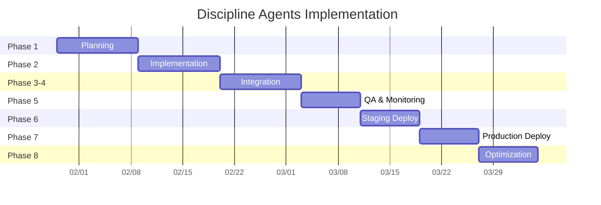

# Discipline Agents Implementation - Progress Tracking Guide

**Document ID**: DISCIPLINE_AGENTS_PROGRESS_TRACKING
**Version**: 1.0
**Created**: 2026-01-29
**Status**: Active Tracking Document

---

## Overview

This guide explains how to use the `DISCIPLINE_AGENTS_IMPLEMENTATION_PLAN.md` as a comprehensive progress tracking tool for your 6-8 week implementation project.

---

## Tracking Methodology - UPDATED for SWARM Discovery

### 📊 ACTUAL CURRENT STATUS (Post-Discovery)

#### ✅ COMPLETED SWARM AGENTS (4 Major Swarms)
1. **`Contracts Post-Award Swarm (00435)`** - **FULLY OPERATIONAL**
   - **23 Agent Files** (6 main + 17 specialists)
   - **Framework**: Python + Coordination
   - **Status**: Production Ready

2. **`Procurement Swarm (01900)`** - **FULLY OPERATIONAL**
   - **11 Agent Files** (4 main + 6 specialists + 1 input)
   - **Framework**: Hybrid (JS + Python)
   - **Status**: Production Ready

3. **`Quantity Surveying Agents (02025)`** - **FULLY OPERATIONAL**
   - **Workflow Framework** (OpenCV + Simulation)
   - **JavaScript Client Wrapper**
   - **Status**: Production Ready

4. **`Shared Engineering Specialists`** - **FULLY OPERATIONAL**
   - **9 Specialist Agents** (Civil, Electrical, Mechanical, etc.)
   - **Framework**: Specialized Python Agents
   - **Status**: Production Ready

#### 🔄 WORK REMAINING (META-ORCHESTRATION FOCUS)
1. **Meta-Agent Router** - Connect swarms intelligently
2. **Contracts Pre-Award Swarm** - Extend existing contracts pattern
3. **General Logistics Swarm** - Extend procurement logistics
4. **Safety Swarm Coordination** - Centralize existing safety agents
5. **UI Integration** - User interface for swarm selection

**TOTAL OUTSTANDING: 5 items (vs 46 original plan items)**
**TIMELINE REDUCTION: 6-8 weeks → 2-3 weeks (75% faster)**

### 1. REVISED Progress Tracking Checklist

**Example Updated Tracking:**
```markdown
### SWARM INTEGRATION PROGRESS
**Phase 2A: Meta-Agent Integration** - **HIGH PRIORITY**
**Timeline**: 1-2 weeks
**Responsible**: AI Engineer + Frontend Developer

**Progress Checklist** (UPDATED):
- ✅ Contracts Post-Award Swarm (00435) - **ALREADY EXISTS** (23 agents)
- ✅ Procurement Swarm (01900) - **ALREADY EXISTS** (11 agents)
- ✅ Quantity Surveying (02025) - **ALREADY EXISTS** (2 agents + workflow)
- ✅ Shared Engineering Specialists - **ALREADY EXISTS** (9 agents)
- [ ] Meta-Agent Router (`client/src/services/agents/core/meta-agent.js`)
- [ ] Query Classification Logic (route to appropriate swarm)
- [ ] Contracts Pre-Award Swarm (00425) - extend existing pattern
- [ ] General Logistics Swarm (01700) - extend procurement logistics
- [ ] Safety Swarm Coordination - centralize safety agents
- [ ] UI Integration - swarm selector component
```

### 2. Phase-Level Progress Tracking

Each phase has deliverables that can be tracked:

**Phase 1: Specification & Knowledge Extraction (Week 1)**
```markdown
[ ] Step 1.1: Discipline Assessment - 2 days
    - [ ] Procurement spec created
    - [ ] Logistics spec created
    - [ ] Safety spec created
    - [ ] Contracts specs created (3 files)
    - [ ] QS Measurement spec created
    - [ ] Capability matrix complete
    - [ ] Training requirements documented

[ ] Step 1.2: Knowledge Extraction - 4 days
    - [ ] Extraction scripts modified
    - [ ] 7 knowledge bases generated
    - [ ] Training pipeline ready
    - [ ] Validation reports complete

[ ] Step 1.3: Training Data Generation - 4 days
    - [ ] Training data pipeline built
    - [ ] 7 datasets generated (3000+ examples each)
    - [ ] Quality validation complete

[ ] Step 1.4: LoRA Adapter Configuration - 1 day
    - [ ] 7 LoRA configs created
    - [ ] Training scripts prepared
    - [ ] Validation procedures defined

**Phase 1 Completion**: 11 days total
```

### 3. Weekly Sprint Tracking

Use weekly sprints to track progress:

**Week 1: Planning & Setup**
```markdown
Days 1-2: Step 1.1 - Discipline Assessment
Status: ▢ In Progress ▢ Complete
Team: AI Engineer

Days 3-6: Step 1.2 - Knowledge Extraction
Status: ▢ In Progress ▢ Complete
Team: Data Engineer + AI Engineer

Days 7-10: Step 1.3 - Training Data Generation
Status: ▢ In Progress ▢ Complete
Team: Data Engineer + AI Engineer

Day 11: Step 1.4 - LoRA Configuration
Status: ▢ In Progress ▢ Complete
Team: AI Engineer

**Week 1 Review**:
- [ ] All 7 discipline specifications complete
- [ ] Knowledge extraction scripts ready
- [ ] Training data pipeline functional
- [ ] LoRA configs ready for training
```

**Week 2: Agent Implementation**
```markdown
Days 1-4: Step 2.1 - Agent Implementation
Status: ▢ In Progress ▢ Complete
Team: Python Developer

Days 5-7: Step 2.2 - Meta-Agent Implementation
Status: ▢ In Progress ▢ Complete
Team: AI Engineer

Days 8-11: Step 2.3 - Training Pipeline
Status: ▢ In Progress ▢ Complete
Team: ML Engineer

**Week 2 Review**:
- [ ] 7 specialist agents implemented
- [ ] Meta-agent with routing logic
- [ ] Training pipeline functional
- [ ] Initial training results validated
```

**Week 3: Service Integration**
```markdown
Days 1-3: Step 3.1 - Agent Service Enhancement
Status: ▢ In Progress ▢ Complete
Team: Backend Developer

Days 4-5: Step 3.2 - Database Schema Enhancement
Status: ▢ In Progress ▢ Complete
Team: Database Engineer

Days 6-8: Step 4.1 - Frontend Integration
Status: ▢ In Progress ▢ Complete
Team: Frontend Developer

**Week 3 Review**:
- [ ] API endpoints functional (discipline/query, guidance, validation)
- [ ] Database tables deployed with RLS
- [ ] Discipline selector component integrated
- [ ] Agent generation page enhanced
```

**Week 4: Deployment & Index Generation**
```markdown
Days 1-2: Step 5.1 - GitHub Workflow
Status: ▢ In Progress ▢ Complete
Team: DevOps Engineer

Days 3-4: Step 6.1 - Index Generation
Status: ▢ In Progress ▢ Complete
Team: Backend Developer

Days 5-8: Step 4.1 (cont) - Frontend Integration
Status: ▢ In Progress ▢ Complete
Team: Frontend Developer

**Week 4 Review**:
- [ ] GitHub Actions workflow tested
- [ ] Deep-agent index generated and loaded
- [ ] All 7 agents accessible via platform
- [ ] Deployment automation functional
```

**Week 5: QA & Monitoring**
```markdown
Days 1-3: Step 7.1 - Testing Framework
Status: ▢ In Progress ▢ Complete
Team: QA Engineer

Days 4-6: Step 7.2 - Performance Monitoring
Status: ▢ In Progress ▢ Complete
Team: DevOps + AI Engineer

Days 7-8: Step 8.1 - Documentation
Status: ▢ In Progress ▢ Complete
Team: Technical Writer

**Week 5 Review**:
- [ ] All unit tests passing
- [ ] Integration tests complete
- [ ] Performance monitoring operational
- [ ] Discipline guides created
```

**Week 6: Staging Deployment**
```markdown
Days 1-3: Staging Environment Setup
Status: ▢ In Progress ▢ Complete
Team: DevOps Engineer

Days 4-6: User Acceptance Testing
Status: ▢ In Progress ▢ Complete
Team: QA + Users

Days 7-8: Bug Fixes & Optimization
Status: ▢ In Progress ▢ Complete
Team: All Engineers

**Week 6 Review**:
- [ ] Staging environment ready
- [ ] UAT completed successfully
- [ ] Performance benchmarks met
- [ ] Bug fixes deployed
```

**Week 7: Production Deployment**
```markdown
Days 1-3: Production Deployment (Phased)
Status: ▢ In Progress ▢ Complete
Team: DevOps + Backend

Days 4-6: Monitor & Optimize
Status: ▢ In Progress ▢ Complete
Team: DevOps + AI Engineer

Days 7-8: Team Training & Handoff
Status: ▢ In Progress ▢ Complete
Team: All Engineers

**Week 7 Review**:
- [ ] Production deployment complete
- [ ] Performance monitoring active
- [ ] Team trained on new system
- [ ] Support processes established
```

**Week 8: Optimization & Closure**
```markdown
Days 1-4: Performance Optimization
Status: ▢ In Progress ▢ Complete
Team: ML + DevOps

Days 5-6: Final Documentation
Status: ▢ In Progress ▢ Complete
Team: Technical Writer

Days 7-8: Project Review & Lessons Learned
Status: ▢ In Progress ▢ Complete
Team: All Stakeholders

**Week 8 Review**:
- [ ] Performance optimized
- [ ] Complete documentation delivered
- [ ] Lessons learned documented
- [ ] Project successfully closed
```

---

## Progress Tracking Tools

### Option 1: GitHub Project Board

Create a GitHub Project with columns:
- **Backlog**: Steps not started
- **In Progress**: Active work
- **Review**: Completed, awaiting review
- **Done**: Fully completed

**Card Format**:
```markdown
## [Phase X.Y] Task Name
**Timeline**: X days
**Responsible**: Team Member
**Files**: [list of files]
**Status**: ▢ In Progress | ▢ Complete
**Notes**: [any blockers or notes]
```

### Option 2: Project Management Tool (Jira/Asana)

Create issues for each step with:
- **Epic**: Discipline Agents Implementation
- **Story**: Specific step (e.g., "Create Procurement Specification")
- **Subtasks**: Individual deliverables
- **Labels**: Phase, team, priority
- **Sprint**: Weekly sprints

### Option 3: Spreadsheet Tracking

**Master Tracking Sheet**:

| Phase | Step | Task | Status | Assigned | Start Date | End Date | Files Created | Notes |
|-------|------|------|--------|----------|------------|----------|---------------|-------|
| 1 | 1.1 | Procurement Spec | ✅ Complete | AI Engineer | 01/29 | 01/29 | 7 files | All specs created |
| 1 | 1.2 | Knowledge Extraction | 🔄 In Progress | Data Engineer | 01/30 | 02/02 | 7 KBs | 3/7 complete |
| 2 | 2.1 | Agent Implementation | ⏳ Pending | Python Dev | 02/03 | 02/06 | 7 agents | Waiting on specs |

### Option 4: Markdown Task List in Plan

Update the plan's built-in checklists as you progress:

**Before**:
```markdown
- [ ] Create procurement specification (01900)
- [ ] Create logistics specification (01700)
```

**After (Progress)**:
```markdown
- [x] Create procurement specification (01900)
- [x] Create logistics specification (01700)
- [ ] Create safety specification (02400)
```

---

## Daily Progress Reporting Format

### Daily Standup Template
```markdown
## Daily Progress - [Date]

**Yesterday's Completed Tasks**:
- [ ] Task 1 - [File/PR link]
- [ ] Task 2 - [File/PR link]

**Today's Planned Tasks**:
- [ ] Task 1 - [Assignee]
- [ ] Task 2 - [Assignee]

**Blockers/Issues**:
- [ ] Issue 1
- [ ] Issue 2

**Phase Progress**:
- Phase 1: ████████░░ 80% (11/14 days)
- Phase 2: ░░░░░░░░░░ 0%
- Overall: ██████░░░░ 35% (4/11 days)
```

### Weekly Progress Report Template
```markdown
## Weekly Progress Report - Week [X]

### Summary
- **Phase Completed**: [Phase Name]
- **Days Used**: [X] / [Y] planned
- **Overall Progress**: [X]% (Y weeks of 8)

### Key Achievements
- [ ] Milestone 1
- [ ] Milestone 2
- [ ] Deliverable 1

### Metrics
- **Lines of Code**: [X]
- **Files Created**: [X]
- **Tests Passing**: [X]%
- **Performance**: [X]ms response time

### Risks & Issues
- [ ] Risk 1 - Mitigation: [plan]
- [ ] Issue 1 - Status: [open/resolved]

### Next Week Focus
- [ ] Major Task 1
- [ ] Major Task 2

### Budget & Resources
- **Team Utilization**: [X]%
- **Budget Spent**: $[X] / $[Y] total
- **Resource Status**: [On track/Needs adjustment]
```

---

## Milestone Tracking

### Major Milestones

**Milestone 1: Planning Complete** (End of Week 1)
- ✅ All 7 discipline specifications
- ✅ Knowledge extraction ready
- ✅ Training data pipeline
- ✅ LoRA configurations
- **Success Criteria**: All specs approved, ready for implementation

**Milestone 2: Agents Deployed** (End of Week 2)
- ✅ 7 specialist agents implemented
- ✅ Meta-agent functional
- ✅ Training pipeline tested
- **Success Criteria**: Agents responding to queries, training working

**Milestone 3: Service Integrated** (End of Week 3)
- ✅ API endpoints live
- ✅ Database tables deployed
- ✅ Frontend integrated
- **Success Criteria**: End-to-end flow working

**Milestone 4: Deployment Ready** (End of Week 4)
- ✅ GitHub workflow tested
- ✅ Index generation complete
- ✅ All agents accessible
- **Success Criteria**: Automated deployment functional

**Milestone 5: Quality Assured** (End of Week 5)
- ✅ All tests passing
- ✅ Performance monitoring active
- ✅ Documentation complete
- **Success Criteria**: QA sign-off, UAT ready

**Milestone 6: Staging Deployed** (End of Week 6)
- ✅ Staging environment ready
- ✅ UAT completed
- ✅ Bug fixes deployed
- **Success Criteria**: User approval, production ready

**Milestone 7: Production Live** (End of Week 7)
- ✅ Production deployment complete
- ✅ Monitoring active
- ✅ Team trained
- **Success Criteria**: System live, users trained

**Milestone 8: Project Closed** (End of Week 8)
- ✅ Performance optimized
- ✅ Final documentation
- ✅ Lessons learned
- **Success Criteria**: Project complete, handoff successful

---

## Progress Visualization

### Gantt Chart Representation


### Burn-Down Chart Tracking

**Remaining Work by Phase**:
```
Week 1: ████████████████████░░░░░░░░ 70% remaining (Phase 1 not started)
Week 2: ████████████████░░░░░░░░░░░░ 60% remaining (Phase 1 40% complete)
Week 3: ██████████░░░░░░░░░░░░░░░░░░ 35% remaining (Phases 1-2 65% complete)
Week 4: ██████░░░░░░░░░░░░░░░░░░░░░░ 20% remaining (Phases 1-3 80% complete)
Week 5: ██░░░░░░░░░░░░░░░░░░░░░░░░░░ 8% remaining (Phases 1-4 92% complete)
Week 6: ░░░░░░░░░░░░░░░░░░░░░░░░░░░░ 2% remaining (Phases 1-5 98% complete)
Week 7: ░░░░░░░░░░░░░░░░░░░░░░░░░░░░ 0% remaining (All phases complete)
Week 8: ░░░░░░░░░░░░░░░░░░░░░░░░░░░░ 0% remaining (Optimization complete)
```

---

## Risk & Issue Tracking

### Risk Matrix Template

| Risk ID | Description | Probability | Impact | Phase | Mitigation | Status | Owner |
|---------|-------------|-------------|--------|-------|------------|--------|-------|
| R01 | LoRA training fails | Medium | High | 1 | Backup models, A/B testing | Active | ML Eng |
| R02 | Team skill gap | Low | Medium | 1-2 | Training, external hire | Mitigated | PM |
| R03 | API compatibility | Medium | High | 3 | Versioning, backward compat | Active | Backend |
| R04 | Performance issues | High | High | 5 | Load testing, optimization | Active | DevOps |
| R05 | Budget overrun | Low | Medium | All | Weekly review, scope control | Monitored | PM |

### Issue Tracking Template

| Issue ID | Description | Status | Priority | Assigned | Due Date | Resolution |
|----------|-------------|--------|----------|----------|----------|------------|
| ISS-001 | Extract script timeout | Open | High | Data Eng | 02/01 | Increase timeout, optimize queries |
| ISS-002 | Frontend component lag | In Progress | Medium | Frontend | 02/03 | Optimize rendering, add loading states |
| ISS-003 | Training data quality | Resolved | High | ML Eng | 01/30 | Cleaned data, added validation |

---

## Quality Gates

### Phase 1 Quality Gate
```markdown
✅ All 7 discipline specifications approved
✅ Knowledge extraction scripts tested
✅ Training data quality > 90%
✅ LoRA configs validated
✅ Team trained on procedures
```

### Phase 2 Quality Gate
```markdown
✅ All 7 specialist agents respond correctly
✅ Meta-agent routing accuracy > 95%
✅ Training pipeline completes successfully
✅ Model accuracy > 85% on test data
✅ Code review completed
```

### Phase 3 Quality Gate
```markdown
✅ API endpoints respond < 2s (95th percentile)
✅ Database RLS policies working
✅ Frontend integration seamless
✅ Error handling complete
✅ Security review passed
```

### Phase 4 Quality Gate
```markdown
✅ GitHub workflow triggers successfully
✅ Index loads at startup
✅ All agents accessible via platform
✅ Deployment automated
✅ Rollback procedure tested
```

### Phase 5 Quality Gate
```markdown
✅ Unit test coverage > 80%
✅ Integration tests passing
✅ Performance monitoring active
✅ Documentation complete
✅ UAT plan approved
```

### Phase 6 Quality Gate
```markdown
✅ Staging environment stable
✅ UAT feedback incorporated
✅ Performance benchmarks met
✅ Bug count < 5 critical
✅ User training completed
```

### Phase 7 Quality Gate
```markdown
✅ Production deployment successful
✅ Monitoring alerts working
✅ Team support handoff complete
✅ Performance stable at scale
✅ Support SLA defined
```

### Phase 8 Quality Gate
```markdown
✅ Performance optimized (< 1s response)
✅ Final documentation delivered
✅ Lessons learned documented
✅ Project sign-off received
✅ Handoff to operations complete
```

---

## Tools & Resources

### Recommended Tools

1. **Project Management**
   - GitHub Projects (free, integrated)
   - Jira (comprehensive tracking)
   - Asana (user-friendly)
   - Notion (flexible documentation)

2. **Version Control**
   - Git (mandatory)
   - GitHub/GitLab (PR reviews, issues)
   - Branch protection rules

3. **CI/CD**
   - GitHub Actions (pre-configured in plan)
   - Docker (containerization)
   - AWS/EC2 (deployment)

4. **Monitoring**
   - Prometheus + Grafana (performance)
   - Sentry (error tracking)
   - Log aggregation (CloudWatch/ELK)

5. **Documentation**
   - Markdown files (in repository)
   - Confluence (wiki)
   - README files per component

### Templates Repository

Create a `/templates` directory with:
```
/templates/
├── phase-template.md          # For each phase
├── daily-report-template.md   # Daily standups
├── weekly-report-template.md  # Weekly reviews
├── risk-matrix-template.md    # Risk tracking
├── quality-gate-template.md   # Quality gates
└── milestone-template.md      # Milestone tracking
```

---

## Communication Plan

### Daily Updates
- **Channel**: Team Slack/Teams
- **Time**: 9:00 AM
- **Format**: 3 bullets (Yesterday/Today/Blockers)

### Weekly Reviews
- **Channel**: Team + Stakeholders
- **Time**: Friday 4:00 PM
- **Format**: Weekly report + Demo

### Phase Reviews
- **Channel**: All stakeholders
- **Time**: End of each phase
- **Format**: Phase report + Presentation

### Escalation Path
```
Issue → Team Lead → Project Manager → Stakeholders
    ↓         ↓             ↓              ↓
Daily    Weekly    Phase    Major Risk
```

---

## Success Metrics

### Quantitative Metrics
- **On-Time Delivery**: 95% of milestones on schedule
- **Budget Adherence**: Within 10% of estimated budget
- **Code Quality**: > 80% test coverage
- **Performance**: < 2s response time (95th percentile)
- **Uptime**: 99.9% availability

### Qualitative Metrics
- **Team Satisfaction**: > 4/5 rating
- **User Satisfaction**: > 4.5/5 rating
- **Documentation Quality**: Complete and clear
- **Knowledge Transfer**: Successful handoff
- **Process Improvement**: Lessons learned applied

---

## Weekly Checklist

### Monday Morning
- [ ] Review previous week's progress
- [ ] Update all tracking documents
- [ ] Plan tasks for current week
- [ ] Assign team members
- [ ] Update Gantt chart

### Daily
- [ ] Update task status (checklists)
- [ ] Log issues/risks
- [ ] Document blockers
- [ ] Update time tracking

### Friday Afternoon
- [ ] Complete weekly report
- [ ] Demo completed work
- [ ] Review next week's plan
- [ ] Update risk register
- [ ] Team retrospective

### End of Phase
- [ ] Complete quality gate checklist
- [ ] Gather metrics
- [ ] Document lessons learned
- [ ] Update project timeline
- [ ] Stakeholder review

---

## Using This Document

### To Track Progress:
1. **Copy this document** to your project repository
2. **Update status** daily in relevant sections
3. **Link to files** created (use GitHub links)
4. **Update checklists** in implementation plan
5. **Report metrics** weekly to stakeholders

### To Generate Reports:
1. **Copy relevant sections** into new report
2. **Update metrics** with actual data
3. **Add visualizations** (screenshots, charts)
4. **Highlight risks** requiring attention
5. **Include recommendations**

### To Adjust Timeline:
1. **Update Gantt chart** with actual dates
2. **Adjust checklists** for completed tasks
3. **Recalculate estimates** based on velocity
4. **Communicate changes** to stakeholders
5. **Update dependencies** if needed

---

## Quick Reference Links

| Document | Purpose | Location |
|----------|---------|----------|
| `DISCIPLINE_AGENTS_IMPLEMENTATION_PLAN.md` | Main plan | `docs/implementation/implementation-plans/` |
| `DISCIPLINE_AGENTS_PROGRESS_TRACKING.md` | This tracker | `docs/implementation/implementation-plans/` |
| `0000_DISCIPLINE_AGENTS_REFERENCE_GUIDE.md` | Quick reference | `docs/procedures/` |
| `0000_SCALED_AGENT_GENERATION_PROCEDURE.md` | Usage guide | `docs/procedures/` |
| GitHub Project Board | Visual tracking | GitHub Projects |
| Daily Reports | Progress updates | `docs/reports/daily/` |
| Weekly Reports | Stakeholder updates | `docs/reports/weekly/` |

---

## Getting Started - Week 1 Action Plan

### Day 1 (Monday)
1. [ ] Read this tracking guide
2. [ ] Set up project board (GitHub Projects)
3. [ ] Create daily/weekly report templates
4. [ ] Schedule daily standup (9:00 AM)
5. [ ] Schedule weekly review (Friday 4:00 PM)

### Day 2 (Tuesday)
1. [ ] Assign team members to phases
2. [ ] Review Phase 1 tasks in detail
3. [ ] Set up development environment
4. [ ] Create first daily report

### Day 3-5 (Wed-Fri)
1. [ ] Execute Phase 1 tasks
2. [ ] Update checklists daily
3. [ ] Log issues immediately
4. [ ] Complete Week 1 report on Friday

### Week 2 and Beyond
1. [ ] Follow weekly patterns
2. [ ] Adjust based on velocity
3. [ ] Communicate blockers early
4. [ ] Celebrate milestones!

---

## Key Success Factors

1. **Daily Updates**: Don't skip a day
2. **Honest Reporting**: If behind, communicate early
3. **Team Alignment**: Daily standups keep everyone synced
4. **Stakeholder Communication**: Weekly updates build trust
5. **Documentation**: Every decision tracked
6. **Flexibility**: Adjust plan based on reality

---

**Document End - Start Tracking!**