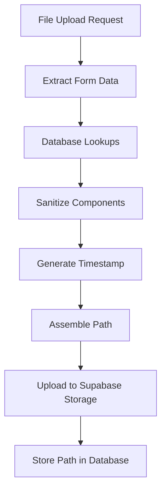

# File Storage Path Determination in LangChain Integration

## 📁 **Storage Path Structure**

The file storage path in the Supabase bucket is determined using a hierarchical structure that provides organization, traceability, and logical grouping of documents.

## 🔄 **Path Generation Process**

### **Step 1: Data Collection**
The system collects the following information from the upload request:

```javascript
// From form data
const organizationId = fields.organizationId;
const projectId = fields.projectId;
const discipline = fields.discipline || '00435';
const department = fields.department;

// From metadata (user form inputs)
const documentType = enhancedMetadata.ui?.documentType || 'general';
const projectPhase = enhancedMetadata.ui?.projectPhase || 'general';

// From file
const fileName = file.originalFilename || file.newFilename;
```

### **Step 2: Database Lookups**
The system performs database queries to get human-readable names:

```javascript
// Get organization and project names for path construction
const [orgResult, projectResult] = await Promise.all([
  supabase.from('organisations').select('name').eq('id', organizationId).single(),
  supabase.from('projects').select('name').eq('id', projectId).single()
]);

const orgName = orgResult.data?.name || 'unknown-org';
const projectName = projectResult.data?.name || 'unknown-project';
```

### **Step 3: Path Component Sanitization**
All path components are sanitized to ensure filesystem compatibility:

```javascript
// Sanitize path components (remove special characters)
const sanitizedOrg = orgName.replace(/[^a-zA-Z0-9-_]/g, '');
const sanitizedProject = projectName.replace(/[^a-zA-Z0-9-_]/g, '');
const sanitizedDiscipline = disciplineCode.replace(/[^a-zA-Z0-9-_]/g, '');
const sanitizedPhase = projectPhase.replace(/[^a-zA-Z0-9-_]/g, '');
const sanitizedType = documentType.replace(/[^a-zA-Z0-9-_]/g, '');
const sanitizedFilename = fileName.replace(/[^a-zA-Z0-9-_.]/g, '');
```

### **Step 4: Timestamp Generation**
A unique timestamp is generated for file versioning:

```javascript
const timestamp = new Date().toISOString().replace(/[:.]/g, '-');
// Example: "2025-01-07T05-59-38-123Z"
```

### **Step 5: Final Path Assembly**
The final storage path is constructed using this hierarchical structure:

```javascript
const storagePath = `documents/${sanitizedOrg}/${sanitizedProject}/${sanitizedDiscipline}/${sanitizedPhase}/${sanitizedType}/${timestamp}-${sanitizedFilename}`;
```

## 📊 **Path Structure Breakdown**

### **Complete Path Format**
```
documents/
  └── {organization_name}/
      └── {project_name}/
          └── {discipline_code}/
              └── {project_phase}/
                  └── {document_type}/
                      └── {timestamp}-{filename}
```

### **Real-World Example**
For a contract uploaded to the Simandou project:

```
documents/
  └── Rio-Tinto/
      └── Simandou-Iron-Ore-Project/
          └── 00435/
              └── feasibility-study/
                  └── contract/
                      └── 2025-01-07T05-59-38-123Z-supplier-agreement.pdf
```

## 🎯 **Path Components Explained**

### **1. Root Directory: `documents/`**
- Fixed root directory for all document storage
- Provides clear separation from other storage types

### **2. Organization: `{organization_name}`**
- **Source**: Database lookup from `organisations` table using `organizationId`
- **Purpose**: Top-level organizational separation
- **Fallback**: `'unknown-org'` if lookup fails
- **Example**: `Rio-Tinto`, `Chalco`, `Chinalco`

### **3. Project: `{project_name}`**
- **Source**: Database lookup from `projects` table using `projectId`
- **Purpose**: Project-level document organization
- **Fallback**: `'unknown-project'` if lookup fails
- **Example**: `Simandou-Iron-Ore-Project`, `Blocks-1-and-2`

### **4. Discipline: `{discipline_code}`**
- **Source**: Form field `discipline` or default `'00435'`
- **Purpose**: Discipline-specific document categorization
- **Examples**: `00435` (Contracts), `02050` (IT), `01000` (Engineering)

### **5. Project Phase: `{project_phase}`**
- **Source**: User form input from `MetadataCapture` component
- **Purpose**: Phase-based document organization
- **Fallback**: `'general'` if not specified
- **Examples**: `feasibility-study`, `construction`, `operations`, `closure`

### **6. Document Type: `{document_type}`**
- **Source**: User form input from `MetadataCapture` component
- **Purpose**: Type-based document categorization
- **Fallback**: `'general'` if not specified
- **Examples**: `contract`, `invoice`, `specification`, `report`

### **7. File: `{timestamp}-{filename}`**
- **Timestamp**: ISO timestamp with special characters replaced
- **Filename**: Original filename with special characters sanitized
- **Purpose**: Unique file identification and versioning
- **Example**: `2025-01-07T05-59-38-123Z-supplier-agreement.pdf`

## 🔧 **Configuration Sources**

### **Frontend Form Data**
The path components come from various parts of the upload form:

```javascript
// From basic information section
organizationId: "Selected from organisation dropdown"
projectId: "Selected from project dropdown"

// From metadata capture component
documentType: "Selected from document type dropdown"
projectPhase: "Selected from project phase dropdown"

// From system/modal context
discipline: "Determined by which modal is used (e.g., 00435 for Contracts)"
department: "Determined by modal context (e.g., 'Contracts')"
```

### **Database Lookups**
```sql
-- Organization name lookup
SELECT name FROM organisations WHERE id = {organizationId}

-- Project name lookup  
SELECT name FROM projects WHERE id = {projectId}
```

## 🛡️ **Security & Validation**

### **Path Sanitization**
- **Regex**: `/[^a-zA-Z0-9-_]/g` removes all special characters except hyphens and underscores
- **Purpose**: Prevents path traversal attacks and ensures filesystem compatibility
- **Applied to**: All path components except the timestamp

### **Fallback Values**
- **Organization**: `'unknown-org'` if database lookup fails
- **Project**: `'unknown-project'` if database lookup fails
- **Document Type**: `'general'` if not provided by user
- **Project Phase**: `'general'` if not provided by user

### **Validation**
- Required fields validated before path generation
- Database lookups handle missing records gracefully
- Path length and character restrictions enforced

## 📈 **Benefits of This Structure**

### **1. Hierarchical Organization**
- Clear logical grouping by organization → project → discipline → phase → type
- Easy navigation and browsing of stored documents
- Intuitive structure for administrators and users

### **2. Scalability**
- Supports multiple organizations and projects
- Handles unlimited document types and phases
- Distributes files across directory structure to avoid large single directories

### **3. Traceability**
- Every file path contains complete context information
- Easy to determine document origin and purpose from path alone
- Supports audit trails and compliance requirements

### **4. Version Management**
- Timestamp prefix ensures unique filenames
- Prevents overwrites of existing files
- Enables chronological sorting and version tracking

### **5. Integration Friendly**
- Compatible with existing document management workflows
- Supports automated processing and indexing
- Easy integration with backup and archival systems

## 🔄 **Path Generation Flow**



## 📝 **Example Paths**

### **Contract Document**
```
documents/Rio-Tinto/Simandou-Iron-Ore-Project/00435/feasibility-study/contract/2025-01-07T05-59-38-123Z-supplier-agreement.pdf
```

### **IT Specification**
```
documents/Chalco/Blocks-1-and-2/02050/design/specification/2025-01-07T06-15-22-456Z-network-requirements.docx
```

### **Engineering Report**
```
documents/Chinalco/Infrastructure/01000/construction/report/2025-01-07T07-30-45-789Z-structural-analysis.pdf
```

This hierarchical path structure ensures organized, scalable, and traceable document storage while maintaining compatibility with the existing system architecture and supporting future enhancements.
