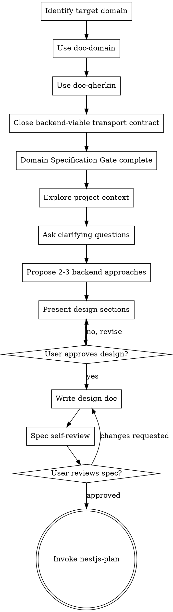

# NestJS Think

Turn backend requests into concrete NestJS-first designs before code changes. This skill is not stack-neutral: default to `NestJS + Prisma + Clean Architecture + SOLID`.

This skill owns backend coherence end to end at the design level: use-cases, transport, error mapping, and persistence viability stay together here unless the user explicitly asks to split them.

When the request is clearly frontend-first for Nuxt/Vuetify, use `nuxt-think` instead of forcing this workflow.
Use `feat-spec` when the request changes both frontend and backend or when the frontend depends on a new backend contract.

Before closing backend design decisions, locate the nearest backend `GUIDELINES.md` in the target project when one exists. Start from the likely owning module or app, walk upward, and treat the closest file as the primary local implementation source. If none exists, continue with this skill as the fallback baseline.

<HARD-GATE>
Do NOT invoke any implementation skill, write any code, scaffold any project, or take any implementation action until you have presented a design and the user has approved it.
</HARD-GATE>

## Domain Specification Gate

Complete this gate before checklist step 1.

Before writing the implementation plan:

1. identify the target business domain
2. use `doc-domain` to create or update `docs/domain/<domain>/domain.md`
3. use `doc-gherkin` to create or update `docs/domain/<domain>/*.feature`
4. present the domain and Gherkin artifacts for approval
5. do not advance with stale domain or Gherkin artifacts
6. if state transitions changed, regenerate the affected `.feature` files before planning
7. do not do the `domain.md` or `*.feature` work inline inside `nestjs-think`; delegate it to the shared spec skills
8. if the request splits into multiple independent domains, split them and close one domain at a time
9. for HTTP features, close the backend-viable transport contract before handing off to `doc-openapi`
10. close persistence viability for the approved backend shape: repositories, transactions, Prisma boundaries, constraints, and schema impact when relevant
11. only after `doc-openapi` and `nuxt-think` are approved, invoke `nestjs-plan`

Treat the domain directory as the approved specification bundle for backend planning, route coverage, and later test generation. `doc-openapi` publishes the canonical transport contract after this skill closes the backend-viable shape.

**Pronto para planejar**

- `docs/domain/<domain>/domain.md` approved.
- `docs/domain/<domain>/*.feature` approved.
- Backend-viable contract, persistence viability, Prisma/schema impact, and review constraints are closed.
- `doc-openapi` is ready to publish `docs/domain/<domain>/openapi.yaml` when the feature changes HTTP.

## Checklist

You MUST create a task for each of these items and complete them in order:

1. **Explore project context** — inspect modules, Prisma schema, tests, docs, and recent commits
2. **Ask clarifying questions** — one at a time, understand purpose, boundaries, contracts, and success criteria
3. **Propose 2-3 backend approaches** — with trade-offs and your recommendation
4. **Present the design** — emphasize modules, boundaries, contracts, persistence, and tests
5. **Write design doc** — save to `docs/plans/YYYY-MM-DD-<topic>-design.md`
6. **Spec self-review** — check placeholders, contradictions, ambiguity, and boundary drift
7. **User reviews written spec** — ask the user to review the file before proceeding
8. **Transition to implementation** — only after approval, invoke `nestjs-plan`

## Process Flow

## Understanding the Request

- Check the current project state first: modules, controllers, DTOs, use-cases, repositories, Prisma schema, test suites, and recent commits.
- Extract any local backend rules from the nearest `GUIDELINES.md` before proposing the final shape. Focus on migration strategy, Prisma boundaries, repository responsibilities, API granularity, and test discipline.
- If the request describes multiple independent subsystems, decompose it before refining details. Each subsystem should get its own spec and later its own implementation plan.
- Ask one question per message. Prefer multiple choice when it keeps the answer precise.
- Focus on:
  - public contract: HTTP, jobs, events, or internal use-case API
  - boundary placement: controller, application, domain, infrastructure
  - persistence shape: repository contracts, Prisma queries, transactions
  - persistence viability: cardinality, constraints, idempotency, auditing, and migration pressure
  - constraints: auth, validation, idempotency, migrations, observability
  - success criteria and test evidence

## Exploring Approaches

- Propose 2-3 backend approaches with trade-offs.
- Lead with your recommendation and explain why.
- Explicitly discuss:
  - migration shape and rollback posture when schema or persistence behavior changes
  - module boundaries
  - dependency direction
  - whether the public contract should be chunky or batch-oriented instead of chatty
  - repository and use-case responsibilities
  - whether update flows should be partial/minimal payload or full replacement, and why
  - where Prisma belongs and where it must not leak
  - whether the approved backend contract is actually supportable by the intended persistence strategy
  - how SOLID influences the design

## Presenting the Design

Cover, when relevant:

- module structure
- request or command flow
- DTOs, validation, guards, filters, and serialization
- use-cases and service boundaries
- repository contracts and Prisma adapters
- transaction boundaries and error mapping
- schema impact, constraints, and persistence risks that could force contract changes
- migration phases when contract or schema evolution is not atomic
- batch validation strategy when arrays of identifiers or related entities are involved
- payload granularity expectations for update endpoints
- test strategy across HTTP, application, and persistence layers

Ask after each section whether it looks right so far. If something is wrong or vague, revise before moving on.

## Design Rules

- Break the system into units with one clear purpose and explicit interfaces.
- Keep framework concerns, application logic, domain policies, and infrastructure separate.
- Treat Prisma as infrastructure. Repositories and adapters own persistence details.
- Prefer small, reversible changes and explicit expand-migrate-contract strategies over all-at-once rewrites when persistence shape changes.
- Prefer chunky contracts over chatty ones when the use case naturally supports batch operations.
- When validating arrays of identifiers, default to batch repository access patterns instead of N sequential lookups.
- Repositories persist and retrieve. They do not orchestrate multi-entity workflows, derive domain status, or absorb application caching concerns.
- Do not postpone obvious persistence contradictions to planning. If the contract and the data model fight each other, surface that here.
- If the existing code leaks Prisma into controllers or collapses use-cases into large services, call that out and propose the smallest correction that improves the current work.
- Stay focused on the requested goal. Do not propose unrelated refactors.

## After the Design

### Documentation

- Write the validated spec to `docs/plans/YYYY-MM-DD-<topic>-design.md`
- Do not leave placeholder sections or vague architecture prose

### Spec Self-Review

After writing the spec, check:

1. **Placeholder scan:** no `TBD`, `TODO`, or vague requirements
2. **Internal consistency:** architecture, requirements, and test strategy do not contradict each other
3. **Scope check:** the work still fits one implementation plan
4. **Ambiguity check:** requirements cannot be interpreted in multiple incompatible ways
5. **Boundary check:** controller, application, domain, and infrastructure concerns are separated
6. **Prisma check:** Prisma is confined to repository or adapter boundaries
7. **Migration check:** schema-impacting changes have a reversible evolution story when needed
8. **Contract check:** chatty endpoints, looped validations, or full-form update payloads are justified instead of accidental

Fix issues inline before asking the user to review.

### User Review Gate

After the self-review loop passes, ask the user to review the written spec before proceeding:

> "Spec written to `<path>`. Review it and tell me if you want any changes before I write the implementation plan."

Wait for approval. If the user requests changes, update the spec and re-run the self-review loop.

## Key Principles

- **One question at a time**
- **Multiple choice preferred when it improves precision**
- **YAGNI ruthlessly**
- **Explore alternatives before committing**
- **Incremental validation**
- **NestJS-first for backend work**
- **Clean boundaries over convenience**
- **Prisma discipline**
- **SOLID over short-lived hacks**

## Transition

When the backend design is approved, the next skill is:

- `doc-openapi` for HTTP features
- `nuxt-think` for frontend design on top of the published contract
- `nestjs-plan` only after `doc-openapi` and `nuxt-think` are closed when the feature is fullstack
