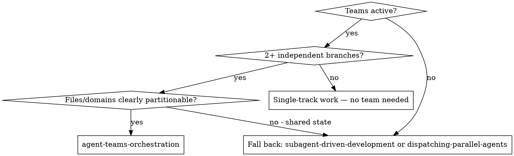
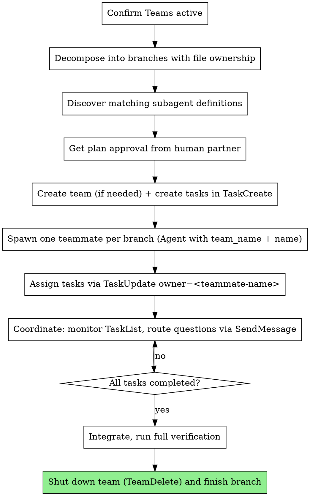

# Agent Teams Orchestration

## Overview

Claude Code 2.1.32+ exposes an experimental Agent Teams runtime gated behind the `CLAUDE_CODE_EXPERIMENTAL_AGENT_TEAMS=1` environment variable. When active, the `Agent` tool spawns long-lived teammates that share a team context, can be directly addressed via `SendMessage`, and pull work from a shared task list managed with `TaskCreate`/`TaskUpdate`/`TaskList`.

This skill guides the **team lead** — the agent that decomposes a problem, spawns teammates, and coordinates them through completion.

**Announce at start:** "I'm using the agent-teams-orchestration skill to coordinate this work as a team."

## When to Use



**Use when:**
- `<agent-teams-status>active</agent-teams-status>` appears in session context, OR `CLAUDE_CODE_EXPERIMENTAL_AGENT_TEAMS=1` is exported
- Work splits cleanly into 2+ independent branches with non-overlapping file ownership
- Each branch is sized for a fresh teammate (not a 30-second one-shot)

**Don't use when:**
- Teams runtime is inactive — use `superpowers:dispatching-parallel-agents` or `superpowers:subagent-driven-development` instead
- Branches edit overlapping files — sequence them or merge into one branch
- Task is small/exploratory — a single Agent dispatch is cheaper

## Detect Teams Status

Before doing anything else, determine whether Teams is active.

**Signals that Teams is active:**
1. Session context contains `<agent-teams-status>active</agent-teams-status>` (injected by the superpowers SessionStart hook)
2. The `Agent` tool's parameter list includes `team_name` and `name`
3. `SendMessage`, `TeamCreate`, and `TaskList` are available in the deferred tool list

**If active:** proceed with this skill.

**If inactive:** stop and delegate to `superpowers:dispatching-parallel-agents` (for ad-hoc parallel investigation) or `superpowers:subagent-driven-development` (for plan execution). Do NOT try to call `team_name` or `SendMessage` — they will fail.

## The Process



### 1. Decompose Into Branches With File Ownership

For every branch, write down:
- **Domain:** one clear problem area (one subsystem, one feature slice, one test file)
- **Files owned:** explicit list of files this teammate may write to
- **Files read-only:** files that may be read for context but never edited
- **Done criteria:** the exact verification (tests pass, lint clean, behavior verified)
- **Dependencies:** other branches that must finish first (if any — prefer none)

**Two teammates must never own the same file.** If branches overlap, merge them into one branch or sequence with `addBlockedBy`.

### 2. Discover Matching Subagent Definitions

Claude Code auto-loads subagent definitions from:
- `.claude/agents/*.md` (project scope, takes precedence)
- `~/.claude/agents/*.md` (user scope)

Each file's frontmatter `name:` becomes a valid `subagent_type` value for the `Agent` tool.

For each branch, pick a `subagent_type`:
- If a definition's description matches the branch domain (e.g., `code-reviewer.md` for a review branch), use its name as `subagent_type`.
- Otherwise omit `subagent_type` to spawn a generic teammate.

Read the definition file before assigning — its `description` and `tools` constrain what the teammate can do.

### 3. Get Plan Approval

Present the decomposition to the human partner before spawning anything:

```
Plan (Agent Teams):

Team: <team-name or "default">

Branches:
1. Branch: <domain>
   Teammate: <name> (subagent_type: <type or "generic">)
   Files owned: <list>
   Done when: <criteria>
2. Branch: ...

Coordination: I will route cross-branch questions via SendMessage.
Verification: <full-suite command> after all branches complete.
```

**Wait for approval.** Do not spawn until the human confirms.

### 4. Create Team and Tasks

If a fresh team is required, call `TeamCreate` with a descriptive name. Otherwise use the existing team context.

Create one task per branch with `TaskCreate`. Include in the description:
- Full branch context (files owned, files read-only, done criteria)
- Required verification command(s)
- Pointer to the plan file if one exists

Tasks start unowned. Set `addBlockedBy` for any sequencing dependencies.

### 5. Spawn Teammates

For each branch, dispatch one `Agent` call with:
- `team_name`: the team identifier
- `name`: a stable, unique handle (e.g., `auth-impl`, `db-migration`) — used by `SendMessage` and `TaskUpdate.owner`
- `subagent_type`: matched definition name, or omit for generic
- `prompt`: self-contained brief — the teammate sees no prior conversation

**Spawn rule:** one teammate per branch. Do not run two implementer teammates against the same files concurrently.

### 6. Assign Tasks

After spawning, assign each task to its teammate by `TaskUpdate` with `owner` set to the teammate's `name`. The teammate sees its assignment via `TaskList` and starts work.

### 7. Coordinate

While teammates work:
- Poll `TaskList` to see status changes (`pending` → `in_progress` → `completed`).
- Use `SendMessage` to:
  - Answer a teammate's question routed to you
  - Forward a cross-branch question (e.g., teammate A asks about a type owned by teammate B)
  - Deliver new context that emerged after spawn
- Do **not** edit owned files yourself while a teammate owns them. You are the coordinator.

If a teammate reports `BLOCKED` or `NEEDS_CONTEXT`, follow the same handling rules as `superpowers:subagent-driven-development` (provide context, escalate model, split task, or escalate to human).

### 8. Integrate and Verify

When every task reads `completed`:
1. Review each teammate's reported summary
2. Run the full verification suite (tests, lint, type-check)
3. If verification fails, dispatch a fix teammate scoped to the failing surface — do not patch from the lead session

### 9. Shut Down

After verification passes:
- `TeamDelete` if the team was created for this work and won't be reused
- Hand off to `superpowers:finishing-a-development-branch`

## Custom Subagent Definitions

When the matched definition needs project-specific guardrails, document them in the spawn prompt — the teammate cannot read this skill or your conversation history.

Minimum brief for every spawn:
1. The branch's task ID and what `completed` requires
2. Full file ownership and read-only lists
3. Verification commands
4. Communication protocol: "Use SendMessage to ask the lead questions; mark your task `in_progress` when you start and `completed` when verification passes."
5. Hard rule: "Do not edit files outside your owned list."

## Common Mistakes

**❌ Spawning before plan approval** — wastes teammates if the human redirects.
**✅ Plan first, spawn second.**

**❌ Two teammates owning the same file** — merge conflicts at integration.
**✅ Disjoint ownership, enforced in spawn prompt.**

**❌ Lead edits owned files mid-flight** — racing your own teammate.
**✅ Coordinator-only mode while teammates run.**

**❌ Assuming `subagent_type` exists** — typo'd or missing definition fails the spawn.
**✅ Read the definition file first; omit the param to fall back to generic.**

**❌ Using `Agent` with `team_name` when Teams is inactive** — tool errors.
**✅ Detect status first; fall back to `dispatching-parallel-agents`.**

**❌ Letting tasks finish without final verification** — green individuals, broken whole.
**✅ Run the full suite from the lead session before shutdown.**

## When NOT to Use

- Teams runtime inactive — fall back as described in detection
- Single-track work — direct implementation in this session is faster
- Highly coupled refactor where every branch reads in-flight state from the others — sequence with `subagent-driven-development` instead
- Exploratory debugging where you don't yet know the branches — investigate first, then decide

## Integration

**Required workflow skills:**
- **superpowers:writing-plans** — produces the plan that drives decomposition
- **superpowers:using-git-worktrees** — set up isolated workspace before spawning
- **superpowers:finishing-a-development-branch** — closes the work after team shutdown

**Fall-back skills (when Teams inactive):**
- **superpowers:dispatching-parallel-agents** — ad-hoc parallel investigation
- **superpowers:subagent-driven-development** — plan execution in current session
- **superpowers:executing-plans** — plan execution in a separate session

**Custom subagent sources:**
- `.claude/agents/` (project)
- `~/.claude/agents/` (user)
