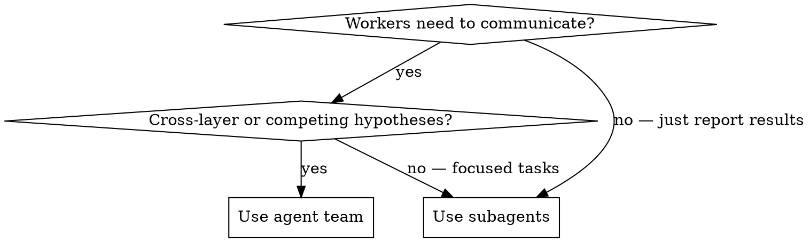

# Agent Teams

Coordinate multiple independent Claude Code sessions working in parallel with shared task lists and direct messaging. One session leads, the rest work as teammates.

**Core principle:** Teams beat subagents when teammates need to share findings, challenge each other, or coordinate across boundaries. Use subagents for everything else.

## When to Use



| Signal | Use |
|--------|-----|
| Workers talk to each other, share findings | Agent team |
| Workers just report results back | Subagent |
| Adversarial review, competing hypotheses | Agent team |
| Focused task, only the result matters | Subagent |
| Cross-layer changes (frontend + backend + tests) | Agent team |
| Independent bug fixes or research queries | Subagent |

**Don't use teams when:**
- Tasks are sequential or tightly coupled
- Multiple agents would edit the same files
- A single subagent handles it fine
- Coordination overhead exceeds the parallel benefit

## Setup

Agent teams are experimental. Enable first:

```json
// settings.json
{
  "env": {
    "CLAUDE_CODE_EXPERIMENTAL_AGENT_TEAMS": "1"
  }
}
```

## Team Shapes

### Research & Review (3 teammates)

Each reviewer applies a different lens. No file conflicts, pure analysis.

```
Create a team to review PR #142:
- Security reviewer
- Performance reviewer
- Test coverage reviewer
```

### Competing Hypotheses (3-5 teammates)

Teammates investigate different theories and actively challenge each other.

```
Users report the app exits after one message. Spawn 5 teammates
to investigate different hypotheses. Have them debate and disprove
each other's theories.
```

### Cross-Layer Feature (2-4 teammates)

Each teammate owns a layer. Clear file boundaries.

```
Create a team for the auth feature:
- Backend: API endpoints + middleware
- Frontend: login UI + state management
- Tests: integration tests (depends on impl landing first)
```

## Sizing

- **3-5 teammates** is the sweet spot. Three focused teammates outperform five scattered ones.
- **5-6 tasks per teammate** keeps everyone productive without excessive context switching.
- Token costs scale linearly — each teammate has its own context window.

## Worktrees

**CRITICAL:** When teammates work in git worktrees, the lead **MUST** commit, push, and merge (or open a PR for) each worktree's changes before the session ends. Worktree branches that aren't pushed are **lost** when the session terminates.

Use `isolation: "worktree"` on Agent spawns to give each teammate its own copy of the repo. This eliminates file conflicts entirely.

Project configs and auto memory are shared across worktrees of the same repository — teammates in worktrees see the same CLAUDE.md, rules, and memory without extra setup.

## Model Selection

Teammates inherit the lead session's model. Override in the spawn prompt:

```
Create a team with 4 teammates. Use Sonnet for each teammate.
```

## Communication

- **DM** (type: `message`): one specific teammate. Default to this.
- **Broadcast** (type: `broadcast`): all teammates. Costs N messages for N teammates — use sparingly.
- Messages auto-deliver. Don't poll.
- Teammates go idle between turns. This is normal, not an error. Sending a message wakes them.

## Navigation (in-process mode)

| Key | Action |
|-----|--------|
| `Shift+Down` | Cycle through teammates |
| `Enter` | View teammate's session |
| `Escape` | Interrupt teammate's turn |
| `Ctrl+T` | Toggle task list |

## Quality Gates

### Hooks

- **`TeammateIdle`**: runs when a teammate is about to go idle. Exit code 2 sends feedback and keeps them working. Return `{"continue": false, "stopReason": "..."}` to stop the teammate entirely.
- **`TaskCompleted`**: runs when a task is marked complete. Exit code 2 blocks completion with feedback. Same stop behavior available.

Hook events include `agent_id` and `agent_type` fields, so hooks can identify which teammate triggered them and apply different rules per role.

### Plan Approval

Require teammates to plan before implementing:

```
Spawn an architect teammate. Require plan approval before changes.
```

The lead approves or rejects. Rejected teammates revise and resubmit.

## Shutdown

```
Ask the researcher teammate to shut down
```

Shutdown is a request/response protocol — teammate can reject with a reason. Shut down all teammates before cleanup.

```
Clean up the team
```

**Always clean up via the lead.** Teammates lack the right context to clean up correctly.

## Display Modes

| Mode | Setting | Notes |
|------|---------|-------|
| Auto (default) | `"teammateMode": "auto"` | Split if already in tmux, otherwise in-process |
| In-process | `"teammateMode": "in-process"` | All in one terminal, any terminal works |
| Split panes | `"teammateMode": "tmux"` | Requires tmux or iTerm2 |

CLI override: `claude --teammate-mode in-process`

Split panes not supported in VS Code terminal, Windows Terminal, or Ghostty.

## Anti-Patterns

| Pattern | Problem | Fix |
|---------|---------|-----|
| Two teammates editing same file | Overwrites | One owner per file, or use worktrees |
| Lead implements instead of delegating | Bottleneck | "Wait for teammates to finish" |
| Teammates fail to mark tasks complete | Blocks dependents | Nudge or update status manually |
| Running unattended too long | Wasted effort | Check in periodically, redirect |
| Team for sequential work | All overhead, no benefit | Single session or subagents |
| Worktree branches not pushed | **Work lost permanently** | Commit + push + merge before shutdown |
| Overstaffing simple work | Token waste | 3 focused > 5 scattered |

## Integration

**Called by:**
- **writing-plans** — as an execution handoff option for parallel work

**Pairs with:**
- **using-git-worktrees** — isolate each teammate's work
- **finishing-a-development-branch** — merge worktree branches after teammates finish
- **requesting-code-review** — dispatch a reviewer teammate or review between tasks

## Limitations

- **No `/resume` or `/rewind`** for in-process teammates
- **One team per session**, no nested teams
- **Lead is fixed** — can't promote a teammate or transfer leadership
- **Permissions set at spawn** — changeable after, not during
- **Task status can lag** — teammates sometimes forget to mark tasks complete
- **Shutdown can be slow** — teammate finishes current tool call first
