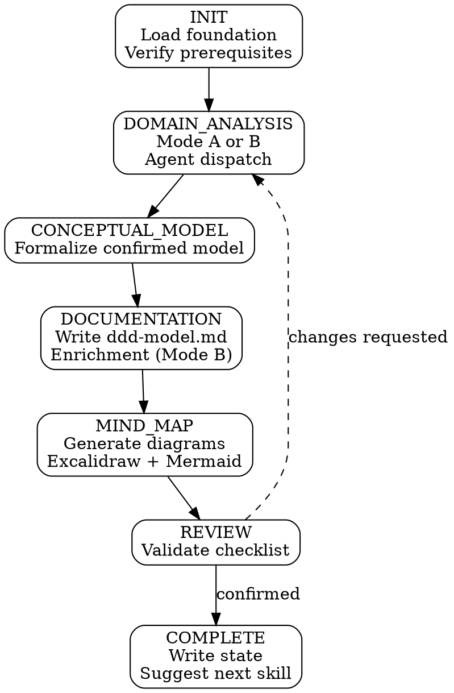

# Application Design

application-design conducts DDD-informed domain modeling adapted for Power Platform. It analyzes your foundation (and optionally existing solution artifacts) to identify bounded contexts, aggregates, aggregate roots, and ubiquitous language — then produces `docs/ddd-model.md`, the primary input for schema-design.

**Announce:** "I'm using the application-design skill to [create/resume] your domain model."

## Plan Mode Exit

<HARD-GATE>
This skill writes files at DOCUMENTATION, MIND_MAP, and COMPLETE stages. If plan mode is active, tell the developer:
"application-design needs to write files as we go. Please exit plan mode (Shift+Tab) so I can proceed."
Do NOT continue past Mode Selection while plan mode is active.
</HARD-GATE>

---

## Prerequisites

<HARD-GATE>
Before proceeding, verify all of the following exist in `.foundation/` and are NOT placeholders:
- `00-project-identity.md`
- `01-requirements.md`
- `02-architecture-decisions.md`
- `03-entity-map.md`

If ANY are missing or placeholder → STOP and tell the developer:
"I need a complete project foundation before I can model your domain. Run solution-discovery first."

Also verify `.foundation/.discovery-state.json` shows `"stage": "COMPLETE"`.
If discovery is not complete → STOP:
"solution-discovery is still in progress (stage: [stage]). Complete discovery first, then run application-design."
</HARD-GATE>

---

## Mode Selection

At INIT, determine the operating mode:

```
IF .pp-context/skill-state.json does not exist
   OR does not contain application-design entries → CREATE mode
IF skill-state.json shows activeSkill == "application-design"
   AND activeStage != "COMPLETE" → RESUME mode
IF skill-state.json shows "application-design" in completedSkills:
  → Ask: "Your domain model is complete. Would you like to update it?"
  → If yes → UPDATE mode (re-run from DOMAIN_ANALYSIS)
  → If no → suggest downstream skill and exit
```

## Companion File Loading

<EXTREMELY-IMPORTANT>
Load companion files at the specified points. These are directives, not suggestions.

**CREATE mode:**
1. Read `./conversation-guide.md` now.

**RESUME mode:**
1. Read `.pp-context/skill-state.json` to determine resume point.
2. Read `./conversation-guide.md` to continue from the first incomplete stage.

**UPDATE mode:**
1. Read `./conversation-guide.md` now.
2. Read `docs/ddd-model.md` to present current state.
</EXTREMELY-IMPORTANT>

---

## DDD Methodology

application-design uses DDD concepts adapted for Power Platform — taking what adds value in the Dataverse ecosystem and leaving behind what doesn't translate.

**Always produce (every project):**

| DDD Concept | Power Platform mapping |
|---|---|
| Bounded contexts | Solution boundaries, component ownership |
| Aggregates | Table groups with cascade scope, transactional boundaries |
| Aggregate roots | Primary entity in a group, lookup direction |
| Ubiquitous language | Table/column naming conventions, UI label consistency |

**Produce when relevant (complexity warrants it):**

| DDD Concept | When to include |
|---|---|
| Domain events | When the project has significant server-side logic or integration patterns |
| Value objects | When the entity map contains attributes that might be entities or might be column groups |

**Skip entirely (no Power Platform equivalent):**
Repositories, factories, domain services, application services, anti-corruption layers.

---

## CREATE Mode State Machine



## Stage-Gate Summary

| Stage | Writes | Can skip? | Gate condition |
|---|---|---|---|
| INIT | — | No | Foundation files exist, prerequisites pass, mode selected |
| DOMAIN_ANALYSIS | — | No | Agent dispatched, 3-round confirmation complete (Mode A) or gap analysis confirmed (Mode B) |
| CONCEPTUAL_MODEL | — | No | Developer confirms formalized conceptual model |
| DOCUMENTATION | `docs/ddd-model.md` | No | DDD document written; enrichment complete if Mode B |
| MIND_MAP | Diagrams (Excalidraw inline + Mermaid in doc) | No | Developer confirms diagrams are accurate |
| REVIEW | — | No | All checklist items pass, developer confirms |
| COMPLETE | `.pp-context/skill-state.json` | No | State written, next skill suggested, developer responds |

## DOMAIN_ANALYSIS — Mode Fork and Agent Dispatch

At the start of DOMAIN_ANALYSIS, present the mode selection:

> "Your foundation is loaded. I can see [N] entities in your entity map and [app type] as your architecture decision.
>
> How would you like to approach domain modeling?
> - **Design from scratch** — I'll analyze your requirements and propose a domain model (Mode A)
> - **Analyze existing solution** — Point me at your solution artifacts and I'll infer the domain model for review (Mode B)"

**Mode A — Forward Design (Greenfield):**
- Dispatch the **domain-modeler** agent with foundation sections 00-03
- Agent returns proposed bounded contexts, aggregates, ubiquitous language, and optionally domain events and value objects
- Present results in **three confirmation rounds:** bounded contexts → aggregates → ubiquitous language + conditionals
- Each round requires developer confirmation before proceeding to the next

**Mode B — Reverse Inference (Brownfield/MVP+):**
- Prompt for solution artifact paths (Entity Catalog, C# plugin project, web resource folder)
- Dispatch the **solution-analyzer** agent with foundation sections + artifact paths
- Agent returns inferred model + gap analysis + code observations
- Present gap analysis for developer review and confirmation
- Corrections captured for the enrichment protocol in DOCUMENTATION stage

See agent definitions in `agents/` for full analysis processes.

---

## Red Flags

<HARD-GATE>
**Never do these:**

- Never skip a stage — all 7 stages are required
- Never proceed past a stage gate without developer confirmation
- Never auto-start the next skill after COMPLETE — suggest, then wait
- Never write `docs/ddd-model.md` before the developer confirms at REVIEW
- Never collapse Mode A's three confirmation rounds into a single round — contexts, aggregates, and language are confirmed separately
- Never modify foundation sections without presenting each change for developer confirmation (enrichment protocol)
- Never modify `00-project-identity.md` through enrichment — project identity is the developer's declaration of intent
- Never create new foundation sections through enrichment — only update existing ones
</HARD-GATE>

---

## Integration

- **Upstream:** solution-discovery — produces `.foundation/` with the sections this skill reads
- **Downstream:** schema-design — reads `docs/ddd-model.md` for aggregate boundaries, ubiquitous language, and bounded context assignments
- **Cross-reference:** If DDD analysis reveals 3+ bounded contexts and foundation specifies single-solution packaging, flag the tension and suggest the developer consider running solution-strategy
- **Agents:** domain-modeler (Mode A), solution-analyzer (Mode B)
