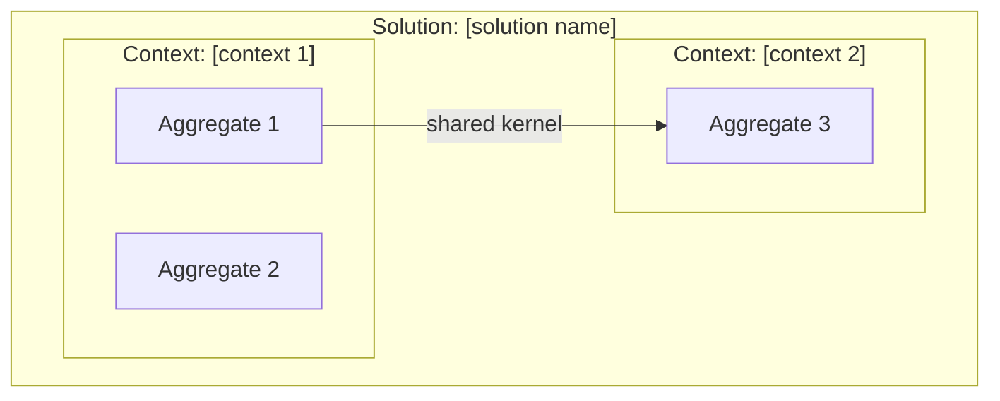
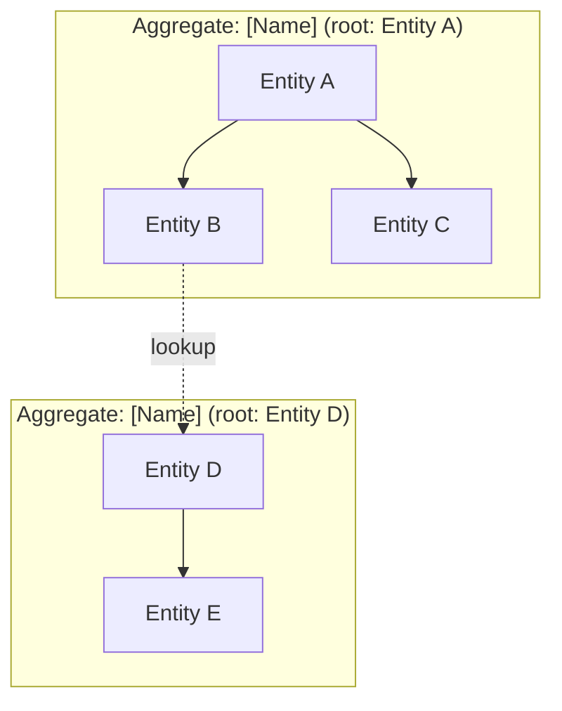
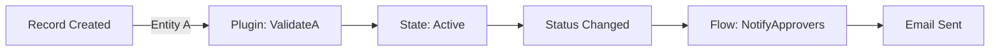

# Conversation Guide — application-design

This file is the stage-by-stage reference for running application-design. Read it at the start of CREATE, RESUME, or UPDATE mode. Follow each stage's flow, presentation templates, and gate conditions exactly.

<EXTREMELY-IMPORTANT>
**Timestamps:** Use actual UTC timestamps (e.g., `2026-04-02T14:30:00Z`) in all state file writes and document metadata. Never use placeholder timestamps like `T00:00:00Z`.

**State writes:** Write to `.pp-context/skill-state.json` at every stage transition. If `.pp-context/` does not exist, create it.

**Developer confirmation:** Every stage gate requires explicit developer confirmation before proceeding. Do not assume confirmation from silence or partial responses.
</EXTREMELY-IMPORTANT>

---

## Stage: INIT

### Actions

1. Read foundation sections:
   - `.foundation/00-project-identity.md`
   - `.foundation/01-requirements.md`
   - `.foundation/02-architecture-decisions.md`
   - `.foundation/03-entity-map.md`

2. Read context files if available:
   - `.pp-context/environment.json`
   - `.pp-context/session.json`

3. Check for existing state:
   - If `.pp-context/skill-state.json` exists, read it for mode detection

4. Determine mode (CREATE / RESUME / UPDATE) per SKILL.md rules

5. Write initial state:
   ```json
   {
     "activeSkill": "application-design",
     "activeStage": "INIT",
     "activeMode": null,
     "stageHistory": [
       { "stage": "INIT", "startedAt": "<UTC timestamp>" }
     ],
     "lastCompleted": "solution-discovery",
     "suggestedNext": null,
     "completedSkills": ["solution-discovery"]
   }
   ```

### Gate

Foundation files exist and are not placeholders. Mode determined. Proceed to DOMAIN_ANALYSIS.

---

## Stage: DOMAIN_ANALYSIS

### Mode Selection

Present the mode fork:

> "Your foundation is loaded. I can see [N] entities in your entity map and [app type] as your architecture decision.
>
> How would you like to approach domain modeling?
> - **Design from scratch** — I'll analyze your requirements and propose a domain model (Mode A)
> - **Analyze existing solution** — Point me at your solution artifacts and I'll infer the domain model for review (Mode B)"

Record the selected mode in state: `"activeMode": "A"` or `"activeMode": "B"`.

---

### Mode A — Forward Design

**Dispatch the domain-modeler agent** with the four foundation sections as input context. The agent is defined in `agents/domain-modeler.md`.

When the agent returns its proposal, present results in **three separate confirmation rounds**:

#### Round 1 — Bounded Contexts

> "Based on your requirements and entity map, I've identified [N] bounded contexts:
>
> **[Context Name 1]** — [one-line description]
> - Entities: [list]
> - Rationale: [why these entities belong together]
>
> **[Context Name 2]** — [one-line description]
> - Entities: [list]
> - Rationale: [why these entities belong together]
>
> Does this context breakdown make sense? Would you move any entities between contexts, add a context, or merge contexts?"

**Gate:** Developer confirms bounded context assignments. Apply any corrections before proceeding.

#### Round 2 — Aggregates

> "Within each bounded context, here are the aggregates I've identified:
>
> **[Context Name 1]:**
> - Aggregate: [Aggregate Name] (root: [Entity])
>   - Members: [entities in this aggregate]
>   - Cascade scope: [what happens when the root is deleted]
>   - Invariants: [business rules this aggregate protects]
>
> **[Context Name 2]:**
> [same structure]
>
> Does this aggregate structure match how you think about data ownership in your domain?"

**Gate:** Developer confirms aggregate definitions. Apply any corrections before proceeding.

#### Round 3 — Ubiquitous Language + Conditionals

> "Here's the ubiquitous language I've extracted — the naming standard for your domain:
>
> | Term | Definition | Maps to |
> |---|---|---|
> | [domain term] | [what it means in this context] | [Dataverse table/column name] |
>
> [If domain events were identified:]
> I've also identified these domain events:
> | Event | Trigger | Source entity | Handler type | Side effects |
> |---|---|---|---|---|
> | [event name] | [what causes it] | [entity] | [plugin/flow/business rule] | [state transition or side effect] |
>
> [If value object candidates were identified:]
> And these value object candidates — attribute groups that might be embedded columns or separate tables:
> | Candidate | Current form | Recommendation | Rationale |
> |---|---|---|---|
> | [name] | [form] | [recommendation] | [why] |"

**Gate:** Developer confirms ubiquitous language. Domain events and value objects confirmed if present.

---

### Mode B — Reverse Inference

**Prompt for artifact paths:**

> "Point me at your solution artifacts:
> 1. **Entity Catalog or Dataverse schema:** [path to entity catalog folder, or solution XML]
> 2. **C# plugin project:** [path to plugin .csproj or folder]
> 3. **Web resources:** [path to web resource folder]
>
> Any of these can be skipped if they don't exist yet."

**Dispatch the solution-analyzer agent** with foundation sections + artifact paths. The agent is defined in `agents/solution-analyzer.md`.

When the agent returns, present the gap analysis:

> "I've analyzed your solution artifacts. Here's what I found compared to your foundation:
>
> **Entities:**
> - Foundation lists [N] entities. Solution contains [M] entities.
> - Found in solution but not in foundation: [list]
> - In foundation but not found in solution: [list]
>
> **Inferred bounded contexts:**
> [present each context with evidence from artifact analysis]
>
> **Inferred aggregates:**
> [present each aggregate with cascade behaviors from actual relationship configuration]
>
> **Observations from code analysis:**
> - [patterns found in plugins]
> - [patterns found in web resources]
>
> What matches your intent? What needs to change?"

**Gate:** Developer confirms or corrects the inferred model. Record corrections for the enrichment protocol in DOCUMENTATION.

---

### State Write (both modes)

After DOMAIN_ANALYSIS is confirmed:
```json
{
  "activeSkill": "application-design",
  "activeStage": "CONCEPTUAL_MODEL",
  "activeMode": "[A or B]",
  "stageHistory": [
    { "stage": "INIT", "completedAt": "<UTC timestamp>" },
    { "stage": "DOMAIN_ANALYSIS", "completedAt": "<UTC timestamp>" },
    { "stage": "CONCEPTUAL_MODEL", "startedAt": "<UTC timestamp>" }
  ]
}
```

---

## Stage: CONCEPTUAL_MODEL

### Actions

Synthesize the confirmed model into a structured conceptual model — converting the conversational confirmations into a coherent whole.

### Presentation

> "Here's your conceptual domain model:
>
> **Bounded Contexts ([N]):**
> [For each context: name, entities, aggregate structure, key relationships to other contexts]
>
> **Aggregate Map:**
> [For each aggregate: root entity, member entities, invariants, cascade scope]
>
> **Cross-Context Relationships:**
> [How contexts communicate: shared kernel, customer-supplier, or conformist patterns]
>
> Does this conceptual model accurately represent your domain?"

### Gate

Developer confirms conceptual model is accurate and complete. This is the last confirmation before documentation is written.

### State Write

Update `activeStage` to `"DOCUMENTATION"`, add CONCEPTUAL_MODEL to stageHistory with `completedAt`.

---

## Stage: DOCUMENTATION

### Actions

1. **Write `docs/ddd-model.md`** using the template below
2. **Bounded context / single-solution tension check:** If the model contains 3+ bounded contexts and `04-solution-packaging.md` specifies a single solution:

   > "Your domain model has [N] bounded contexts, but your foundation specifies a single-solution packaging strategy. Bounded contexts often map to solution boundaries. You may want to run **solution-strategy** after this to evaluate whether multi-solution packaging would better serve your architecture.
   >
   > This is a signal, not a blocker — single-solution projects with multiple bounded contexts are valid. Noting it for your consideration."

3. **Mode B only — Foundation Enrichment Protocol:**

   Compare the confirmed model against foundation sections. Present each proposed change:

   > "I've found [N] updates to propose for your foundation:
   >
   > **03-entity-map.md:**
   > - ADD: [Entity X] — found in solution but not in foundation [reason]
   > - UPDATE: [Entity Y] relationship — foundation says 1:N, solution shows N:N [evidence]
   >
   > **02-architecture-decisions.md:**
   > - ADD: Integration point — [System Z] connector found in plugin code
   >
   > Confirm each update individually, or approve all?"

   For each confirmed update, write the change to the foundation section file and add a metadata comment:
   ```markdown
   <!-- Enriched by application-design [Mode B], [date]. Changes: [summary] -->
   ```

   **Enrichment may NOT:**
   - Create new foundation sections
   - Modify `00-project-identity.md`
   - Override developer decisions

   Log all applied changes in the DDD document's "Foundation enrichment applied" section.

4. **Either mode — Entity map corrections:** If DDD analysis revealed entities missing from or incorrectly described in `03-entity-map.md`, present corrections using the same enrichment flow.

### DDD Model Document Template — `docs/ddd-model.md`

```markdown
# Domain Model — [Project Name]

**Generated by:** application-design (pp-superpowers)
**Mode:** [A: Forward Design | B: Reverse Inference]
**Date:** [UTC timestamp]
**Foundation version:** [.discovery-state.json completedAt timestamp]

---

## Bounded Contexts

### [Context Name 1]

**Description:** [one-paragraph description of this context's responsibility]
**Solution assignment:** [solution name, or "primary" if single-solution]

**Entities in this context:**
| Entity | Role | Aggregate |
|---|---|---|
| [entity name] | [aggregate root | member | value object] | [aggregate name] |

**Relationships to other contexts:**
| Related context | Pattern | Description |
|---|---|---|
| [context name] | [shared kernel | customer-supplier | conformist] | [what is shared or consumed] |

### [Context Name 2]
[same structure]

---

## Aggregates

### [Aggregate Name 1]

**Bounded context:** [context name]
**Root entity:** [entity name]
**Members:**
| Entity | Role in aggregate | Cascade behavior |
|---|---|---|
| [entity name] | [root | child | reference] | [cascade delete | restrict | referential] |

**Invariants this aggregate protects:**
- [business rule or constraint]

**Notes:**
- [design rationale or observations]

### [Aggregate Name 2]
[same structure]

---

## Ubiquitous Language

| Term | Definition | Dataverse mapping | Notes |
|---|---|---|---|
| [domain term] | [what it means in this context] | [table or column name] | [naming convention applied] |

---

## Domain Events

> *This section is included when domain events were identified during analysis. If no events were identified, include this note: "No domain events identified during analysis. This section will be populated when the business-logic skill identifies trigger patterns."*

| Event | Trigger condition | Source entity | Handler type | Side effects |
|---|---|---|---|---|
| [event name] | [what causes this event] | [entity] | [plugin | flow | business rule] | [state changes, notifications, cascading actions] |

---

## Value Objects

> *This section is included when value object candidates were identified. If none, include this note: "No value object candidates identified."*

| Candidate | Current form | Recommendation | Rationale |
|---|---|---|---|
| [name] | [embedded columns | separate table | undecided] | [embed | extract to table] | [why] |

---

## Diagrams

### Bounded Context Map
[Mermaid code block]

### Aggregate Relationship Map
[Mermaid code block]

### Domain Event Flow
[Mermaid code block, or "Not applicable — no domain events identified"]

---

## Mode B: Inference Notes

> *Include this section only for Mode B. Delete for Mode A.*

### Artifacts analyzed
| Artifact type | Path | Entity count | Observations |
|---|---|---|---|
| Entity Catalog | [path] | [N] | [summary] |
| C# Plugins | [path] | [N classes] | [trigger patterns] |
| Web Resources | [path] | [N files] | [form script patterns] |

### Gap analysis summary
| Category | Foundation | Solution | Resolution |
|---|---|---|---|
| Entity count | [N] | [M] | [entities added/removed/confirmed] |
| Relationships | [from entity map] | [from actual schema] | [corrections applied] |
| Architecture | [from decisions] | [inferred from code] | [aligned/flagged] |

### Foundation enrichment applied
| Section | Change | Confirmed by developer |
|---|---|---|
| [section file] | [what was updated] | [yes — timestamp] |
```

### State Write

Update `activeStage` to `"MIND_MAP"`, add DOCUMENTATION to stageHistory with `completedAt`.

---

## Stage: MIND_MAP

### Actions

Generate three diagrams from the confirmed conceptual model. Each diagram is produced in two forms:

1. **Excalidraw inline** (if available) — interactive, rendered in the conversation for review
2. **Mermaid in document** (always) — written to `docs/ddd-model.md` for durable, git-friendly persistence

**Check for Excalidraw MCP tools** (look for `mcp__claude_ai_Excalidraw__create_view`):
- **Skip Excalidraw entirely in VS Code** — MCP Apps render as iframes that only display in claude.ai web UI. The `read_me` call alone wastes ~500 tokens of context for no visual output. Check the system context for "VSCode native extension environment" to detect this.
- If running in **claude.ai web UI** and tools are available: call `read_me` first (if not already called this session), then use `create_view` for each diagram to render inline for the developer to review interactively.
- If not available: present diagrams as Mermaid code blocks in conversation instead.

**Regardless of Excalidraw availability,** Mermaid code blocks are always written to the DDD document for persistence. Do NOT use `export_to_excalidraw` — the exported URLs are unreliable.

#### Diagram 1 — Bounded Context Map

**Excalidraw layout** (inline rendering):
- Use zone rectangles (opacity: 30) with `backgroundColor: "#dbe4ff"` for each bounded context
- Place aggregate rectangles inside each zone with `backgroundColor: "#a5d8ff"` for roots and `"#b2f2bb"` for members
- Use labeled arrows between contexts for integration patterns (shared kernel, customer-supplier, conformist)
- Group by solution assignment if multi-solution
- Use `cameraUpdate` as first element to frame the diagram

**Mermaid** (written to document):


#### Diagram 2 — Aggregate Relationship Map

**Excalidraw layout** (inline rendering):
- Title text at top
- Each aggregate as a group: root entity in `backgroundColor: "#a5d8ff"` rectangle, child entities in `"#b2f2bb"`, references in `"#ffd8a8"`
- Parental cascade arrows use solid lines with `strokeColor: "#22c55e"`
- Cross-aggregate reference arrows use dashed lines with `strokeColor: "#8b5cf6"`
- Layout top-down: aggregate root at top, children below, with clear spacing

**Mermaid** (written to document):


#### Diagram 3 — Domain Event Flow

**Only generate if domain events were identified.** If no events exist:
> "Domain Event Flow skipped — no domain events identified during analysis."

**Excalidraw layout** (inline rendering):
- Left-to-right flow
- Trigger events as rounded rectangles with `backgroundColor: "#fff3bf"`
- Handler nodes (plugin, flow, business rule) as rounded rectangles with `backgroundColor: "#d0bfff"`
- Side effects/outputs as rounded rectangles with `backgroundColor: "#b2f2bb"`
- Labeled arrows connecting trigger → handler → output
- Use `cameraUpdate` to frame the flow

**Mermaid** (written to document):


### Write Diagrams to DDD Document

<EXTREMELY-IMPORTANT>
After generating diagrams, you MUST edit `docs/ddd-model.md` to replace the placeholder text in the Diagrams section with Mermaid code blocks. This is a file write, not just a conversation presentation.

Replace each placeholder (e.g., `*Generated at MIND_MAP stage*`) with the corresponding Mermaid code block (wrapped in triple-backtick mermaid fences).

Excalidraw is for interactive conversation rendering only — do NOT write Excalidraw URLs or JSON to the document. Mermaid is the durable format.

Do NOT leave placeholder text in the document. The REVIEW stage will check that diagrams are present in the file.
</EXTREMELY-IMPORTANT>

### Presentation

> "I've generated [two/three] diagrams for your domain model:
> 1. **Bounded Context Map** — [rendered above via Excalidraw, or "see Mermaid diagram below"]
> 2. **Aggregate Relationship Map** — [rendered above via Excalidraw, or "see Mermaid diagram below"]
> 3. **Domain Event Flow** — [rendered above, or "Skipped — no domain events identified"]
>
> Mermaid versions have been written to `docs/ddd-model.md` for persistence.
>
> Review each diagram. Do any relationships or structures look wrong?"

### Gate

Developer confirms diagrams are accurate. Apply corrections if requested.

### State Write

Update `activeStage` to `"REVIEW"`, add MIND_MAP to stageHistory with `completedAt`.

---

## Stage: REVIEW

### Actions

Validate the complete DDD model against the foundation using this checklist:

### Presentation

> "Review checklist:
> - [checkmark/cross] All entities in `03-entity-map.md` assigned to a bounded context
> - [checkmark/cross] Every entity is a member of exactly one aggregate
> - [checkmark/cross] Every aggregate has exactly one root
> - [checkmark/cross] Ubiquitous language covers all entity names and key domain terms
> - [checkmark/cross] Bounded context relationships documented (no orphaned contexts)
> - [checkmark/cross] Domain events have handlers identified (if events exist)
> - [checkmark/cross] DDD document complete per template
> - [checkmark/cross] All diagrams written to `docs/ddd-model.md` as Mermaid code blocks — no placeholder text remaining
> [If Mode B:]
> - [checkmark/cross] Foundation enrichment protocol completed, all updates confirmed
>
> [If any items fail:] The following items need attention: [list with descriptions]
> [If all items pass:] Your domain model is complete. Ready to close?"

### Gate

All checklist items pass. Developer confirms.

### State Write

Update `activeStage` to `"COMPLETE"`, add REVIEW to stageHistory with `completedAt`.

---

## Stage: COMPLETE

### Actions

1. **Write completion state** to `.pp-context/skill-state.json`:
   ```json
   {
     "activeSkill": null,
     "activeStage": null,
     "activeMode": null,
     "stageHistory": [
       { "stage": "INIT", "completedAt": "<timestamp>" },
       { "stage": "DOMAIN_ANALYSIS", "completedAt": "<timestamp>" },
       { "stage": "CONCEPTUAL_MODEL", "completedAt": "<timestamp>" },
       { "stage": "DOCUMENTATION", "completedAt": "<timestamp>" },
       { "stage": "MIND_MAP", "completedAt": "<timestamp>" },
       { "stage": "REVIEW", "completedAt": "<timestamp>" },
       { "stage": "COMPLETE", "completedAt": "<timestamp>" }
     ],
     "lastCompleted": "application-design",
     "suggestedNext": "schema-design",
     "completedSkills": ["solution-discovery", "application-design"],
     "artifacts": [
       { "skill": "application-design", "file": "docs/ddd-model.md", "createdAt": "<timestamp>" }
     ]
   }
   ```

2. **Present the handoff suggestion:**

   > "Application design is complete. Your DDD model is at `docs/ddd-model.md` with [N] bounded contexts, [M] aggregates, and a [X]-term ubiquitous language glossary.
   >
   > I'd suggest moving to **schema-design** next — your aggregate definitions will directly inform table groupings, relationship behaviors, and naming conventions.
   >
   > Other options:
   > - **solution-strategy** — if bounded context analysis suggests reconsidering your solution packaging
   > - **ui-design** — if you want to start form/screen design before data modeling
   > - **Any other skill**
   >
   > What would you like to work on next?"

3. **Wait for explicit confirmation.** Do not auto-start the next skill.
