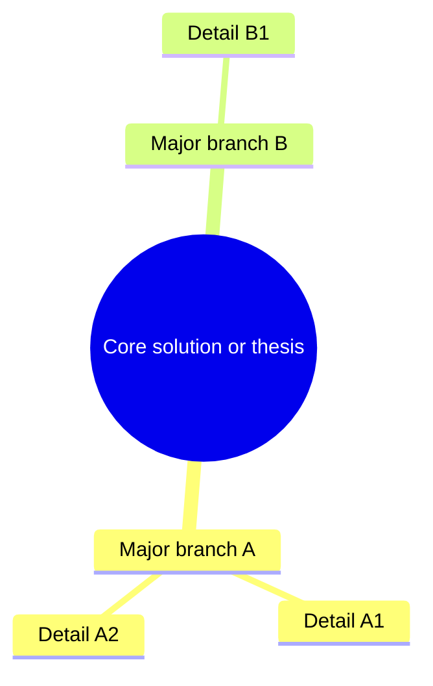

# Article Summary Output Template

Copy this structure for every summary. Replace placeholders.

---

## Meta

- **Title:**
- **Source:** (URL or file)
- **One-line takeaway:**

## Terms

Brief definitions — **WHAT** only. Prefer a table; use bullets if fewer than four terms.

| Term | What it is |
|------|------------|
|  |  |

Or:

- **Term:** …

## Problem

What question or pain does this article address? Include context (who, when, constraints) in 1–3 short paragraphs or bullets.

- **Situation:**
- **Pain / gap:**
- **Goal of the article:**

## Solution

### Mind map

Adjust depth to match the article. For tutorials, branches can follow major steps; for concept posts, branches follow ideas or components.

### Key decisions and points

- 
- 

Use this list for: architectural choices, recommended practices, trade-offs, warnings, and “if you only remember N things” — not for re-defining Terms.

---

## Optional (only if useful)

- **Prerequisites** the article assumes
- **Follow-up reading** mentioned in the article
- **Open questions** the article leaves unresolved
