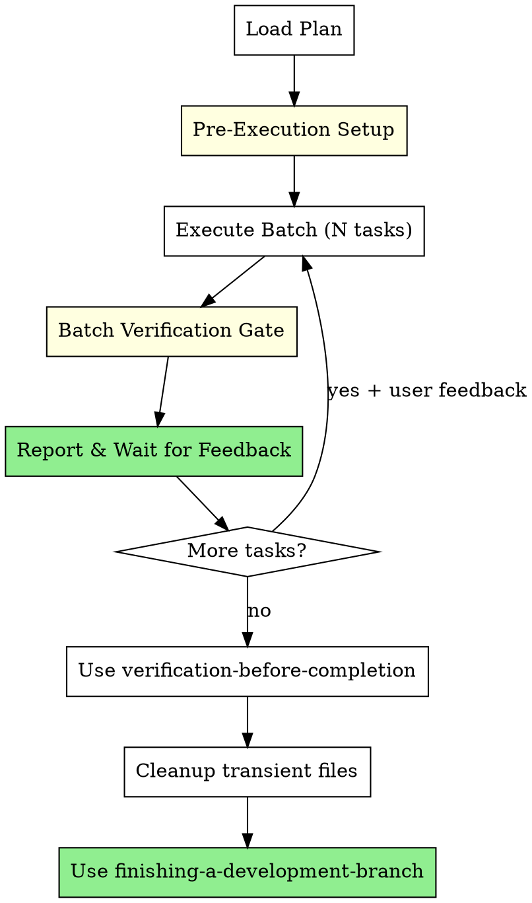

# Batch Development

Execute plans in batches with human checkpoints between each batch.

**Core principle:** Human stays in control. Execute N tasks, pause for feedback, repeat.

<requirements>
## Requirements

1. Pause after each batch for user review. Continuous execution loses user control.
2. Use AskUserQuestion for checkpoint feedback. Plain text doesn't allow structured response.
3. Wait for user approval before next batch. Proceeding without approval defeats the human-in-loop purpose.
</requirements>

## When to Use

- Executing implementation plans where you want to review progress
- When you prefer control over speed
- When tasks may need mid-flight adjustments

## Arguments

- Plan path: First argument (e.g., `docs/plans/feature.md`)
- `--batch-size=N`: Number of tasks per batch (default: 3)

## The Process



## Pre-Execution Setup

These offers are presented before the task loop. User decides whether to execute each.

<verification>
### Pre-Execution Verification

Before starting task loop, verify:

- [ ] On base branch? If yes, present Branch Creation Offer
- [ ] Primary issue exists? If yes, present Status Update Offer

Skipping required offers results in incomplete setup. User can decline any offer - the requirement is presentation, not execution.
</verification>

### Step 1: Branch Creation Offer (if not on feature branch)

Check if on main/master/develop:
```bash
git branch --show-current
```

If on base branch, dispatch issue-tracking agent:
```
Task(description: "Get branch convention",
     prompt: "Operation: get-branch-convention
Context: [plan goal/primary issue]",
     model: "haiku",
     subagent_type: "general-purpose")
```

Present offer to user:
```
AskUserQuestion(
  questions: [{
    question: "Create this branch?",
    header: "Branch",
    options: [
      {label: "Yes", description: "Create branch: feature/PROJ-123-add-user-auth"},
      {label: "Modify", description: "Let me specify a different branch name"},
      {label: "Skip", description: "Don't create a branch, stay on current"}
    ],
    multiSelect: false
  }]
)
```

Only execute after user approval via AskUserQuestion response.

### Step 2: Status Update Offer

If primary issue identified (from plan header, branch name, or discovery), dispatch issue-tracking agent:
```
Task(description: "Prepare status update",
     prompt: "Operation: update-status
Issue: [primary issue ID]
New status: in-progress",
     model: "haiku",
     subagent_type: "general-purpose")
```

Present offer:
```
AskUserQuestion(
  questions: [{
    question: "Update issue PROJ-123 status to in-progress?",
    header: "Status",
    options: [
      {label: "Yes", description: "Update status to in-progress"},
      {label: "Skip", description: "Leave status unchanged"}
    ],
    multiSelect: false
  }]
)
```

Only execute after user approval via AskUserQuestion response.

## Batch Execution

For each batch of N tasks:

1. **Execute tasks sequentially** - Follow each step in the plan precisely
2. **Track progress** - Update `docs/current-progress.md` after each task
3. **Note discovered work** - Append to progress file if work uncovers new requirements

<verification>
## Batch Completion Gate

After each batch, before reporting:

- [ ] All batch tasks executed (not skipped)
- [ ] Verifications run for each task (show output)
- [ ] Tests passing (show test output)
- [ ] Progress file updated with completed tasks
- [ ] Discovered work appended (if any found)

Any unchecked item blocks reporting. Complete all verifications first.
</verification>

<verification>
## Human Checkpoint Gate

After reporting batch results, use AskUserQuestion:

```
AskUserQuestion(
  questions: [{
    question: "Batch complete. How should I proceed?",
    header: "Continue",
    options: [
      {label: "Continue", description: "Proceed to next batch"},
      {label: "Pause", description: "I have feedback before continuing"},
      {label: "Stop", description: "Stop here, I'll resume later"}
    ],
    multiSelect: false
  }]
)
```

Verification:
- [ ] Used AskUserQuestion tool (NOT plain text)
- [ ] Waited for explicit user response via tool
- [ ] Incorporated any feedback before next batch

Proceeding without AskUserQuestion response bypasses human control. Plain text questions don't provide structured response UI.
</verification>

## Progress Tracking

Create `docs/current-progress.md` (gitignored) for session state:

```markdown
# Current Progress

## Plan
docs/plans/feature-plan.md

## Batch Size
3

## Active Batch
Tasks 4-6

## Completed Tasks
- [x] Task 1: Setup project structure
- [x] Task 2: Add base API client
- [x] Task 3: Add error handling

## Remaining Tasks
- [ ] Task 4: Add retry logic
- [ ] Task 5: Add rate limiting
- [ ] Task 6: Add tests

## Discovered Work
- [ ] "Need to add rate limiting to API" (discovered in Task 3)
- [ ] "Auth tokens should expire after 24h" (discovered in Task 5)
```

## Discovered Work Tracking

During task execution, when work uncovers something that should be tracked:

Append to `docs/current-progress.md`:

```markdown
## Discovered Work
- [ ] "Need to add rate limiting" (discovered in Task 3)
- [ ] "Auth tokens should expire" (discovered in Task 5)
```

No offers during execution - batched for final verification phase.

## Final Verification

After all tasks complete, use `hyperpowers:verification-before-completion`:
- Evidence-based completion checklist
- Discovered work offers
- Original issue update offer

## Cleanup

After verification-before-completion passes and before using
`hyperpowers:finishing-a-development-branch`, clean up transient files:

```bash
rm -f docs/current-progress.md
```

Note: `docs/handoffs/` cleanup not needed - batch-development doesn't
create handoff files (those are for subagent communication).

## Finish

Use `hyperpowers:finishing-a-development-branch` skill:
- Offers 4 completion options (merge, PR, continue, stash)
- Issue close offer (if primary issue tracked)
- Worktree cleanup offer (if in worktree)

## Red Flags

| Violation | Consequence | Recovery |
|-----------|-------------|----------|
| Plain text questions instead of AskUserQuestion | User can't respond via structured UI | Use AskUserQuestion tool |
| Proceeding without user feedback | Defeats purpose of batch approach | Stop, wait for response |
| Skipping batch verifications | Ships unverified code | Run verifications, show output |
| Skipping pre-execution offers | Missing branch/status setup | Present required offers |
| "Ready for feedback" without verification | False confidence | Verify then report |
| Batch size of "all remaining" | Loses checkpoint value | Stick to configured batch size |
| Starting new batch without user response | Human-in-loop is the value | Wait for explicit "continue" |

## Integration

**Required workflow skills:**
- **hyperpowers:verification-before-completion** - Final evidence-based verification
- **hyperpowers:finishing-a-development-branch** - Complete development after all tasks

**This skill replaces human with subagents** - Unlike subagent-driven-development which dispatches reviewer subagents, batch-development relies on human feedback. No prompt templates needed.

<requirements>
## Requirements Reminder

1. Pause after each batch for user review.
2. Use AskUserQuestion for checkpoint feedback.
3. Wait for user approval before next batch.
</requirements>
