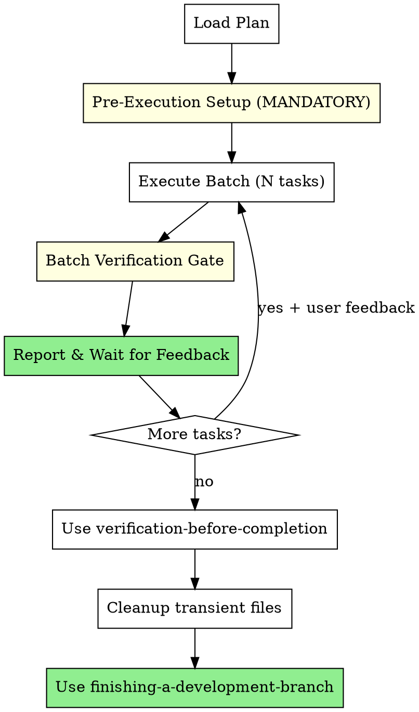

# Batch Development

Execute plans in batches with human checkpoints between each batch.

**Core principle:** Human stays in control. Execute N tasks, pause for feedback, repeat.

## When to Use

- Executing implementation plans where you want to review progress
- When you prefer control over speed
- When tasks may need mid-flight adjustments

## Arguments

- Plan path: First argument (e.g., `docs/plans/feature.md`)
- `--batch-size=N`: Number of tasks per batch (default: 3)

## The Process



## MANDATORY CHECKPOINT: Pre-Execution Setup

**REQUIRED before the task loop. These offers MUST be presented - user decides execution.**

### Step 1: Branch Creation Offer (if not on feature branch)

Check if on main/master/develop:
```bash
git branch --show-current
```

**REQUIRED:** If on base branch, you MUST present the branch creation offer.

If on base branch, dispatch issue-tracking agent:
```
Task(description: "Get branch convention",
     prompt: "Operation: get-branch-convention
Context: [plan goal/primary issue]",
     model: "haiku",
     subagent_type: "general-purpose")
```

Present offer to user:
```
Branch Creation Offer:
- Convention detected from: [source]
- Proposed branch: feature/PROJ-123-add-user-auth
- Based on issue: PROJ-123 "Add user authentication"

Create this branch? [Yes / Modify / Skip]
```

Only execute after user approval.

### Step 2: Status Update Offer

**REQUIRED:** If primary issue exists (from plan header, branch name, or discovery), you MUST present the status update offer.

If primary issue identified, dispatch issue-tracking agent:
```
Task(description: "Prepare status update",
     prompt: "Operation: update-status
Issue: [primary issue ID]
New status: in-progress",
     model: "haiku",
     subagent_type: "general-purpose")
```

Present offer:
```
Issue Status Update Offer:
- Issue: PROJ-123 "Add user authentication"
- Current status: open
- Proposed status: in-progress
- Command: [command from agent]

Update status? [Yes / Skip]
```

Only execute after user approval.

### Pre-Execution Checkpoint Gate

```
BEFORE starting task loop:

1. CHECK: On base branch?
   - YES → MUST present Branch Creation Offer
   - NO → Skip branch offer

2. CHECK: Primary issue exists?
   - YES → MUST present Status Update Offer
   - NO → Skip status offer

Skip presenting any required offer = incomplete pre-execution setup
```

**STOP CONDITION:** If about to start task loop without presenting required offers, STOP. Present offers first.

**Note:** User can decline any offer. The REQUIREMENT is presentation, not execution.

## Batch Execution

For each batch of N tasks:

1. **Execute tasks sequentially** - Follow each step in the plan precisely
2. **Track progress** - Update `docs/current-progress.md` after each task
3. **Note discovered work** - Append to progress file if work uncovers new requirements

## COMPULSORY: Batch Completion Gate

After each batch, before reporting:

- [ ] All batch tasks executed (not skipped)
- [ ] Verifications RUN for each task (show output)
- [ ] Tests passing (show test output)
- [ ] Progress file updated with completed tasks
- [ ] Discovered work appended (if any found)

**STOP CONDITION:** If ANY checkbox unchecked, complete it before reporting.

## COMPULSORY: Human Checkpoint Enforcement

After reporting batch results:

- [ ] Stated "Ready for feedback"
- [ ] WAITED for explicit user response
- [ ] Incorporated any feedback before next batch

**STOP CONDITION:** NEVER proceed to next batch without user response. This is the core value proposition of batch-development.

## Progress Tracking

Create `docs/current-progress.md` (gitignored) for session state:

```markdown
# Current Progress

## Plan
docs/plans/feature-plan.md

## Batch Size
3

## Active Batch
Tasks 4-6

## Completed Tasks
- [x] Task 1: Setup project structure
- [x] Task 2: Add base API client
- [x] Task 3: Add error handling

## Remaining Tasks
- [ ] Task 4: Add retry logic
- [ ] Task 5: Add rate limiting
- [ ] Task 6: Add tests

## Discovered Work
- [ ] "Need to add rate limiting to API" (discovered in Task 3)
- [ ] "Auth tokens should expire after 24h" (discovered in Task 5)
```

## Discovered Work Tracking

During task execution, when work uncovers something that should be tracked:

Append to `docs/current-progress.md`:

```markdown
## Discovered Work
- [ ] "Need to add rate limiting" (discovered in Task 3)
- [ ] "Auth tokens should expire" (discovered in Task 5)
```

No offers during execution - batched for final verification phase.

## Final Verification

After all tasks complete, use `hyperpowers:verification-before-completion`:
- Evidence-based completion checklist
- Discovered work offers
- Original issue update offer

## Cleanup

After verification-before-completion passes and before using
`hyperpowers:finishing-a-development-branch`, clean up transient files:

```bash
rm -f docs/current-progress.md
```

Note: `docs/handoffs/` cleanup not needed - batch-development doesn't
create handoff files (those are for subagent communication).

## Finish

Use `hyperpowers:finishing-a-development-branch` skill:
- Offers 4 completion options (merge, PR, continue, stash)
- Issue close offer (if primary issue tracked)
- Worktree cleanup offer (if in worktree)

## Red Flags - IMMEDIATE STOP

| Violation | Why It's Critical | Recovery |
|-----------|-------------------|----------|
| Proceeding without user feedback | Defeats purpose of batch approach | STOP, wait for response |
| Skipping batch verifications | Ships unverified code | Run verifications, show output |
| Skipping pre-execution offers | Missing branch/status setup | Present required offers |
| "Ready for feedback" without verification | False confidence | Verify THEN report |
| Batch size of "all remaining" | Loses checkpoint value | Stick to configured batch size |
| Starting new batch without user response | Human-in-loop is the value | Wait for explicit "continue" |

## Integration

**Required workflow skills:**
- **hyperpowers:verification-before-completion** - Final evidence-based verification
- **hyperpowers:finishing-a-development-branch** - Complete development after all tasks

**This skill replaces human with subagents** - Unlike subagent-driven-development which dispatches reviewer subagents, batch-development relies on human feedback. No prompt templates needed.
