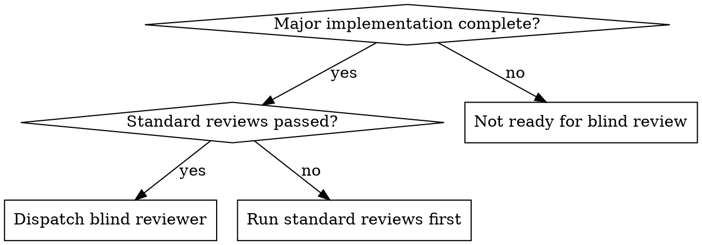

# Blind Review

## Overview

Dispatch a review agent that receives ONLY the original spec or requirements — no implementation summaries, no file lists, no context about how the code was built. The reviewer must read the code independently and evaluate it purely against what was requested.

**Core principle:** A reviewer who only knows the *spec* naturally focuses on "does this do what was asked?" rather than "does this code look reasonable?" This catches entire categories of bugs that implementation-aware reviewers miss.

**Announce at start:** "I'm using the blind-review skill to validate this implementation against the spec."

## When to Use



**Mandatory after:**
- All tasks complete in subagent-driven-development (before finishing-a-development-branch)
- Multi-file feature implementations
- Plan execution completion

**Not needed for:**
- Single-file bug fixes with clear test coverage
- Documentation-only changes
- Refactors that don't change behavior

## Why Blind Review Catches Different Bugs

Standard code review happens with implementation context — the reviewer knows what was built, how it was built, and tends to evaluate "does this code look reasonable?" Blind review forces evaluation from the spec outward.

| Review Type | Perspective | Catches |
|-------------|------------|---------|
| Standard (implementation-aware) | "Does this code work?" | Logic errors, style issues, test gaps |
| Blind (spec-only) | "Does this match what was asked?" | Spec drift, missing requirements, security gaps, deployment issues |

**Bug classes blind review consistently catches:**
- **Spec drift** — features subtly different from what was requested
- **Missing requirements** — items skipped or only partially implemented
- **Security gaps** — empty secret defaults, missing auth checks, fail-open paths
- **Race conditions** — TOCTOU gaps between check and action
- **Deployment issues** — missing retry paths, backward-incompatible data changes
- **Over-engineering** — features added that weren't in the spec

## The Process

### Step 1: Gather the Spec

Extract the original requirements — the plan, spec document, or task description. This is the ONLY context the reviewer gets.

**Do NOT include:**
- Implementation summaries or reports
- File lists or changed paths
- Notes about how it was built
- Implementer's self-review

### Step 2: Dispatch Blind Reviewer

Use the prompt template below. The reviewer must read the codebase independently.

```
Task tool (general-purpose):
  description: "Blind spec review for [feature name]"
  prompt: |
    You are a hostile auditor reviewing code you've never seen before.
    You know ONLY what was supposed to be built. You must find the code,
    read it, and determine if it does what the spec says.

    ## The Specification

    [PASTE FULL SPEC/REQUIREMENTS — NOTHING ELSE]

    ## Your Job

    Read the actual codebase and verify against the spec above.
    You have NO implementation context. Find the code yourself.

    **Check for:**

    1. **Spec compliance**
       - Every requirement implemented? Line by line.
       - Anything built that wasn't requested?
       - Requirements interpreted differently than intended?

    2. **Security and deployment readiness**
       - Secrets with empty/insecure defaults?
       - Auth checks missing on endpoints?
       - Fail-open paths (what happens when auth/validation fails)?
       - Race conditions (check-then-act patterns)?

    3. **Data safety**
       - Backward compatibility with existing data?
       - Migration paths for format changes?
       - What happens with malformed or missing data?

    4. **Missing error paths**
       - Token expiry, network failure, partial writes?
       - Retry and recovery mechanisms?

    **IMPORTANT: Even if you cannot find the implementation files, you MUST
    still produce a full report.** Enumerate every spec requirement, flag
    every security concern derivable from the spec, and list what you would
    verify in code. "Code not found" is a Critical finding, not a reason
    to stop. The spec alone contains enough information to identify risks
    (e.g., "JWT auth" implies token expiry handling, secret management,
    refresh token rotation).

    **Report format:**
    - Critical: Must fix before merge (security, data loss, spec violations)
    - Important: Should fix before merge (missing error handling, race conditions)
    - Minor: Nice to fix (style, naming, minor improvements)
    - Spec compliance: ✅ Met / ❌ Not met — with line-by-line breakdown
    - Spec-derived risks: Concerns derivable from the spec that MUST be
      verified in code (even if you haven't seen the code yet)
```

### Step 3: Act on Findings

- **Critical issues:** Fix immediately, re-run blind review on affected areas
- **Important issues:** Fix before merge
- **Minor issues:** Fix or note for follow-up
- If reviewer found zero issues, be suspicious — ensure they actually read the code

## Quick Reference

| Step | Action | Key Rule |
|------|--------|----------|
| 1 | Gather spec | Spec only — no implementation context |
| 2 | Dispatch reviewer | Reviewer reads code independently |
| 3 | Act on findings | Fix Critical/Important before merge |

## Integration with Existing Workflows

**Subagent-Driven Development:**
```
Per-task spec review → Per-task code quality review → ... → All tasks done →
BLIND REVIEW (entire implementation vs full spec) → finishing-a-development-branch
```

**Executing Plans:**
```
All batches complete → BLIND REVIEW → finishing-a-development-branch
```

The blind review is the final quality gate before branch completion. Per-task reviews catch task-level issues; blind review catches system-level issues across the full implementation.

## Common Mistakes

| Mistake | Fix |
|---------|-----|
| Including implementation context in the prompt | Spec only — let reviewer find code independently |
| Skipping because per-task reviews passed | Per-task reviews catch different bugs than whole-spec review |
| Trusting "zero issues" result | Verify reviewer actually read the code (check for file references) |
| Only running on happy path features | Run on security-sensitive and data-handling code especially |
| Treating it as optional | It's the final gate — mandatory before merge for major implementations |
| Short-circuiting on "code not found" | "Code not found" is a Critical finding, not a stop signal. Still enumerate every spec requirement and flag spec-derived security risks |
| Cutting corners under time pressure | "We need to merge today" is not a reason to do a "quick review." Blind review is the final gate — rushing it defeats its purpose |

## Red Flags

**Never:**
- Give the reviewer implementation summaries, file lists, or build context
- Skip blind review because "standard reviews already passed"
- Merge with unresolved Critical findings
- Trust a review that doesn't reference specific files and lines
- Do a "quick" or "abbreviated" blind review under time pressure
- Stop the review because implementation files weren't found — enumerate spec-derived risks regardless

**Always:**
- Provide only the spec/requirements
- Let the reviewer find and read code independently
- Enumerate spec-derived risks even before reading code (e.g., "JWT auth" → token expiry, secret rotation, refresh token security)
- Fix Critical and Important findings before merge
- Re-review if significant changes were made to fix findings
