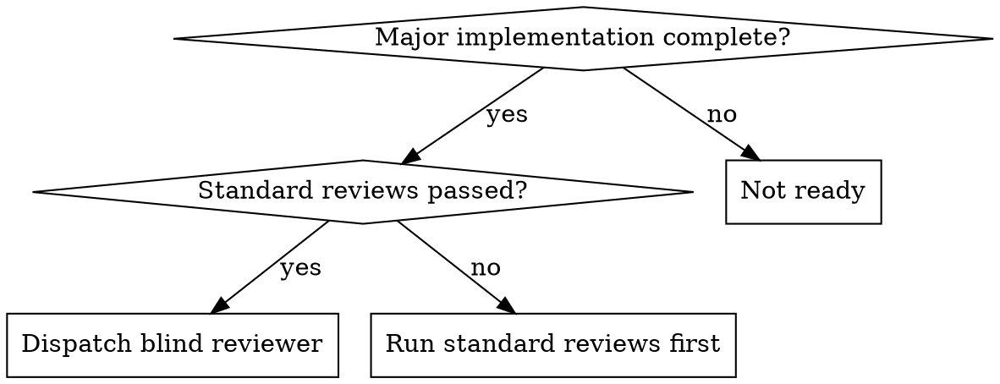

# Blind Review

## Overview

Dispatch a review agent that receives ONLY the original spec — no implementation summaries, no file lists, no context about how the code was built. The reviewer reads code independently and evaluates purely against what was requested.

A reviewer who only knows the *spec* focuses on "does this do what was asked?" rather than "does this code look reasonable?" — catching spec drift, security gaps, race conditions, and deployment issues that implementation-aware reviewers systematically miss.

**Announce at start:** "I'm using the blind-review skill to validate this implementation against the spec."

## When to Use



**Mandatory after:** all tasks in subagent-driven-development, multi-file features, plan execution completion.

**Not needed for:** single-file bug fixes, documentation-only changes, behavior-preserving refactors.

## The Process

### Step 1: Gather the Spec

Extract the original requirements. This is the ONLY context the reviewer gets.

**Do NOT include:** implementation summaries, file lists, notes about how it was built, implementer's self-review.

### Step 2: Dispatch Blind Reviewer

```
Task tool (general-purpose):
  description: "Blind spec review for [feature name]"
  prompt: |
    You are a hostile auditor reviewing code you've never seen before.
    You know ONLY what was supposed to be built. You must find the code,
    read it, and determine if it does what the spec says.

    ## The Specification

    [PASTE FULL SPEC/REQUIREMENTS — NOTHING ELSE]

    ## Your Job

    Read the actual codebase and verify against the spec above.
    You have NO implementation context. Find the code yourself.

    **Check for:**

    1. **Spec compliance** — Every requirement implemented? Anything
       extra? Requirements misinterpreted?

    2. **Security and deployment readiness** — Secrets with empty
       defaults? Missing auth checks? Fail-open paths? Race conditions
       (check-then-act)?

    3. **Data safety** — Backward compatibility? Migration paths?
       Malformed/missing data handling?

    4. **Missing error paths** — Token expiry, network failure, partial
       writes? Retry and recovery?

    **IMPORTANT: If you cannot find implementation files, you MUST still
    produce a full report.** Enumerate every spec requirement, flag every
    security concern derivable from the spec. "Code not found" is a
    Critical finding, not a reason to stop.

    **Report format:**
    - Critical: Must fix before merge (security, data loss, spec violations)
    - Important: Should fix (missing error handling, race conditions)
    - Minor: Nice to fix (style, naming)
    - Spec compliance: ✅ Met / ❌ Not met — line-by-line breakdown
    - Spec-derived risks: Concerns to verify in code
```

### Step 3: Act on Findings

- **Critical:** Fix immediately, re-run blind review on affected areas
- **Important:** Fix before merge
- **Minor:** Fix or note for follow-up
- Zero issues found? Be suspicious — verify the reviewer actually read code (check for file:line references)

## Integration

```
subagent-driven-development: Per-task reviews → All tasks done → BLIND REVIEW → finishing-a-development-branch
executing-plans:             All batches done → BLIND REVIEW → finishing-a-development-branch
```

## Common Mistakes

| Mistake | Fix |
|---------|-----|
| Including implementation context | Spec only — let reviewer find code independently |
| Skipping because per-task reviews passed | Per-task reviews catch different bugs than whole-spec review |
| Trusting "zero issues" result | Verify reviewer read the code (check for file references) |
| Short-circuiting on "code not found" | Still enumerate every spec requirement and flag spec-derived risks |
| Cutting corners under time pressure | "Merge today" is not a reason for a "quick review" |

## Red Flags

**Never:** give the reviewer implementation context, skip because standard reviews passed, merge with unresolved Critical findings, do a "quick" blind review under time pressure, stop because files weren't found.

**Always:** provide only the spec, let the reviewer find code independently, enumerate spec-derived risks before reading code, fix Critical/Important before merge, re-review after significant fixes.
