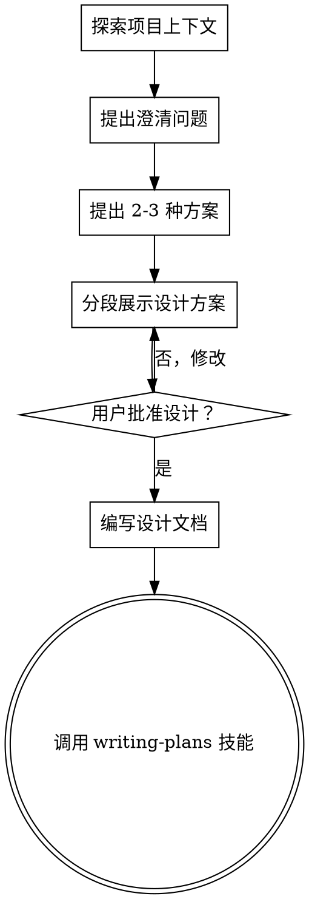

# 将创意头脑风暴转化为设计方案

## 概述

通过自然的协作对话，帮助将创意转化为完整的设计和规格说明。

首先了解当前项目的上下文，然后逐一提出问题以完善创意。一旦你理解了要构建的内容，就展示设计方案并获得用户批准。

<HARD-GATE>
在你展示设计方案并获得用户批准之前，不要调用任何实施技能、编写任何代码、搭建任何项目或采取任何实施行动。无论项目看起来多么简单，这条规则都适用于每一个项目。
</HARD-GATE>

## 反模式："这太简单了，不需要设计"

每个项目都要经过这个流程。待办事项列表、单功能工具、配置变更——所有项目都不例外。"简单"项目恰恰是未经检验的假设导致最多无效工作的地方。设计可以很简短（对于真正简单的项目只需几句话），但你必须展示设计方案并获得批准。

## 检查清单

你必须为以下每一项创建任务，并按顺序完成：

1. **探索项目上下文** — 检查文件、文档和最近的提交记录
2. **提出澄清问题** — 逐一提问，了解目的/约束条件/成功标准
3. **提出 2-3 种方案** — 包含权衡分析和你的推荐建议
4. **展示设计方案** — 按各部分的复杂程度分段展示，每段展示后获取用户批准
5. **编写设计文档** — 保存至 `docs/plans/YYYY-MM-DD-<topic>-design.md` 并提交
6. **过渡到实施阶段** — 调用 writing-plans 技能创建实施计划

## 流程图

**终止状态是调用 writing-plans。** 不要调用 frontend-design、mcp-builder 或任何其他实施技能。头脑风暴之后唯一调用的技能是 writing-plans。

## 流程详解

**理解创意：**
- 首先查看当前项目状态（文件、文档、最近的提交记录）
- 逐一提出问题以完善创意
- 尽可能使用选择题，但开放式问题也可以
- 每条消息只提一个问题——如果某个主题需要更深入的探索，将其拆分为多个问题
- 重点理解：目的、约束条件、成功标准

**探索方案：**
- 提出 2-3 种不同的方案及其权衡分析
- 以对话的方式展示选项，附上你的推荐建议和理由
- 先展示你推荐的方案并解释原因

**展示设计方案：**
- 一旦你认为已经理解了要构建的内容，就展示设计方案
- 根据每个部分的复杂程度调整篇幅：简单的用几句话，复杂的可以用 200-300 字
- 每展示完一个部分后，询问是否正确
- 涵盖：架构、组件、数据流、错误处理、测试
- 如果有不明确的地方，随时准备回过头来澄清

## 设计完成后

**文档编写：**
- 将验证通过的设计写入 `docs/plans/YYYY-MM-DD-<topic>-design.md`
- 如果可用，使用 elements-of-style:writing-clearly-and-concisely 技能
- 将设计文档提交到 git

**实施：**
- 调用 writing-plans 技能创建详细的实施计划
- 不要调用任何其他技能。writing-plans 是下一步。

## 核心原则

- **一次一个问题** — 不要用多个问题让用户应接不暇
- **优先使用选择题** — 在可能的情况下，比开放式问题更容易回答
- **严格遵循 YAGNI 原则** — 从所有设计中移除不必要的功能
- **探索替代方案** — 在确定方案之前，始终提出 2-3 种方案
- **增量验证** — 展示设计方案，获得批准后再继续
- **保持灵活** — 当某些内容不明确时，回过头来澄清
