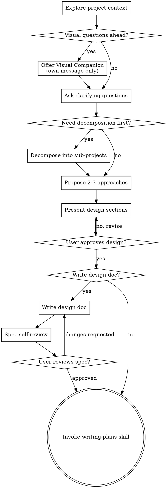

# Brainstorming Ideas Into Designs

Help turn ideas into fully formed designs and specs through natural collaborative dialogue.

Start by understanding the current project context, then ask questions one at a time to refine the idea. Once you understand what you're building, present the design and get user approval before any implementation work begins.

**Announce at start:** "我正在使用头脑风暴技能来完善你的想法..." (I'm using brainstorming to refine your idea...)

<HARD-GATE>
Do NOT invoke any implementation skill, write any code, scaffold any project, or take any implementation action until you have presented a design and the user has approved it. This applies to EVERY project regardless of perceived simplicity.
</HARD-GATE>

## Anti-Pattern: "这个需求太简单，不需要设计"

每个项目都必须经过 brainstorming。一个 TODO、小工具、配置调整，都会因为未经审视的假设而浪费时间。简单项目可以有简短设计，但不能跳过设计和确认。

## Checklist

You MUST create a task for each of these items and complete them in order:

1. **Explore project context** - check files, docs, recent commits
2. **Offer visual companion** (if topic will involve visual questions) - this must be its own message
3. **Ask clarifying questions** - one at a time, understand purpose/constraints/success criteria
4. **Propose 2-3 approaches** - with trade-offs and your recommendation
5. **Present design** - in sections scaled to complexity, get approval
6. **Decide whether to write a design doc** - based on documentation settings and decision importance
7. **Spec self-review** - if a design doc is written, check for placeholders, ambiguity, contradictions, and overscope
8. **User reviews written spec** - if a design doc is written, ask the user to review it before moving on
9. **Transition to implementation planning** - invoke writing-plans, not implementation

## Process Flow

**The terminal state is invoking writing-plans.** Do NOT invoke frontend-design, mcp-builder, or any other implementation skill directly from brainstorming.

## The Process

**Understanding the idea:**
- Check out the current project state first (files, docs, recent commits)
- Before asking detailed questions, assess scope. If the request contains multiple loosely coupled subsystems, decompose it before refining details.
- If the request is too large for a single spec, break it into sub-projects and brainstorm the first one through the normal flow. Each sub-project gets its own spec -> plan -> implementation cycle.
- Ask questions one at a time to refine the idea
- Prefer multiple choice questions when possible, but open-ended is fine too
- Only one question per message - if a topic needs more exploration, break it into multiple questions
- Focus on understanding: purpose, constraints, success criteria

**Exploring approaches:**
- Propose 2-3 different approaches with trade-offs
- Present options conversationally with your recommendation and reasoning
- Lead with your recommended option and explain why

**Presenting the design:**
- Once you believe you understand what you're building, present the design
- Scale each section to its complexity: a few sentences if straightforward, up to 200-300 words if nuanced
- Ask after each section whether it looks right so far
- Cover: architecture, components, data flow, error handling, testing
- Be ready to go back and clarify if something doesn't make sense

**Design for isolation and clarity:**
- Break the system into smaller units that each have one clear purpose and well-defined boundaries
- For each unit, be able to answer: what it does, how it is used, and what it depends on
- If understanding a unit requires reading all its internals, or changing internals breaks consumers, the boundary is weak and should be redesigned
- When working in an existing codebase, follow current patterns and only propose targeted refactors that serve the current goal

## After the Design

**Documentation Integration (遵循最小必要文档原则):**

IF `.horspowers-config.yaml` exists AND `documentation.enabled: true`:

  **Initialize if needed:**
  IF session context shows `docs_auto_init:true`:
    Run: Create `docs/` directory structure using core docs module

  **Search existing context (在创建新文档前):**
  Run: Search `docs/context/` for project architecture and `docs/plans/` for related designs
  Purpose: 避免重复创建，复用现有文档

  **判断是否需要创建设计文档:**
  IF 设计中包含重要的技术方案选择（架构变更、技术栈选择、数据模型设计等）:
    ASK user: "这个设计包含重要的方案决策，是否需要创建设计文档记录？

    **选项:**
    1. **创建设计文档** - 记录方案对比和决策理由（推荐用于重要功能）
    2. **跳过设计文档** - 直接进入实施计划（适用于简单功能）

    说明: 核心文档数量建议不超过 3 个（design + plan + task），避免文档膨胀"

    IF user chooses 创建设计文档:
      Use horspowers:document-management or core module
      Create: `docs/plans/YYYY-MM-DD-design-<topic>.md` (前缀式命名)

      In the created document, populate (使用统一的设计模板):
      - ## 基本信息: 创建时间、设计者、状态
      - ## 设计背景: [为什么需要这个设计]
      - ## 设计方案: [方案A、方案B等，包括优缺点]
      - ## 最终设计: [选择的方案及详细理由]
      - ## 技术细节: [架构、组件、数据流等]
      - ## 影响范围: [这个设计影响的模块/系统]
      - ## 实施计划: [如何实施这个设计]
      - ## 结果评估: [设计实施后的效果评估]
      - ## 相关文档: [计划文档链接]

    ELSE (user chooses 跳过):
      DO NOT create design document
      Summarize the approved design in the conversation
      PROCEED directly to writing-plans

  ELSE (设计不包含重要方案选择):
    DO NOT create design document
    Summarize the approved design in the conversation
    PROCEED directly to writing-plans

**Original documentation (备用方案):**
如果用户选择创建设计文档:
- Write the validated design to `docs/plans/YYYY-MM-DD-design-<topic>.md` (前缀式)
- Use elements-of-style:writing-clearly-and-concisely skill if available
- Commit the design document to git

**Spec Self-Review (如果已写设计文档):**
After writing the design doc, check it quickly with fresh eyes:

1. **Placeholder scan:** Any "TODO", "TBD", unfinished sections, or vague requirements? Fix them.
2. **Internal consistency:** Do any sections contradict each other?
3. **Scope check:** Is this still small enough for a single implementation plan?
4. **Ambiguity check:** Could an engineer reasonably interpret a requirement in two different ways?

Fix issues inline. Do not move forward with an obviously fuzzy spec.

**User Review Gate (如果已写设计文档):**
- Tell the user: "设计已保存到文档。请先检查文档内容；如果需要修改，我会先调整文档，再进入实施计划。"
- Wait for user confirmation - they may edit the document before proceeding
- If the user requests changes, update the document and rerun the spec self-review
- Only proceed once the user approves the document

**Document as communication medium:**
- If user says "继续" or "ready" after documentation, re-read the design document (if created)
- The document may have been modified by the user - treat it as the source of truth
- Confirm understanding before proceeding: "基于文档中的设计，我们准备开始实施。确认继续？"

**Implementation (if continuing):**
- Do NOT start implementation directly from brainstorming
- The next skill is horspowers:writing-plans
- writing-plans can then decide how implementation should be executed

## Visual Companion

A browser-based companion for showing mockups, diagrams, and visual options during brainstorming. It is optional and should be enabled only when a question is materially easier to understand visually.

**Offering the companion:**
When you anticipate visual questions (mockups, layouts, diagrams), offer it once for consent:

> "有些内容如果我直接在浏览器里给你看会更容易理解。我可以在讨论过程中提供界面草图、流程图、方案对比等可视化内容。这个能力还比较新，而且会增加一些上下文开销。要不要试一下？（需要打开本地 URL）"

**This offer MUST be its own message.** Do not combine it with a clarification question or any other content.

**Per-question decision:**
- Use the browser for inherently visual topics: layout comparisons, mockups, diagrams, visual hierarchy
- Use the terminal for conceptual and textual topics: requirements, trade-offs, scope, API decisions

If the user accepts, read the detailed guide before proceeding:
`skills/brainstorming/visual-companion.md`

## Key Principles

- **One question at a time** - Don't overwhelm with multiple questions
- **Multiple choice preferred** - Easier to answer than open-ended when possible
- **YAGNI ruthlessly** - Remove unnecessary features from all designs
- **Explore alternatives** - Always propose 2-3 approaches before settling
- **Incremental validation** - Present design and get approval before moving on
- **Design before implementation** - No coding, scaffolding, or implementation skills before approval
- **Be flexible** - Go back and clarify when something doesn't make sense
