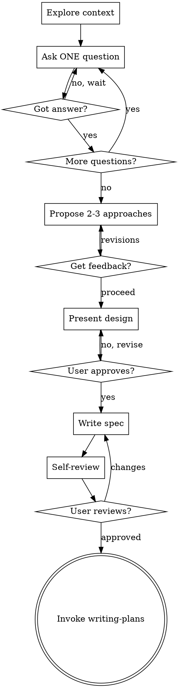

# Brainstorming: Ideas to Designs

Transform vague ideas into validated designs through structured dialogue and documentation.

**Core Principle:** No code is written until a design is presented and explicitly approved. This applies to EVERY project.

## The Iron Law

```
NO IMPLEMENTATION WITHOUT:
1. Clarifying questions answered
2. 2-3 approaches explored with trade-offs  
3. Design presented and explicitly approved
4. Spec written to docs/superpowers/specs/
5. User reviews written spec
6. writing-plans skill invoked
```

## When NOT to Skip This

**This applies to all projects:**
- ✅ New features
- ✅ Bug fixes
- ✅ Config changes
- ✅ "Simple" utilities
- ✅ Todo lists
- ✅ One-line changes

**"Simple" is a red flag:** Simple projects have the most unexamined assumptions. The design can be short, but you MUST do the process.

## Hard Gate

**DO NOT write code, scaffold projects, invoke implementation skills, or take any implementation action until ALL checklist items are complete.**

No exceptions for urgency, perceived simplicity, or partial approvals.

## Checklist (Create TodoWrite tasks for each)

1. **Explore context** — check files, docs, commits, existing code
2. **Ask ONE question at a time** — wait for answer, then next question
3. **Propose 2-3 approaches** — with trade-offs and recommendation
4. **Present design** — get explicit approval before proceeding
5. **Write spec** — to `docs/superpowers/specs/YYYY-MM-DD-<topic>-design.md`
6. **Self-review** — placeholders, contradictions, ambiguity, scope
7. **User reviews spec** — wait for explicit approval
8. **Invoke writing-plans** — ONLY implementation skill allowed

## Process Flow



**Terminal state: Invoke writing-plans only.** Do NOT invoke frontend-design, mcp-builder, or any other skill directly.

## The Process

### 1. Explore Context

Before asking questions:
- Check current files and structure
- Read existing docs
- Look at recent commits
- Understand what's already built

**For existing codebases:** Follow existing patterns. Note code quality issues that affect the work.

### 2. Ask ONE Question at a Time

**Critical rule:** Only one question per message. Wait for the answer before asking the next.

**Why:** Each answer reveals information that shapes the next question. Asking multiple questions:
- Overwhelms the user
- Prevents incremental refinement
- Leads to incomplete answers
- Skips learning opportunities

**Format:**
```
[Context from previous answers]

**Question N:** [Single focused question]
```

**Not allowed:**
- Bullet lists of questions
- Numbered lists of questions
- "Here are 5 questions..."
- Multiple questions in one paragraph

### 3. Explore 2-3 Approaches

After understanding requirements, present options:

**Structure:**
```
**Option A: [Name]**
- What it is
- Pros
- Cons

**Option B: [Name]**
...

**My recommendation:** [Option X] because [reasoning]
```

**Get feedback before proceeding.** User might prefer different trade-offs.

### 4. Present Design for Approval

Once you understand what to build, present the design in sections:

**Structure (scale to complexity):**
- Architecture overview
- Key components
- Data flow
- Error handling
- Testing approach

**After each section:**
> "Does this look right so far?"

**Get explicit approval:** "Yes, this design looks good" before proceeding.

**Partial approvals need revisiting:**
- "Looks good overall" = NOT approved
- "Just add X and Y" = design changes needed, re-approval required

### 5. Write Spec Document

Save to: `docs/superpowers/specs/YYYY-MM-DD-<topic>-design.md`

**Include:**
- All validated requirements
- Chosen approach with rationale
- Architecture details
- Component breakdown
- Error handling
- Testing strategy

**Commit the spec to git.**

### 6. Self-Review

Check the written spec:
1. **Placeholder scan:** Any TBD, TODO, incomplete sections?
2. **Consistency:** Do sections contradict each other?
3. **Scope:** Focused enough for one implementation plan?
4. **Ambiguity:** Could any requirement be interpreted two ways?

Fix issues inline. No need to re-review - just fix.

### 7. User Reviews Written Spec

> "Spec written and committed to `<path>`. Please review and let me know if you want changes before we create the implementation plan."

**Wait for explicit approval.** Do NOT proceed on silence or "looks good."

### 8. Invoke writing-plans

Once spec is approved:
```
I'll now invoke the writing-plans skill to create a detailed implementation plan.
```

**Only writing-plans is allowed.** No other implementation skills.

## Red Flags - STOP and Start Over

| Red Flag | What It Means |
|----------|---------------|
| Asking multiple questions | Violating one-question rule |
| "Simple" project | About to skip process |
| "Looks good overall" | Partial approval, not real approval |
| "Just add X" | Scope change, design needs update |
| User says "let's start coding" | About to skip spec/review |
| Time pressure mentioned | About to rationalize skipping steps |
| Bullet list of questions | Multiple questions violation |

**All red flags mean:** Go back. Fix the violation. Follow the process.

## Common Rationalizations

| Excuse | Reality |
|--------|---------|
| "It's just a simple X" | Simple projects have assumptions too |
| "Asked all at once to save time" | One question at a time enables refinement |
| "Looks good overall = approved" | Need explicit "yes" on specific design |
| "Let's start coding" | Spec must be written and reviewed first |
| "We're under time pressure" | Skipping process takes MORE time |
| "I already know what to build" | Unvalidated assumptions cause rework |
| "The user seems satisfied" | Silence ≠ approval. Get explicit yes. |

## Key Principles

- **One question at a time** — No exceptions
- **Explicit approval required** — "Looks good" is not approval
- **All projects equal** — No skipping for "simple" tasks
- **YAGNI ruthlessly** — Remove unnecessary features
- **Explore alternatives** — Always 2-3 approaches with trade-offs
- **Document everything** — Spec written, committed, reviewed

## After Brainstorming

1. Invoke `writing-plans` skill
2. Do NOT invoke any other skill
3. writing-plans will create implementation plan
4. Implementation plan will guide actual coding

**The brainstorming skill ends with invoking writing-plans.**
