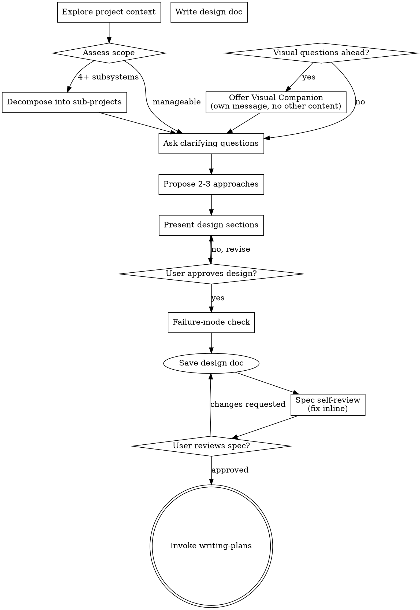

# Brainstorming

Turn rough requests into an approved design before implementation.

## Hard Gate
Help turn ideas into fully formed designs and specs through natural collaborative dialogue.

Do not write code, edit files, or invoke implementation skills until design approval is explicit.

## Anti-Pattern: "This Is Too Simple To Need A Design"

Every project goes through this process. A todo list, a single-function utility, a config change — all of them. "Simple" projects are where unexamined assumptions cause the most wasted work. The design can be short (a few sentences for truly simple projects), but you MUST present it and get approval.

## Checklist

You MUST create a task for each of these items and complete them in order:

1. **Inspect project context** — (relevant files, docs, recent commits).
2. **Offer visual companion** — (if topic will involve visual questions) — this is its own message, not combined with a clarifying question. See the Visual Companion section below.
3. **Assess scope** — if the project touches 4+ independent subsystems or would require 20+ implementation tasks, decompose into sub-projects. Design each sub-project as a separate spec. Present the decomposition to the user for approval before designing individual specs.
4. **Ask clarifying questions** — one at a time, understand purpose/constraints/success criteria
5. **Propose 2-3 approaches** — with trade-offs and a recommendation.
6. **Present design** — in sections scaled to their complexity, get user approval after each section
7. **For existing codebases** — study existing patterns before proposing new ones. Match the project's conventions unless there's a compelling reason to diverge. Design for isolation — prefer changes that minimize blast radius and don't require coordinating across many files.
8. **If the repo lacks `CLAUDE.md` / `AGENTS.md`** and long-term collaboration is expected, consider using `claude-md-creator` to create a minimal, high-signal context file.
9. **Before approving the design — failure-mode check:** State the top 2-3 ways the chosen approach could fail or not cover all cases. This is adversarial reasoning, not a list of known assumptions — actively try to break the design. For each failure mode found, assess severity:
   - **Critical** (design fails for a significant user scenario): revise the design before proceeding.
   - **Minor** (edge case, acceptable limitation): document as a non-goal in the design.
   Do not skip this step. An approach that survives adversarial questioning is an approach worth approving.
10. Save approved design to `docs/superpowers-prepared/specs/YYYY-MM-DD-<topic>-design.md`.
11. **Spec self-review** — quick inline check for placeholders, contradictions, ambiguity, scope (see Spec Self-Review below). Fix issues inline; no subagent dispatch needed.
12. **User reviews written spec** — ask user to review the spec file before proceeding (see User Review Gate below).
13. **Transition to implementation** — invoke writing-plans skill to create implementation plan

## Process Flow

**The terminal state is invoking writing-plans.** Do NOT invoke frontend-design, or any other implementation skill. The ONLY skill you invoke after brainstorming is writing-plans.

## Spec Self-Review

**Understanding the idea:**

- Check out the current project state first (files, docs, recent commits)
- Before asking detailed questions, assess scope: if the request describes multiple independent subsystems (e.g., "build a platform with chat, file storage, billing, and analytics"), flag this immediately. Don't spend questions refining details of a project that needs to be decomposed first.
- If the project is too large for a single spec, help the user decompose into sub-projects: what are the independent pieces, how do they relate, what order should they be built? Then brainstorm the first sub-project through the normal design flow. Each sub-project gets its own spec → plan → implementation cycle.
- For appropriately-scoped projects, ask questions one at a time to refine the idea
- Prefer multiple choice questions when possible, but open-ended is fine too
- Only one question per message - if a topic needs more exploration, break it into multiple questions
- Focus on understanding: purpose, constraints, success criteria

**Exploring approaches:**

- Propose 2-3 different approaches with trade-offs
- Present options conversationally with your recommendation and reasoning
- Lead with your recommended option and explain why

**Presenting the design:**

- Once you believe you understand what you're building, present the design
- Scale each section to its complexity: a few sentences if straightforward, up to 200-300 words if nuanced
- Ask after each section whether it looks right so far
- Cover: architecture, components, data flow, error handling, testing
- Be ready to go back and clarify if something doesn't make sense

**Design for isolation and clarity:**

- Break the system into smaller units that each have one clear purpose, communicate through well-defined interfaces, and can be understood and tested independently
- For each unit, you should be able to answer: what does it do, how do you use it, and what does it depend on?
- Can someone understand what a unit does without reading its internals? Can you change the internals without breaking consumers? If not, the boundaries need work.
- Smaller, well-bounded units are also easier for you to work with - you reason better about code you can hold in context at once, and your edits are more reliable when files are focused. When a file grows large, that's often a signal that it's doing too much.

**Working in existing codebases:**

- Explore the current structure before proposing changes. Follow existing patterns.
- Where existing code has problems that affect the work (e.g., a file that's grown too large, unclear boundaries, tangled responsibilities), include targeted improvements as part of the design - the way a good developer improves code they're working in.
- Don't propose unrelated refactoring. Stay focused on what serves the current goal.

## After the Design

**Documentation:**

- Write the validated design (spec) to `docs/superpowers-prepared/specs/YYYY-MM-DD-<topic>-design.md`
  - (User preferences for spec location override this default)
- Use elements-of-style:writing-clearly-and-concisely skill if available
- Commit the design document to git

**Spec Self-Review:**
After writing the spec document, look at it with fresh eyes:

1. **Placeholder scan:** Any "TBD", "TODO", incomplete sections, or vague requirements? Fix them.
2. **Internal consistency:** Do any sections contradict each other? Does the architecture match the feature descriptions?
3. **Scope check:** Is this focused enough for a single implementation plan, or does it need decomposition?
4. **Ambiguity check:** Could any requirement be interpreted two different ways? If so, pick one and make it explicit.

Fix any issues inline. No need to re-review — just fix and move on.

**User Review Gate:**
After the spec review loop passes, ask the user to review the written spec before proceeding:

> "Spec written and committed to `<path>`. Please review it and let me know if you want to make any changes before we start writing out the implementation plan."

Wait for the user's response. If they request changes, make them and re-run the spec review loop. Only proceed once the user approves.

**Implementation:**

- Invoke the writing-plans skill to create a detailed implementation plan
- Do NOT invoke any other skill. writing-plans is the next step.

Wait for the user's response. If they request changes, make them and re-run the self-review. Only proceed once the user approves.

- **One question at a time** - Don't overwhelm with multiple questions
- **Multiple choice preferred** - Easier to answer than open-ended when possible
- **YAGNI ruthlessly** - Remove unnecessary features from all designs
- **Explore alternatives** - Always propose 2-3 approaches before settling
- **Incremental validation** - Present design, get approval before moving on
- **Be flexible** - Go back and clarify when something doesn't make sense

## Design for Isolation and Clarity

- Break the system into smaller units that each have one clear purpose, communicate through well-defined interfaces, and can be understood and tested independently.
- For each unit, you should be able to answer: what does it do, how do you use it, and what does it depend on?
- Smaller, well-bounded units are easier to reason about — you reason better about code you can hold in context at once, and your edits are more reliable when files are focused.

## Design Contents

Include:
- Scope and non-goals
- Architecture and data flow
- Interfaces/contracts
- Error handling
- Testing strategy
- Rollout or migration notes (if needed)

## Engineering Rigor

Apply senior engineering judgment during design:
- Verify requirements are complete and unambiguous before designing.
- Identify edge cases, error paths, and cross-platform concerns early.
- Evaluate trade-offs explicitly (performance vs. readability, flexibility vs. simplicity).
- Prioritize modularity, SOLID principles, and production-ready standards.
- Flag architectural risks that will be expensive to fix later.

## Interaction Rules

- Batch all questions into a single turn; use multiple choice to reduce ambiguity.
- Remove non-essential scope (YAGNI).
- If user feedback conflicts with prior assumptions, revise design before proceeding.

## Exit Criteria

- User approved the design.
- Failure-mode check completed — critical failure modes resolved, minor ones documented as non-goals.
- Design document exists at the required path (`docs/superpowers-prepared/specs/`).
- Spec self-review completed — placeholders, contradictions, ambiguity, and scope issues resolved.
- User reviewed the written spec and approved.
- `writing-plans` is invoked as the next skill.

## Visual Companion

A browser-based companion for showing mockups, diagrams, and visual options during brainstorming. Available as a tool — not a mode. Accepting the companion means it's available for questions that benefit from visual treatment; it does NOT mean every question goes through the browser.

**Offering the companion:** When you anticipate that upcoming questions will involve visual content (mockups, layouts, diagrams), offer it once for consent:
> "Some of what we're working on might be easier to explain if I can show it to you in a web browser. I can put together mockups, diagrams, comparisons, and other visuals as we go. This feature is still new and can be token-intensive. Want to try it? (Requires opening a local URL)"

**This offer MUST be its own message.** Do not combine it with clarifying questions, context summaries, or any other content. The message should contain ONLY the offer above and nothing else. Wait for the user's response before continuing. If they decline, proceed with text-only brainstorming.

**Per-question decision:** Even after the user accepts, decide FOR EACH QUESTION whether to use the browser or the terminal. The test: **would the user understand this better by seeing it than reading it?**

- **Use the browser** for content that IS visual — mockups, wireframes, layout comparisons, architecture diagrams, side-by-side visual designs
- **Use the terminal** for content that is text — requirements questions, conceptual choices, tradeoff lists, A/B/C/D text options, scope decisions

A question about a UI topic is not automatically a visual question. "What does personality mean in this context?" is a conceptual question — use the terminal. "Which wizard layout works better?" is a visual question — use the browser.

If they agree to the companion, read the detailed guide before proceeding:
`skills/brainstorming/visual-companion.md`
