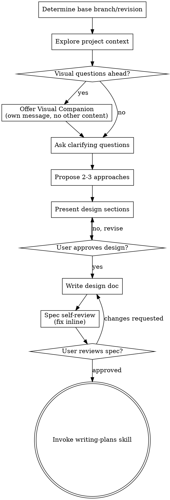

# Brainstorming Ideas Into Designs

Help turn ideas into fully formed designs and specs through natural collaborative dialogue.

Start by understanding the current project context, then ask questions one at a time to refine the idea. Once you understand what you're building, present the design and get user approval.

<HARD-GATE>
Do NOT invoke any implementation skill, write any code, scaffold any project, or take any implementation action until you have presented a design and the user has approved it. This applies to EVERY project regardless of perceived simplicity.
</HARD-GATE>

## Anti-Pattern: "This Is Too Simple To Need A Design"

Every project goes through this process. A todo list, a single-function utility, a config change — all of them. "Simple" projects are where unexamined assumptions cause the most wasted work. The design can be short (a few sentences for truly simple projects), but you MUST present it and get approval.

## Checklist

You MUST create a task for each of these items and complete them in order:

1. **Determine base branch and base revision** — see the "Base branch and revision" section below
2. **Explore project context** — check files, docs, recent commits
3. **Offer visual companion** (if topic will involve visual questions) — this is its own message, not combined with a clarifying question. See the Visual Companion section below.
4. **Ask clarifying questions** — one at a time, understand purpose/constraints/success criteria
5. **Propose 2-3 approaches** — with trade-offs and your recommendation
6. **Present design** — in sections scaled to their complexity, get user approval after each section
7. **Write design doc** — save to `docs/superpowers/specs/YYYY-MM-DD-<topic>-design.md` and commit
8. **Spec self-review** — quick inline check for placeholders, contradictions, ambiguity, scope (see below)
9. **User reviews written spec** — ask user to review the spec file before proceeding
10. **Transition to implementation** — invoke writing-plans skill to create implementation plan

## Base branch and revision

Every spec must record the commit and branch it was written against. This information is used later by `finishing-a-development-branch` to detect drift on the base branch, safely rebase, and route to the right fix flow when drift is found.

### If invoked with inherited context

If another skill (typically `finishing-a-development-branch` for drift recovery) dispatched this brainstorming session and provided `base_branch` and `base_revision` values, use them verbatim and skip the detection below. The invoker knows what it's doing — do not re-ask the user which branch to merge to, do not second-guess the revision.

### Otherwise, detect the base branch

Check the current branch:

```bash
CURRENT_BRANCH=$(git branch --show-current)
```

**If the current branch is one of** `main`, `master`, `dev`, `develop`, `developer`, or `trunk`: use the current branch as the base branch. Do not ask the user — the intent is unambiguous.

**Otherwise:** present the following numbered-list question (generate options 2..N-1 dynamically, one per default-ish branch that actually exists in the repo, as reported by `git for-each-ref refs/heads/`):

```
You're on branch `<CURRENT_BRANCH>`. Which best describes your situation?

1. This is a long-term branch. Start a new feature branch from here,
   and later merge the feature back to `<CURRENT_BRANCH>`.
2. This is the feature branch for this work. Complete the work here
   and later merge back to `<default-branch-1>`.
<additional options per existing default-ish branch>
N. Something else — let me specify the base branch name.
```

Interpret the user's choice:
- **Option 1 ("long-term branch"):** base branch = `<CURRENT_BRANCH>`. The feature will be built from here and merged back here.
- **Options 2..N-1 ("feature branch"):** base branch = the named default-ish branch.
- **Option N ("something else"):** ask the user to type the base branch name. Verify the name refers to an existing branch; if not, ask again.

**Do not create new branches yourself.** Brainstorming records the intended base branch; it does not modify the git state.

### Record the base revision

Once the base branch is known, capture its current HEAD:

```bash
BASE_REVISION=$(git rev-parse "$BASE_BRANCH")
```

Also record the current UTC timestamp in ISO 8601 format.

### Write the header into the spec

When you write the spec document (checklist step 7), include these lines near the top of the file, after the title and before any section headings:

```markdown
This spec was written against the following baseline:

**Base revision:** `<BASE_REVISION>` on branch `<BASE_BRANCH>` (as of <ISO 8601 UTC timestamp>)
```

Example:

```markdown
# Add Lowercase Function

This spec was written against the following baseline:

**Base revision:** `9c107a3cafa81a3acb32d12d25495baf958a1846` on branch `main` (as of 2026-04-12T14:30:00Z)

## Summary
...
```

The `**Base revision:**` line is **required** for drift detection to work. Do not omit it. Do not reword its format — `finishing-a-development-branch` parses this line.

### When updating an existing spec (drift recovery)

If you are invoked to update an existing spec (via the `spec_update` routing from `finishing-a-development-branch`), the spec already has a `**Base revision:**` header. Preserve the original `created at` commit, but add (or update) a "later updated to reflect" clause with the passed-in `base_revision`:

Before:
```markdown
This spec was written against the following baseline:

**Base revision:** `9c107a3...` on branch `main` (as of 2026-04-11T10:00:00Z)
```

After:
```markdown
This spec was written against the following baseline:

**Base revision:** `9c107a3...` on branch `main`, later updated to reflect `b43f566...` (as of 2026-04-12T14:30:00Z)
```

If the header already has a "later updated to reflect" clause from a previous update, **replace** the old `<new_revision>` value with the current one — do not accumulate a chain of updates. The header always carries at most two values: the original creation revision and the most recent update revision.

The branch name does not change across updates.

## Process Flow



**The terminal state is invoking writing-plans.** Do NOT invoke frontend-design, mcp-builder, or any other implementation skill. The ONLY skill you invoke after brainstorming is writing-plans.

## The Process

**Understanding the idea:**

- Check out the current project state first (files, docs, recent commits)
- Before asking detailed questions, assess scope: if the request describes multiple independent subsystems (e.g., "build a platform with chat, file storage, billing, and analytics"), flag this immediately. Don't spend questions refining details of a project that needs to be decomposed first.
- If the project is too large for a single spec, help the user decompose into sub-projects: what are the independent pieces, how do they relate, what order should they be built? Then brainstorm the first sub-project through the normal design flow. Each sub-project gets its own spec → plan → implementation cycle.
- For appropriately-scoped projects, ask questions one at a time to refine the idea
- Prefer multiple choice questions when possible, but open-ended is fine too
- Only one question per message - if a topic needs more exploration, break it into multiple questions
- Focus on understanding: purpose, constraints, success criteria

**Exploring approaches:**

- Propose 2-3 different approaches with trade-offs
- Present options conversationally with your recommendation and reasoning
- Lead with your recommended option and explain why

**Presenting the design:**

- Once you believe you understand what you're building, present the design
- Scale each section to its complexity: a few sentences if straightforward, up to 200-300 words if nuanced
- Ask after each section whether it looks right so far
- Cover: architecture, components, data flow, error handling, testing
- Be ready to go back and clarify if something doesn't make sense

**Design for isolation and clarity:**

- Break the system into smaller units that each have one clear purpose, communicate through well-defined interfaces, and can be understood and tested independently
- For each unit, you should be able to answer: what does it do, how do you use it, and what does it depend on?
- Can someone understand what a unit does without reading its internals? Can you change the internals without breaking consumers? If not, the boundaries need work.
- Smaller, well-bounded units are also easier for you to work with - you reason better about code you can hold in context at once, and your edits are more reliable when files are focused. When a file grows large, that's often a signal that it's doing too much.

**Working in existing codebases:**

- Explore the current structure before proposing changes. Follow existing patterns.
- Where existing code has problems that affect the work (e.g., a file that's grown too large, unclear boundaries, tangled responsibilities), include targeted improvements as part of the design - the way a good developer improves code they're working in.
- Don't propose unrelated refactoring. Stay focused on what serves the current goal.

## After the Design

**Documentation:**

- Write the validated design (spec) to `docs/superpowers/specs/YYYY-MM-DD-<topic>-design.md`
  - (User preferences for spec location override this default)
- **Include the `**Base revision:**` header near the top of the spec** (see "Base branch and revision" section above). This is mandatory for drift detection.
- Use elements-of-style:writing-clearly-and-concisely skill if available
- Commit the design document to git

**Spec Self-Review:**
After writing the spec document, look at it with fresh eyes:

1. **Placeholder scan:** Any "TBD", "TODO", incomplete sections, or vague requirements? Fix them.
2. **Internal consistency:** Do any sections contradict each other? Does the architecture match the feature descriptions?
3. **Scope check:** Is this focused enough for a single implementation plan, or does it need decomposition?
4. **Ambiguity check:** Could any requirement be interpreted two different ways? If so, pick one and make it explicit.
5. **Base revision header:** Is the `**Base revision:**` line present and correctly formatted?

Fix any issues inline. No need to re-review — just fix and move on.

**User Review Gate:**
After the spec review loop passes, ask the user to review the written spec before proceeding:

> "Spec written and committed to `<path>`. Please review it and let me know if you want to make any changes before we start writing out the implementation plan."

Wait for the user's response. If they request changes, make them and re-run the spec review loop. Only proceed once the user approves.

**Implementation:**

- Invoke the writing-plans skill to create a detailed implementation plan
- Do NOT invoke any other skill. writing-plans is the next step.

## Key Principles

- **One question at a time** - Don't overwhelm with multiple questions
- **Multiple choice preferred** - Easier to answer than open-ended when possible
- **YAGNI ruthlessly** - Remove unnecessary features from all designs
- **Explore alternatives** - Always propose 2-3 approaches before settling
- **Incremental validation** - Present design, get approval before moving on
- **Be flexible** - Go back and clarify when something doesn't make sense

## Visual Companion

A browser-based companion for showing mockups, diagrams, and visual options during brainstorming. Available as a tool — not a mode. Accepting the companion means it's available for questions that benefit from visual treatment; it does NOT mean every question goes through the browser.

**Offering the companion:** When you anticipate that upcoming questions will involve visual content (mockups, layouts, diagrams), offer it once for consent:
> "Some of what we're working on might be easier to explain if I can show it to you in a web browser. I can put together mockups, diagrams, comparisons, and other visuals as we go. This feature is still new and can be token-intensive. Want to try it? (Requires opening a local URL)"

**This offer MUST be its own message.** Do not combine it with clarifying questions, context summaries, or any other content. The message should contain ONLY the offer above and nothing else. Wait for the user's response before continuing. If they decline, proceed with text-only brainstorming.

**Per-question decision:** Even after the user accepts, decide FOR EACH QUESTION whether to use the browser or the terminal. The test: **would the user understand this better by seeing it than reading it?**

- **Use the browser** for content that IS visual — mockups, wireframes, layout comparisons, architecture diagrams, side-by-side visual designs
- **Use the terminal** for content that is text — requirements questions, conceptual choices, tradeoff lists, A/B/C/D text options, scope decisions

A question about a UI topic is not automatically a visual question. "What does personality mean in this context?" is a conceptual question — use the terminal. "Which wizard layout works better?" is a visual question — use the browser.

If they agree to the companion, read the detailed guide before proceeding:
`skills/brainstorming/visual-companion.md`
