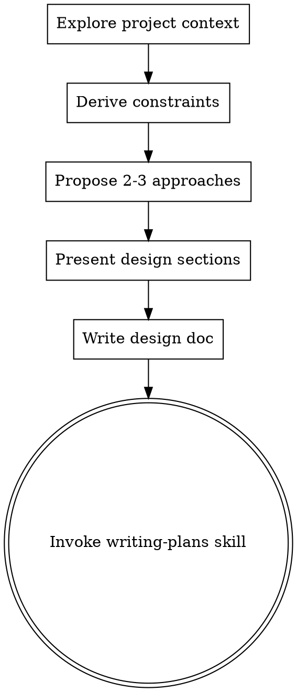

# Brainstorming Ideas Into Designs

## Overview

Help turn ideas into fully formed designs and specs through non-interactive, evidence-backed reasoning.

Start by understanding the current project context, then derive constraints from repo/docs/env/logs. Present a concise design and proceed with safe defaults without asking questions or requesting approval.

**Core principle:** No implementation before a recorded design. No approval gating in non-interactive runs.

<HARD-GATE>
Do NOT invoke any implementation skill, write any code, scaffold any project, or take any implementation action until you have presented a design and recorded decisions. This applies to EVERY project regardless of perceived simplicity. In non-interactive runs, do not request approval.
</HARD-GATE>

## Anti-Pattern: "This Is Too Simple To Need A Design"

Every project goes through this process. A todo list, a single-function utility, a config change — all of them. "Simple" projects are where unexamined assumptions cause the most wasted work. The design can be short (a few sentences for truly simple projects), but you MUST present it and record decisions.

## Checklist

You MUST create a task for each of these items and complete them in order:

1. **Explore project context** — check files, docs, recent commits
2. **Derive constraints** — use repo/docs/env/logs; if ambiguity remains, choose the safest default and record decisions
3. **Propose 2-3 approaches** — with trade-offs and your recommendation
4. **Present design** — in sections scaled to their complexity; do not ask questions; record decisions/assumptions
5. **Write design doc** — save to `docs/plans/YYYY-MM-DD-<topic>-design.md` and commit
6. **Transition to implementation** — invoke writing-plans skill to create implementation plan

## Process Flow

**The terminal state is invoking writing-plans.** Do NOT invoke frontend-design, mcp-builder, or any other implementation skill. The ONLY skill you invoke after brainstorming is writing-plans.

## The Process

**Understanding the idea:**
- Check out the current project state first (files, docs, recent commits)
- Derive purpose/constraints/success criteria from repo/docs/env/logs
- If ambiguity remains, pick the safest default and record decisions

**Exploring approaches:**
- Propose 2-3 different approaches with trade-offs
- Present options conversationally with your recommendation and reasoning
- Lead with your recommended option and explain why

**Presenting the design:**
- Once you believe you understand what you're building, present the design
- Scale each section to its complexity: a few sentences if straightforward, up to 200-300 words if nuanced
- Cover: architecture, components, data flow, error handling, testing
- Record decisions/assumptions explicitly; do not ask questions

## Quick Reference

| Situation | Do | Do Not |
| --- | --- | --- |
| Non-interactive constraint | Derive constraints from repo/docs/env/logs, record decisions | Ask questions or request approval |
| Ambiguity remains | Choose safest default and note it | Block on approval or user input |
| Design complete | Proceed to writing-plans | Skip design or jump to implementation |

## Example (non-interactive)

Goal: update CI to add PR triggers without asking for approval.

Design (concise):
- Scope: workflow YAML only; no runtime changes.
- Approach: add PR event triggers, keep existing push triggers unless policy says otherwise.
- Risks: CI load increase; mitigate by limiting paths or branches.
- Testing: run existing workflow lint/validation.

Decisions recorded:
- Minimal diff to workflows only.
- No new dependencies unless required by CI tools.
- If policy is ambiguous, default to conservative trigger scope.

## Common Mistakes

- Asking for approval despite non-interactive constraints.
- Skipping design because the change seems small.
- Leaving ambiguity unresolved instead of recording a safe default.

## Rationalization Table

| Excuse | Reality |
| --- | --- |
| "I need approval before proceeding" | Non-interactive runs require recorded decisions instead of approval requests. |
| "It’s too small to design" | Small changes still require a concise design and decision log. |
| "No data, so I must block" | Use safest defaults when evidence is incomplete and record them. |

## Red Flags

- “Waiting for approval” appears in output.
- Any questions are asked to the user.
- Implementation starts before the design is presented and decisions recorded.

## After the Design

**Documentation:**
- Write the validated design to `docs/plans/YYYY-MM-DD-<topic>-design.md`
- Use elements-of-style:writing-clearly-and-concisely skill if available
- Commit the design document to git

**Implementation:**
- Invoke the writing-plans skill to create a detailed implementation plan
- Do NOT invoke any other skill. writing-plans is the next step.

## Key Principles

- **Non-interactive by default** - Do not ask questions or request approval
- **Decisions recorded** - Document defaults and constraints when evidence is incomplete
- **YAGNI ruthlessly** - Remove unnecessary features from all designs
- **Explore alternatives** - Always propose 2-3 approaches before settling
- **Incremental validation** - Present design, then proceed under safe defaults
- **Be flexible** - Go back and clarify when something doesn't make sense
