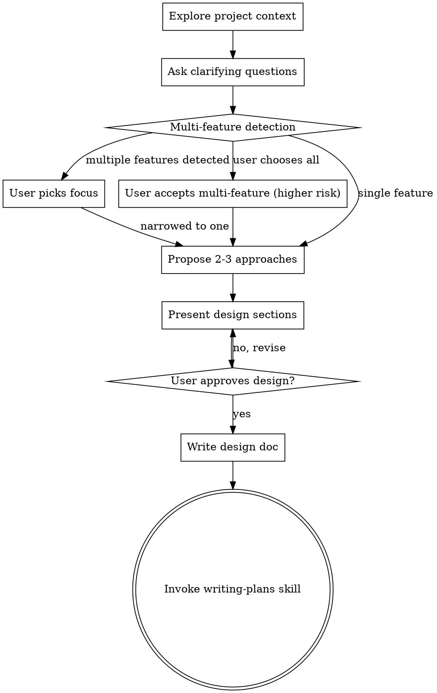

# Brainstorming Ideas Into Designs

## Overview

Help turn ideas into fully formed designs and specs through natural collaborative dialogue.

Start by understanding the current project context, then ask questions one at a time to refine the idea. Once you understand what you're building, present the design and get user approval.

<HARD-GATE>
Do NOT invoke any implementation skill, write any code, scaffold any project, or take any implementation action until you have presented a design and the user has approved it. This applies to EVERY project regardless of perceived simplicity.
</HARD-GATE>

## Anti-Pattern: "This Is Too Simple To Need A Design"

Every project goes through this process. A todo list, a single-function utility, a config change — all of them. "Simple" projects are where unexamined assumptions cause the most wasted work. The design can be short (a few sentences for truly simple projects), but you MUST present it and get approval.

## Checklist

You MUST create a task for each of these items and complete them in order:

1. **Explore project context** — check files, docs, recent commits
2. **Ask clarifying questions** — one at a time, understand purpose/constraints/success criteria
3. **Scope check: single or multi-feature?** — detect whether the request spans multiple distinct features (see Multi-Feature Detection below)
4. **Propose 2-3 approaches** — with trade-offs and your recommendation
5. **Present design** — in sections scaled to their complexity, get user approval after each section
6. **Write design doc** — save to `docs/plans/YYYY-MM-DD-<topic>-design.md` and commit
7. **Transition to implementation** — invoke writing-plans skill to create implementation plan

## Process Flow



**The terminal state is invoking writing-plans.** Do NOT invoke frontend-design, mcp-builder, or any other implementation skill. The ONLY skill you invoke after brainstorming is writing-plans.

## The Process

**Understanding the idea:**
- Check out the current project state first (files, docs, recent commits)
- Ask questions one at a time to refine the idea
- Prefer multiple choice questions when possible, but open-ended is fine too
- Only one question per message - if a topic needs more exploration, break it into multiple questions
- Focus on understanding: purpose, constraints, success criteria

**Exploring approaches:**
- Propose 2-3 different approaches with trade-offs
- Present options conversationally with your recommendation and reasoning
- Lead with your recommended option and explain why

**Presenting the design:**
- Once you believe you understand what you're building, present the design
- Scale each section to its complexity: a few sentences if straightforward, up to 200-300 words if nuanced
- Ask after each section whether it looks right so far
- Cover: architecture, components, data flow, error handling, testing
- Be ready to go back and clarify if something doesn't make sense

## After the Design

**Documentation:**
- Write the validated design to `docs/plans/YYYY-MM-DD-<topic>-design.md`
- Use elements-of-style:writing-clearly-and-concisely skill if available
- Commit the design document to git

**Implementation:**
- Invoke the writing-plans skill to create a detailed implementation plan
- Do NOT invoke any other skill. writing-plans is the next step.

## Multi-Feature Detection

After clarifying questions, assess whether the request contains multiple distinct features. A "distinct feature" is functionality that could ship independently — it has its own user-facing behavior, its own tests, and its own reason to exist.

**Signals of multi-feature scope:**
- User describes unrelated behaviors in a single request ("add auth AND a reporting dashboard")
- Different subsystems or layers affected with no shared purpose
- Request would naturally map to multiple PRs in a code review

**If multiple features detected, present the scope check:**

```
I've identified N distinct features in this request:

1. **Feature A** — [one-line description]
2. **Feature B** — [one-line description]
3. **Shared dependency** — [if any: e.g., "both need a new user model"]

Options:
1. Focus on one feature (recommended — lower risk, cleaner PRs)
2. Proceed with all features (higher risk — requires multi-feature orchestration)

Which would you prefer? If focusing, which feature first?
```

**If user picks one feature:** Continue the normal single-feature path. Note the other features for future sessions.

**If user picks all features (multi-feature mode):**
1. Run the multi-worktree readiness audit (see superpowers:using-git-worktrees) — identify port conflicts, environment gaps, platform-specific needs (scratch orgs, venvs, etc.) that could block parallel development. Remediation tasks become part of the shared dependency plan or a setup phase in the coordination manifest.
2. Identify shared dependencies between features — code that multiple features need but that doesn't exist yet
3. Design each feature independently but note integration points
4. Present designs per-feature (each gets its own approval)
5. Write one design doc per feature, plus one for each shared dependency
6. At transition, invoke writing-plans with multi-feature context so it creates a coordination manifest

**Key constraint:** Each agent works on one feature or one shared dependency. Never assign an agent work that spans features. This preserves agent context and prevents cross-feature interference.

## Key Principles

- **One question at a time** - Don't overwhelm with multiple questions
- **Multiple choice preferred** - Easier to answer than open-ended when possible
- **YAGNI ruthlessly** - Remove unnecessary features from all designs
- **Explore alternatives** - Always propose 2-3 approaches before settling
- **Incremental validation** - Present design, get approval before moving on
- **Be flexible** - Go back and clarify when something doesn't make sense
