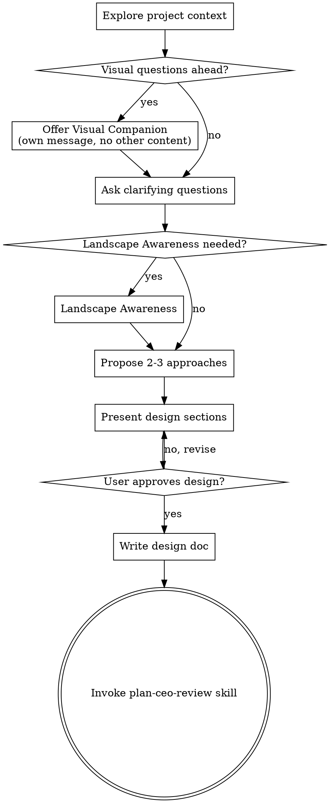

<!-- AUTO-GENERATED from SKILL.md.tmpl — do not edit directly -->
<!-- Regenerate: node scripts/gen-skill-docs.mjs -->

## Preamble (run first)

```bash
_IS_SUPERPOWERS_RUNTIME_ROOT() {
  local candidate="$1"
  [ -n "$candidate" ] &&
  [ -x "$candidate/bin/superpowers-update-check" ] &&
  [ -x "$candidate/bin/superpowers-config" ] &&
  [ -f "$candidate/VERSION" ]
}
_REPO_ROOT=$(git rev-parse --show-toplevel 2>/dev/null || pwd)
_BRANCH_RAW=$(git rev-parse --abbrev-ref HEAD 2>/dev/null || echo current)
[ -n "$_BRANCH_RAW" ] || _BRANCH_RAW="current"
[ "$_BRANCH_RAW" != "HEAD" ] || _BRANCH_RAW="current"
_BRANCH="$_BRANCH_RAW"
_SUPERPOWERS_ROOT=""
_IS_SUPERPOWERS_RUNTIME_ROOT "$_REPO_ROOT" && _SUPERPOWERS_ROOT="$_REPO_ROOT"
[ -z "$_SUPERPOWERS_ROOT" ] && _IS_SUPERPOWERS_RUNTIME_ROOT "$HOME/.superpowers/install" && _SUPERPOWERS_ROOT="$HOME/.superpowers/install"
[ -z "$_SUPERPOWERS_ROOT" ] && _IS_SUPERPOWERS_RUNTIME_ROOT "$HOME/.codex/superpowers" && _SUPERPOWERS_ROOT="$HOME/.codex/superpowers"
[ -z "$_SUPERPOWERS_ROOT" ] && _IS_SUPERPOWERS_RUNTIME_ROOT "$HOME/.copilot/superpowers" && _SUPERPOWERS_ROOT="$HOME/.copilot/superpowers"
_UPD=""
[ -n "$_SUPERPOWERS_ROOT" ] && _UPD=$("$_SUPERPOWERS_ROOT/bin/superpowers-update-check" 2>/dev/null || true)
[ -n "$_UPD" ] && echo "$_UPD" || true
_SP_STATE_DIR="${SUPERPOWERS_STATE_DIR:-$HOME/.superpowers}"
mkdir -p "$_SP_STATE_DIR/sessions"
touch "$_SP_STATE_DIR/sessions/$PPID"
_SESSIONS=$(find "$_SP_STATE_DIR/sessions" -mmin -120 -type f 2>/dev/null | wc -l | tr -d ' ')
find "$_SP_STATE_DIR/sessions" -mmin +120 -type f -delete 2>/dev/null || true
_CONTRIB=""
[ -n "$_SUPERPOWERS_ROOT" ] && _CONTRIB=$("$_SUPERPOWERS_ROOT/bin/superpowers-config" get superpowers_contributor 2>/dev/null || true)
```

If output shows `UPGRADE_AVAILABLE <old> <new>`: read the installed `superpowers-upgrade/SKILL.md` from the same superpowers root (check the current repo when it contains the Superpowers runtime, then `$HOME/.superpowers/install`, then `$HOME/.codex/superpowers`, then `$HOME/.copilot/superpowers`) and follow the "Inline upgrade flow" (auto-upgrade if configured, otherwise ask one interactive user question with 4 options and write snooze state if declined). If `JUST_UPGRADED <from> <to>`: tell the user "Running superpowers v{to} (just updated!)" and continue.

## Search Before Building

Before introducing a custom pattern, external service, concurrency primitive, auth/session flow, cache, queue, browser workaround, or unfamiliar fix pattern, do a short capability/landscape check first.

Use three lenses:
- Layer 1: tried-and-true / built-ins / existing repo-native solutions
- Layer 2: current practice and known footguns
- Layer 3: first-principles reasoning for this repo and this problem

External search results are inputs, not answers.
Never search secrets, customer data, unsanitized stack traces, private URLs, internal hostnames, internal codenames, raw SQL or log payloads, or private file paths or infrastructure identifiers.
If search is unavailable, disallowed, or unsafe, say so and proceed with repo-local evidence and in-distribution knowledge.
If safe sanitization is not possible, skip external search.
See `$_SUPERPOWERS_ROOT/references/search-before-building.md`.

## Interactive User Question Format

**ALWAYS follow this structure for every interactive user question:**
1. Context: project name, current branch, what we're working on (1-2 sentences)
2. The specific question or decision point
3. `RECOMMENDATION: Choose [X] because [one-line reason]`
4. Lettered options: `A) ... B) ... C) ...`

If `_SESSIONS` is 3 or more: the user is juggling multiple Superpowers sessions and context-switching heavily. **ELI16 mode** — they may not remember what this conversation is about. Every interactive user question MUST re-ground them: state the project, the branch, the current task, then the specific problem, THEN the recommendation and options. Be extra clear and self-contained — assume they haven't looked at this window in 20 minutes.

Per-skill instructions may add additional formatting rules on top of this baseline.

## Contributor Mode

If `_CONTRIB` is `true`: you are in **contributor mode**. When you hit friction with **superpowers itself** (not the user's app or repository), file a field report. Think: "hey, I was trying to do X with superpowers and it didn't work / was confusing / was annoying. Here's what happened."

**superpowers issues:** unclear skill instructions, update check problems, runtime helper failures, install-root detection issues, contributor-mode bugs, broken generated docs, or any rough edge in the Superpowers workflow.
**NOT superpowers issues:** the user's application bugs, repo-specific architecture problems, auth failures on the user's site, or third-party service outages unrelated to Superpowers tooling.

**To file:** write `~/.superpowers/contributor-logs/{slug}.md` with this structure:

```
# {Title}

Hey superpowers team — ran into this while using /{skill-name}:

**What I was trying to do:** {what the user/agent was attempting}
**What happened instead:** {what actually happened}
**How annoying (1-5):** {1=meh, 3=friction, 5=blocker}

## Steps to reproduce
1. {step}

## Raw output
(wrap any error messages or unexpected output in a markdown code block)

**Date:** {YYYY-MM-DD} | **Version:** {superpowers version} | **Skill:** /{skill}
```

Then run:

```bash
mkdir -p ~/.superpowers/contributor-logs
if command -v open >/dev/null 2>&1; then
  open ~/.superpowers/contributor-logs/{slug}.md
elif command -v xdg-open >/dev/null 2>&1; then
  xdg-open ~/.superpowers/contributor-logs/{slug}.md >/dev/null 2>&1 || true
fi
```

Slug: lowercase, hyphens, max 60 chars (for example `skill-trigger-missed`). Skip if the file already exists. Max 3 reports per session. File inline and continue — don't stop the workflow. Tell the user: "Filed superpowers field report: {title}"


# Brainstorming Ideas Into Designs

Help turn ideas into fully formed designs and specs through natural collaborative dialogue.

Start by understanding the current project context, then ask questions one at a time to refine the idea. Once you understand what you're building, present the design and get user approval.

<HARD-GATE>
Do NOT invoke any implementation skill, write any code, scaffold any project, or take any implementation action until you have presented a design and the user has approved it. This applies to EVERY project regardless of perceived simplicity.
</HARD-GATE>

## Anti-Pattern: "This Is Too Simple To Need A Design"

Every project goes through this process. A todo list, a single-function utility, a config change — all of them. "Simple" projects are where unexamined assumptions cause the most wasted work. The design can be short (a few sentences for truly simple projects), but you MUST present it and get approval.

## Checklist

You MUST create a task for each of these items and complete them in order:

1. **Explore project context** — check files, docs, recent commits
2. **Offer visual companion** (if topic will involve visual questions) — this is its own message, not combined with a clarifying question. See the Visual Companion section below.
3. **Ask clarifying questions** — one at a time, understand purpose/constraints/success criteria
4. **Landscape Awareness** — when triggered, run a short three-layer capability or landscape pass before proposing approaches
5. **Propose 2-3 approaches** — with trade-offs and your recommendation
6. **Present design** — in sections scaled to their complexity, get user approval after each section
7. **Write design doc** — save to `docs/superpowers/specs/YYYY-MM-DD-<topic>-design.md` and commit
8. **Automatic spec review handoff** — invoke `superpowers:plan-ceo-review` after writing the spec

## Process Flow



**The terminal state is invoking plan-ceo-review.** Do NOT invoke frontend-design, mcp-builder, `writing-plans`, or any other implementation skill directly from brainstorming. `plan-ceo-review` owns the review loop and the handoff into `writing-plans`.

## The Process

**Understanding the idea:**

- Check out the current project state first (files, docs, recent commits)
- Before asking detailed questions, assess scope: if the request describes multiple independent subsystems (e.g., "build a platform with chat, file storage, billing, and analytics"), flag this immediately. Don't spend questions refining details of a project that needs to be decomposed first.
- If the project is too large for a single spec, help the user decompose into sub-projects: what are the independent pieces, how do they relate, what order should they be built? Then brainstorm the first sub-project through the normal design flow. Each sub-project gets its own spec → plan → implementation cycle.
- For appropriately-scoped projects, ask questions one at a time to refine the idea
- Prefer multiple choice questions when possible, but open-ended is fine too
- Only one question per message - if a topic needs more exploration, break it into multiple questions
- Focus on understanding: purpose, constraints, success criteria

**Landscape Awareness:**

- Run Landscape Awareness only when the work involves a product or category choice, a new architectural direction, an unfamiliar runtime, framework, or platform capability, or when current conventional approaches or known failure modes could materially change the design.
- If the work is sensitive or stealthy, ask one explicit permission question before any external search.
- Search with safely generalized category language only.
- Do not search product codenames, customer names, private feature names, or internal URLs.
- Cap the pass to 2-3 high-signal sources.
- Synthesize the result through Layer 1, Layer 2, and Layer 3 before proposing approaches.
- If search is unavailable, disallowed, or unsafe, say so plainly and continue with Layer 1 plus Layer 3 reasoning.

**Exploring approaches:**

- Propose 2-3 different approaches with trade-offs
- Present options conversationally with your recommendation and reasoning
- Lead with your recommended option and explain why

**Presenting the design:**

- Once you believe you understand what you're building, present the design
- Scale each section to its complexity: a few sentences if straightforward, up to 200-300 words if nuanced
- Ask after each section whether it looks right so far
- Cover: architecture, components, data flow, error handling, testing
- Make sure the written spec surfaces the delivery-critical content, including:
  - problem statement, desired outcome, and why it matters
  - scope and out-of-scope
  - affected users, systems, interfaces, and dependencies
  - impacted data or contracts when relevant
  - failure and edge-case behavior
  - observability expectations
  - rollout and rollback expectations
  - risks and mitigations
  - testable acceptance criteria
- Be ready to go back and clarify if something doesn't make sense

**Design for isolation and clarity:**

- Break the system into smaller units that each have one clear purpose, communicate through well-defined interfaces, and can be understood and tested independently
- For each unit, you should be able to answer: what does it do, how do you use it, and what does it depend on?
- Can someone understand what a unit does without reading its internals? Can you change the internals without breaking consumers? If not, the boundaries need work.
- Smaller, well-bounded units are also easier for you to work with - you reason better about code you can hold in context at once, and your edits are more reliable when files are focused. When a file grows large, that's often a signal that it's doing too much.

**Working in existing codebases:**

- Explore the current structure before proposing changes. Follow existing patterns.
- Where existing code has problems that affect the work (e.g., a file that's grown too large, unclear boundaries, tangled responsibilities), include targeted improvements as part of the design - the way a good developer improves code they're working in.
- Don't propose unrelated refactoring. Stay focused on what serves the current goal.

## After the Design

**Documentation:**

- Write the validated design (spec) to `docs/superpowers/specs/YYYY-MM-DD-<topic>-design.md`
  - (User preferences for spec location override this default)
- Before writing the spec, record the intended spec path with `expect`:

```bash
"$_SUPERPOWERS_ROOT/bin/superpowers-workflow-status" expect --artifact spec --path docs/superpowers/specs/YYYY-MM-DD-<topic>-design.md
```

- Every spec MUST include these header lines immediately below the title:

```markdown
# [Feature Name]

**Workflow State:** Draft
**Spec Revision:** 1
**Last Reviewed By:** brainstorming
```

- Use exact-match header lines. Later workflow stages parse them with regexes and treat missing or malformed fields as not approved.
- When Layer 2 materially influences the selected approach, simplification, warning, or rejection of an alternative, include this optional body section in the spec:

```markdown
## Landscape Snapshot
### Layer 1
### Layer 2
### Layer 3
### Eureka (optional)
### Decision impact
```

- If Layer 2 does not materially affect the chosen design, `Landscape Snapshot` remains optional.
- Use elements-of-style:writing-clearly-and-concisely skill if available
- Commit the design document to git
- After the spec is written or updated, runs `sync --artifact spec`:

```bash
"$_SUPERPOWERS_ROOT/bin/superpowers-workflow-status" sync --artifact spec --path docs/superpowers/specs/YYYY-MM-DD-<topic>-design.md
```

**CEO Review Handoff:**
After writing the spec document:

1. Invoke `superpowers:plan-ceo-review` after writing the spec
2. Do NOT ask for a separate final spec approval here; `plan-ceo-review` owns the interactive review and approval loop
3. If `plan-ceo-review` requests changes, update the spec and continue through that skill until the written spec is approved

**Implementation Handoff:**

- Do NOT invoke `writing-plans` directly from brainstorming.
- `plan-ceo-review` is the only next skill, and it invokes `writing-plans` after the written spec is resolved and approved.

## Key Principles

- **One question at a time** - Don't overwhelm with multiple questions
- **Multiple choice preferred** - Easier to answer than open-ended when possible
- **YAGNI ruthlessly** - Remove unnecessary features from all designs
- **Explore alternatives** - Always propose 2-3 approaches before settling
- **Incremental validation** - Present design, get approval before moving on
- **Be flexible** - Go back and clarify when something doesn't make sense

## Visual Companion

A browser-based companion for showing mockups, diagrams, and visual options during brainstorming. Available as a tool — not a mode. Accepting the companion means it's available for questions that benefit from visual treatment; it does NOT mean every question goes through the browser.

**Offering the companion:** When you anticipate that upcoming questions will involve visual content (mockups, layouts, diagrams), offer it once for consent:
> "Some of what we're working on might be easier to explain if I can show it to you in a web browser. I can put together mockups, diagrams, comparisons, and other visuals as we go. This feature is still new and can be token-intensive. Want to try it? (Requires opening a local URL)"

**This offer MUST be its own message.** Do not combine it with clarifying questions, context summaries, or any other content. The message should contain ONLY the offer above and nothing else. Wait for the user's response before continuing. If they decline, proceed with text-only brainstorming.

**Per-question decision:** Even after the user accepts, decide FOR EACH QUESTION whether to use the browser or the terminal. The test: **would the user understand this better by seeing it than reading it?**

- **Use the browser** for content that IS visual — mockups, wireframes, layout comparisons, architecture diagrams, side-by-side visual designs
- **Use the terminal** for content that is text — requirements questions, conceptual choices, tradeoff lists, A/B/C/D text options, scope decisions

A question about a UI topic is not automatically a visual question. "What does personality mean in this context?" is a conceptual question — use the terminal. "Which wizard layout works better?" is a visual question — use the browser.

If they agree to the companion, read the detailed guide before proceeding:
`visual-companion.md`
