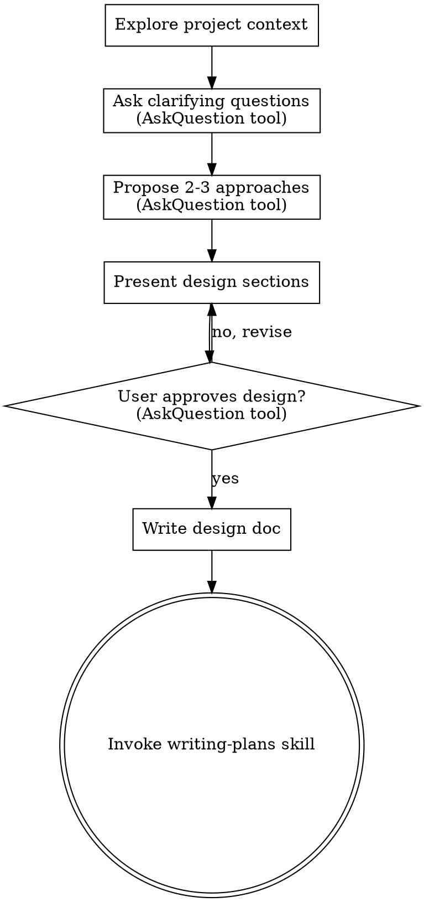

# Brainstorming Ideas Into Designs

## Overview

Help turn ideas into fully formed designs and specs through structured, low-effort collaborative dialogue.

Start by understanding the current project context, then use the **AskQuestion** tool to gather user input through multiple-choice questions. The user should rarely need to type more than a few words. Once you understand what you're building, present the design and get user approval.
Use the AskQuestion tool for any interaction requiring user input like choosing between options, confirming a proposed action, or clarifying an ambiguous request.

<HARD-GATE>
Do NOT invoke any implementation skill, write any code, scaffold any project, or take any implementation action until you have presented a design and the user has approved it. This applies to EVERY project regardless of perceived simplicity.
</HARD-GATE>

## Anti-Pattern: "This Is Too Simple To Need A Design"

Every project goes through this process. A todo list, a single-function utility, a config change — all of them. "Simple" projects are where unexamined assumptions cause the most wasted work. The design can be short (a few sentences for truly simple projects), but you MUST present it and get approval.

## Structured Input via AskQuestion

**Always use the `AskQuestion` tool** to collect user decisions. This presents clickable multiple-choice options so the user doesn't have to type long answers.

### Rules for AskQuestion usage

- **Batch related questions**: group up to 3-4 related questions in a single `AskQuestion` call when they are independent of each other (e.g., target platform + styling preference + auth method).
- **Single question for dependent topics**: when the next question depends on the previous answer, use one question per call.
- **Always include an "Other" option**: add an option labeled "Other (I'll describe)" so the user can break out of the predefined choices when none fit. If they pick it, follow up with a brief open-ended prompt.
- **Use `allow_multiple: true`** when the user might want to select more than one option (e.g., "Which platforms?" or "Which features are must-haves?").
- **Keep option labels short** (2-5 words) with a clear, descriptive `label`. Don't repeat the question in the option text.
- **2-5 options per question** — enough to cover the realistic design space without overwhelming.

### Example

```
AskQuestion({
  title: "Project Scope",
  questions: [
    {
      id: "target",
      prompt: "What is the primary target for this feature?",
      options: [
        { id: "web", label: "Web browser" },
        { id: "mobile", label: "Mobile app" },
        { id: "api", label: "Backend / API" },
        { id: "cli", label: "CLI tool" },
        { id: "other", label: "Other (I'll describe)" }
      ]
    },
    {
      id: "priority",
      prompt: "What matters most for the first version?",
      options: [
        { id: "speed", label: "Ship fast (MVP)" },
        { id: "quality", label: "Production quality" },
        { id: "learning", label: "Learning / prototype" }
      ]
    }
  ]
})
```

### When to fall back to open-ended text

Use a plain text message (not AskQuestion) only when:
- The question is inherently open-ended and can't be meaningfully reduced to options (e.g., "Describe the user journey in your own words").
- The user selected "Other (I'll describe)" and needs to elaborate.
- You need a short free-text input like a name or identifier.

Even then, keep the prompt short and specific so the user can answer in one sentence.

## Checklist

You MUST create a task for each of these items and complete them in order:

1. **Explore project context** — check files, docs, recent commits
2. **Ask clarifying questions** — use AskQuestion tool, understand purpose/constraints/success criteria
3. **Propose 2-3 approaches** — present via AskQuestion with trade-offs and your recommendation
4. **Present design** — in sections scaled to their complexity, get user approval via AskQuestion after each section
5. **Write design doc** — save to `docs/plans/YYYY-MM-DD-<topic>-design.md` and commit
6. **Transition to implementation** — invoke writing-plans skill to create implementation plan

## Process Flow



**The terminal state is invoking writing-plans.** Do NOT invoke frontend-design, mcp-builder, or any other implementation skill. The ONLY skill you invoke after brainstorming is writing-plans.

## The Process

**Understanding the idea:**
- Check out the current project state first (files, docs, recent commits)
- Use AskQuestion to gather decisions — batch independent questions, ask dependent ones sequentially
- Always provide an "Other (I'll describe)" escape hatch
- Focus on understanding: purpose, constraints, success criteria

**Exploring approaches:**
- Propose 2-3 different approaches with trade-offs in a brief text summary
- Then use AskQuestion to let the user pick their preferred approach:

```
AskQuestion({
  title: "Approach Selection",
  questions: [{
    id: "approach",
    prompt: "Which approach do you prefer?",
    options: [
      { id: "a", label: "Approach A — <short summary>" },
      { id: "b", label: "Approach B — <short summary>" },
      { id: "c", label: "Approach C — <short summary>" },
      { id: "other", label: "None of these / hybrid" }
    ]
  }]
})
```

**Presenting the design:**
- Once you believe you understand what you're building, present the design
- Scale each section to its complexity: a few sentences if straightforward, up to 200-300 words if nuanced
- After each section, use AskQuestion to confirm:

```
AskQuestion({
  questions: [{
    id: "section_review",
    prompt: "Does this section look right?",
    options: [
      { id: "yes", label: "Looks good" },
      { id: "minor", label: "Minor tweaks needed" },
      { id: "rethink", label: "Needs rethinking" }
    ]
  }]
})
```

- Cover: architecture, components, data flow, error handling, testing
- If user picks "Minor tweaks needed", ask what to change (brief open-ended follow-up)
- If user picks "Needs rethinking", re-explore that section

## After the Design

**Documentation:**
- Write the validated design to `docs/plans/YYYY-MM-DD-<topic>-design.md`
- Use elements-of-style:writing-clearly-and-concisely skill if available
- Commit the design document to git

**Implementation:**
- Invoke the writing-plans skill to create a detailed implementation plan
- Do NOT invoke any other skill. writing-plans is the next step.

## Key Principles

- **Structured input first** — Use AskQuestion for every decision point; fall back to open-ended only when necessary
- **Batch when independent** — Group 2-4 unrelated questions in one AskQuestion call to reduce round-trips
- **One at a time when dependent** — If the answer changes what you ask next, ask sequentially
- **Always offer "Other"** — Let the user escape predefined options gracefully
- **YAGNI ruthlessly** — Remove unnecessary features from all designs
- **Explore alternatives** — Always propose 2-3 approaches before settling
- **Incremental validation** — Present design section by section, confirm via AskQuestion before moving on
- **Minimize typing** — The user should be able to complete most of the brainstorming by clicking options
