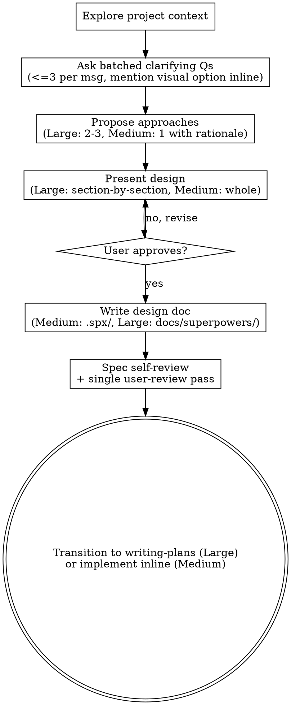

# Brainstorming Ideas Into Designs

Help turn ideas into fully formed designs and specs through natural collaborative dialogue.

Start by understanding the current project context, then ask the user up to 3 batched questions per message to refine the idea. Once you understand what you're building, present the design and get user approval.

<TIER-GATE>
This skill applies to **Medium** and **Large** tier work (per `task-tier`).

- **Trivial / Small** — skip this skill entirely. Restate the user's intent in one sentence, then implement.
- **Medium** — single-pass design with batched questions; spec saved to `.spx/specs/` (gitignored). One round of user approval.
- **Large** — full ceremony as documented below; spec saved to `docs/superpowers/specs/` and committed; section-by-section approval.

Do NOT invoke implementation skills before approval **for Medium/Large**. For Trivial/Small the workflow IS just "make the change and verify."
</TIER-GATE>

## Anti-Pattern: "This Medium-or-Larger Task Is Too Simple To Need A Design"

For Medium/Large work, the temptation to skip design because it "feels simple" is where unexamined assumptions cause the most wasted work. Even a short design (a few sentences) must exist and get approval at this tier.

For Trivial/Small work the opposite anti-pattern applies — do NOT manufacture ceremony for a one-line change. Tier first, then act.

## Auto-Approval (Medium tier)

For Medium work, if codebase conventions unambiguously answer all open questions, skip the question-asking round:

1. State the assumptions you're inferring from the codebase (file conventions, framework patterns, existing similar features) in one short message.
2. Give the user one explicit veto window: *"Proceeding with the above unless you push back."*
3. If they don't object within their next message, proceed.

For Large work, always ask — never auto-approve.

## Checklist

You MUST create a task for each of these items and complete them in order:

1. **Explore project context** — check files, docs, recent commits
2. **Ask clarifying questions** — batch up to 3 related questions per message; if visual treatment would help, mention the visual-companion option inline (no standalone offer message). User may answer any subset; assume codebase defaults for the rest and state your assumptions.
3. **Propose 2-3 approaches** (Large tier) or pick the obvious one and justify it (Medium tier) — with trade-offs and your recommendation
4. **Present design** — Large: section-by-section approval; Medium: whole-design single approval
5. **Write design doc** — Medium: `.spx/specs/<topic>.md` (gitignored); Large: `docs/superpowers/specs/YYYY-MM-DD-<topic>-design.md` (committed)
6. **Spec self-review and one user-review pass** — fix self-review findings inline, then ask user once to review (combine into a single message: "spec written to `<path>`, fixed inline issues X/Y/Z, please review")
7. **Transition to implementation** — invoke writing-plans skill (Large) or proceed inline (Medium)

## Process Flow

**The terminal state is invoking writing-plans.** Do NOT invoke frontend-design, mcp-builder, or any other implementation skill. The ONLY skill you invoke after brainstorming is writing-plans.

## The Process

**Understanding the idea:**

- Check out the current project state first (files, docs, recent commits)
- Before asking detailed questions, assess scope: if the request describes multiple independent subsystems (e.g., "build a platform with chat, file storage, billing, and analytics"), flag this immediately. Don't spend questions refining details of a project that needs to be decomposed first.
- If the project is too large for a single spec, help the user decompose into sub-projects: what are the independent pieces, how do they relate, what order should they be built? Then brainstorm the first sub-project through the normal design flow. Each sub-project gets its own spec → plan → implementation cycle.
- For appropriately-scoped projects, batch up to 3 related questions per message; user may answer any subset
- Prefer multiple choice questions when possible, but open-ended is fine too
- Number questions so the user can answer in any order or skip; for unanswered ones, infer from codebase conventions and state your assumption explicitly
- Focus on understanding: purpose, constraints, success criteria

**Exploring approaches:**

- Propose 2-3 different approaches with trade-offs
- Present options conversationally with your recommendation and reasoning
- Lead with your recommended option and explain why

**Presenting the design:**

- Once you believe you understand what you're building, present the design
- Scale each section to its complexity: a few sentences if straightforward, up to 200-300 words if nuanced
- Ask after each section whether it looks right so far
- Cover: architecture, components, data flow, error handling, testing
- Be ready to go back and clarify if something doesn't make sense

**Design for isolation and clarity:**

- Break the system into smaller units that each have one clear purpose, communicate through well-defined interfaces, and can be understood and tested independently
- For each unit, you should be able to answer: what does it do, how do you use it, and what does it depend on?
- Can someone understand what a unit does without reading its internals? Can you change the internals without breaking consumers? If not, the boundaries need work.
- Smaller, well-bounded units are also easier for you to work with - you reason better about code you can hold in context at once, and your edits are more reliable when files are focused. When a file grows large, that's often a signal that it's doing too much.

**Working in existing codebases:**

- Explore the current structure before proposing changes. Follow existing patterns.
- Where existing code has problems that affect the work (e.g., a file that's grown too large, unclear boundaries, tangled responsibilities), include targeted improvements as part of the design - the way a good developer improves code they're working in.
- Don't propose unrelated refactoring. Stay focused on what serves the current goal.

## After the Design

**Documentation:**

- **Medium tier:** write the spec to `.spx/specs/<topic>.md` (gitignored scratch dir). No commit.
- **Large tier:** write the spec to `docs/superpowers/specs/YYYY-MM-DD-<topic>-design.md` and commit.
- (User preferences for spec location override these defaults.)

**Spec Self-Review (do inline before asking user):**
After writing the spec document, look at it with fresh eyes:

1. **Placeholder scan:** Any "TBD", "TODO", incomplete sections, or vague requirements? Fix them.
2. **Internal consistency:** Do any sections contradict each other? Does the architecture match the feature descriptions?
3. **Scope check:** Is this focused enough for a single implementation plan, or does it need decomposition?
4. **Ambiguity check:** Could any requirement be interpreted two different ways? If so, pick one and make it explicit.

Fix any issues inline. No need to re-review — just fix and move on.

**User Review Gate (single message, combined):**
After self-review fixes, ask the user once in a combined message:

> "Spec written to `<path>`. Self-review found and fixed: <short list>. Please flag anything else before I proceed with the plan."

If they request changes, make them and proceed (do not re-run another full review loop unless changes are substantive).

**Implementation transition:**

- **Large:** invoke the writing-plans skill to create a detailed implementation plan.
- **Medium:** proceed inline — generate an internal TodoWrite checklist from the spec and execute, dispatching reviewer at the end.

## Key Principles

- **Batch related questions** - up to 3 per message, numbered, partial answers welcome
- **Multiple choice preferred** - Easier to answer than open-ended when possible
- **YAGNI ruthlessly** - Remove unnecessary features from all designs
- **Explore alternatives** - Large tier: 2-3 approaches; Medium tier: pick the obvious one with rationale
- **Tier-appropriate validation** - Large: section-by-section approval; Medium: single-pass approval
- **Be flexible** - Go back and clarify when something doesn't make sense

## Visual Companion

A browser-based companion for showing mockups, diagrams, and visual options during brainstorming. Available as a tool — not a mode. Accepting the companion means it's available for questions that benefit from visual treatment; it does NOT mean every question goes through the browser.

**Offering the companion:** When you anticipate that upcoming questions will involve visual content (mockups, layouts, diagrams), mention it inline alongside your first batch of clarifying questions:
> "(Optional: I can spin up a browser companion for mockups/diagrams if visuals would help — say the word.)"

Combine the offer with your clarifying questions; do not send a standalone offer message. If the user opts in, switch to the visual flow on the next visual question. If they ignore or decline, proceed with text-only brainstorming.

**Per-question decision:** Even after the user accepts, decide FOR EACH QUESTION whether to use the browser or the terminal. The test: **would the user understand this better by seeing it than reading it?**

- **Use the browser** for content that IS visual — mockups, wireframes, layout comparisons, architecture diagrams, side-by-side visual designs
- **Use the terminal** for content that is text — requirements questions, conceptual choices, tradeoff lists, A/B/C/D text options, scope decisions

A question about a UI topic is not automatically a visual question. "What does personality mean in this context?" is a conceptual question — use the terminal. "Which wizard layout works better?" is a visual question — use the browser.

If they agree to the companion, read the detailed guide before proceeding:
`skills/brainstorming/visual-companion.md`
