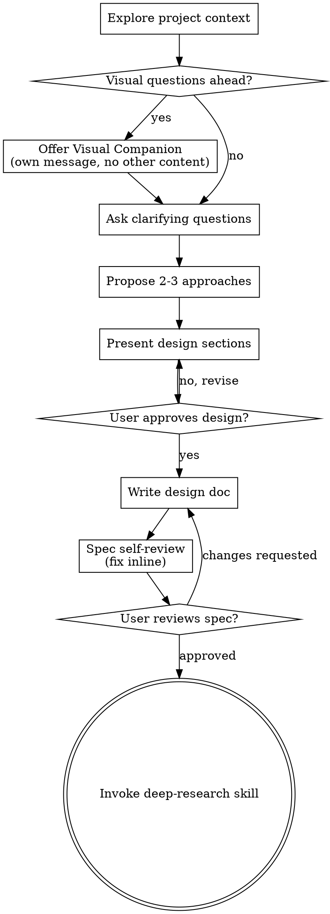

# Brainstorming Ideas Into Designs

Help turn ideas into fully formed designs and specs through natural collaborative dialogue.

Start by understanding the current project context, then ask questions one at a time to refine the idea. Once you understand what you're building, present the design and get user approval.

<HARD-GATE>
Do NOT invoke any implementation skill, write any code, scaffold any project, or take any implementation action until you have presented a design and the user has approved it. This applies to EVERY project regardless of perceived simplicity.
</HARD-GATE>

## Anti-Pattern: "This Is Too Simple To Need A Design"

Every project goes through this process. A todo list, a single-function utility, a config change — all of them. "Simple" projects are where unexamined assumptions cause the most wasted work. The design can be short (a few sentences for truly simple projects), but you MUST present it and get approval.

## Checklist

You MUST create a task for each of these items and complete them in order:

1. **Explore project context** — check files, docs, recent commits
2. **Match architecture profile** — read `~/.claude/ultrapowers-architecture-defaults.json` (then repo-level override if present); match signals from user's idea; if a profile fits, suggest its stack before asking clarifying questions (see Architecture Profile Matching section)
3. **Offer visual companion** (if topic will involve visual questions) — this is its own message, not combined with a clarifying question. See the Visual Companion section below.
4. **Ask clarifying questions** — one at a time, understand purpose/constraints/success criteria
5. **Load or ask workflow preferences** — check for saved preferences in .claude/ultrapowers-preferences.json; if missing, ask and save (see Workflow Preferences section below)
6. **Propose 2-3 approaches** — with trade-offs and your recommendation
7. **Present design** — in sections scaled to their complexity, get user approval after each section
8. **Scan for sibling-pack skills** — after design is approved, match the design against `${CLAUDE_SKILL_DIR}/sibling-pack-map.md`; bucket matches into installed vs missing; for missing packs, emit a blocking prompt per pack (see Sibling-Pack Scan section)
9. **Write design doc** — save to `docs/ultrapowers/specs/YYYY-MM-DD-<topic>-design.md` (commit only if user opted in). If a profile matched in step 2 or skills matched in step 8, include them in a `## Referenced Skills` section inside the spec.
10. **Spec self-review** — quick inline check for placeholders, contradictions, ambiguity, scope (see below)
11. **User reviews written spec** — ask user to review the spec file before proceeding
12. **Transition to research** — invoke deep-research skill to capture current state of the art

## Process Flow



**The terminal state is invoking deep-research.** Do NOT invoke writing-plans, frontend-design, mcp-builder, or any other implementation skill directly. The ONLY skill you invoke after brainstorming is deep-research. The research pipeline (deep-research → skills-audit → skills-creation) will eventually invoke writing-plans.

## The Process

**Understanding the idea:**

- Check out the current project state first (files, docs, recent commits)
- Before asking detailed questions, assess scope: if the request describes multiple independent subsystems (e.g., "build a platform with chat, file storage, billing, and analytics"), flag this immediately. Don't spend questions refining details of a project that needs to be decomposed first.
- If the project is too large for a single spec, help the user decompose into sub-projects: what are the independent pieces, how do they relate, what order should they be built? Then brainstorm the first sub-project through the normal design flow. Each sub-project gets its own spec → plan → implementation cycle.
- For appropriately-scoped projects, ask questions one at a time to refine the idea
- Prefer multiple choice questions when possible, but open-ended is fine too
- Only one question per message - if a topic needs more exploration, break it into multiple questions
- Focus on understanding: purpose, constraints, success criteria

**Exploring approaches:**

- Propose 2-3 different approaches with trade-offs
- Present options conversationally with your recommendation and reasoning
- Lead with your recommended option and explain why

**Presenting the design:**

- Once you believe you understand what you're building, present the design
- Scale each section to its complexity: a few sentences if straightforward, up to 200-300 words if nuanced
- Ask after each section whether it looks right so far
- Cover: architecture, components, data flow, error handling, testing
- Be ready to go back and clarify if something doesn't make sense

**Design for isolation and clarity:**

- Break the system into smaller units that each have one clear purpose, communicate through well-defined interfaces, and can be understood and tested independently
- For each unit, you should be able to answer: what does it do, how do you use it, and what does it depend on?
- Can someone understand what a unit does without reading its internals? Can you change the internals without breaking consumers? If not, the boundaries need work.
- Smaller, well-bounded units are also easier for you to work with - you reason better about code you can hold in context at once, and your edits are more reliable when files are focused. When a file grows large, that's often a signal that it's doing too much.

**Working in existing codebases:**

- Explore the current structure before proposing changes. Follow existing patterns.
- Where existing code has problems that affect the work (e.g., a file that's grown too large, unclear boundaries, tangled responsibilities), include targeted improvements as part of the design - the way a good developer improves code they're working in.
- Don't propose unrelated refactoring. Stay focused on what serves the current goal.

## After the Design

**Documentation:**

- Write the validated design (spec) to `docs/ultrapowers/specs/YYYY-MM-DD-<topic>-design.md`
  - (User preferences for spec location override this default)
- Use elements-of-style:writing-clearly-and-concisely skill if available
- Commit the design document only if the user opted to commit design docs (see Workflow Preferences). Default: do not commit.

**Spec Self-Review:**
After writing the spec document, look at it with fresh eyes:

1. **Placeholder scan:** Any "TBD", "TODO", incomplete sections, or vague requirements? Fix them.
2. **Internal consistency:** Do any sections contradict each other? Does the architecture match the feature descriptions?
3. **Scope check:** Is this focused enough for a single implementation plan, or does it need decomposition?
4. **Ambiguity check:** Could any requirement be interpreted two different ways? If so, pick one and make it explicit.

Fix any issues inline. No need to re-review — just fix and move on.

**User Review Gate:**
After the spec review loop passes, ask the user to review the written spec before proceeding:

> "Spec written to `<path>` (local only, not committed). Please review it and let me know if you want to make any changes before we start the research phase."

Wait for the user's response. If they request changes, make them and re-run the spec review loop. Only proceed once the user approves.

**Research Pipeline:**

- Invoke the deep-research skill to capture the current state of the art
- Do NOT invoke writing-plans or any implementation skill directly
- The research pipeline (deep-research → skills-audit → skills-creation) will invoke writing-plans when ready

## Key Principles

- **One question at a time** - Don't overwhelm with multiple questions
- **Multiple choice preferred** - Easier to answer than open-ended when possible
- **YAGNI ruthlessly** - Remove unnecessary features from all designs
- **Explore alternatives** - Always propose 2-3 approaches before settling
- **Incremental validation** - Present design, get approval before moving on
- **Be flexible** - Go back and clarify when something doesn't make sense

## Workflow Preferences

**Step 4 — Load or ask workflow preferences:**

Read `.claude/ultrapowers-preferences.json` in the project root using the Read tool. If it exists and contains valid JSON, load the values silently and announce:

> "Using saved workflow prefs (auto-commit: on/off, auto-push: on/off, commit docs: on/off). Say 'change prefs' to update."

If the file does not exist or is invalid, ask the user **one** question with the defaults visible:

> "Workflow defaults for this repo: **auto-commit on**, **auto-push on**, **commit design docs off**. Reply `ok` to accept, or tell me what to change (e.g., `no auto-push`, `commit docs too`, `all off`)."

**Defaults:**
- `autoCommit`: **ON** (commit autonomously as tasks complete)
- `autoPush`: **ON** (push to remote after commits)
- `commitDesignDocs`: **OFF** (design specs/research briefs stay local)
- `suggestSiblingPacks.dev`: **ON** (suggest installing `ultrapowers-dev` when relevant and missing)
- `suggestSiblingPacks.business`: **ON** (suggest installing `ultrapowers-business` when relevant and missing)

**Deterministic reply parsing** (apply in order; multiple modifiers combine):

| User reply | Resulting change |
|---|---|
| `ok` / `yes` / `accept` / empty | all defaults as-is |
| `no auto-commit` / `manual commits` | `autoCommit: false` |
| `no auto-push` / `manual push` | `autoPush: false` |
| `commit docs` / `include design docs` | `commitDesignDocs: true` |
| `all off` | `autoCommit: false`, `autoPush: false`, `commitDesignDocs: false` |
| `all on` | `autoCommit: true`, `autoPush: true`, `commitDesignDocs: true` |

Combined example: `no auto-push, commit docs` → `autoPush: false`, `commitDesignDocs: true`.

If the reply is ambiguous (e.g., `push but not commit`), ask **one** targeted follow-up:

> "To confirm: auto-push on, auto-commit off, commit docs off — correct?"

Do not guess.

**Schema written to `.claude/ultrapowers-preferences.json`:**

```json
{
  "autoCommit": true,
  "autoPush": true,
  "commitDesignDocs": false,
  "suggestSiblingPacks": {
    "dev": true,
    "business": true
  }
}
```

The `suggestSiblingPacks` object is additive and controls whether Step 6a (below) fires blocking "install missing sibling pack" prompts. If the file is missing this key, treat both flags as `true`. If a user replies `stop suggesting ultrapowers-dev` (or the flag is written via the sibling-pack scan step), persist `suggestSiblingPacks.dev: false` without touching other fields.

If `.claude/` directory doesn't exist, create it. Suggest adding `.claude/ultrapowers-preferences.json` to `.gitignore` if not already ignored.

All downstream skills (`writing-plans`, `subagent-driven-development`, `executing-plans`, `finishing-a-development-branch`, `project-setup`) read this file and respect the values. Unknown keys (like `suggestSiblingPacks` in older consumers) are ignored gracefully. If the file is missing, fall back to defaults documented above (all three workflow flags ON for auto-commit/auto-push, OFF for commitDesignDocs; both `suggestSiblingPacks` flags ON).

## Architecture Profile Matching

**Step 2 — Match architecture profile:**

Before asking clarifying questions, check if the user's described idea matches a pre-defined architecture profile. Profiles encode the user's default stack choices and feed directly into the design's Architecture section + skills-audit's "External" list.

1. Read `~/.claude/ultrapowers-architecture-defaults.json` (user-level, baseline) and `<repo>/.claude/ultrapowers-architecture-defaults.json` (repo-level override — replaces user-level if present).
2. If neither file exists AND this is the first run of modified brainstorming:
   > "I don't see your architecture defaults file at `~/.claude/ultrapowers-architecture-defaults.json`. I can seed one with two profiles (marketing/content site + SaaS product app) based on your current reference projects. Want me to create it? (`yes` / `skip`)"

   On `yes`: write the seed file using the two profiles from `${CLAUDE_SKILL_DIR}/architecture-profile-matching.md`. On `skip`: proceed without matching, don't ask again this session.
3. If a file exists, apply the matching algorithm in `${CLAUDE_SKILL_DIR}/architecture-profile-matching.md` against the user's idea text.
4. Present the result:
   - **No match:** skip silently; proceed to clarifying questions.
   - **Single match:** suggest the profile using the wording in the reference file; user accepts or declines.
   - **Multiple matches:** present top 2-3 with signal counts; user picks or says `neither`.
5. If accepted, store the profile ID for the session and bake its `stack` values into the design's Architecture section when you reach step 7.

**Never auto-edit the defaults file.** Any change to profiles (including seed write) requires explicit user consent.

## Sibling-Pack Scan

**Step 8 — Scan for sibling-pack skills (runs after design is approved, before writing the spec):**

1. Read `${CLAUDE_SKILL_DIR}/sibling-pack-map.md`.
2. Extract signals from the approved design: architecture section, tech stack mentions, domain descriptions, profile `stack` values (if a profile was matched in step 2).
3. For each signal, look up matching skills in both the `ultrapowers-dev` and `ultrapowers-business` tables.
4. For each matched skill, scan the session's available-skills list (injected as `<system-reminder>`) for the corresponding prefix:
   - `ultrapowers-dev:<name>` present → **installed match** for `ultrapowers-dev`.
   - `ultrapowers-business:<name>` present → **installed match** for `ultrapowers-business`.
   - Pack prefix entirely absent from available-skills → **missing pack** (candidate for install prompt).
5. Handle results:
   - **Installed matches** (any count) → append a `## Referenced Skills` section to the spec (written in step 9) listing them with one-line rationale per skill. Done silently — no user prompt.
   - **Missing pack, relevant AND `suggestSiblingPacks.<pack>: true`** → emit a blocking prompt, one per missing pack, sequentially. Do not combine packs into a single prompt.

**Blocking prompt template (one per missing pack):**

> "This project looks like it would benefit from the **ultrapowers-{dev|business}** pack. Detected signals: `{signal1}`, `{signal2}`, `{signal3}`. It's optional but would give the implementation plan access to current best-practice skills. Options:
>
> 1. **Install** — I'll pause while you run `/plugin install ultrapowers-{dev|business}@ultrapowers` (or use the interactive `/plugin` menu). When done, say `installed` and I'll re-scan.
> 2. **Skip** — proceed without; I won't reference these skills in the spec.
> 3. **Skip and stop suggesting** — sets `suggestSiblingPacks.{dev|business}: false` in `.claude/ultrapowers-preferences.json` so I don't suggest this pack again in this repo."

Wait for user response:
- `installed` → call `/reload-plugins` if needed, re-read the available-skills list (ask the user to paste the updated list if not automatically visible), re-bucket matches, and proceed. If the pack still doesn't appear, ask the user to verify the install and fall back to `skip` after one retry.
- `skip` → drop matches for this pack for this session; don't write to prefs.
- `skip and stop suggesting` → read current `.claude/ultrapowers-preferences.json`, set `suggestSiblingPacks.<pack>: false`, write it back (preserving all other keys), drop matches for this session.

## Visual Companion

A browser-based companion for showing mockups, diagrams, and visual options during brainstorming. Available as a tool — not a mode. Accepting the companion means it's available for questions that benefit from visual treatment; it does NOT mean every question goes through the browser.

**Offering the companion:** When you anticipate that upcoming questions will involve visual content (mockups, layouts, diagrams), offer it once for consent:
> "Some of what we're working on might be easier to explain if I can show it to you in a web browser. I can put together mockups, diagrams, comparisons, and other visuals as we go. This feature is still new and can be token-intensive. Want to try it? (Requires opening a local URL)"

**This offer MUST be its own message.** Do not combine it with clarifying questions, context summaries, or any other content. The message should contain ONLY the offer above and nothing else. Wait for the user's response before continuing. If they decline, proceed with text-only brainstorming.

**Per-question decision:** Even after the user accepts, decide FOR EACH QUESTION whether to use the browser or the terminal. The test: **would the user understand this better by seeing it than reading it?**

- **Use the browser** for content that IS visual — mockups, wireframes, layout comparisons, architecture diagrams, side-by-side visual designs
- **Use the terminal** for content that is text — requirements questions, conceptual choices, tradeoff lists, A/B/C/D text options, scope decisions

A question about a UI topic is not automatically a visual question. "What does personality mean in this context?" is a conceptual question — use the terminal. "Which wizard layout works better?" is a visual question — use the browser.

If they agree to the companion, read the detailed guide before proceeding:
`skills/brainstorming/visual-companion.md`
