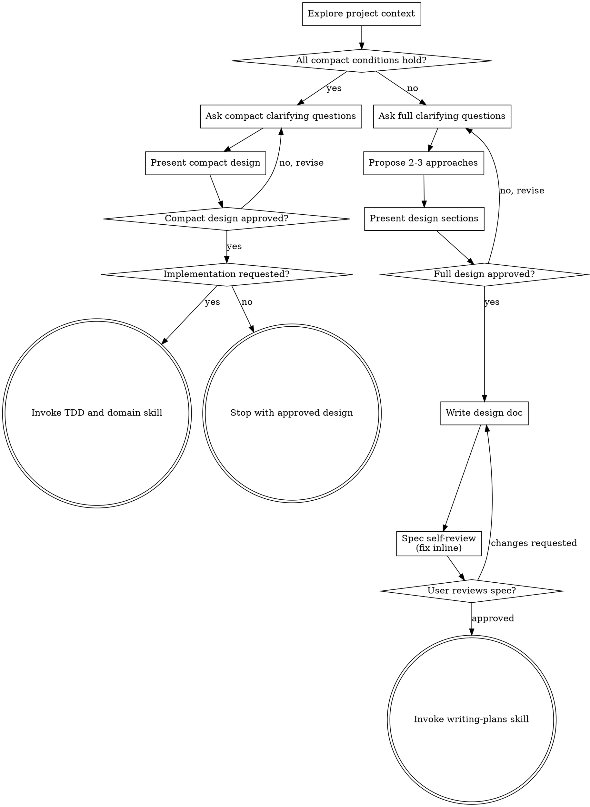

# Brainstorming Ideas Into Designs

Help turn ideas into fully formed designs and specs through natural collaborative dialogue.

Start by understanding the current project context, then ask questions one at a time to refine the idea. Once you understand what you're building, present the design and get user approval.

<HARD-GATE>
Do NOT invoke any implementation skill, write any code, scaffold any project, or take any implementation action until you have classified the workflow, presented a design, and the user has approved it. A compact in-chat design satisfies this gate only when every compact-workflow condition below holds.
</HARD-GATE>

## Route the Workflow First

### Context gate

Use direct research when the task is confined to one known module and no more than three targeted files. Use **superpowers:exploring-codebase-context** before detailed questions when any of these are true:

- two or more independent domains are involved;
- the implementation point is unclear;
- more than five files are likely needed;
- direct exploration would consume substantial parent context.

Treat its context brief as the exploration result. Open primary files yourself only for conflicts, missing evidence, or high-impact claims.

### Ceremony gate

Use the compact workflow only when **all** conditions hold:

- one module owns the change;
- no more than two implementation files are expected;
- no public API, schema, dependency, or architectural boundary changes;
- no authentication, payments, security, migrations, or infrastructure impact;
- the solution is unambiguous and has no competing architectural approaches;
- verification is local and already understood.

Tests and fixtures do not count as implementation files, but their impact must remain local. If any condition fails—or later exploration invalidates one—use the full workflow.

## Anti-Pattern: "Small Means No Design"

Small tasks still require an approved design. What changes is the ceremony: compact tasks use one concise in-chat design; larger or risk-sensitive tasks retain the complete spec and planning workflow.

## Checklist

You MUST create a task for each of these items and complete them in order:

1. **Explore project context** — apply the context gate; use the context skill when it fires
2. **Classify ceremony** — record which compact conditions pass or fail
3. **Offer the visual companion just-in-time** — NOT upfront. The first time a question would genuinely be clearer shown than described, offer it then (its own message); on approval its browser tab opens for you. If no visual question ever arises, never offer it. See the Visual Companion section below.
4. **Ask clarifying questions** — one at a time, understand purpose/constraints/success criteria
5. **Run the selected workflow**:
   - **Compact:** present one concise design and verification strategy, then get approval
   - **Full:** propose 2-3 approaches, present design sections, write and commit the spec, self-review it, obtain user review, then invoke writing-plans

## Process Flow

```dot
digraph brainstorming {
    "Explore project context" [shape=box];
    "All compact conditions hold?" [shape=diamond];
    "Ask compact clarifying questions" [shape=box];
    "Ask full clarifying questions" [shape=box];
    "Present compact design" [shape=box];
    "Propose 2-3 approaches" [shape=box];
    "Present design sections" [shape=box];
    "Compact design approved?" [shape=diamond];
    "Full design approved?" [shape=diamond];
    "Implementation requested?" [shape=diamond];
    "Invoke TDD and domain skill" [shape=doublecircle];
    "Stop with approved design" [shape=doublecircle];
    "Write design doc" [shape=box];
    "Spec self-review\n(fix inline)" [shape=box];
    "User reviews spec?" [shape=diamond];
    "Invoke writing-plans skill" [shape=doublecircle];

    "Explore project context" -> "All compact conditions hold?";
    "All compact conditions hold?" -> "Ask compact clarifying questions" [label="yes"];
    "All compact conditions hold?" -> "Ask full clarifying questions" [label="no"];
    "Ask compact clarifying questions" -> "Present compact design";
    "Ask full clarifying questions" -> "Propose 2-3 approaches";
    "Present compact design" -> "Compact design approved?";
    "Propose 2-3 approaches" -> "Present design sections";
    "Present design sections" -> "Full design approved?";
    "Compact design approved?" -> "Ask compact clarifying questions" [label="no, revise"];
    "Compact design approved?" -> "Implementation requested?" [label="yes"];
    "Implementation requested?" -> "Invoke TDD and domain skill" [label="yes"];
    "Implementation requested?" -> "Stop with approved design" [label="no"];
    "Full design approved?" -> "Ask full clarifying questions" [label="no, revise"];
    "Full design approved?" -> "Write design doc" [label="yes"];
    "Write design doc" -> "Spec self-review\n(fix inline)";
    "Spec self-review\n(fix inline)" -> "User reviews spec?";
    "User reviews spec?" -> "Write design doc" [label="changes requested"];
    "User reviews spec?" -> "Invoke writing-plans skill" [label="approved"];
}
```

**Terminal state depends on the selected workflow.** Full workflow invokes writing-plans. Compact workflow, when implementation was requested, invokes test-driven-development and the applicable domain skill only after design approval.

## The Process

**Understanding the idea:**

- Check out the current project state first (files, docs, recent commits)
- Before asking detailed questions, assess scope: if the request describes multiple independent subsystems (e.g., "build a platform with chat, file storage, billing, and analytics"), flag this immediately. Don't spend questions refining details of a project that needs to be decomposed first.
- If the project is too large for a single spec, help the user decompose into sub-projects: what are the independent pieces, how do they relate, what order should they be built? Then brainstorm the first sub-project through the normal design flow. Each sub-project gets its own spec → plan → implementation cycle.
- For appropriately-scoped projects, ask questions one at a time to refine the idea
- Prefer multiple choice questions when possible, but open-ended is fine too
- Only one question per message - if a topic needs more exploration, break it into multiple questions
- Focus on understanding: purpose, constraints, success criteria

**Exploring approaches (full workflow):**

- Propose 2-3 different approaches with trade-offs
- Present options conversationally with your recommendation and reasoning
- Lead with your recommended option and explain why

**Presenting the design:**

- Once you believe you understand what you're building, present the design
- For compact work, present one concise section covering the intended change, preserved behavior, affected boundary, and verification
- For full work, present sections scaled to their complexity
- Scale each section to its complexity: a few sentences if straightforward, up to 200-300 words if nuanced
- Ask after each section whether it looks right so far
- Cover: architecture, components, data flow, error handling, testing
- Be ready to go back and clarify if something doesn't make sense

**Design for isolation and clarity:**

- Break the system into smaller units that each have one clear purpose, communicate through well-defined interfaces, and can be understood and tested independently
- For each unit, you should be able to answer: what does it do, how do you use it, and what does it depend on?
- Can someone understand what a unit does without reading its internals? Can you change the internals without breaking consumers? If not, the boundaries need work.
- Smaller, well-bounded units are also easier for you to work with - you reason better about code you can hold in context at once, and your edits are more reliable when files are focused. When a file grows large, that's often a signal that it's doing too much.

**Working in existing codebases:**

- Explore the current structure before proposing changes. Follow existing patterns.
- Where existing code has problems that affect the work (e.g., a file that's grown too large, unclear boundaries, tangled responsibilities), include targeted improvements as part of the design - the way a good developer improves code they're working in.
- Don't propose unrelated refactoring. Stay focused on what serves the current goal.

## After the Design

### Compact workflow

After approval, do not create a design document or separate implementation plan. If implementation was requested, invoke superpowers:test-driven-development and the applicable domain skill. If the user requested discussion only, stop with the approved design.

### Full workflow

**Documentation:**

- Write the validated design (spec) to `docs/superpowers/specs/YYYY-MM-DD-<topic>-design.md`
  - (User preferences for spec location override this default)
- Use elements-of-style:writing-clearly-and-concisely skill if available
- Commit the design document to git

**Spec Self-Review:**
After writing the spec document, look at it with fresh eyes:

1. **Placeholder scan:** Any "TBD", "TODO", incomplete sections, or vague requirements? Fix them.
2. **Internal consistency:** Do any sections contradict each other? Does the architecture match the feature descriptions?
3. **Scope check:** Is this focused enough for a single implementation plan, or does it need decomposition?
4. **Ambiguity check:** Could any requirement be interpreted two different ways? If so, pick one and make it explicit.

Fix any issues inline. No need to re-review — just fix and move on.

**User Review Gate:**
After the spec review loop passes, ask the user to review the written spec before proceeding:

> "Spec written and committed to `<path>`. Please review it and let me know if you want to make any changes before we start writing out the implementation plan."

Wait for the user's response. If they request changes, make them and re-run the spec review loop. Only proceed once the user approves.

**Implementation:**

- Invoke the writing-plans skill to create a detailed implementation plan
- Do NOT invoke any other skill. writing-plans is the next step.

## Key Principles

- **One question at a time** - Don't overwhelm with multiple questions
- **Multiple choice preferred** - Easier to answer than open-ended when possible
- **YAGNI ruthlessly** - Remove unnecessary features from all designs
- **Explore alternatives** - Always propose 2-3 approaches before settling
- **Incremental validation** - Present design, get approval before moving on
- **Be flexible** - Go back and clarify when something doesn't make sense

## Visual Companion

A browser-based companion for showing mockups, diagrams, and visual options during brainstorming. Available as a tool — not a mode. Accepting the companion means it's available for questions that benefit from visual treatment; it does NOT mean every question goes through the browser.

**Offering the companion (just-in-time):** Do NOT offer it upfront. Wait until a question would genuinely be clearer shown than told — a real mockup / layout / diagram question, not merely a UI *topic*. The first time that happens, offer it then, as its own message:
> "This next part might be easier if I show you — I can put together mockups, diagrams, and comparisons in a browser tab as we go. It's still new and can be token-intensive. Want me to? I'll open it for you."

**This offer MUST be its own message.** Only the offer — no clarifying question, summary, or other content. Wait for the user's response. If they accept, start the server with `--open` so their browser opens to the first screen automatically. If they decline, continue text-only and don't offer again unless they raise it.

**Per-question decision:** Even after the user accepts, decide FOR EACH QUESTION whether to use the browser or the terminal. The test: **would the user understand this better by seeing it than reading it?**

- **Use the browser** for content that IS visual — mockups, wireframes, layout comparisons, architecture diagrams, side-by-side visual designs
- **Use the terminal** for content that is text — requirements questions, conceptual choices, tradeoff lists, A/B/C/D text options, scope decisions

A question about a UI topic is not automatically a visual question. "What does personality mean in this context?" is a conceptual question — use the terminal. "Which wizard layout works better?" is a visual question — use the browser.

If they agree to the companion, read the detailed guide before proceeding:
`skills/brainstorming/visual-companion.md`
