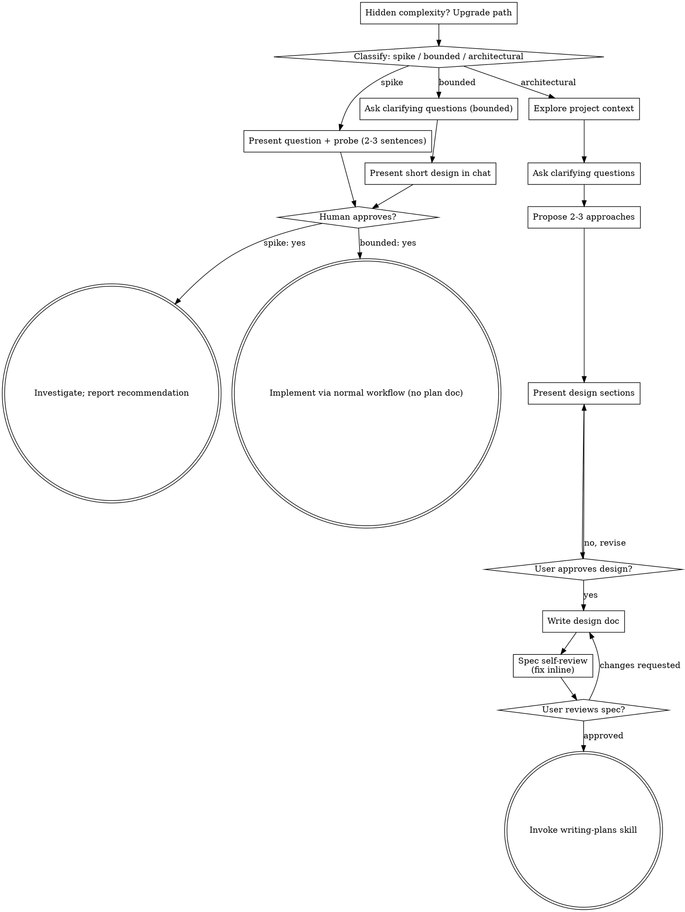

# Brainstorming Ideas Into Designs

Help turn ideas into fully formed designs and specs through natural collaborative dialogue.

Start by classifying how much process the request needs, then work
through your path: understand the context, refine the idea, present a
design, and get your human partner's approval.

## Establish Shared Understanding

The outcome of brainstorming is an understanding your human partner can
recognize and correct, grounded in what they want to accomplish.

1. **Discover intent.** Use the request and available context to identify
   the intended outcome, who it is for, and what success looks like. When
   that information is missing, ask one focused question about purpose or
   intended use before proposing features or an approach. Knowing the app
   genre does not tell you why your partner wants it. Gathering missing
   requirements does not ask them to authorize the task again.
2. **Write back your understanding.** Summarize the intended outcome,
   relevant constraints, and success criteria in a short note your partner
   can assess. Separate what they said from assumptions. Invite correction
   and incorporate their answer before treating this as the design brief.
3. **Carry intent into the design.** Preserve the agreed understanding in
   the selected path's design artifact: the written spec for architectural
   work, or the in-chat design/probe for bounded work and spikes. Check
   proposed features and technical choices against that understanding.

When the request already supplies the purpose and constraints, reflect
that understanding instead of asking the same questions again. Keep the
note concise; its accuracy and the opportunity to correct it matter.

<HARD-GATE>
Before taking any implementation action, including invoking an
implementation skill, writing product code, scaffolding, installing
product dependencies, or creating an external project, complete the
selected path's prerequisites:

- Spike: the human partner approves the question and probe.
- Bounded: the human partner approves the short in-chat design.
- Architectural: the human partner reviews and approves the written spec,
  then reviews the written implementation plan and selects its execution
  method. Conversational design approval only permits writing the spec;
  written-spec approval only permits invoking writing-plans.

A reply approves the stage actually presented. Approval of an idea or
feature scope does not approve artifacts that do not exist yet. Resume
at the earliest incomplete stage; do not turn one approval into permission
to skip the rest of the selected path. Read-only project exploration is
allowed while those prerequisites remain incomplete.
</HARD-GATE>

## Three Paths

Before your first question, classify the request and say the
classification out loud — "this looks bounded, so I'll present a short
design here rather than write a spec" — so your human partner can
override it:

- **Spike** — a feasibility question ("can we...", "is it possible...",
  "quick and dirty is fine") whose output is an answer, not code you
  keep. Present the question and what you'll try in 2-3 sentences, get
  a nod, then find out as cheaply as correctness allows. No design
  doc, no spec file. Report findings as a recommendation; anything you
  built stays labeled throwaway.
- **Bounded** — a well-scoped change to code that already exists in
  this repo: a new flag, a small endpoint, a one-file fix.
  Understanding the kind of app is not enough — bounded means the flow
  you are changing is already here to read. If there is no existing
  flow to change, the task is not bounded. Ask the clarifying
  questions that matter, present a short design IN CHAT (a few
  sentences to a few short paragraphs), and STOP. Implementation
  starts only after your human partner says yes to that design — a
  bounded task's approval is as hard a gate as an architectural
  one. No spec file, no implementation plan document.
- **Architectural** — new projects, new subsystems, changes that
  restructure how components fit together or alter interfaces others
  depend on. Follow the full process: questions, approaches, sectioned
  design, written spec, then the writing-plans skill.

When in doubt between two paths, take the heavier one. The ratchet is
one-way: hidden complexity discovered mid-task upgrades the path —
stop, say so, and step up. Nothing downgrades mid-task.

## Anti-Pattern: "Too Simple To Need Approval"

Every path ends with your human partner approving the required design
before implementation. A bounded change may need only two sentences in
chat. A new todo-list project is architectural and requires the written
spec and planning handoffs. Scale the artifact to the selected path;
complete that path's reviews before implementation.

## Red Flags

| Thought | Reality |
|---------|---------|
| "This is too simple to need a design" | Follow the selected path: a bounded change gets a short chat design; an architectural change gets the written spec and planning handoffs. |
| "I'll call it bounded and skip the spec" | Reaching for a label to skip work IS the doubt — take the heavier path. |
| "It's bounded and the design is obvious — I'll start while they read it" | The gate is the approval, not the design's length. Present, then stop until you hear yes. |
| "I understand this kind of app, so it's bounded" | Bounded measures the repo, not your familiarity. A new project has no existing flow — it is architectural. |
| "The spike works, so I'll keep the code" | A spike's output is an answer. Keeping the code is a new request — classify it. |
| "It grew, but I'm almost done — no need to re-classify" | Hidden complexity upgrades the path mid-task. Stop and say so. |
| "They approved the spike, so the follow-up change is approved too" | Each task gets its own classification and its own approval. |
| "I'll ask clarifying questions in plain chat text" | Use your harness's interactive questioning tool (e.g. `AskUserQuestion`, `ask_question`, `ask_user`) with structured options and recommendations, or formatted chat options if your harness lacks one. |
| "I'll ask where this config or file lives" | If it can be answered by exploring the codebase, explore instead of asking. |
| "I'll batch multiple questions at once to save time" | Ask one question at a time. Walk down each branch of the design tree, resolving dependencies between decisions one-by-one. |
| "I'll dump paragraphs of explanation into the modal question" | The prompt header has limited space; output the structured Decision Context in chat and keep the prompt to a concise sentence (<120 chars) ending with `(see chat for details)`. |
| "I'll put the TL;DR at the top of the chat message" | As text streams, top content scrolls off-screen. Place the TL;DR & Recommendation at the very bottom of the chat message so it stays visible right above the prompt without scrolling. |
| "I'll write long essays in chat before asking" | Respect the length budget: 1-2 sentences for Problem, 1-line bullets for Tradeoffs, 1-2 sentences for bottom TL;DR. Don't bombard your human partner with walls of text. |

## Checklist

Classify first, announce the path, then create a task for each item on
your path and complete them in order.

**Spike:**
1. **Explore project context** — enough to frame the probe
2. **Present question + probe plan** — 2-3 sentences
3. **Get approval** — a nod is enough
4. **Investigate** — as cheaply as correctness allows
5. **Report findings** — a recommendation; label anything built as throwaway

**Bounded:**
1. **Explore project context** — check files, docs, recent commits
2. **Ask clarifying questions** — one at a time via interactive questioning tool if available (or structured chat), with recommended options; explore codebase first
3. **Present short design in chat** — approach, files touched, testing
4. **Get approval** — STOP and wait for an explicit yes; presenting the design and starting in the same breath is skipping the gate
5. **Implement** — proceed with the normal development workflow (TDD applies); no plan document

**Architectural:**
1. **Explore project context** — check files, docs, recent commits
2. **Offer the visual companion just-in-time** — NOT upfront. The first time a question would genuinely be clearer shown than described, offer it then (its own message); on approval its browser tab opens for you. If no visual question ever arises, never offer it. See the Visual Companion section below.
3. **Ask clarifying questions** — one at a time via interactive questioning tool if available (or structured chat), with recommended options; understand purpose/constraints/success criteria
4. **Propose 2-3 approaches** — with trade-offs and recommendation, prompting choice via interactive questioning if available (or structured chat)
5. **Present design** — in sections scaled to their complexity, get user approval after each section
6. **Write design doc** — save to `docs/superpowers/specs/YYYY-MM-DD-<topic>-design.md` and commit
7. **Spec self-review** — quick inline check for placeholders, contradictions, ambiguity, scope (see below)
8. **User reviews written spec** — ask user to review the spec file before proceeding
9. **Transition to implementation** — invoke writing-plans skill to create implementation plan

## Process Flow


```dot
digraph brainstorming {
    "Classify: spike / bounded / architectural" [shape=diamond];
    "Present question + probe (2-3 sentences)" [shape=box];
    "Ask clarifying questions (bounded)" [shape=box];
    "Present short design in chat" [shape=box];
    "Human approves?" [shape=diamond];
    "Investigate; report recommendation" [shape=doublecircle];
    "Implement via normal workflow (no plan doc)" [shape=doublecircle];
    "Explore project context" [shape=box];
    "Ask clarifying questions" [shape=box];
    "Propose 2-3 approaches" [shape=box];
    "Present design sections" [shape=box];
    "User approves design?" [shape=diamond];
    "Write design doc" [shape=box];
    "Spec self-review\n(fix inline)" [shape=box];
    "User reviews spec?" [shape=diamond];
    "Invoke writing-plans skill" [shape=doublecircle];
    "Hidden complexity? Upgrade path" [shape=box];

    "Classify: spike / bounded / architectural" -> "Present question + probe (2-3 sentences)" [label="spike"];
    "Classify: spike / bounded / architectural" -> "Ask clarifying questions (bounded)" [label="bounded"];
    "Classify: spike / bounded / architectural" -> "Explore project context" [label="architectural"];
    "Present question + probe (2-3 sentences)" -> "Human approves?";
    "Ask clarifying questions (bounded)" -> "Present short design in chat";
    "Present short design in chat" -> "Human approves?";
    "Human approves?" -> "Investigate; report recommendation" [label="spike: yes"];
    "Human approves?" -> "Implement via normal workflow (no plan doc)" [label="bounded: yes"];
    "Hidden complexity? Upgrade path" -> "Classify: spike / bounded / architectural";
    "Explore project context" -> "Ask clarifying questions";
    "Ask clarifying questions" -> "Propose 2-3 approaches";
    "Propose 2-3 approaches" -> "Present design sections";
    "Present design sections" -> "User approves design?";
    "User approves design?" -> "Present design sections" [label="no, revise"];
    "User approves design?" -> "Write design doc" [label="yes"];
    "Write design doc" -> "Spec self-review\n(fix inline)";
    "Spec self-review\n(fix inline)" -> "User reviews spec?";
    "User reviews spec?" -> "Write design doc" [label="changes requested"];
    "User reviews spec?" -> "Invoke writing-plans skill" [label="approved"];
}
```

**Terminal states are path-bound.** Architectural: the ONLY skill you
invoke after brainstorming is writing-plans — never frontend-design,
mcp-builder, or any other implementation skill. Bounded: after
approval, implementation proceeds directly through the normal
development workflow; no plan document. Spike: the terminal state is a
reported recommendation.

## The Process

The subsections below serve the bounded and architectural paths (a
spike stops at "present the probe, get a nod"). Sections from
**Exploring approaches** onward are architectural-path depth — for
bounded work, context plus a few questions plus a short in-chat design
is the whole process.

**Understanding the idea:**

- Check out the current project state first (files, docs, recent commits)
- Before asking detailed questions, assess scope: if the request describes multiple independent subsystems (e.g., "build a platform with chat, file storage, billing, and analytics"), flag this immediately. Don't spend questions refining details of a project that needs to be decomposed first.
- If the project is too large for a single spec, help the user decompose into sub-projects: what are the independent pieces, how do they relate, what order should they be built? Then brainstorm the first sub-project through the normal design flow. Each sub-project gets its own spec → plan → implementation cycle.
- For appropriately-scoped projects, ask questions to refine the idea using the **Dual-Surface Questioning Protocol** (using your harness's interactive questioning tool like `AskUserQuestion`, `ask_question`, `ask_user`, `question`, `clarify` if available, or structured chat options if your harness lacks one):
  - **The Dual-Surface Pattern**: Main chat stream provides rich, readable context; the interactive prompt captures structured input.
  - **Bottom-Anchored TL;DR (Anti-Scrolling Invariant)**: In the chat message, always place the **TL;DR & Recommendation** at the very bottom (immediately before the prompt is invoked). As long responses stream down, content at the top scrolls off-screen. Placing the TL;DR at the bottom guarantees it remains visible in your human partner's viewport right above the interactive prompt without requiring them to scroll up.
  - **Strict Length Budget (No Bombardment)**:
    - **Problem / Finding**: 1–2 sentences on what is underspecified or discovered in the codebase (with clickable file/line links).
    - **Tradeoffs**: 1-line bullet per option highlighting key pros & cons.
    - **TL;DR & Recommendation**: 1–2 punchy sentences summarizing the choice and why the recommended path was picked.
  - **Chat Message Format Template**:
    ```markdown
    ### Decision Context: <Topic Title>

    **Problem / Finding**:
    <1-2 sentences on what's underspecified or what was found in the codebase. Link relevant files/lines.>

    **Tradeoffs**:
    - **<Option A>**: <1-line pros & cons>
    - **<Option B>**: <1-line pros & cons>

    ---
    💡 **TL;DR & Recommendation**:
    <1-2 punchy sentences summarizing the core choice and why the (Recommended) path was chosen.>
    ```
  - **Prompt Header Constraint**: Keep the prompt `question` string to a concise single sentence (<120 characters) ending with `(see chat for details)`.
  - **Option Formatting**: Provide 2–4 distinct options formatted as user responses with a short tag + 1-line rationale (e.g. `(Recommended) SQLite — ACID guarantees & zero-corruption`).
  - **Lead with Recommendation**: The first option MUST be prefixed with `(Recommended)`.
  - **Prompt Conventions**: Never add an "Other" option (built-in write-in box exists); never enumerate options (UI numbers them); set `is_multi_select: true` only if multiple choices apply.
  - **Codebase First & One at a Time**: Never ask for what can be discovered by reading code. Ask one question per turn, walking down the decision tree.

**Exploring approaches:**

- Propose 2-3 different approaches with trade-offs using the same Dual-Surface format.
- Output the `Decision Context` in chat with Problem, Tradeoffs, and bottom-anchored `💡 TL;DR & Recommendation`.
- Use your harness's interactive questioning tool (or structured chat options) to let your human partner select the approach, formatting each approach as a selectable option with its 1-line rationale and marking your recommended choice with `(Recommended)`.
- YAGNI ruthlessly - remove unnecessary features from every approach and design.

**Presenting the design:**

- Once you believe you understand what you're building, present the design
- Scale each section to its complexity: a few sentences if straightforward, up to 200-300 words if nuanced
- Ask after each section whether it looks right so far
- Cover: architecture, components, data flow, error handling, testing
- Be ready to go back and clarify if something doesn't make sense

**Design for isolation and clarity:**

- Break the system into smaller units that each have one clear purpose, communicate through well-defined interfaces, and can be understood and tested independently
- For each unit, you should be able to answer: what does it do, how do you use it, and what does it depend on?
- Can someone understand what a unit does without reading its internals? Can you change the internals without breaking consumers? If not, the boundaries need work.
- Smaller, well-bounded units are also easier for you to work with - you reason better about code you can hold in context at once, and your edits are more reliable when files are focused. When a file grows large, that's often a signal that it's doing too much.

**Working in existing codebases:**

- Explore the current structure before proposing changes. Follow existing patterns.
- Where existing code has problems that affect the work (e.g., a file that's grown too large, unclear boundaries, tangled responsibilities), include targeted improvements as part of the design - the way a good developer improves code they're working in.
- Don't propose unrelated refactoring. Stay focused on what serves the current goal.

## After the Design (architectural path)

**Documentation:**

- Write the validated design (spec) to `docs/superpowers/specs/YYYY-MM-DD-<topic>-design.md`
  - (User preferences for spec location override this default)
- Use elements-of-style:writing-clearly-and-concisely skill if available
- Commit the design document to git

**Spec Self-Review:**
After writing the spec document, look at it with fresh eyes:

1. **Placeholder scan:** Any "TBD", "TODO", incomplete sections, or vague requirements? Fix them.
2. **Internal consistency:** Do any sections contradict each other? Does the architecture match the feature descriptions?
3. **Scope check:** Is this focused enough for a single implementation plan, or does it need decomposition?
4. **Ambiguity check:** Could any requirement be interpreted two different ways? If so, pick one and make it explicit.

Fix any issues inline. No need to re-review — just fix and move on.

**User Review Gate:**
After the spec review loop passes, ask the user to review the written spec before proceeding:

> "Spec written and committed to `<path>`. Please review it and let me know if you want to make any changes before we start writing out the implementation plan."

Wait for the user's response. If they request changes, make them and re-run the spec review loop. Only proceed once the user approves.

**Implementation:**

- Invoke the writing-plans skill to create a detailed implementation plan
- Do NOT invoke any other skill. writing-plans is the next step.

## Visual Companion

A browser-based companion for showing mockups, diagrams, and visual options during brainstorming. Available as a tool — not a mode. Accepting the companion means it's available for questions that benefit from visual treatment; it does NOT mean every question goes through the browser.

**Offering the companion (just-in-time):** Do NOT offer it upfront. Wait until a question would genuinely be clearer shown than told — a real mockup / layout / diagram question, not merely a UI *topic*. The first time that happens, offer it then, as its own message:
> "This next part might be easier if I show you — I can put together mockups, diagrams, and comparisons in a browser tab as we go. It's still new and can be token-intensive. Want me to? I'll open it for you."

**This offer MUST be its own message.** Only the offer — no clarifying question, summary, or other content. Wait for the user's response. If they accept, start the server with `--open` so their browser opens to the first screen automatically. If they decline, continue text-only and don't offer again unless they raise it.

**Per-question decision:** Even after the user accepts, decide FOR EACH QUESTION whether to use the browser or the terminal. The test: **would the user understand this better by seeing it than reading it?**

- **Use the browser** for content that IS visual — mockups, wireframes, layout comparisons, architecture diagrams, side-by-side visual designs
- **Use the interactive questioning tool / terminal** for content that is text — requirements questions, conceptual choices, tradeoff lists, approach selection, scope decisions

A question about a UI topic is not automatically a visual question. "What does personality mean in this context?" is a conceptual question — use the terminal. "Which wizard layout works better?" is a visual question — use the browser.

If they agree to the companion, read the detailed guide before proceeding:
`skills/brainstorming/visual-companion.md`
