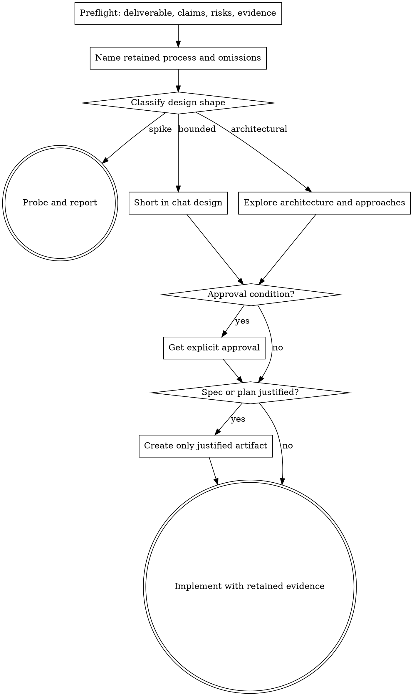

# Brainstorming Ideas Into Designs

Help turn ideas into an understood outcome and the lightest responsible
way to build it.

Calibrate rigor before creating any artifact. The project shape controls
how deeply to explore the design; actual claims and risks control whether
specs, plans, tests, reviews, or approval gates exist at all.

<HARD-GATE>
Do NOT invoke an implementation skill, write code, scaffold a project, or
create a spec, plan, test harness, or review workflow until you complete
the preflight reflection below. Do not manufacture machinery merely to
justify a downstream skill.
</HARD-GATE>

## Preflight Reflection

Before writing anything, determine:

1. **Deliverable** — what the user actually wants to exist.
2. **Claims** — what must be true for that deliverable to be credible.
3. **Risks** — concrete security, compatibility, irreversible, external,
   or coordination failures that matter here.
4. **Evidence** — the cheapest reliable evidence for each claim or risk.
5. **Process** — which artifacts and gates earn their cost, and the named
   claim, risk, or decision each one serves.
6. **Omissions** — what you will deliberately not create.

Reflection selects the evidence; it never substitutes for it. Keep the
cheapest evidence that actually supports the product's claims, and remove
only machinery with no such job.

Surface the result in one compact sentence so your human partner can
correct it. Example: "This is a reversible prompt-only package; I will
write the skills and run a few realistic pressure scenarios, but I will
not create runtime code, a unit-test framework, or per-file reviewers."

Apply this counterfactual before retaining any process item:

> If this artifact, test, or reviewer did not already exist, would this
> task's claims or risks make me create it now?

If the answer is no, do not create it. Existing checklists, path labels,
and available skills are not independent justification.

### What earns machinery

| Process item | Create it only when |
|---|---|
| Written spec | A durable interface, multi-party agreement, or likely context loss needs a stable source of truth |
| Implementation plan | Work must cross contributors or contexts, or dependencies cannot be executed reliably in one context; ordinary sequential steps do not qualify |
| Automated test | Retained executable behavior has a regression claim worth rechecking |
| Pressure scenario | Prompt, policy, or skill behavior must hold under realistic use |
| Reviewer | Independent judgment addresses a named security boundary, untrusted-input path, protocol contract, irreversible effect, data-loss risk, or consequential decision |
| Human approval gate | A material design choice remains open, or work is destructive, irreversible, security-sensitive, or externally visible |

Use existing lightweight validation when it already proves a claim. Never
add runtime code solely to make prose, prompts, templates, or skills unit
testable.

An explicit containment or protocol promise in the brief — for example,
"must not follow symlinks outside the root," secret redaction, network
request replay, or safe response headers — retains one focused boundary or
final review unless the same independent judgment is already supplied.
Conversely, prompt-only, local, reversible, and static work does not acquire
a reviewer merely because one is available.

The preflight decision governs downstream skills. A downstream default may
not recreate a plan, test harness, review loop, or approval gate that was
deliberately omitted here.

## Three Paths

After the preflight, classify the design shape. Say it briefly so your
human partner can override it. A path selects exploration depth, not a
mandatory bundle of artifacts:

- **Spike** — a feasibility question ("can we...", "is it possible...",
  "quick and dirty is fine") whose output is an answer, not code you
  keep. Present the question and what you'll try in 2-3 sentences, then
  find out as cheaply as correctness allows. Report findings as a
  recommendation; anything you built stays labeled throwaway.
- **Bounded** — a well-scoped change to code that already exists in
  this repo: a new flag, a small endpoint, a one-file fix.
  Understanding the kind of app is not enough — bounded means the flow
  you are changing is already here to read. If there is no existing
  flow to change, the task is not bounded. Ask the clarifying
  questions that matter, present a short design IN CHAT (a few
  sentences to a few short paragraphs). Ask for approval only when the
  preflight identified a real approval condition; otherwise state the
  intent and proceed with reversible in-worktree implementation.
- **Architectural** — new projects, new subsystems, changes that
  restructure how components fit together or alter interfaces others
  depend on. Explore questions, approaches, and design in appropriate
  depth. Architecture does not automatically require a spec file,
  implementation plan, TDD, subagents, or staged review.

When evidence changes, re-run the preflight. Increase rigor when a new
claim or risk earns it; reduce rigor when the justification disappears.
Do this before creating the next artifact, not after building a process
that should never have existed.

## Approval Is Risk-Bound

Always stop for an unresolved material design decision and before a
destructive, irreversible, security-sensitive, or externally visible
action. Also stop when the user explicitly asks to review first. For a
clear, reversible, in-worktree request, the compact preflight statement is
enough; do not turn acknowledgement into a ritual approval round.

## Red Flags

| Thought | Reality |
|---------|---------|
| "Architectural means full ceremony" | Architectural describes product shape. Claims and risks determine process weight. |
| "A feature means TDD" | Only retained executable behavior with a regression claim earns automated tests. |
| "A skill exists, so I must produce its input" | Skills serve the task. Never create a spec or plan merely to trigger another skill. |
| "I understand this kind of app, so it's bounded" | Bounded measures the repo, not your familiarity. A new project has no existing flow — it is architectural. |
| "The spike works, so I'll keep the code" | A spike's output is an answer. Keeping the code is a new request — classify it. |
| "More review is always safer" | A reviewer without a named risk or decision adds confidence theater, not evidence. |
| "I can trim unnecessary machinery later" | Late deletion is recovery. The preflight exists to prevent creating it. |

## Checklist

Complete the preflight, announce the path and retained process, then use
only the applicable items below.

**Spike:**
1. **Explore project context** — enough to frame the probe
2. **Present question + probe plan** — 2-3 sentences
3. **Investigate** — as cheaply as correctness allows
4. **Report findings** — a recommendation; label anything built as throwaway

**Bounded:**
1. **Explore project context** — check files, docs, recent commits
2. **Ask clarifying questions** — one at a time, the ones that matter
3. **Present short design in chat** — approach, files touched, retained evidence
4. **Resolve approval condition if preflight named one**
5. **Implement** — use only the validation and workflow retained by preflight

**Architectural:**
1. **Explore project context** — check files, docs, recent commits
2. **Offer the visual companion just-in-time** — NOT upfront. The first time a question would genuinely be clearer shown than described, offer it then (its own message); on approval its browser tab opens for you. If no visual question ever arises, never offer it. See the Visual Companion section below.
3. **Ask clarifying questions** — one at a time, understand purpose/constraints/success criteria
4. **Propose 2-3 approaches** — with trade-offs and your recommendation
5. **Present design** — in sections scaled to their complexity
6. **Resolve approval condition if preflight named one**
7. **Transition directly to implementation unless a written spec or plan earned its cost**
8. **If retained, write and review only the justified artifact, then invoke the matching skill**

## Process Flow

```dot
digraph brainstorming {
    "Preflight: deliverable, claims, risks, evidence" [shape=box];
    "Name retained process and omissions" [shape=box];
    "Classify design shape" [shape=diamond];
    "Probe and report" [shape=doublecircle];
    "Short in-chat design" [shape=box];
    "Explore architecture and approaches" [shape=box];
    "Approval condition?" [shape=diamond];
    "Get explicit approval" [shape=box];
    "Spec or plan justified?" [shape=diamond];
    "Create only justified artifact" [shape=box];
    "Implement with retained evidence" [shape=doublecircle];

    "Preflight: deliverable, claims, risks, evidence" -> "Name retained process and omissions";
    "Name retained process and omissions" -> "Classify design shape";
    "Classify design shape" -> "Probe and report" [label="spike"];
    "Classify design shape" -> "Short in-chat design" [label="bounded"];
    "Classify design shape" -> "Explore architecture and approaches" [label="architectural"];
    "Short in-chat design" -> "Approval condition?";
    "Explore architecture and approaches" -> "Approval condition?";
    "Approval condition?" -> "Get explicit approval" [label="yes"];
    "Approval condition?" -> "Spec or plan justified?" [label="no"];
    "Get explicit approval" -> "Spec or plan justified?";
    "Spec or plan justified?" -> "Create only justified artifact" [label="yes"];
    "Spec or plan justified?" -> "Implement with retained evidence" [label="no"];
    "Create only justified artifact" -> "Implement with retained evidence";
}
```

**Terminal states are justification-bound.** Invoke writing-plans only when
the preflight retained a plan. Invoke TDD only when it retained automated
regression evidence. Invoke a review workflow only when it retained an
independent review. Otherwise transition directly to the appropriate
implementation skill. A spike ends with a reported recommendation.

## The Process

The subsections below serve the bounded and architectural paths (a
spike stops at "present the probe, get a nod"). Sections from
**Exploring approaches** onward are architectural-path depth — for
bounded work, context plus a few questions plus a short in-chat design
is the whole process.

**Understanding the idea:**

- Check out the current project state first (files, docs, recent commits)
- Before asking detailed questions, assess scope: if the request describes multiple independent subsystems (e.g., "build a platform with chat, file storage, billing, and analytics"), flag this immediately. Don't spend questions refining details of a project that needs to be decomposed first.
- If the project has multiple independent subsystems, help the user decompose them and design the first useful slice. Do not automatically create a separate spec and plan for every slice; apply the preflight to each.
- For appropriately-scoped projects, ask questions one at a time to refine the idea
- Prefer multiple choice questions when possible, but open-ended is fine too
- Only one question per message - if a topic needs more exploration, break it into multiple questions
- Focus on understanding: purpose, constraints, success criteria

**Exploring approaches:**

- Propose 2-3 different approaches with trade-offs
- Present options conversationally with your recommendation and reasoning
- Lead with your recommended option and explain why
- YAGNI ruthlessly - remove unnecessary features from every approach and design

**Presenting the design:**

- Once you believe you understand what you're building, present the design
- Scale each section to its complexity: a few sentences if straightforward, up to 200-300 words if nuanced
- Ask after each section only when an unresolved decision needs the user's judgment; otherwise present a compact coherent design
- Cover the relevant architecture, components, data flow, failure handling, and retained evidence
- Be ready to go back and clarify if something doesn't make sense

**Design for isolation and clarity:**

- Break the system into smaller units that each have one clear purpose, communicate through well-defined interfaces, and can be understood and tested independently
- For each unit, you should be able to answer: what does it do, how do you use it, and what does it depend on?
- Can someone understand what a unit does without reading its internals? Can you change the internals without breaking consumers? If not, the boundaries need work.
- Smaller, well-bounded units are also easier for you to work with - you reason better about code you can hold in context at once, and your edits are more reliable when files are focused. When a file grows large, that's often a signal that it's doing too much.

**Working in existing codebases:**

- Explore the current structure before proposing changes. Follow existing patterns.
- Where existing code has problems that affect the work (e.g., a file that's grown too large, unclear boundaries, tangled responsibilities), include targeted improvements as part of the design - the way a good developer improves code they're working in.
- Don't propose unrelated refactoring. Stay focused on what serves the current goal.

## After the Design (when artifacts were retained)

Skip this entire section when the preflight did not justify a written spec
or plan.

**Written spec:**

- When a durable source of truth was justified, write it to `docs/superpowers/specs/YYYY-MM-DD-<topic>-design.md`
  - (User preferences for spec location override this default)
- Use elements-of-style:writing-clearly-and-concisely skill if available
- Commit the design document to git

**Spec Self-Review:**
After writing the spec document, look at it with fresh eyes:

1. **Placeholder scan:** Any "TBD", "TODO", incomplete sections, or vague requirements? Fix them.
2. **Internal consistency:** Do any sections contradict each other? Does the architecture match the feature descriptions?
3. **Scope check:** Is this focused enough for a single implementation plan, or does it need decomposition?
4. **Ambiguity check:** Could any requirement be interpreted two different ways? If so, pick one and make it explicit.

Fix any issues inline. No need to re-review — just fix and move on.

**User review (conditional):**
When the preflight retained a human review gate, ask the user to review the written spec before proceeding:

> "Spec written and committed to `<path>`. Please review it and let me know if you want to make any changes before we start writing out the implementation plan."

Wait for the user's response. If they request changes, make them and re-run the self-review. Proceed once the user approves. If no review gate was retained, continue without manufacturing one.

**Implementation:**

- If sequencing or handoff justified a plan, invoke writing-plans.
- Otherwise invoke the implementation skill that directly serves the deliverable.

## Visual Companion

A browser-based companion for showing mockups, diagrams, and visual options during brainstorming. Available as a tool — not a mode. Accepting the companion means it's available for questions that benefit from visual treatment; it does NOT mean every question goes through the browser.

**Offering the companion (just-in-time):** Do NOT offer it upfront. Wait until a question would genuinely be clearer shown than told — a real mockup / layout / diagram question, not merely a UI *topic*. The first time that happens, offer it then, as its own message:
> "This next part might be easier if I show you — I can put together mockups, diagrams, and comparisons in a browser tab as we go. It's still new and can be token-intensive. Want me to? I'll open it for you."

**This offer MUST be its own message.** Only the offer — no clarifying question, summary, or other content. Wait for the user's response. If they accept, start the server with `--open` so their browser opens to the first screen automatically. If they decline, continue text-only and don't offer again unless they raise it.

**Per-question decision:** Even after the user accepts, decide FOR EACH QUESTION whether to use the browser or the terminal. The test: **would the user understand this better by seeing it than reading it?**

- **Use the browser** for content that IS visual — mockups, wireframes, layout comparisons, architecture diagrams, side-by-side visual designs
- **Use the terminal** for content that is text — requirements questions, conceptual choices, tradeoff lists, A/B/C/D text options, scope decisions

A question about a UI topic is not automatically a visual question. "What does personality mean in this context?" is a conceptual question — use the terminal. "Which wizard layout works better?" is a visual question — use the browser.

If they agree to the companion, read the detailed guide before proceeding:
`skills/brainstorming/visual-companion.md`
