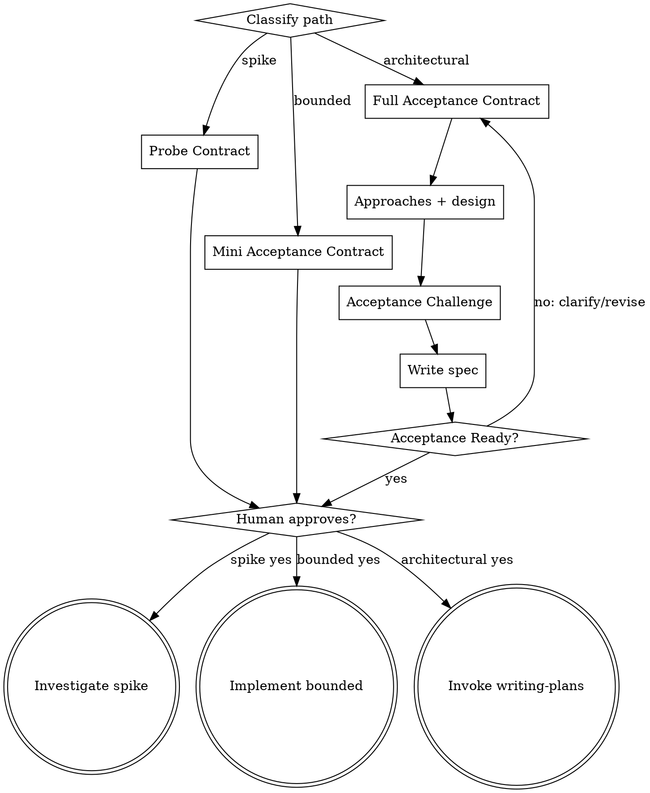

# Brainstorming Ideas Into Designs

Help turn ideas into fully formed designs and specs through natural collaborative dialogue.

Start by classifying how much process the request needs, then work
through your path: understand the context, refine the idea, present a
design, and get your human partner's approval.

## Establish Shared Understanding

The outcome of brainstorming is a shared contract your human partner can
recognize and correct, grounded in what they want to accomplish and what
must be observably true for the work to count as correct.

1. **Discover intent.** Use the request and available context to identify
   the intended outcome, who it is for, and what success looks like. When
   that information is missing, ask one focused question about purpose or
   intended use before proposing features or an approach.
2. **Write back your understanding.** Summarize the intended outcome,
   relevant constraints, success criteria, and assumptions in a short note
   your partner can assess. Separate facts from assumptions and invite
   correction.
3. **Define acceptance.** Before selecting an implementation approach,
   capture the acceptance obligations that constrain correctness. Scale the
   artifact to the path: a Probe Contract for spikes, a Mini Acceptance
   Contract for bounded work, and a Full Acceptance Contract for
   architectural work. Define observable outcomes, important invariants,
   critical failure semantics, and blocking behavioral ambiguity. Do not
   design exhaustive test cases here. See `acceptance-contract.md`.
4. **Carry intent and acceptance into the design.** Check proposed features
   and technical choices against both the agreed intent and the acceptance
   obligations. Critical obligations must map to a design mechanism.

When the request already supplies the purpose, constraints, and acceptance
facts, reflect them instead of asking the same questions again. Scale
acceptance effort to behavioral risk, not document size.

<HARD-GATE>
Before taking any implementation action, including invoking an
implementation skill, writing product code, scaffolding, installing
product dependencies, or creating an external project, complete the
selected path's quality and approval prerequisites:

- Spike: the question, Probe Contract, and probe plan are explicit and the
  human partner approves them.
- Bounded: the Mini Acceptance Contract and short in-chat design are
  explicit and the human partner approves them.
- Architectural: the Full Acceptance Contract exists, Acceptance Challenge
  is complete, Acceptance Readiness is **READY**, the human partner reviews
  and approves the written spec, then reviews the implementation plan and
  selects its execution method. Conversational design approval only permits
  writing the spec; written-spec approval only permits invoking writing-plans.

Human approval does not make an acceptance-incomplete artifact ready.
A reply approves only the stage actually presented. Resume at the earliest
incomplete stage; do not turn one approval into permission to skip the rest
of the selected path. Read-only project exploration is allowed while those
prerequisites remain incomplete.
</HARD-GATE>

## Three Paths

Before your first question, classify the request and say the
classification out loud so your human partner can override it:

- **Spike** — a feasibility question ("can we...", "is it possible...",
  "quick and dirty is fine") whose output is an answer, not code you keep.
  Define a lightweight **Probe Contract**: question/hypothesis, evidence,
  success/failure criteria, and decision rule. Get approval, then investigate
  as cheaply as correctness allows. Anything built stays throwaway.
- **Bounded** — a well-scoped change to code that already exists in this
  repo. Ask the clarifying questions that matter, state a **Mini Acceptance
  Contract** and short design IN CHAT, and STOP. The mini contract captures
  only the changed behavior, relevant must-remain-true invariants, and
  critical failure semantics. Implementation starts only after approval.
  No spec file or implementation-plan document.
- **Architectural** — new projects, new subsystems, or changes that
  restructure how components fit together or alter interfaces others depend
  on. Follow the full process: context, questions, **Full Acceptance
  Contract**, approaches evaluated against acceptance, design, Acceptance
  Challenge, written spec, Acceptance Readiness, then writing-plans.

When in doubt between two paths, take the heavier one. The ratchet is
one-way: hidden complexity discovered mid-task upgrades the path — stop,
say so, and step up. Nothing downgrades mid-task. Acceptance depth follows
the selected path; it does not justify expanding feature scope.

## Anti-Pattern: "Too Simple To Need Acceptance"

Every path defines the acceptance artifact appropriate to its risk and gets
human approval before implementation. A bounded change may need only a few
lines of Mini Acceptance Contract plus a short design; it does not need a
full spec. A new project is architectural and requires the full contract,
written spec, readiness gate, and planning handoff. Scale the artifact;
never skip the correctness contract.

## Red Flags

| Thought | Reality |
|---------|---------|
| "This is too simple to need a design" | Follow the selected path: a bounded change gets a short chat design; an architectural change gets the written spec and planning handoffs. |
| "I'll call it bounded and skip the spec" | Reaching for a label to skip work IS the doubt — take the heavier path. |
| "It's bounded and the design is obvious — I'll start while they read it" | The gate is the approval, not the design's length. Present, then stop until you hear yes. |
| "I understand this kind of app, so it's bounded" | Bounded measures the repo, not your familiarity. A new project has no existing flow — it is architectural. |
| "The spike works, so I'll keep the code" | A spike's output is an answer. Keeping the code is a new request — classify it. |
| "It grew, but I'm almost done — no need to re-classify" | Hidden complexity upgrades the path mid-task. Stop and say so. |
| "They approved the spike, so the follow-up change is approved too" | Each task gets its own classification and its own approval. |
| "The success criteria are obvious; tests can define them later" | Tests cannot repair an undefined correctness contract. Define the path-sized acceptance artifact before design/implementation. |
| "The requirement is ambiguous, but I can choose the reasonable interpretation" | If the choice changes observable behavior or acceptance semantics, it is a behavioral decision for the human partner. |
| "Acceptance means listing every edge case" | No. Capture only obligations that materially constrain correctness, design, or release confidence. |
| "The user approved the design, so Acceptance Readiness is unnecessary" | Approval and artifact readiness are separate gates; one does not substitute for the other. |

## Checklist

Classify first, announce the path, then create a task for each item on
your path and complete them in order.

**Spike:**
1. **Explore project context** — enough to frame the probe
2. **Define Probe Contract** — hypothesis/question, evidence, success,
   failure, decision rule
3. **Present probe plan + contract** — keep it brief
4. **Get approval**
5. **Investigate**
6. **Report evidence + decision** — label anything built as throwaway

**Bounded:**
1. **Explore project context** — check files, docs, recent commits
2. **Ask clarifying questions** — one at a time, only what matters
3. **Define Mini Acceptance Contract** — changed behavior, relevant
   invariants, critical failure semantics
4. **Present short design in chat** — approach, files touched, verification
5. **Get approval** — STOP and wait for an explicit yes
6. **Implement** — normal development workflow; TDD applies; no plan doc

**Architectural:**
1. **Explore project context**
2. **Offer the visual companion just-in-time** when a genuinely visual
   question arises
3. **Ask clarifying questions** — purpose, constraints, success criteria,
   behavioral decisions
4. **Define Full Acceptance Contract** — critical behavior, observable
   oracles, invariants, failure obligations, NFR obligations, unknowns
5. **Propose 2-3 approaches** — evaluate trade-offs and acceptance fit
6. **Present design** — architecture plus Acceptance -> Design traceability
7. **Run Acceptance Challenge** — counterexample, boundary, state,
   regression
8. **Write design doc**
9. **Spec self-review**
10. **Run Acceptance Readiness Gate** — must be READY
11. **User reviews written spec**
12. **Transition to implementation** — invoke writing-plans

## Process Flow

```dot
digraph brainstorming {
    "Classify path" [shape=diamond];
    "Probe Contract" [shape=box];
    "Mini Acceptance Contract" [shape=box];
    "Full Acceptance Contract" [shape=box];
    "Approaches + design" [shape=box];
    "Acceptance Challenge" [shape=box];
    "Acceptance Ready?" [shape=diamond];
    "Human approves?" [shape=diamond];
    "Investigate spike" [shape=doublecircle];
    "Implement bounded" [shape=doublecircle];
    "Write spec" [shape=box];
    "Invoke writing-plans" [shape=doublecircle];

    "Classify path" -> "Probe Contract" [label="spike"];
    "Classify path" -> "Mini Acceptance Contract" [label="bounded"];
    "Classify path" -> "Full Acceptance Contract" [label="architectural"];
    "Probe Contract" -> "Human approves?";
    "Mini Acceptance Contract" -> "Human approves?";
    "Human approves?" -> "Investigate spike" [label="spike yes"];
    "Human approves?" -> "Implement bounded" [label="bounded yes"];
    "Full Acceptance Contract" -> "Approaches + design";
    "Approaches + design" -> "Acceptance Challenge";
    "Acceptance Challenge" -> "Write spec";
    "Write spec" -> "Acceptance Ready?";
    "Acceptance Ready?" -> "Full Acceptance Contract" [label="no: clarify/revise"];
    "Acceptance Ready?" -> "Human approves?" [label="yes"];
    "Human approves?" -> "Invoke writing-plans" [label="architectural yes"];
}
```

**Terminal states are path-bound.** Architectural: after acceptance-ready
spec approval, the ONLY skill you invoke is writing-plans. Bounded: after
approval, implementation proceeds directly through the normal development
workflow; no plan document. Spike: the terminal state is an evidence-backed
recommendation.

## The Process

The subsections below serve the bounded and architectural paths. A spike
uses only the Probe Contract and probe workflow. Architectural depth begins
with approach comparison; bounded work stops after a Mini Acceptance Contract,
short design, and approval.

**Understanding the idea:**

- Check out the current project state first (files, docs, recent commits)
- Before asking detailed questions, assess scope: if the request describes multiple independent subsystems (e.g., "build a platform with chat, file storage, billing, and analytics"), flag this immediately. Don't spend questions refining details of a project that needs to be decomposed first.
- If the project is too large for a single spec, help the user decompose into sub-projects: what are the independent pieces, how do they relate, what order should they be built? Then brainstorm the first sub-project through the normal design flow. Each sub-project gets its own spec → plan → implementation cycle.
- For appropriately-scoped projects, ask questions one at a time to refine the idea
- Prefer multiple choice questions when possible, but open-ended is fine too
- Only one question per message - if a topic needs more exploration, break it into multiple questions
- Focus on understanding: purpose, constraints, success criteria
- Separate behavioral decisions from implementation choices. A behavioral
  ambiguity changes observable behavior, business rules, state transitions,
  data correctness, failure semantics, security/permission behavior,
  compatibility, or acceptance thresholds. Do not silently resolve it;
  expose it as a Decision / Unknown for the human partner. Implementation
  ambiguity may be resolved when it cannot change acceptance semantics.

**Defining acceptance:**

- Define what must be observably true before selecting the final approach.
- Use the path-specific contract in `acceptance-contract.md`.
- Capture only obligations that materially constrain correctness, design
  choices, or release confidence.
- Do not enumerate every imaginable edge case and do not generate exhaustive
  test cases here.
- For existing code, capture must-remain-true behavior as invariants when the
  change could regress it.

**Exploring approaches:**

- Propose 2-3 different approaches with trade-offs
- Present options conversationally with your recommendation and reasoning
- Evaluate each serious option against the critical acceptance obligations;
  call out obligations it cannot satisfy or can satisfy only with added mechanisms
- Lead with your recommended option and explain why
- YAGNI ruthlessly - remove unnecessary features from every approach and design

**Presenting the design:**

- Once you believe you understand what you're building, present the design
- Scale each section to its complexity: a few sentences if straightforward, up to 200-300 words if nuanced
- Ask after each section whether it looks right so far
- Cover: architecture, components, data/state flow, failure semantics,
  Acceptance -> Design traceability, and verification intent
- For each critical obligation, identify the design mechanism responsible for
  satisfying it
- Be ready to go back and clarify if something doesn't make sense

**Acceptance Challenge:**

Before finalizing an architectural spec, try to falsify the design with four
focused probes:

1. **Counterexample** — can the listed acceptance conditions appear satisfied
   while the intended user outcome is still wrong?
2. **Boundary** — is there a boundary condition that changes a design decision?
3. **State** — is a critical state transition undefined or contradictory?
4. **Regression** — can the new behavior violate an existing invariant?

Add or revise only obligations that materially affect correctness or design.
Do not turn this into open-ended edge-case brainstorming.

**Design for isolation and clarity:**

- Break the system into smaller units that each have one clear purpose, communicate through well-defined interfaces, and can be understood and tested independently
- For each unit, you should be able to answer: what does it do, how do you use it, and what does it depend on?
- Can someone understand what a unit does without reading its internals? Can you change the internals without breaking consumers? If not, the boundaries need work.
- Smaller, well-bounded units are also easier for you to work with - you reason better about code you can hold in context at once, and your edits are more reliable when files are focused. When a file grows large, that's often a signal that it's doing too much.

**Working in existing codebases:**

- Explore the current structure before proposing changes. Follow existing patterns.
- Where existing code has problems that affect the work (e.g., a file that's grown too large, unclear boundaries, tangled responsibilities), include targeted improvements as part of the design - the way a good developer improves code they're working in.
- Don't propose unrelated refactoring. Stay focused on what serves the current goal.
- Identify existing behavior that must remain true when the change can affect it;
  represent those as explicit invariants rather than assuming regression safety.

## After the Design (architectural path)

**Documentation:**

- Write the validated design (spec) to `docs/superpowers/specs/YYYY-MM-DD-<topic>-design.md`
  - (User preferences for spec location override this default)
- Use elements-of-style:writing-clearly-and-concisely skill if available
- The spec must carry the agreed intent, Acceptance Contract, design,
  Acceptance -> Design mapping, Acceptance Challenge results, and verification
  intent. Do not expand these into exhaustive test cases.
- Commit the design document to git

**Spec Self-Review:**
After writing the spec document, review it against the contract:

1. **Intent alignment:** Does the design still achieve the stated intended outcome?
2. **Acceptance completeness:** Does every critical outcome have an acceptance obligation?
3. **Oracle check:** Could an independent observer determine PASS/FAIL for each critical obligation?
4. **Invariant check:** Are relevant must-remain-true behaviors explicit?
5. **Failure semantics:** Are critical failures defined rather than implied?
6. **Counterexample check:** Could all ACs appear satisfied while the real outcome is wrong?
7. **Behavioral ambiguity:** Any unresolved behavioral ambiguity is a blocking Decision / Unknown; do not pick an interpretation silently.
8. **Traceability:** Can every critical obligation point to the design mechanism responsible for it?
9. **Consistency and scope:** Any contradiction, scope creep, or multi-subsystem spec that should be decomposed?
10. **Placeholder scan:** Any TBD/TODO or vague blocking language?

Fix non-decision issues inline. Surface blocking behavioral decisions to the
human partner.

**Acceptance Readiness Gate:**

The architectural spec is **Acceptance Ready** only when:

- intended outcome is explicit;
- critical behavior obligations exist;
- each critical obligation has an observable oracle/evidence condition;
- critical failure semantics and relevant invariants are explicit;
- blocking behavioral ambiguities are zero;
- critical Acceptance -> Design mappings exist; and
- high-risk counterexample/boundary/state/regression probes have been considered.

If any condition fails, report **NOT READY** with the blocking items and return
to clarification/acceptance/design. Only a **READY** spec may proceed to the
user review gate and then writing-plans.

**User Review Gate:**
After the spec self-review and Acceptance Readiness Gate pass, ask the user to review the written spec before proceeding:

> "Spec written and committed to `<path>`. Please review it and let me know if you want to make any changes before we start writing out the implementation plan."

Wait for the user's response. If they request changes, make them and re-run the spec review loop. Only proceed once the user approves.

**Implementation:**

- Invoke the writing-plans skill to create a detailed implementation plan
- Do NOT invoke any other skill. writing-plans is the next step.

## Visual Companion

A browser-based companion for showing mockups, diagrams, and visual options during brainstorming. Available as a tool — not a mode. Accepting the companion means it's available for questions that benefit from visual treatment; it does NOT mean every question goes through the browser.

**Offering the companion (just-in-time):** Do NOT offer it upfront. Wait until a question would genuinely be clearer shown than told — a real mockup / layout / diagram question, not merely a UI *topic*. The first time that happens, offer it then, as its own message:
> "This next part might be easier if I show you — I can put together mockups, diagrams, and comparisons in a browser tab as we go. It's still new and can be token-intensive. Want me to? I'll open it for you."

**This offer MUST be its own message.** Only the offer — no clarifying question, summary, or other content. Wait for the user's response. If they accept, start the server with `--open` so their browser opens to the first screen automatically. If they decline, continue text-only and don't offer again unless they raise it.

**Per-question decision:** Even after the user accepts, decide FOR EACH QUESTION whether to use the browser or the terminal. The test: **would the user understand this better by seeing it than reading it?**

- **Use the browser** for content that IS visual — mockups, wireframes, layout comparisons, architecture diagrams, side-by-side visual designs
- **Use the terminal** for content that is text — requirements questions, conceptual choices, tradeoff lists, A/B/C/D text options, scope decisions

A question about a UI topic is not automatically a visual question. "What does personality mean in this context?" is a conceptual question — use the terminal. "Which wizard layout works better?" is a visual question — use the browser.

If they agree to the companion, read the detailed guide before proceeding:
`skills/brainstorming/visual-companion.md`