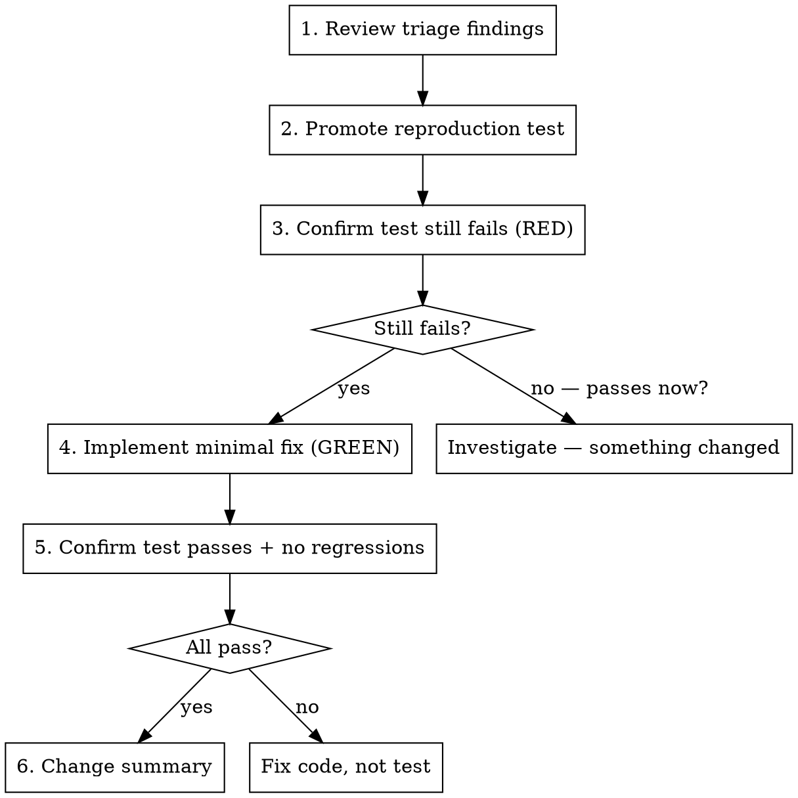

# Bug Fix

## Overview

Implement a fix based on confirmed triage findings. The root cause is known. The reproduction test exists. Now fix it with minimal change and verify.

**Core principle:** Minimal fix for root cause. Promote the test. Verify with evidence.

**Announce at start:** "I'm using the bug-fix skill to implement this fix."

## When to Use

- Triage is complete with confirmed root cause, specific code locations, and a reproduction test
- On a feature branch (e.g., `fix/<issue#>-...`)
- Fix is straightforward and well-understood

**Do not use when:**
- Root cause is not confirmed (go back to `bug-triage`)
- Fix requires significant refactoring or multi-file architecture changes (use `writing-plans` + `subagent-driven-development`)
- No reproduction test exists (go back to `bug-triage`)

## Prerequisites

- Completed triage with: root cause, file(s)/line(s), confirmed reproduction test
- On a feature branch
- Read project-specific fix context (`.claude/shared/fix-project.md` if it exists)

## The Process

### Step 1: Review Triage Findings

- Re-read the triage conclusion: root cause, file(s), line(s), reproduction evidence
- Confirm you're on the correct feature branch
- Understand exactly what needs to change and why

### Step 2: Promote Reproduction Test

Uses `evidence-driven-testing` at **promoted** commitment level:

- Locate the confirmed reproduction test from triage (noted in triage conclusion)
- If it's in a scratch/triage directory: move it to the permanent test location
- Ensure it follows project test conventions (naming, location, structure)
- The promoted test should be the test that the codebase keeps forever

### Step 3: Confirm Test Still Fails (RED)

Run the promoted test. It MUST still fail.

- Confirm it fails for the same reason identified in triage
- This is the baseline — proof the bug still exists before you touch anything

**If it passes:** Something changed between triage and now. Investigate:
- Was the bug already fixed by another change?
- Is the test targeting the right code path?
- Did a rebase introduce a fix?

Do NOT proceed to Step 4 if the test passes. You need a failing baseline.

### Step 4: Implement Minimal Fix (GREEN)

- Make the smallest change needed to resolve the root cause
- Follow existing code patterns and conventions
- Consult project-specific fix guidance (`.claude/shared/fix-project.md`) for language-specific concerns

**Scope rules:**
- Only fix what the triage identified — don't expand scope
- If you discover additional bugs during the fix: note them for a separate issue, ask user/handler
- If the fix turns out to be more complex than expected: stop and discuss before continuing
- No "while I'm here" improvements
- No bundled refactoring

### Step 5: Confirm Test Passes + No Regressions

Run the reproduction test. It MUST pass now.

Then run the full relevant test suite to verify no regressions:
- Use project-specific test commands (from `.claude/shared/fix-project.md` or `testing-gates` skill)
- All existing tests must still pass

**If the reproduction test still fails:** Fix the code, not the test. Return to Step 4.

**If other tests break:** Your fix has side effects. Assess:
- Is the side effect expected? (The old behavior was wrong, other tests relied on wrong behavior)
- Is it a real regression? (Fix something, break something else)
- Fix regressions before proceeding

### Step 6: Change Summary

Present:
- Files changed with brief description of each change
- Test promoted (from scratch location to permanent location)
- Test results (pass/fail for each gate run)
- Any side effects or related issues discovered

**Recommend next steps:**
- `testing-gates` skill for full CI gate run
- `user-acceptance-testing` if user-facing changes exist
- `committing` when ready to PR

## Modes

### Interactive Mode
- Present change summary in chat
- Recommend `/commit` when ready

### Loop Mode (Async)
- Post `[FIX_COMPLETE]` marker on GitHub issue with change summary
- If blocked, post details and move to next item

## Anti-Patterns

| Pattern | Problem |
|---------|---------|
| Fixing without confirming test still fails | No proof the bug still exists |
| Expanding scope beyond triage findings | Scope creep — fix what was triaged |
| Modifying the test to make it pass | Fix the CODE, not the test |
| Skipping regression check | Fix one bug, create another |
| Keeping scratch test instead of promoting | Scratch tests don't survive cleanup |

## Red Flags — STOP

- Starting a fix without a reproduction test
- Reproduction test passes before you've changed anything
- Fix touches files not mentioned in triage
- Fix requires "massive refactoring"
- Multiple iterations without the test passing

**If the fix requires more than 3 attempts:** The root cause may be wrong or the architecture may need rethinking. Return to `bug-triage` or escalate to the handler.

## Integration

**Uses:**
- **superpowers:evidence-driven-testing** — promoted commitment level
- **superpowers:verification-before-completion** — verify before claiming done

**Preceded by:**
- **superpowers:bug-triage** — provides root cause + reproduction test

**Followed by:**
- **superpowers:testing-gates** — full CI gate run
- **superpowers:user-acceptance-testing** — if user-facing changes
- **superpowers:committing** — rebase, PR, cleanup
