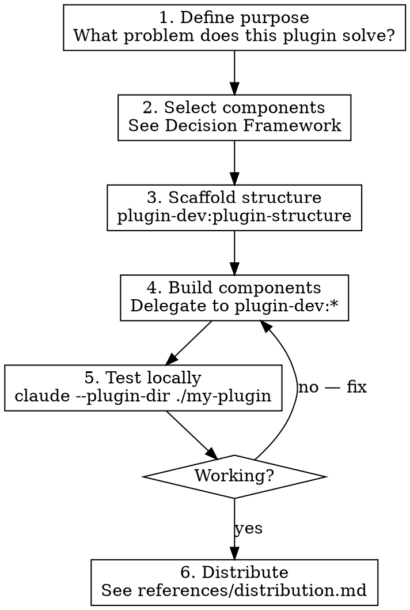

# Building Plugins

## Overview

A plugin is a directory of components (skills, hooks, agents, MCP servers, LSP servers) that extends Claude Code. This skill guides the **process** of building one — component selection, architecture, development workflow, and distribution. For component **implementation**, it delegates to `plugin-dev:*` skills.

**Announce at start:** "I'm using the building-plugins skill to [create/plan/convert] [plugin name/description]."

## Process



## Component Selection (Quick Reference)

| User Need | Component | Skill |
|-----------|-----------|-------|
| Interactive workflow invoked by name | Skill | `plugin-dev:skill-development` |
| Automatic enforcement/validation on events | Hook | `plugin-dev:hook-development` |
| Specialized autonomous task delegation | Agent | `plugin-dev:agent-development` |
| External service/API integration | MCP Server | `plugin-dev:mcp-integration` |
| Code intelligence (go-to-def, diagnostics) | LSP Server | Official docs |
| Default config shipped with plugin | settings.json | `plugin-dev:plugin-settings` |

**Ambiguous cases?** See `references/decision-framework.md` for the full decision tree.

## Scaffold Checklist

```
my-plugin/
├── .claude-plugin/
│   └── plugin.json          # name (required), metadata (optional)
├── skills/                  # Interactive workflows
│   └── my-skill/
│       └── SKILL.md
├── agents/                  # Autonomous specialists
│   └── my-agent.md
├── hooks/                   # Event-driven automation
│   └── hooks.json
├── scripts/                 # Hook/utility scripts (chmod +x!)
├── .mcp.json                # MCP server configs
├── .lsp.json                # LSP server configs
└── settings.json            # Default settings (agent key only)
```

**Critical rules:**
- Components at plugin root, NOT inside `.claude-plugin/`
- All script/hook paths use `${CLAUDE_PLUGIN_ROOT}`
- Manifest is optional — auto-discovery finds default locations
- `commands/` is legacy — use `skills/` for new work

## Build Loop

For each component identified in step 2:

1. **Invoke the matching `plugin-dev:*` skill** — it owns the implementation details
2. **Test incrementally** — `claude --plugin-dir ./my-plugin` after each component
3. **Validate** — invoke `plugin-dev:plugin-validator` agent or `claude plugin validate .`

## Development Workflow

**Local iteration (fastest):**
```
edit source → claude --plugin-dir ./my-plugin → test → repeat
```

**Marketplace iteration:**
```
edit → commit → push → unset CLAUDECODE && claude plugin marketplace update <name> → /reload-plugins
```

See `references/dev-workflow.md` for directory source setup, cache behavior, and debugging.

## Distribution

Choose a strategy based on audience:

| Audience | Strategy |
|----------|----------|
| Just me | `--plugin-dir` or directory source in `settings.local.json` |
| My team | `extraKnownMarketplaces` in `.claude/settings.json` (project scope) |
| Public | Marketplace (hub or standalone), official submission |

See `references/distribution.md` for marketplace setup and versioning.

## Common Mistakes

- Putting components inside `.claude-plugin/` instead of plugin root
- Using absolute paths instead of `${CLAUDE_PLUGIN_ROOT}`
- Forgetting `chmod +x` on hook scripts
- Setting `version` in both `plugin.json` and `marketplace.json` (manifest wins silently)
- Forgetting to push before `marketplace update` (fetches remote, not local)

## Battle-Tested Patterns

See `references/battle-tested.md` for patterns from 17 production plugins:
- Hub marketplace architecture
- Cache gotchas and cleanup
- Thin wrapper pattern for command namespacing
- Plugin identity and narrative routing
