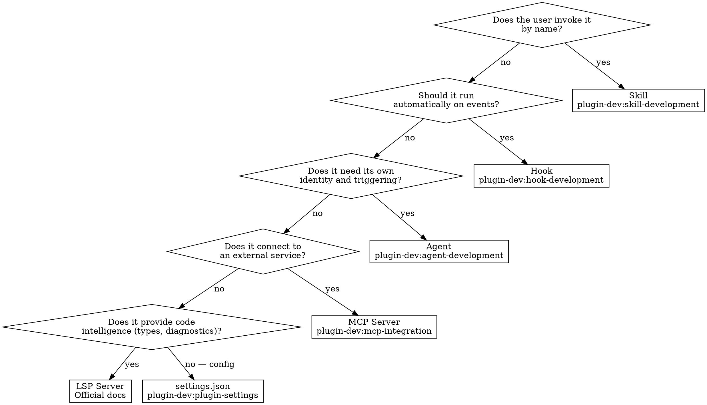

# Component Decision Framework

When planning a plugin, the hardest question is **which component type** to use. This framework resolves the ambiguous cases.

## The Core Decision



## Ambiguous Cases

### Skill vs. Hook

| Signal | Choose |
|--------|--------|
| User should be able to trigger/skip it | **Skill** |
| Must run every time, no exceptions | **Hook** |
| Needs Claude's judgment to decide what to do | **Skill** |
| Deterministic yes/no validation | **Hook** |
| Interactive — asks questions, shows choices | **Skill** |
| Invisible — user never thinks about it | **Hook** |

**Example:** "Format code after every edit" → Hook (PostToolUse). "Review my code for security issues" → Skill (user invokes when ready).

**Hybrid pattern:** A skill that *installs* a hook. The skill is the setup workflow, the hook is the runtime enforcement. See `plugin-dev:plugin-settings` for the `.local.md` activation pattern.

### Agent vs. Skill with `context: fork`

| Signal | Choose |
|--------|--------|
| Reusable across contexts, own identity | **Agent** |
| Subtask of a larger skill workflow | **Forked skill** |
| Needs custom tool restrictions | **Agent** (has `tools`/`disallowedTools`) |
| Needs persistent memory across sessions | **Agent** (has `memory` field) |
| Should show in `/agents` menu | **Agent** |
| One-shot isolated execution | **Forked skill** |

**Example:** "Code reviewer that runs after every PR" → Agent (reusable, own identity). "Run linting as part of the deploy skill" → Forked skill (subtask).

### MCP Server vs. Hook

| Signal | Choose |
|--------|--------|
| Claude decides when to use it | **MCP** (provides tools) |
| Must run on specific events | **Hook** (event-driven) |
| Bidirectional communication | **MCP** (persistent connection) |
| Fire-and-forget validation | **Hook** (exit code response) |
| External API with multiple operations | **MCP** (tool surface) |
| Single check on file write | **Hook** (PostToolUse matcher) |

### Commands vs. Skills

**Always use skills for new work.** Commands (`commands/`) are the legacy format.

Use a command only as a **thin wrapper** when you need `allowed-tools` or `argument-hint` frontmatter and want to delegate to a skill:

```markdown
---
description: Do the thing
allowed-tools: Read, Write, Edit, Bash
argument-hint: [target]
---

Run the my-skill skill. Read skills/my-skill/SKILL.md and follow it exactly.
```

This forces the colon-qualified `/plugin:command` namespacing while keeping logic in the skill.

## Multi-Component Plugins

Most plugins need 2-3 component types. Common combinations:

| Plugin Type | Components |
|-------------|------------|
| Workflow automation | Skills + Hooks |
| External integration | MCP Server + Skills (for configuration) |
| Code quality | Hooks (enforcement) + Agents (review) |
| Development tools | Skills + Agents + Hooks |
| Language support | LSP Server + Skills (for setup/config) |

**Sequencing:** Build skills first (most visible to users), then hooks (automatic enforcement), then agents/MCP (specialized delegation).
