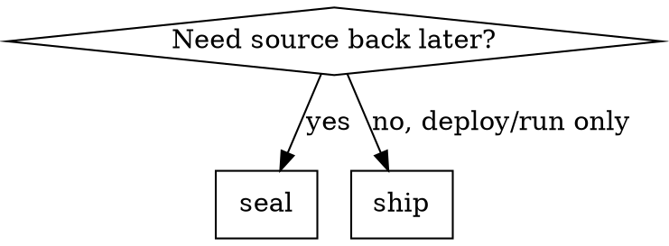

# Code Presser

Compress and protect backend and frontend source using two modes: **seal** (reversible with passphrase) and **ship** (irreversible source, runnable artifacts).

**Not for Agent consumption.** Do not use sealed blobs as context for coding tasks.

**Script path** (from isaac repo root):

```bash
CPX="superpowers/skills/code-presser/scripts/cpx_press.py"
```

## Threat Model

| Attacker | seal | ship |
|----------|------|------|
| No passphrase | Cannot decrypt or recover source | Cannot recover original source |
| Casual inspection | Cannot recognize format from extension or ASCII headers | Sees only binaries/bundles |
| Agent heuristics (strip header, rename file) | Fails: GCM auth tag validates full layout | N/A — no source blob |
| Skilled reverse engineer | Can break with passphrase or side channels | Can analyze binary/JS with effort |

**Passphrase rules (mandatory):**

- Prompt via terminal (`read -s` / Python `getpass`) — never argv, env, files, git, logs, or chat
- Never echo passphrase in agent responses or commit messages
- Do not suggest storing passphrase in 1Password hooks, CI secrets, or `.env` for seal operations unless user explicitly overrides for automation

## Mode Selection



| Mode | Goal | Output | Reversible |
|------|------|--------|------------|
| **seal** | Store/transmit source confidentially | Opaque binary blob(s), no `.go`/`.ts` extension | Yes, with passphrase |
| **ship** | Publish runnable artifacts | Go binary, frontend `dist/` bundle | Source: no |

## seal Mode

### Pipeline

**Single blob (`--split 1`, default):**

```text
source tree → tar → gzip (max) → AES-256-GCM → CPX1 container → one file
```

**Sharded (`--split N`, N > 1):**

```text
source tree → tar → gzip → AES-256-GCM → CPX1 container → binary split → N shard files
```

1. **Normalize input**: single directory or explicit path list; exclude `.git`, `node_modules`, `vendor`, `mock`, `coverage.out`, `dist`, `*.age`, `*.cpx`.
2. **Compress**: `tar` + `gzip -9` (compress-then-encrypt).
3. **Encrypt**: AES-256-GCM; key = Argon2id(passphrase, salt, time=3, memory=64MB).
4. **Container**: CPX1 format — see [container-format.md](container-format.md). No ASCII magic (`age-`, `PK`, `Salted__`).
5. **Output naming**: `superpowers/resources/<code>/` or user dir; filename = 32 hex chars, **no extension**.

### Commands

Install once:

```bash
python3 -m pip install --user cryptography
```

Seal single blob (prompts passphrase interactively; run from repo root):

```bash
python3 superpowers/skills/code-presser/scripts/cpx_press.py seal \
  --input ./path/to/service \
  --output ./sealed/a7f3c91e2b4d6085f1a93e7c2d5b8a04
```

Seal into N binary shards (output must be a **directory**):

```bash
python3 superpowers/skills/code-presser/scripts/cpx_press.py seal \
  --input ./path/to/service \
  --output ./superpowers/resources/mycode \
  --split 5
```

Unseal / unpack (single blob **or** shard directory):

```bash
python3 superpowers/skills/code-presser/scripts/cpx_press.py unseal \
  --input ./superpowers/resources/mycode \
  --output ./restored/service

python3 superpowers/skills/code-presser/scripts/cpx_press.py unpack \
  --input ./superpowers/resources/mycode \
  --output ./restored/service
```

**Agent must run these in terminal** so passphrase stays local. Do not inline passphrase in generated commands.

### Anti-recognition Properties

- Entire file is high-entropy bytes; no plaintext algorithm labels
- Fixed 48-byte CPX1 prefix is salt+nonce+length — stripping corrupts GCM decryption
- `--split N` splits the encrypted container; each shard has `shard_index` + `shard_total` (see container-format.md)
- Do **not** use raw `age` / `openssl enc` output as final artifact (recognizable headers)

## ship Mode

Source must not be recoverable; artifacts must run in target environment.

### Go backend

Requires [garble](https://github.com/burrowers/garble):

```bash
go install mvdan.cc/garble@latest
```

```bash
cd /path/to/service
garble -literals -tiny build -ldflags="-s -w" -o ./ship/bin/service ./cmd/...
```

- `-literals`: obfuscate string literals
- `-tiny`: strip additional metadata (smaller, harder to analyze)
- Ship **binary only**; do not publish `internal/`, `cmd/` source alongside

Verify: `./ship/bin/service --help` or smoke test.

### Frontend (JS/TS)

Production build + obfuscation:

```bash
cd /path/to/frontend
npm ci && npm run build
npx --yes javascript-obfuscator ./dist/assets/*.js \
  --output ./ship/dist \
  --compact true \
  --control-flow-flattening true \
  --string-array true \
  --string-array-encoding base64 \
  --disable-console-output true
```

Ship `./ship/dist` (and static assets). Do not ship `src/`.

**Stronger (optional):** compile critical logic to WASM; obfuscate WASM with [WASMixer](https://arxiv.org/abs/2308.03123) patterns — higher cost, not default.

### ship Checklist

- [ ] No `.go`, `.ts`, `.tsx`, `.vue` source in ship artifact directory
- [ ] Debug symbols stripped (`-s -w` / production build)
- [ ] Source maps excluded from `dist/` (`hidden-source-map` off in prod)
- [ ] Smoke test runnable artifact

## Forbidden

- Custom ciphers, XOR-only, Base64-only, or "remove extension" as security
- Passphrase in environment variables, files, git, skill output, or CI for seal/unseal
- Claiming ship binaries are "impossible" to reverse — document as **high cost**, not impossible
- Using seal blobs for agent codebase context
- `replace` hacks or committing sealed secrets to public repos without user approval

## When NOT to Use

- Open-source publication
- Everyday dev builds (use normal `go build` / `npm run dev`)
- Reducing LLM token usage (use summaries, not this skill)

## Troubleshooting

| Symptom | Cause | Fix |
|---------|-------|-----|
| `decryption failed` | Wrong passphrase or truncated file | Re-enter passphrase; re-seal |
| `invalid container` | Not CPX1 or corrupted | Confirm file from `cpx_press.py seal` |
| `Missing shard indices` | Incomplete shard set | Place all N shards in one directory |
| `Duplicate shard index` | Two files share same index | Re-seal or remove duplicate |
| garble build fails | Unsupported Go version / generics edge case | Pin garble version; simplify `-literals` scope |
| obfuscated JS breaks | Over-aggressive obfuscator options | Reduce `control-flow-flattening`; test in browser |

## Reference

- [container-format.md](container-format.md) — CPX1 byte layout and sharding
- Script: `scripts/cpx_press.py`
- Sealed artifacts (example): `superpowers/resources/{web,sd,eg,bs}/`
