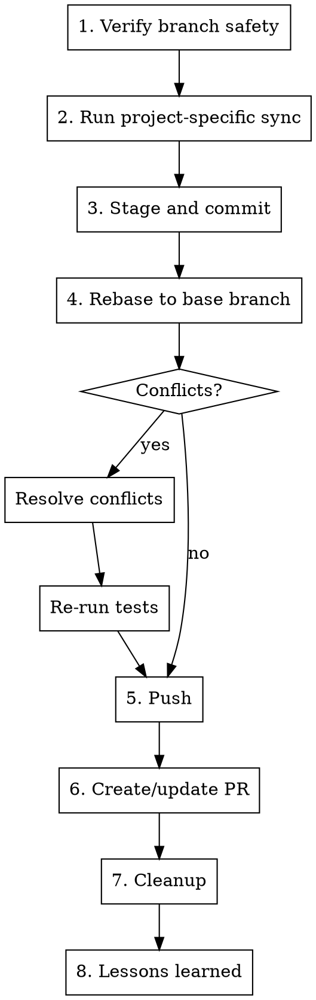

# Committing

## Overview

Finalize work on a feature branch: rebase, commit, push, create PR, clean up, and capture lessons learned.

**Core principle:** Clean history, verified state, captured learnings.

**Announce at start:** "I'm using the committing skill to finalize this work."

## When to Use

- All tests pass (verified by `testing-gates`)
- Work is complete on a feature branch
- Ready to submit for review or merge

**Do not use when:**
- Tests are failing (fix first)
- On a protected branch (main, dev, staging)
- Work is incomplete

## Prerequisites

- On a feature branch (e.g., `fix/*`, `feat/*`, `chore/*`, `agent/*`)
- Tests have been run this session (warn if no evidence)
- Read project-specific commit guidance (`.claude/shared/commit-project.md` if it exists)

## The Process



### Step 1: Verify Branch Safety

```bash
git branch --show-current
```

Confirm current branch is a feature branch, NOT a protected branch. If on a protected branch: STOP.

### Step 2: Run Project-Specific Sync

Check project config for any pre-commit sync steps (e.g., code generation, library promotion). These are defined in `.claude/shared/commit-project.md` or `project-flows.json`.

Skip if no sync steps are configured.

### Step 3: Stage and Commit

Stage and commit BEFORE rebasing (rebase requires a clean working tree):

1. Stage relevant files: `git add <specific files>`
   - Review what's being staged — don't include unrelated changes
   - Don't include secrets (`.env`, credentials, keys)
2. Show staged diff summary for confirmation
3. Generate commit message following project convention
   - Default format: `<type>: #<issue#> one line description`
   - Types: `feat`, `fix`, `chore`
4. Commit

### Step 4: Rebase to Base Branch

```bash
git fetch origin <base-branch>
git rebase origin/<base-branch>
```

- `<base-branch>` comes from `project-flows.json` or project convention (e.g., `dev`, `main`)
- If conflicts: resolve and continue rebase
- If conflicts are complex: present to user/handler for guidance
- After resolving: re-run tests to verify nothing broke

### Step 5: Push

```bash
git push origin <branch-name>
```

- If rebase changed history: `git push origin <branch-name> --force-with-lease`
- Handle push rejections:
  - Large files (>100MB): identify and remove from history, add to `.gitignore`
  - Protected branch rejection: you're pushing to the wrong branch
  - Pre-receive hook failure: read the error message

### Step 6: Create or Update PR

Check for existing PR:
```bash
gh pr list --head <branch-name> --json number,url
```

- If PR exists: update with a comment noting latest changes
- If no PR: create one targeting the base branch

PR body should include:
- `Closes #<issue#>` (if applicable)
- Summary of changes
- Test evidence (which gates passed)
- Files changed overview

### Step 7: Cleanup

Remove any temporary artifacts that shouldn't persist:
- Triage scratch tests (if a scratch directory convention exists)
- Temporary debug files

Commit cleanup separately: `chore: #<issue#> clean up triage artifacts`

### Step 8: Lessons Learned

After the PR is created, review the session and generate recommendations:

**What to review:**
- Methodology gaps — were steps missing, unclear, or wrong in any skills or project-specific docs?
- Skill improvements — did any skill need better guidance?
- Project config updates — were new conventions discovered?
- New issues — were bigger ideas or unrelated bugs found that warrant their own issue?

**Process:**
1. Present a numbered list of concrete recommendations
2. Ask user/handler which to implement (by number, "all", or "none")
3. Implement selected changes
4. Commit: `chore: #<issue#> lessons learned from <brief-description>`
5. Push (lands in the existing PR)

**Guidelines:**
- Keep recommendations concrete and actionable
- Quality over quantity — zero recommendations is fine if the cycle was smooth
- If a recommendation is too big to implement inline, suggest a GitHub issue instead

## Modes

### Interactive Mode
- Present commit message and PR body for confirmation before executing
- Ask which lessons learned to implement
- Present PR URL when complete

### Loop Mode (Async)
- Auto-generate commit message and PR body
- Post `[PR_CREATED]` marker on GitHub issue with PR URL
- Post lessons learned as a separate GitHub comment for handler review

## Anti-Patterns

| Pattern | Problem |
|---------|---------|
| Committing without tests having passed | Ships broken code |
| `git add -A` or `git add .` | Catches unrelated files, secrets |
| Rebasing before committing | Dirty working tree blocks rebase |
| Force-pushing without `--force-with-lease` | Can overwrite others' work |
| Skipping lessons learned | Misses improvement opportunities |
| Amending commits after push | Rewrites shared history |

## Red Flags — STOP

- On a protected branch
- Tests haven't been run this session
- Staging files that look like secrets or credentials
- Merge conflicts that affect test behavior (re-run tests after resolving)

## Integration

**Preceded by:**
- **superpowers:testing-gates** — gates must pass before committing
- **superpowers:user-acceptance-testing** — if applicable, UAT must be accepted

**Pairs with:**
- **superpowers:verification-before-completion** — verify state before claiming done
