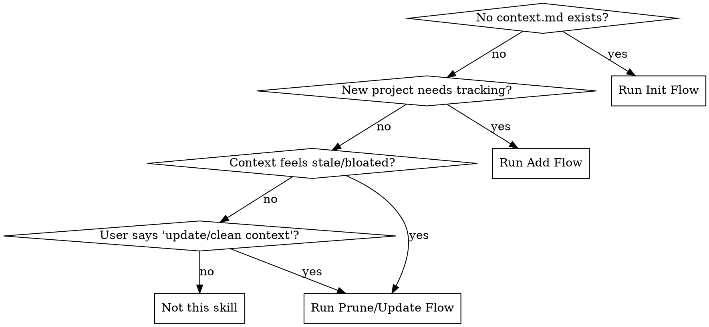

# Context Management

Persistent context that survives across sessions. Your AI agent remembers who you are, what you work on, and lessons you've learned.

**Core principle:** One global file (identity + preferences) auto-loaded every session. Per-project files loaded only when relevant. Optional domain isolation for users with multiple roles.

## When to Use



## Quick Start (5 minutes)

For users who want to get started fast. The agent does the work — you just confirm.

1. **Auto-detect:** Agent reads `git config user.name/email`, scans `~/` for repos, checks cloud CLI configs
2. **Generate draft:** Agent creates `context.md` from what it found
3. **User confirms:** Review the draft, add/remove/correct anything
4. **Done.** Next session, agent loads it automatically

Tell your agent: *"Set up context management for me"* — it handles the rest.

## Directory Layout

```
<agent-home>/          # ~/.copilot/ or ~/.claude/
├── context.md         # Global (~3-8KB), auto-loaded
├── contexts/          # Per-project, on demand (optional)
│   └── archived/      # Done projects
```

## Quick Reference

| Action | Trigger | What to do |
|--------|---------|-----------|
| **Init** | No context.md found | Auto-detect + generate draft for user to confirm |
| **Add** | New project needs tracking | Create `contexts/<name>.md`, add to index |
| **Load** | Session start / topic mentioned | Global always; project on keyword match |
| **Update** | User says "update context" | Edit relevant file, bump date |
| **Archive** | Project done | Move to `archived/`, extract lessons |

## Init Flow

**Trigger:** No `context.md` in agent home, or user asks to set up context.

**Step 1 — Auto-detect** (agent does this silently):
- `git config user.name` / `git config user.email`
- Scan for git repos in common paths (`~/`, `~/Projects/`, `~/IdeaProjects/`)
- Check `~/.aws/config`, cloud CLI profiles
- Check `gh api user` for GitHub identity

**Step 2 — Present draft to user:**
Show what was found, ask user to confirm/correct. One consolidated review, not 6 separate questions.

> "Here's what I found — please correct anything that's wrong:
> - Name: [detected], Email: [detected], Team: [?]
> - Repos: [list found repos with branches]
> - Cloud: [AWS profiles found]
> Anything to add or fix?"

**Step 3 — Generate files:**
1. Create `context.md` from the Global Template (see `templates.md`)
2. Create `contexts/` and `contexts/archived/` directories
3. Add auto-load directive to `copilot-instructions.md` or `CLAUDE.md`:
   ```
   At session start, read `context.md` to restore persistent context.
   Do NOT ask before reading — just load silently.
   ```

## Add Flow (New Project)

**Trigger:** User starts a new project, or mentions something with no matching context file.

Ask: "Want me to create a context file for [topic]? I'll need: what it is, which repos, and current status."

Then:
1. Generate `contexts/<name>.md` using the Project Template (see `templates.md`)
2. Add row to `context.md` **keyword index table** with trigger keywords + summary
3. Confirm: "Created `contexts/<name>.md` and updated project index."

### Keyword Index Table

`context.md` must contain a keyword index table that maps context files to trigger keywords:

```markdown
| Context File | Keywords | Summary |
|-------------|----------|---------|
| `contexts/my-project.md` | project-name, related-term, abbreviation | What's in this file |
```

**Rules for keywords:**
- Include the project name, common abbreviations, and domain terms
- Include tool/service names that are unique to the project
- Keep keywords lowercase, comma-separated
- 5-10 keywords per project is ideal

When adding a new project, **always** add a row to this table. Without keywords, the context file won't be auto-loaded.

## Load Flow (Every Session)

**Global context:** Always load at session start, never ask.

**Agent name:** If `context.md` has an `Agent name` field in Preferences, the agent should use that name when referring to itself in greetings and responses.

**Domain context (if using domain isolation):**
1. At session start, **present domain choices** to the user (using interactive selection if available):
   - List all configured domains (e.g., 💼 Work, 🚀 Innovation, 🧑 Personal)
   - Include an "Auto-detect" option for users who prefer automatic routing
2. Load the selected sub-context file (e.g., `context-work.md`)
3. **Lock the domain** — do not load other sub-contexts for the rest of the session
4. If user chose "Auto-detect", match the first message against the domain routing table in `context.md`

**Project context:** Load silently using this priority chain:

1. **Keyword match** — scan the keyword index table (in `context.md` or the active sub-context file). If any keyword appears in the user's message, load the corresponding context file immediately. No confirmation needed.
2. **Summary scan** — if no keyword hits, check if the user's topic relates to any summary in the index table.
3. **Grep fallback** — if still unsure, `grep -rl "user's term" contexts/` to find matching files.
4. **User explicit** — "load all context" → read everything in `contexts/` (within the active domain only, if using domain isolation).

**Important:** Keyword matching happens on **every user message**, not just the first one. If a user mentions a keyword mid-conversation, load the context file at that point. But never cross domain boundaries.

---

## Maintenance Flows

*Optional flows for keeping context clean over time. Context works fine without them.*

### Update Flow

**Trigger:** PR merged, key decision made, or user says "update context".

| Change type | Target file |
|------------|-------------|
| PR merged / feature done | `contexts/<project>.md` |
| New lesson (cross-project) | `context.md` Historical Lessons |
| New team member / contact | `context.md` Team section |
| New repo | `context.md` Repos table (one row, main branch only) |

**Deduplication:** Same info in 2+ files? Keep it in the most specific file only.

### Prune Flow

**Trigger:** Files getting bloated, or user says "clean up context".

| Target | Action |
|--------|--------|
| Repos table with 3+ branches per row | Keep main + one active branch, move details to project context |
| `[x] Done` items older than 2 weeks | Remove them |
| Code blocks in global context | Replace with file path references |
| Tool/MCP config in context.md | Move to `copilot-instructions.md` |

### Archive Flow

**Trigger:** Project is done.

1. `mv contexts/<project>.md contexts/archived/`
2. Remove row from index table
3. Ask: "Any lessons worth keeping?" → append to Historical Lessons
4. Confirm: "Archived. [N] lessons extracted."

### Health Checks (opt-in)

To enable passive health checks every session, add to `copilot-instructions.md`:

```
## Context Health (passive)
After loading context.md, silently check:
- Any file >20KB → suggest trim
- "Last updated" >2 weeks → ask if still active
- Files in contexts/ not in index → ask to add
Mention at end of first response if issues found.
```

---

## Advanced: Domain Isolation

For users who operate in **distinct life/work domains** (e.g., work, side projects, personal life), a single `context.md` can become a privacy and focus problem — work context bleeds into personal sessions and vice versa.

**Solution: Sub-context files per domain, loaded on demand.**

```
<agent-home>/
├── context.md              # Global router (identity + preferences + domain rules)
├── context-work.md         # 💼 Work domain
├── context-innovation.md   # 🚀 Side projects / innovation
├── context-personal.md     # 🧑 Personal life
├── contexts/
│   ├── work/               # Work project files
│   ├── innovation/         # Innovation project files
│   └── archived/           # Done projects
```

### How It Works

1. **`context.md` is a router, not a dump.** It contains only identity, preferences, and a domain routing table — no domain-specific content.

2. **Domain routing table** maps signals to sub-context files:

   | Signal | Domain | Load |
   |--------|--------|------|
   | CWD in work repos, mentions team/on-call | 💼 Work | `context-work.md` |
   | Mentions AI tools, bots, skills | 🚀 Innovation | `context-innovation.md` |
   | Mentions travel, stocks, personal | 🧑 Personal | `context-personal.md` |
   | Unclear | — | Present domain choices to user |

3. **Domain Lock:** Once a domain is loaded, it is **locked for the entire session**. No cross-domain loading mid-conversation. User must start a new session to switch domains.

4. **Domain selection:** At session start, either auto-detect from context or present choices to the user (using interactive selection if available). Include an "Auto-detect" option for users who prefer automatic routing.

5. **Keyword index lives inside each sub-context**, pointing to project files within that domain's directory (e.g., `contexts/work/my-project.md`).

### Why Domain Isolation

| Without isolation | With isolation |
|-------------------|----------------|
| Work secrets visible in personal sessions | Each domain is a sealed context |
| Irrelevant context wastes tokens | Only load what's relevant |
| One giant file, hard to maintain | Small focused files per domain |
| Can't share context.md with teammates | Can share work context without exposing personal |

### When to Use Domain Isolation

- You have **2+ distinct roles** (e.g., day job + side project + personal)
- You want **privacy** between domains (personal data never leaks into work sessions)
- You want **focused context** (work sessions don't waste tokens on personal preferences)

If you only have one domain (e.g., just work), skip this — standard single-file context is fine.

---

## Integration

**Works with any superpowers skill** — context files are loaded before other skills run, providing the identity and project knowledge that skills like `brainstorming`, `writing-plans`, and `systematic-debugging` benefit from.

**Agent-agnostic:** Works across Claude Code (`~/.claude/`), Copilot CLI (`~/.copilot/`), Cursor, and any tool that supports instruction files.

---

## Common Mistakes

| Mistake | Fix |
|---------|-----|
| One giant file with everything | Split: global identity vs project details |
| Pasting code blocks into context | Reference file paths instead |
| Never cleaning up done projects | Archive or prune when done — saves tokens |
| Loading all projects every session | On-demand only — load what's relevant |
| Mixing personal and work data in one file | Use domain isolation — separate sub-context per role |
| Loading multiple domains in one session | Lock one domain per session — switch domains = new session |
