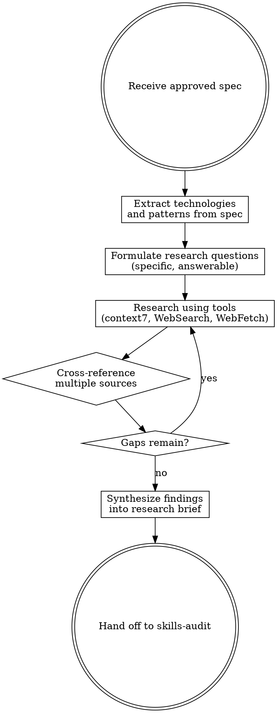

# Deep Research

## Overview

Before building anything, research the current state of the art. This skill activates automatically after brainstorming produces an approved spec. It ensures agents work with verified, current knowledge rather than potentially outdated training data.

**This step runs 100% of the time.** No exceptions, no shortcuts, no "I already know this."

## When to Use

- Immediately after brainstorming produces an approved spec
- Before any implementation planning begins
- The spec references any technology, library, pattern, or protocol

## When NOT to Use

- Never skip this step. It always runs after brainstorming.
- The only exception: if the user explicitly says "skip research."

## Process



### 1. Extract Technologies and Patterns

From the approved spec, list every technology, library, framework, pattern, and protocol the implementation requires.

### 2. Formulate Research Questions

Turn each technology/pattern into specific, answerable questions:

```
# BAD: vague
"How do WebSockets work?"

# GOOD: specific and actionable
"What is the recommended WebSocket library for Rust/axum in 2025?"
"What reconnection strategy do production WebSocket servers use?"
"How do you handle auth on WebSocket upgrade requests?"
```

### 3. Research Using Available Tools

Priority order:
1. **context7** (`resolve-library-id` → `query-docs`) — latest official docs
2. **WebSearch** — landscape, comparisons, community consensus
3. **WebFetch** — specific articles, documentation pages

**Dispatch parallel research agents** for independent topics.

### 4. Cross-Reference and Validate

- Confirm patterns across 2-3 sources minimum
- Prefer official documentation over blog posts
- Prefer recent content (last 12 months)
- Note version-specific details

### 5. Produce Research Brief

```markdown
## Research Brief: [Topic]

### Context
What we're building and why research was needed.

### Key Findings
- **Pattern 1**: Description, trade-offs, when to use
- **Pattern 2**: Description, trade-offs, when to use

### Recommended Approach
Which pattern fits our use case and why.

### Implementation Notes
- Libraries and versions
- Configuration gotchas
- Common pitfalls

### Architecture Defaults Resolved
(Include this section only if brainstorming matched an architecture profile — see step 6 below.)

| Tool | Latest | Status | Notes |
|---|---|---|---|
| astro | 6.1.9 | ✅ | Recommended for content sites |
| next.js | 16.2.4 | ✅ | App Router standard |

### Sources
- [Source 1]: What it confirmed
- [Source 2]: What it confirmed
```

### 6. Resolve Architecture Defaults (conditional sub-step)

**Runs only when brainstorming matched an architecture profile** (stored as a session identifier in the spec's Architecture section or as a `profile_id` field).

For each tool listed in the profile's `stack`:

1. Query current latest stable version (npm registry / upstream docs).
2. Check deprecation / replacement status.
3. One-line sanity check on "still recommended for <use case>".
4. Classify:
   - **✅ Current & recommended** — latest version noted, no user action required.
   - **🚫 Deprecated / replaced** — EOL or strongly superseded; name the replacement.

**Dispatch in parallel** — each tool is independent. Use general-purpose subagents for batches.

**Minor-version drift** (e.g., 1.58 → 1.59) is NOT a classification — it's just the current latest. Only deprecations block.

**Populate the "Architecture Defaults Resolved" table** in the research brief (above) with one row per tool in the profile's `stack`.

**Blocking behavior:** if any 🚫 shows up, pause research and prompt:

> "Your default stack has a deprecated tool:
> - 🚫 `<tool>`: <reason> — suggested replacement: `<replacement>`
>
> Options:
> 1. Update `~/.claude/ultrapowers-architecture-defaults.json` to replace it (I'll show the diff first).
> 2. Use the replacement for this project only (creates `<repo>/.claude/ultrapowers-architecture-defaults.json` as an override).
> 3. Stick with current defaults and proceed anyway."

On option 1, read the user-level file, swap the deprecated tool for the replacement in the matching profile's `stack`, show a diff, and write only after user confirms `apply`.

On option 2, generate the repo-level override file with just the affected profile + replacement.

On option 3, note the deprecation in the research brief and proceed.

**Failure mode:** if a per-tool resolution query fails (timeout, no source available), mark that row as `"unable to verify"` in the table and proceed. Don't block the research step on sub-step failures.

## Red Flags

| Signal | Action |
|--------|--------|
| Only one source for a critical decision | Search more |
| All sources are 2+ years old | Search for recent updates |
| Conflicting advice | Dig deeper, understand why |
| "I already know this" | Check anyway — assumptions rot |
| Research exceeding 30 minutes | Scope down to decision points |

## Output

The research brief feeds directly into **skills-audit**. Invoke the skills-audit skill next.

## Why This Step Cannot Be Audited

Deep research captures new knowledge. You cannot audit new knowledge against old knowledge — that defeats the purpose. This is the only step in the ultrapowers pipeline that skips auditing.
