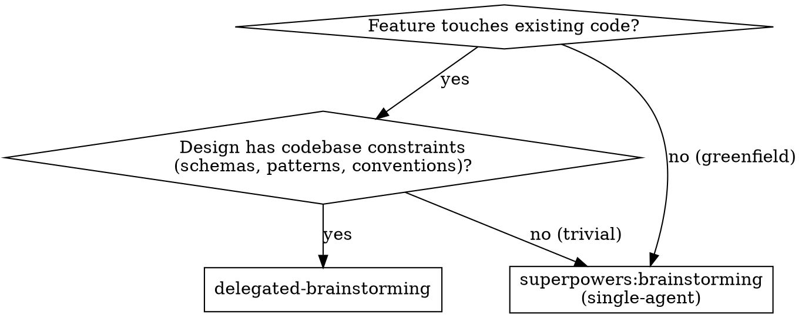
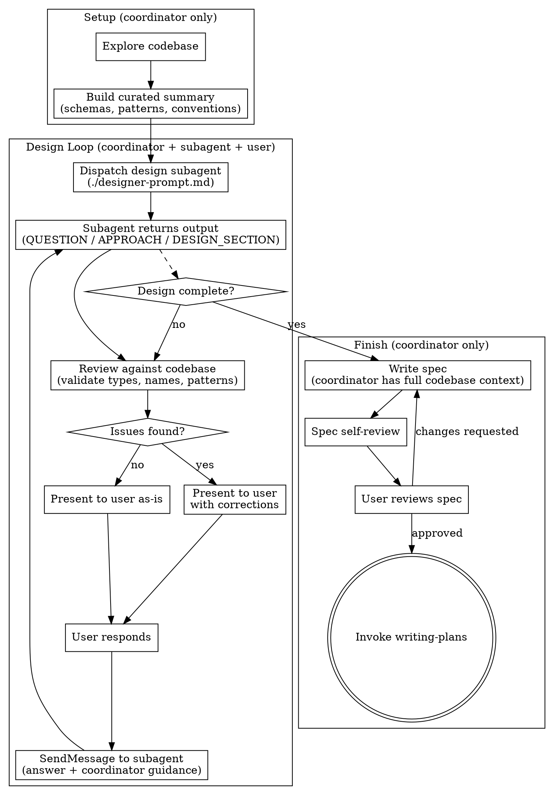

# Delegated Brainstorming

Split brainstorming into two roles: a **design subagent** explores requirements and proposes solutions, while you (the **coordinator**) review every output against the real codebase.

**Why:** Single-agent brainstorming forces one context to hold both design exploration AND codebase details. Splitting roles lets the designer focus on design thinking while the coordinator catches technical inaccuracies — producing better designs with fewer errors.

**Core principle:** Design subagent proposes, coordinator validates against code, user decides.

<HARD-GATE>
Do NOT invoke any implementation skill, write any code, scaffold any project, or take any implementation action until you have presented the complete design and the user has approved it. The coordinator writes the final spec — never the subagent.
</HARD-GATE>

## When to Use

**Use this when:** Design decisions need validation against actual DB schemas, service patterns, naming conventions, or architectural constraints.

**Use superpowers:brainstorming instead when:** Greenfield projects, trivial changes, or when codebase context isn't critical.

## Checklist

You MUST create a task for each of these items and complete them in order:

1. **Explore codebase** — read relevant schemas, services, patterns; build curated summary
2. **Dispatch design subagent** — with codebase summary + user request (see `./designer-prompt.md`)
3. **Review loop** — for each subagent output: validate against code → present to user with review notes → relay answer back to subagent
4. **Write spec yourself** — coordinator writes the final spec (you have codebase context)
5. **Spec self-review** — check for placeholders, contradictions, ambiguity
6. **User reviews spec** — wait for approval before proceeding
7. **Transition to implementation** — invoke writing-plans skill

## Process

**The terminal state is invoking writing-plans.** Do NOT invoke any implementation skill directly.

## Step 1: Explore Codebase

Before dispatching the subagent, YOU read the codebase and build a curated summary:

- **DB schemas** — table names, column types, relationships, JSONB shapes
- **Service patterns** — how similar features are implemented (CRUD conventions, error handling)
- **API conventions** — route structure, middleware chain, auth/RLS patterns
- **Shared types** — enums, Zod schemas, naming conventions
- **Recent changes** — relevant commits, in-progress work

**This is the coordinator's unique value.** The subagent gets a curated summary, not raw file dumps. Include enough detail for accurate design decisions, but don't overwhelm.

## Step 2: Dispatch Design Subagent

Use the Agent tool with the template in `./designer-prompt.md`. The prompt includes:

1. Your **codebase summary** (from Step 1)
2. The **user's request** (what they want to build)
3. **Role instructions** with labeled output format

Use `SendMessage` to continue the same subagent across the design loop — don't dispatch a new one each round.

**Model selection:** Design work requires judgment — use the most capable available model for the design subagent.

## Step 3: Review Loop

For each subagent output:

1. **Read the output** — question, approach proposal, or design section
2. **Validate against codebase:**
   - Are field types correct? (e.g., uuid not text for FK fields)
   - Do proposed names match existing conventions?
   - Would the approach conflict with existing patterns?
   - Are there constraints the subagent doesn't know about?
3. **Present to user:**
   - If accurate: relay as-is
   - If issues found: add your corrections (e.g., "Note: `createdBy` should be uuid, not text — matching existing tables")
4. **Relay back:** SendMessage to subagent with user's answer + your technical guidance

## Step 4: Write Spec

When design is complete, **you** write the spec (not the subagent), because:
- You have full codebase context for accurate file paths and code references
- You can cross-check every detail against actual code
- The spec needs to be implementation-ready, not conceptual

Save to `docs/superpowers/specs/YYYY-MM-DD-<topic>-design.md` (user preferences override).

**Spec Self-Review:**
1. **Placeholder scan:** Any "TBD", "TODO", vague requirements? Fix them.
2. **Internal consistency:** Do sections contradict each other?
3. **Scope check:** Focused enough for a single implementation plan?
4. **Ambiguity check:** Could any requirement be read two ways?

**User Review Gate:**
> "Spec written and committed to `<path>`. Please review it and let me know if you want to make any changes before we start writing out the implementation plan."

Wait for approval before proceeding.

## Key Principles

- **Coordinator never delegates understanding** — you must understand every design decision, not just relay
- **Subagent never guesses about codebase** — if it needs info not in the summary, it asks
- **Review is mandatory** — every subagent output gets checked against real code before reaching the user
- **Spec is written by coordinator** — the agent with codebase context writes the final document
- **One question at a time** — subagent asks one question per round (same as brainstorming)
- **Multiple choice preferred** — easier for user to answer
- **YAGNI ruthlessly** — remove unnecessary features from all designs

## Red Flags

**Never:**
- Let the subagent write the final spec (it lacks codebase context)
- Relay subagent output without reviewing against actual code
- Become a passive relay — if you're just forwarding messages without adding value, you're not coordinating
- Give subagent raw file dumps instead of curated summaries
- Skip codebase exploration in Step 1
- Start implementation before spec is approved
- Dispatch a new subagent each round (use SendMessage to continue)

**If subagent proposes something that conflicts with codebase:**
- Don't silently fix it — tell the user what the subagent proposed AND what the codebase actually requires
- This transparency builds trust and helps the user understand constraints

**If subagent recommends scope decomposition:**
- Agree with the decomposition — present sub-projects to user for prioritization
- Brainstorm the first sub-project through the normal design loop
- Each sub-project gets its own spec → plan → implementation cycle

## Integration

**Alternative workflow:**
- **superpowers:brainstorming** — Single-agent brainstorming for greenfield or simple projects

**Next step after design:**
- **superpowers:writing-plans** — REQUIRED: Create implementation plan from approved spec

**Implementation options after plan:**
- **superpowers:subagent-driven-development** — Execute plan with subagents in current session
- **superpowers:executing-plans** — Execute plan in parallel session
