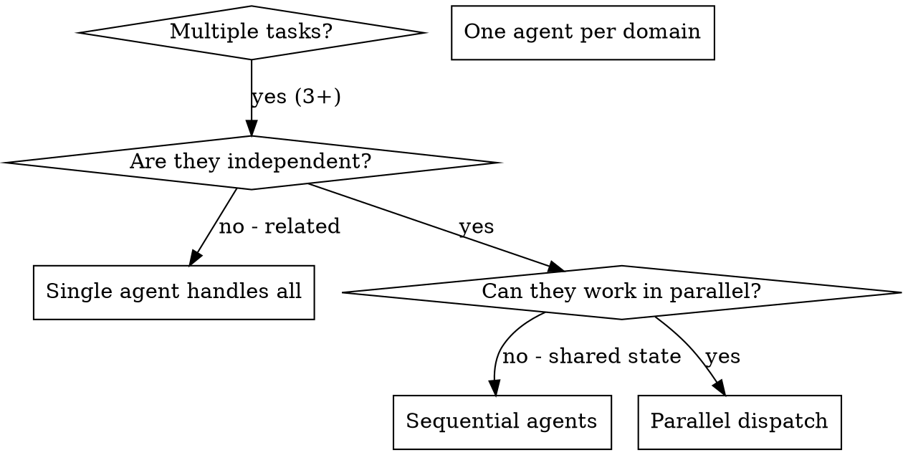

# Dispatching Parallel Agents

## Overview

When you have multiple unrelated tasks (debugging failures, analyzing codebases, researching patterns), working on them sequentially wastes time. Each task is independent and can happen in parallel.

**Core principle:** Dispatch one agent per independent domain. Let them work concurrently.

**Use for:** Debugging, research, analysis, or any independent tasks.

## When to Use



**Use when:**
- **Debugging:** 3+ test files failing with different root causes
- **Research:** Analyzing multiple independent codebases/frameworks
- **Analysis:** Investigating separate problem domains
- Each task can be understood without context from others
- No shared state between tasks

**Don't use when:**
- Tasks are related (one informs the other)
- Need to understand full system state
- Agents would interfere with each other
- Tasks require sequential execution

## The Pattern

### 1. Identify Independent Domains

Group failures by what's broken:
- File A tests: Tool approval flow
- File B tests: Batch completion behavior
- File C tests: Abort functionality

Each domain is independent - fixing tool approval doesn't affect abort tests.

### 2. Create Focused Agent Tasks

Each agent gets:
- **Specific scope:** One test file or subsystem
- **Clear goal:** Make these tests pass
- **Constraints:** Don't change other code
- **Expected output:** Summary of what you found and fixed

### 3. Dispatch in Parallel

```typescript
// In Claude Code / AI environment
Task("Fix agent-tool-abort.test.ts failures")
Task("Fix batch-completion-behavior.test.ts failures")
Task("Fix tool-approval-race-conditions.test.ts failures")
// All three run concurrently
```

### 4. Review and Integrate

When agents return:
- Read each summary
- Verify fixes don't conflict
- Run full test suite
- Integrate all changes

## Agent Prompt Structure

Good agent prompts are:
1. **Focused** - One clear problem domain
2. **Self-contained** - All context needed to understand the problem
3. **Specific about output** - What should the agent return?

```markdown
Fix the 3 failing tests in src/agents/agent-tool-abort.test.ts:

1. "should abort tool with partial output capture" - expects 'interrupted at' in message
2. "should handle mixed completed and aborted tools" - fast tool aborted instead of completed
3. "should properly track pendingToolCount" - expects 3 results but gets 0

These are timing/race condition issues. Your task:

1. Read the test file and understand what each test verifies
2. Identify root cause - timing issues or actual bugs?
3. Fix by:
   - Replacing arbitrary timeouts with event-based waiting
   - Fixing bugs in abort implementation if found
   - Adjusting test expectations if testing changed behavior

Do NOT just increase timeouts - find the real issue.

Return: Summary of what you found and what you fixed.
```

## Common Mistakes

**❌ Too broad:** "Fix all the tests" - agent gets lost
**✅ Specific:** "Fix agent-tool-abort.test.ts" - focused scope

**❌ No context:** "Fix the race condition" - agent doesn't know where
**✅ Context:** Paste the error messages and test names

**❌ No constraints:** Agent might refactor everything
**✅ Constraints:** "Do NOT change production code" or "Fix tests only"

**❌ Vague output:** "Fix it" - you don't know what changed
**✅ Specific:** "Return summary of root cause and changes"

## When NOT to Use

**Related tasks:** One task informs the other - work sequentially
**Need full context:** Understanding requires seeing entire system together
**Exploratory work:** You don't know what domains exist yet
**Shared state:** Agents would interfere (editing same files, conflicting changes)
**Sequential dependencies:** Task B requires results from Task A

## Real Examples

### Example 1: Debugging (2025-10-03)

**Scenario:** 6 test failures across 3 files after major refactoring

**Failures:**
- agent-tool-abort.test.ts: 3 failures (timing issues)
- batch-completion-behavior.test.ts: 2 failures (tools not executing)
- tool-approval-race-conditions.test.ts: 1 failure (execution count = 0)

**Decision:** Independent domains - abort logic separate from batch completion separate from race conditions

**Dispatch:**
```
Agent 1 → Fix agent-tool-abort.test.ts
Agent 2 → Fix batch-completion-behavior.test.ts
Agent 3 → Fix tool-approval-race-conditions.test.ts
```

**Results:**
- Agent 1: Replaced timeouts with event-based waiting
- Agent 2: Fixed event structure bug (threadId in wrong place)
- Agent 3: Added wait for async tool execution to complete

**Integration:** All fixes independent, no conflicts, full suite green

**Time saved:** 3 problems solved in parallel vs sequentially

### Example 2: Research (2025-10-23)

**Scenario:** Analyze 3 independent technology domains for pattern extraction

**Domains:**
- Domain 1: pytest testing framework patterns
- Domain 2: webpack/vite build tool patterns
- Domain 3: Terraform infrastructure patterns

**Decision:** Independent research - testing frameworks unrelated to build tools unrelated to IaC

**Dispatch:**
```typescript
Task("Analyze pytest patterns - best practices, anti-patterns, conventions. Return JSON.")
Task("Analyze webpack/vite patterns - config patterns, optimizations. Return JSON.")
Task("Analyze Terraform patterns - module structure, state management, security. Return JSON.")
```

**Results:**
- Agent 1: pytest best practices with fixture patterns
- Agent 2: webpack vs vite architectural differences
- Agent 3: Terraform module structure patterns

**Integration:** All analysis independent, combined into comprehensive report

**Time saved:** 3 domains analyzed in ~3 minutes vs 9+ minutes sequentially

## Key Benefits

1. **Parallelization** - Multiple investigations happen simultaneously
2. **Focus** - Each agent has narrow scope, less context to track
3. **Independence** - Agents don't interfere with each other
4. **Speed** - 3 problems solved in time of 1

## Verification

After agents return:
1. **Review each summary** - Understand what changed
2. **Check for conflicts** - Did agents edit same code?
3. **Run full suite** - Verify all fixes work together
4. **Spot check** - Agents can make systematic errors

## Real-World Impact

**Debugging session** (2025-10-03):
- 6 failures across 3 files → 3 agents dispatched
- All investigations completed concurrently
- All fixes integrated successfully, zero conflicts

**Research session** (2025-10-23):
- 3 technology domains → 3 agents dispatched
- Completed in ~3 minutes vs 9+ sequentially
- Structured JSON from all agents, combined into analysis

**Bake-off validation** (2025-10-23):
- Task tool approach: 100% success rate, 3-minute completion
- Simple one-line dispatch per agent
- Reliable across debugging and research use cases
