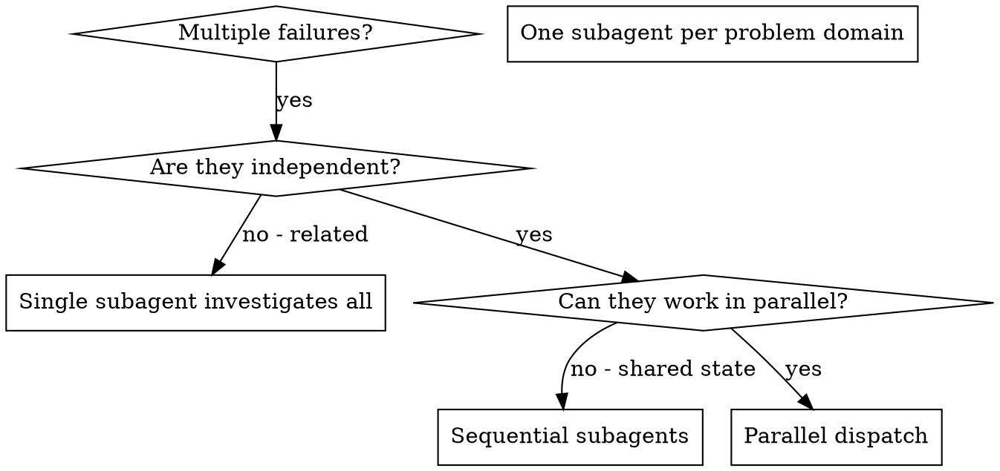

# Dispatching Parallel Agents

## Overview

When you have multiple unrelated failures (different test files, different subsystems, different bugs), investigating them sequentially wastes time. Each investigation is independent and can happen in parallel.

**Core principle:** Dispatch one subagent per independent problem domain. Let them work concurrently.

<requirements>
## Requirements

1. All Task calls in single message. Multiple messages serialize execution.
2. Tasks must be independent. Dependent tasks must run sequentially.
3. Synthesize results after all agents complete.
</requirements>

## When to Use



**Use when:**
- 3+ test files failing with different root causes
- Multiple subsystems broken independently
- Each problem can be understood without context from others
- No shared state between investigations

**Don't use when:**
- Failures are related (fix one might fix others)
- Need to understand full system state
- Subagents would interfere with each other

## The Pattern

### 1. Identify Independent Domains

Group failures by what's broken:
- File A tests: Tool approval flow
- File B tests: Batch completion behavior
- File C tests: Abort functionality

Each domain is independent - fixing tool approval doesn't affect abort tests.

### 2. Create Focused Subagent Tasks

Each subagent gets:
- **Specific scope:** One test file or subsystem
- **Clear goal:** Make these tests pass
- **Constraints:** Don't change other code
- **Expected output:** Summary of what you found and fixed

### 3. Dispatch in Parallel

```typescript
// In Claude Code / AI environment
// Use model: haiku for parallel investigation subagents (fast, cost-effective)
Task("Fix agent-tool-abort.test.ts failures", model: "haiku")
Task("Fix batch-completion-behavior.test.ts failures", model: "haiku")
Task("Fix tool-approval-race-conditions.test.ts failures", model: "haiku")
// All three run concurrently
```

### 4. Review and Integrate

When subagents return:
- Read each summary
- Verify fixes don't conflict
- Run full test suite
- Integrate all changes

## Subagent Prompt Structure

Good subagent prompts are:
1. **Focused** - One clear problem domain
2. **Self-contained** - All context needed to understand the problem
3. **Specific about output** - What should the subagent return?

```markdown
Fix the 3 failing tests in src/agents/agent-tool-abort.test.ts:

1. "should abort tool with partial output capture" - expects 'interrupted at' in message
2. "should handle mixed completed and aborted tools" - fast tool aborted instead of completed
3. "should properly track pendingToolCount" - expects 3 results but gets 0

These are timing/race condition issues. Your task:

1. Read the test file and understand what each test verifies
2. Identify root cause - timing issues or actual bugs?
3. Fix by:
   - Replacing arbitrary timeouts with event-based waiting
   - Fixing bugs in abort implementation if found
   - Adjusting test expectations if testing changed behavior

Do NOT just increase timeouts - find the real issue.

Return: Summary of what you found and what you fixed.
```

## Structured Output Requirements

Each parallel subagent must return results in structured format to enable synthesis without re-reading subagent thinking:

```markdown
## Findings: [Aspect Name]

**Status:** complete | partial | failed

**Key Findings:**
1. [finding with file path reference]
2. [finding with file path reference]

**Files Examined:**
- path/to/file.ts (relevant because...)

**Gaps/Unknowns:**
- [anything not found or unclear]
```

**Why structure matters:**
- Orchestrator can synthesize without parsing freeform text
- Status field enables quick triage of results
- File references enable verification
- Gaps surface incomplete coverage

## Common Mistakes

**❌ Too broad:** "Fix all the tests" - subagent gets lost
**✅ Specific:** "Fix agent-tool-abort.test.ts" - focused scope

**❌ No context:** "Fix the race condition" - subagent doesn't know where
**✅ Context:** Paste the error messages and test names

**❌ No constraints:** Subagent might refactor everything
**✅ Constraints:** "Do NOT change production code" or "Fix tests only"

**❌ Vague output:** "Fix it" - you don't know what changed
**✅ Specific:** "Return summary of root cause and changes"

## When NOT to Use

**Related failures:** Fixing one might fix others - investigate together first
**Need full context:** Understanding requires seeing entire system
**Exploratory debugging:** You don't know what's broken yet
**Shared state:** Subagents would interfere (editing same files, using same resources)

## When to Use Parallel vs Sequential

**Use Parallel When:**
- Tasks are truly independent (no shared state)
- Tasks don't modify same files
- Faster throughput is priority
- Tasks can be verified independently

**Use Sequential When:**
- Tasks have dependencies
- Order matters for correctness
- Debugging clarity is needed
- Tasks share state or files

**Anti-Pattern: Forced Parallelism**
Don't parallelize just because you can. Coordination overhead can exceed time savings. If you spend more time defining task boundaries and merging results than you would just doing tasks sequentially, parallelism isn't helping.

## Real Example from Session

**Scenario:** 6 test failures across 3 files after major refactoring

**Failures:**
- agent-tool-abort.test.ts: 3 failures (timing issues)
- batch-completion-behavior.test.ts: 2 failures (tools not executing)
- tool-approval-race-conditions.test.ts: 1 failure (execution count = 0)

**Decision:** Independent domains - abort logic separate from batch completion separate from race conditions

**Dispatch:**
```
Subagent 1 → Fix agent-tool-abort.test.ts
Subagent 2 → Fix batch-completion-behavior.test.ts
Subagent 3 → Fix tool-approval-race-conditions.test.ts
```

**Results:**
- Subagent 1: Replaced timeouts with event-based waiting
- Subagent 2: Fixed event structure bug (threadId in wrong place)
- Subagent 3: Added wait for async tool execution to complete

**Integration:** All fixes independent, no conflicts, full suite green

**Time saved:** 3 problems solved in parallel vs sequentially

## Key Benefits

1. **Parallelization** - Multiple investigations happen simultaneously
2. **Focus** - Each subagent has narrow scope, less context to track
3. **Independence** - Subagents don't interfere with each other
4. **Speed** - 3 problems solved in time of 1

## Model Selection

Per [Anthropic's guidance](https://platform.claude.com/docs/en/about-claude/models/choosing-a-model), use `model: haiku` for parallel investigation subagents:

- **Speed:** Haiku runs 4-5x faster than Sonnet
- **Cost:** Fraction of Sonnet pricing for high-volume dispatching
- **Quality:** Haiku 4.5 matches Sonnet 4 on coding and agentic workflows
- **Pattern:** Orchestrator (Sonnet/Opus) dispatches Haiku subagents

**When to use Sonnet/Opus instead:**
- Complex architectural decisions
- Multi-file refactoring requiring holistic understanding
- Tasks where reasoning quality is paramount

<verification>
## Dispatch Verification

Before dispatching agents:

**Independence Gate:**

- [ ] Confirmed tasks are independent (no shared state)
- [ ] Tasks don't modify same files
- [ ] Each agent has specific scope (one test file/subsystem)

If any task has dependencies, parallel dispatch causes race conditions. Use sequential dispatch instead.

**Prompt Quality Gate (per agent):**

- [ ] Specific scope defined (not "fix the tests")
- [ ] Context included (error messages, test names)
- [ ] Constraints stated (what NOT to change)
- [ ] Structured output format specified

If prompt is vague, subagent gets lost and wastes tokens. Rewrite before dispatching.

After agents return:

**Integration Gate:**

- [ ] Read each summary
- [ ] Verified no conflicts (same files modified)
- [ ] Ran full test suite
- [ ] All changes integrate cleanly

If conflicts detected, merging produces broken code. Resolve before proceeding.
</verification>

## Red Flags

| Pattern | Consequence | Recovery |
|---------|-------------|----------|
| Parallelizing without checking independence | Shared state causes race conditions | Re-read task descriptions, identify true dependencies |
| Vague prompts like "fix the tests" | Subagent gets lost, wastes tokens | Rewrite with specific scope and context |
| Dependencies mentioned but then ignored | Creates cascading failures | Revert to sequential dispatch, fix order |
| Integration test skipped | Can't verify fixes work together | Run full suite before accepting results |
| "These look independent" without verification | Assumptions fail in practice | Explicitly check files and state access patterns |

## Verification

After subagents return:
1. **Review each summary** - Understand what changed
2. **Check for conflicts** - Did subagents edit same code?
3. **Run full suite** - Verify all fixes work together
4. **Spot check** - Subagents can make systematic errors

## Real-World Impact

From debugging session (2025-10-03):
- 6 failures across 3 files
- 3 subagents dispatched in parallel
- All investigations completed concurrently
- All fixes integrated successfully
- Zero conflicts between subagent changes

<requirements>
## Requirements Reminder

1. All Task calls in single message. Multiple messages serialize execution.
2. Tasks must be independent. Dependent tasks must run sequentially.
3. Synthesize results after all agents complete.
</requirements>
