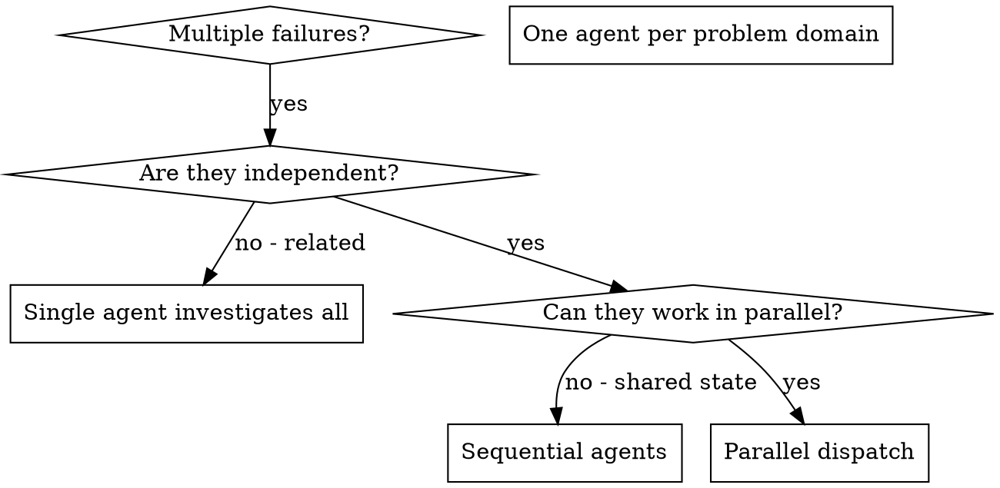

# Dispatching Parallel Agents

## Overview

When you have multiple unrelated failures (different test files, different subsystems, different bugs), investigating them sequentially wastes time. Each investigation is independent and can happen in parallel.

**Core principle:** Dispatch one agent per independent problem domain. Let them work concurrently.

## Step 0: Load Document Context (文档上下文传递)

**Before dispatching agents:**

IF `.horspowers-config.yaml` exists AND `documentation.enabled: true`:

1. **Read task document path** (if set):
   ```bash
   # 检查任务文档是否存在
   if [ -n "$TASK_DOC" ] && [ -f "$TASK_DOC" ]; then
     echo "✅ 任务文档: $TASK_DOC"
     cat "$TASK_DOC"
   elif [ -n "$TASK_DOC" ]; then
     # 文档路径设置但文件不存在 - 增强处理
     echo "⚠️  警告: TASK_DOC 已设置但文件不存在: $TASK_DOC"
     echo ""

     # 尝试搜索相关文档
     echo "🔍 搜索相关文档..."
     RECENT_TASKS=$(find docs/active -name "task*.md" -mtime -7 2>/dev/null | head -3)
     if [ -n "$RECENT_TASKS" ]; then
       echo "最近的任务文档:"
       echo "$RECENT_TASKS"
     fi

     # 从 git log 获取上下文
     echo ""
     echo "📝 从 git 获取上下文..."
     git log --oneline -5 2>/dev/null || true
     CURRENT_BRANCH=$(git branch --show-current 2>/dev/null || echo "unknown")
     echo "当前分支: $CURRENT_BRANCH"

     # 提供流程引导建议
     echo ""
     echo "💡 推荐工作流程:"
     echo "   完整流程: brainstorming → writing-plans → (当前技能)"
     echo ""

     # 检查文档系统是否初始化
     if [ ! -d "docs/active" ]; then
       echo "📋 文档系统未初始化。运行 'horspowers:document-management' 初始化文档系统。"
     fi

     echo "继续使用可用上下文分发代理..."
   fi
   ```

2. **Read related documents** (if specified in task document):
   ```bash
   # 设计文档 (如果在任务文档中链接)
   DESIGN_DOC="docs/plans/YYYY-MM-DD-design-<topic>.md"
   if [ -f "$DESIGN_DOC" ]; then
     echo "✅ 设计文档: $DESIGN_DOC"
     cat "$DESIGN_DOC"
   fi

   # 计划文档 (如果在任务文档中链接)
   PLAN_DOC="docs/plans/YYYY-MM-DD-<feature>.md"
   if [ -f "$PLAN_DOC" ]; then
     echo "✅ 计划文档: $PLAN_DOC"
     cat "$PLAN_DOC"
   fi
   ```

3. **Prepare document context for each agent**:
   Each agent prompt should include:
   - Relevant document paths (for reference)
   - Task/Plan/Design context snippets
   - Bug document path if applicable (`$BUG_DOC`)

**Note:** 如果文档不存在，跳过加载并使用可用上下文继续分发代理。

**IF documentation is NOT enabled:**
- Skip document loading
- Proceed with agent dispatch

## When to Use



**Use when:**
- 3+ test files failing with different root causes
- Multiple subsystems broken independently
- Each problem can be understood without context from others
- No shared state between investigations

**Don't use when:**
- Failures are related (fix one might fix others)
- Need to understand full system state
- Agents would interfere with each other

## The Pattern

### 1. Identify Independent Domains

Group failures by what's broken:
- File A tests: Tool approval flow
- File B tests: Batch completion behavior
- File C tests: Abort functionality

Each domain is independent - fixing tool approval doesn't affect abort tests.

### 2. Create Focused Agent Tasks

Each agent gets:
- **Specific scope:** One test file or subsystem
- **Clear goal:** Make these tests pass
- **Constraints:** Don't change other code
- **Expected output:** Summary of what you found and fixed

### 3. Dispatch in Parallel

```typescript
// In Claude Code / AI environment
Task("Fix agent-tool-abort.test.ts failures")
Task("Fix batch-completion-behavior.test.ts failures")
Task("Fix tool-approval-race-conditions.test.ts failures")
// All three run concurrently
```

### 4. Review and Integrate

When agents return:
- Read each summary
- Verify fixes don't conflict
- Run full test suite
- Integrate all changes

### 4.5. Update Task Document (汇总进度)

**After all agents complete:**

IF `.horspowers-config.yaml` exists AND `documentation.enabled: true`:

**IF `$TASK_DOC` is set:**
```bash
# Update task document with parallel agent results
node -e "
const fs = require('fs');
const taskDoc = process.env.TASK_DOC;
if (fs.existsSync(taskDoc)) {
    let content = fs.readFileSync(taskDoc, 'utf8');
    const timestamp = new Date().toISOString().slice(0, 10);

    const results = [
        { agent: 'Agent 1', result: 'Fixed X' },
        { agent: 'Agent 2', result: 'Fixed Y' },
        { agent: 'Agent 3', result: 'Fixed Z' }
    ];

    let summary = \`- \${timestamp}: 并行代理执行完成\\n\`;
    results.forEach(r => {
        summary += \`  - \${r.agent}: \${r.result}\\n\`;
    });

    if (content.includes('## 进展记录')) {
        content = content.replace(
            /(## 进展记录\\n[\\s\\S]*?)(?=\\n##|\\Z)/,
            '\$1\\n' + summary
        );
    }

    fs.writeFileSync(taskDoc, content);
}
"
```

## Agent Prompt Structure

Good agent prompts are:
1. **Focused** - One clear problem domain
2. **Self-contained** - All context needed to understand the problem
3. **Specific about output** - What should the agent return?

```markdown
Fix the 3 failing tests in src/agents/agent-tool-abort.test.ts:

1. "should abort tool with partial output capture" - expects 'interrupted at' in message
2. "should handle mixed completed and aborted tools" - fast tool aborted instead of completed
3. "should properly track pendingToolCount" - expects 3 results but gets 0

These are timing/race condition issues. Your task:

1. Read the test file and understand what each test verifies
2. Identify root cause - timing issues or actual bugs?
3. Fix by:
   - Replacing arbitrary timeouts with event-based waiting
   - Fixing bugs in abort implementation if found
   - Adjusting test expectations if testing changed behavior

Do NOT just increase timeouts - find the real issue.

Return: Summary of what you found and what you fixed.
```

## Common Mistakes

**❌ Too broad:** "Fix all the tests" - agent gets lost
**✅ Specific:** "Fix agent-tool-abort.test.ts" - focused scope

**❌ No context:** "Fix the race condition" - agent doesn't know where
**✅ Context:** Paste the error messages and test names

**❌ No constraints:** Agent might refactor everything
**✅ Constraints:** "Do NOT change production code" or "Fix tests only"

**❌ Vague output:** "Fix it" - you don't know what changed
**✅ Specific:** "Return summary of root cause and changes"

## When NOT to Use

**Related failures:** Fixing one might fix others - investigate together first
**Need full context:** Understanding requires seeing entire system
**Exploratory debugging:** You don't know what's broken yet
**Shared state:** Agents would interfere (editing same files, using same resources)

## Real Example from Session

**Scenario:** 6 test failures across 3 files after major refactoring

**Failures:**
- agent-tool-abort.test.ts: 3 failures (timing issues)
- batch-completion-behavior.test.ts: 2 failures (tools not executing)
- tool-approval-race-conditions.test.ts: 1 failure (execution count = 0)

**Decision:** Independent domains - abort logic separate from batch completion separate from race conditions

**Dispatch:**
```
Agent 1 → Fix agent-tool-abort.test.ts
Agent 2 → Fix batch-completion-behavior.test.ts
Agent 3 → Fix tool-approval-race-conditions.test.ts
```

**Results:**
- Agent 1: Replaced timeouts with event-based waiting
- Agent 2: Fixed event structure bug (threadId in wrong place)
- Agent 3: Added wait for async tool execution to complete

**Integration:** All fixes independent, no conflicts, full suite green

**Time saved:** 3 problems solved in parallel vs sequentially

## Key Benefits

1. **Parallelization** - Multiple investigations happen simultaneously
2. **Focus** - Each agent has narrow scope, less context to track
3. **Independence** - Agents don't interfere with each other
4. **Speed** - 3 problems solved in time of 1

## Verification

After agents return:
1. **Review each summary** - Understand what changed
2. **Check for conflicts** - Did agents edit same code?
3. **Run full suite** - Verify all fixes work together
4. **Spot check** - Agents can make systematic errors

## Real-World Impact

From debugging session (2025-10-03):
- 6 failures across 3 files
- 3 agents dispatched in parallel
- All investigations completed concurrently
- All fixes integrated successfully
- Zero conflicts between agent changes
