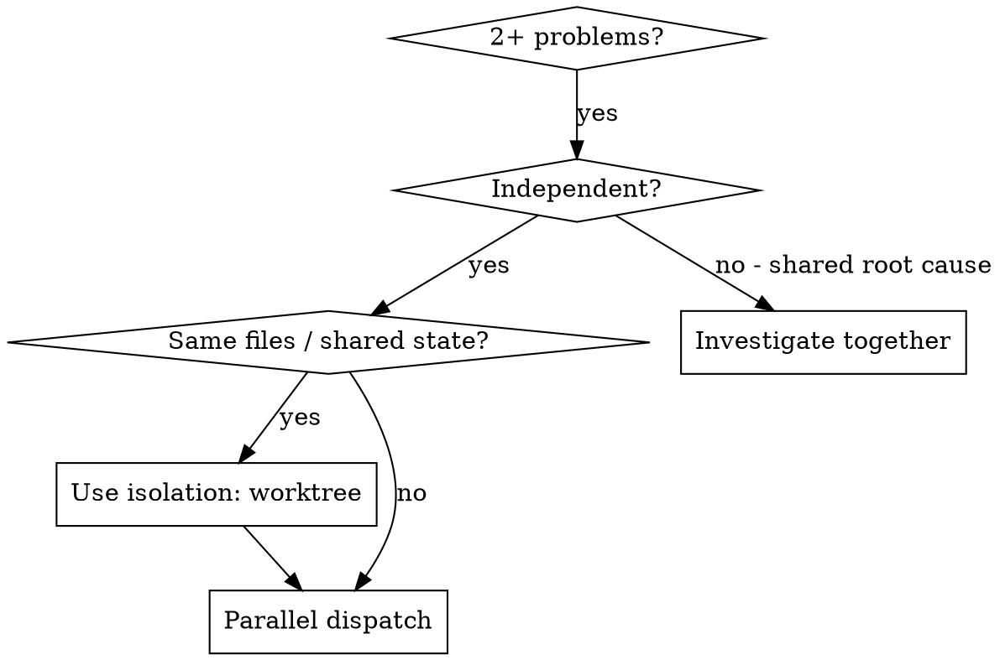

# Dispatching Parallel Agents

## Overview

Independent problems should be investigated concurrently, not sequentially. Each problem gets one Agent with focused scope and a cold context you construct deliberately. You stay the coordinator; the Agents do the work.

**Core principle:** One Agent per independent problem domain, dispatched in a single assistant turn so they run in parallel.

## When to use


```dot
digraph when {
    "2+ problems?" [shape=diamond];
    "Independent?" [shape=diamond];
    "Same files / shared state?" [shape=diamond];
    "Investigate together" [shape=box];
    "Use isolation: worktree" [shape=box];
    "Parallel dispatch" [shape=box];

    "2+ problems?" -> "Independent?" [label="yes"];
    "Independent?" -> "Investigate together" [label="no - shared root cause"];
    "Independent?" -> "Same files / shared state?" [label="yes"];
    "Same files / shared state?" -> "Use isolation: worktree" [label="yes"];
    "Same files / shared state?" -> "Parallel dispatch" [label="no"];
    "Use isolation: worktree" -> "Parallel dispatch";
}
```

**Use when:** 2+ failing test files with different root causes, multiple broken subsystems, independent research questions, parallel code reads across unrelated modules.

**Don't use when:** failures might share a root cause (investigate together first), you're still exploring what's broken, or you only have one real problem dressed up as several.

## The hard rule: one assistant message, multiple Agent calls

Parallelism comes from a SINGLE assistant turn containing MULTIPLE `Agent` tool calls. Two consecutive turns with one Agent call each run **sequentially**, even if you tell the user "I'm running them in parallel."

```
✅ ONE assistant message with three tool_use blocks:
   Agent(description="Fix abort tests", prompt="...", subagent_type="general-purpose")
   Agent(description="Fix batch tests", prompt="...", subagent_type="general-purpose")
   Agent(description="Fix race tests",  prompt="...", subagent_type="general-purpose")

❌ Three messages, one Agent each → sequential
❌ Task(...) or TaskCreate(...) → wrong tool. The tool is Agent.
```

All Agent options are **top-level parameters** on the tool call, not nested. Full shape:

```
Agent({
  description: "Short 3-5 word label",            // required
  prompt:      "Self-contained briefing...",       // required
  subagent_type:    "general-purpose",             // optional, defaults to general-purpose
  isolation:        "worktree",                    // optional
  run_in_background: false,                        // optional, default false
  model:            "haiku" | "sonnet" | "opus",  // optional, inherits
  name:             "auditor",                     // optional, enables SendMessage
})
```

## Choose the right `subagent_type`

| Job | `subagent_type` |
|---|---|
| Find / grep / locate code | `Explore` |
| Open-ended research, multi-step | `general-purpose` |
| Design implementation strategy | `Plan` or `feature-dev:code-architect` |
| Independent code review | `feature-dev:code-reviewer` |
| Trace an existing feature's architecture | `feature-dev:code-explorer` |
| PostHog error triage | `posthog:error-analyzer` |

Default to `general-purpose` when none clearly fits. Picking deliberately matters more than prompt wording.

## Useful Agent options

- `isolation: "worktree"`. Runs the Agent in a temp git worktree. Default-on for any parallel dispatch that touches files (tests fixes, refactors, parallel code edits). Read-only Agents (`Explore`, research) don't need it. When in doubt, isolate.
- `run_in_background: true`. Fire-and-forget; you'll be auto-notified on completion. Use only for genuinely independent work whose result you don't need before continuing. Foreground (default) blocks the turn until the Agent returns.
- `model: "haiku"`. Cheaper model for mechanical work (mass renames, log scraping). Inherits from parent if omitted.
- `name: "auditor"`. Name the Agent so you can continue it later with `SendMessage({to: "auditor", ...})` instead of starting a fresh one with no memory.

## Prompt the Agent like a cold colleague

The Agent starts with no memory of your conversation. Brief it self-contained:

1. **Goal.** What to accomplish and why it matters.
2. **Context.** File paths with line numbers, what you've ruled out, what you've already tried.
3. **Constraints.** "Tests only, don't touch production code", scope limits.
4. **Output shape.** "Return a 200-word punch list", "report root cause + diff summary".

**Never delegate understanding.** Don't write "based on your findings, fix the bug" or "decide the best approach and implement it." Those push synthesis onto the Agent. Make the decision yourself, then dispatch surgical work.

## Common mistakes

| Mistake | Fix |
|---|---|
| `Task(...)` / `TaskCreate(...)` | Use `Agent`. |
| Agents in separate messages | Batch into ONE message with multiple tool_use blocks. |
| No `subagent_type` chosen | Pick deliberately from the table. |
| Vague scope ("fix the tests") | One file or subsystem per Agent. |
| "Decide the best approach and implement" | You decide. Agent executes. |
| Re-running greps the Agent already ran | If you delegated research, don't duplicate it. |
| Reading the summary as truth | Read the diff. Summaries describe intent, not result. |
| Two Agents editing the same file | Use `isolation: "worktree"`. |

## Verification

When Agents return:

1. **Read the diff, not the summary.** The summary is what the Agent *intended*. The diff is what it *did*.
2. **Check for cross-Agent collisions.** Overlapping file edits, duplicate fixes, contradictory changes.
3. **Run the full suite, not just touched files.** Independent fixes can fail together.
4. **Spot-check assertions.** Agents sometimes "fix" tests by weakening them.

## Red flags

In-the-moment rationalizations that mean **stop**:

- "Let me check Agent 1's result before dispatching Agent 2." That's sequential. Batch them.
- "The Agent will figure out the right approach." You decide. Agent executes.
- "The summary says it's fixed." Look at the diff first.
- "I'll re-grep to confirm what the Agent found." Don't duplicate delegated work; verify against the diff.

