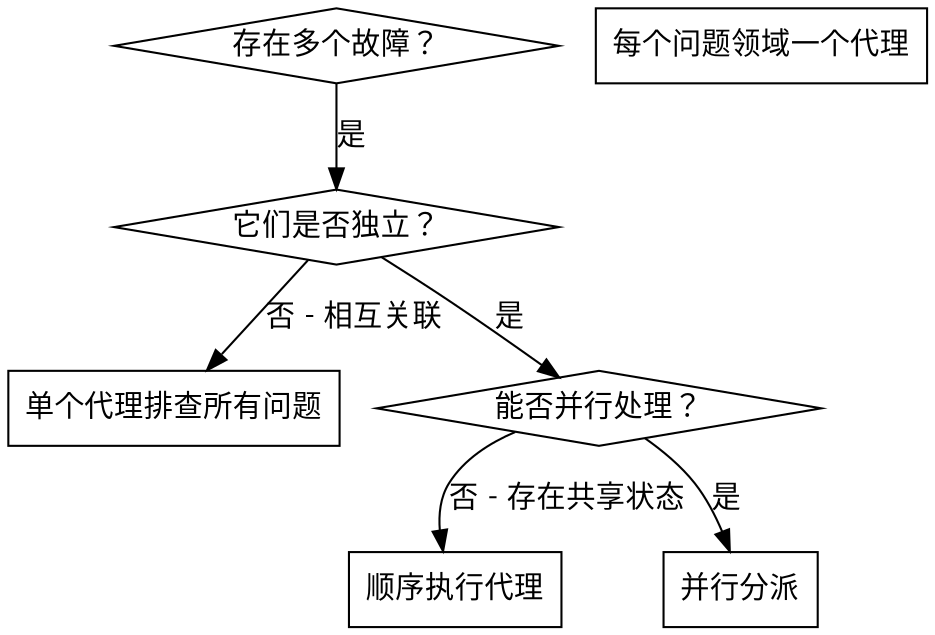

# 调度并行代理

## 概述

当你遇到多个不相关的故障（不同的测试文件、不同的子系统、不同的缺陷）时，按顺序逐一排查会浪费时间。每个排查工作都是独立的，可以并行进行。

**核心原则：** 为每个独立的问题领域分派一个代理，让它们并发执行。

## 何时使用


```dot
digraph when_to_use {
    "存在多个故障？" [shape=diamond];
    "它们是否独立？" [shape=diamond];
    "单个代理排查所有问题" [shape=box];
    "每个问题领域一个代理" [shape=box];
    "能否并行处理？" [shape=diamond];
    "顺序执行代理" [shape=box];
    "并行分派" [shape=box];

    "存在多个故障？" -> "它们是否独立？" [label="是"];
    "它们是否独立？" -> "单个代理排查所有问题" [label="否 - 相互关联"];
    "它们是否独立？" -> "能否并行处理？" [label="是"];
    "能否并行处理？" -> "并行分派" [label="是"];
    "能否并行处理？" -> "顺序执行代理" [label="否 - 存在共享状态"];
}
```

**适用场景：**
- 3 个以上测试文件因不同根因而失败
- 多个子系统各自独立地出现故障
- 每个问题无需其他问题的上下文即可理解
- 各项排查之间没有共享状态

**不适用场景：**
- 故障之间存在关联（修复一个可能修复其他的）
- 需要理解系统的完整状态
- 代理之间会相互干扰

## 使用模式

### 1. 识别独立领域

按故障类型进行分组：
- 文件 A 的测试：工具审批流程
- 文件 B 的测试：批处理完成行为
- 文件 C 的测试：中止功能

每个领域都是独立的——修复工具审批不会影响中止测试。

### 2. 创建聚焦的代理任务

每个代理需要：
- **明确的范围：** 一个测试文件或子系统
- **清晰的目标：** 使这些测试通过
- **约束条件：** 不要修改其他代码
- **预期输出：** 总结发现的问题和修复方案

### 3. 并行分派

```typescript
// 在 Claude Code / AI 环境中
Task("修复 agent-tool-abort.test.ts 的失败用例")
Task("修复 batch-completion-behavior.test.ts 的失败用例")
Task("修复 tool-approval-race-conditions.test.ts 的失败用例")
// 三个任务并发执行
```

### 4. 审查与集成

当代理返回结果时：
- 阅读每份总结
- 验证修复之间不存在冲突
- 运行完整的测试套件
- 集成所有更改

## 代理提示词结构

好的代理提示词应该具备：
1. **聚焦** - 一个明确的问题领域
2. **自包含** - 包含理解问题所需的全部上下文
3. **输出明确** - 代理应该返回什么？

```markdown
修复 src/agents/agent-tool-abort.test.ts 中的 3 个失败测试：

1. "should abort tool with partial output capture" - 期望消息中包含 'interrupted at'
2. "should handle mixed completed and aborted tools" - 快速工具被中止而非完成
3. "should properly track pendingToolCount" - 期望 3 个结果但得到 0 个

这些是时序/竞态条件问题。你的任务：

1. 阅读测试文件，理解每个测试验证的内容
2. 找出根因——是时序问题还是实际缺陷？
3. 修复方式：
   - 用基于事件的等待替换任意超时
   - 如果发现中止实现中的缺陷则修复
   - 如果测试的是已变更的行为则调整测试期望值

不要仅仅增加超时时间——找到真正的问题所在。

返回：你发现的问题和修复内容的总结。
```

## 常见错误

**错误示范：** "修复所有测试" - 代理会迷失方向
**正确示范：** "修复 agent-tool-abort.test.ts" - 范围聚焦

**错误示范：** "修复竞态条件" - 代理不知道在哪里
**正确示范：** 粘贴错误信息和测试名称

**错误示范：** 没有约束条件 - 代理可能会重构所有代码
**正确示范：** "不要修改生产代码" 或 "仅修复测试"

**错误示范：** "修好它" - 你不知道改了什么
**正确示范：** "返回根因分析和更改内容的总结"

## 何时不应使用

**关联故障：** 修复一个可能修复其他的——应先一起排查
**需要完整上下文：** 理解问题需要看到整个系统
**探索性调试：** 你还不知道什么出了问题
**共享状态：** 代理之间会相互干扰（编辑同一文件、使用同一资源）

## 实际会话中的示例

**场景：** 重大重构后，3 个文件中出现 6 个测试失败

**失败情况：**
- agent-tool-abort.test.ts：3 个失败（时序问题）
- batch-completion-behavior.test.ts：2 个失败（工具未执行）
- tool-approval-race-conditions.test.ts：1 个失败（执行计数 = 0）

**决策：** 独立领域——中止逻辑与批处理完成相互独立，与竞态条件也相互独立

**分派：**
```
代理 1 → 修复 agent-tool-abort.test.ts
代理 2 → 修复 batch-completion-behavior.test.ts
代理 3 → 修复 tool-approval-race-conditions.test.ts
```

**结果：**
- 代理 1：用基于事件的等待替换了超时
- 代理 2：修复了事件结构缺陷（threadId 放置位置错误）
- 代理 3：添加了对异步工具执行完成的等待

**集成：** 所有修复相互独立，无冲突，完整测试套件全部通过

**节省的时间：** 3 个问题并行解决，而非顺序处理

## 关键优势

1. **并行化** - 多项排查同时进行
2. **聚焦** - 每个代理范围狭窄，需要跟踪的上下文更少
3. **独立性** - 代理之间互不干扰
4. **速度** - 在解决 1 个问题的时间内解决 3 个问题

## 验证

代理返回结果后：
1. **审查每份总结** - 了解变更了什么
2. **检查冲突** - 代理是否编辑了相同的代码？
3. **运行完整套件** - 验证所有修复协同工作
4. **抽查** - 代理可能会犯系统性错误

## 实际影响

来自调试会话（2025-10-03）：
- 3 个文件中的 6 个失败
- 并行分派了 3 个代理
- 所有排查并发完成
- 所有修复成功集成
- 代理之间的更改零冲突
