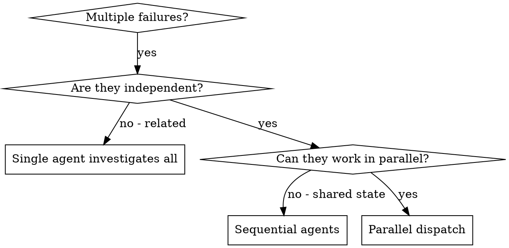

# Dispatching Parallel Agents

Delegate tasks to specialized agents with isolated context. They never inherit your session — you construct exactly what they need.

**Core principle:** One agent per independent problem domain. Let them work concurrently.

## When to Use

```dot
digraph when_to_use {
    "Multiple failures?" [shape=diamond];
    "Are they independent?" [shape=diamond];
    "Single agent investigates all" [shape=box];
    "Can they work in parallel?" [shape=diamond];
    "Sequential agents" [shape=box];
    "Parallel dispatch" [shape=box];

    "Multiple failures?" -> "Are they independent?" [label="yes"];
    "Are they independent?" -> "Single agent investigates all" [label="no - related"];
    "Are they independent?" -> "Can they work in parallel?" [label="yes"];
    "Can they work in parallel?" -> "Parallel dispatch" [label="yes"];
    "Can they work in parallel?" -> "Sequential agents" [label="no - shared state"];
}
```

**Use when:** 3+ failures with different root causes, multiple independent subsystems broken, no shared state between investigations.

**Don't use when:** Failures are related, need full system context, agents would interfere (editing same files).

## The Pattern

1. **Identify independent domains** — group failures by what's broken
2. **Create focused agent tasks** — each gets: specific scope, clear goal, constraints, expected output format
3. **Dispatch in parallel** — all agents run concurrently
4. **Review and integrate** — read summaries, verify no conflicts, run full suite

## Verification After Integration

1. Review each agent's summary
2. Check for conflicts (did agents edit same code?)
3. Run full test suite
4. Spot check — agents can make systematic errors

See `references/examples.md` for prompt templates, common mistakes, and a real-world walkthrough.
