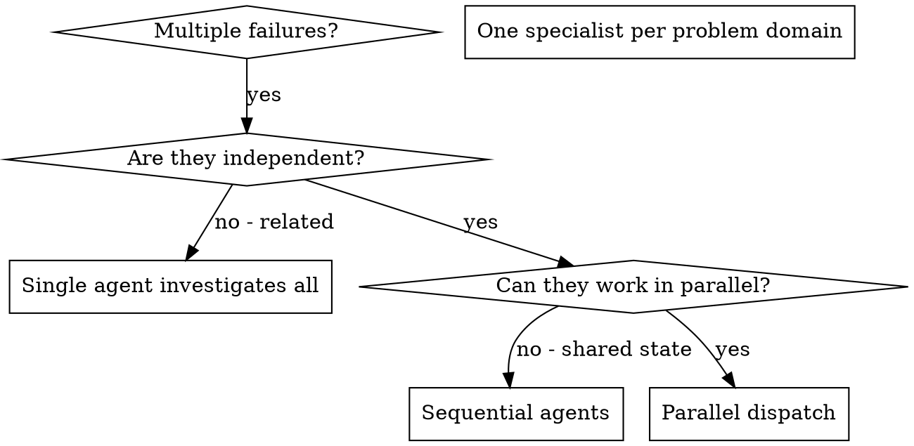

# Dispatching Parallel Agents

## Overview

When you have multiple unrelated failures (different test files, different subsystems, different bugs), investigating them sequentially wastes time. Each investigation is independent and can happen in parallel.

**Core principle:** Dispatch the right Amplifier specialist per independent problem domain. Let them work concurrently.

## Amplifier Agent Selection

Read `${CLAUDE_PLUGIN_ROOT}/AMPLIFIER-AGENTS.md` for the full mapping. Quick reference for parallel dispatch:

| Problem Domain | Amplifier Agent | Why This Specialist |
|---------------|-----------------|-------------------|
| Test failures | `bug-hunter` | Hypothesis-driven debugging, root cause analysis |
| Performance issues | `performance-optimizer` | Measure-first approach, 80/20 optimization |
| Security findings | `security-guardian` | OWASP patterns, vulnerability assessment |
| Integration breakage | `integration-specialist` | External system expertise, dependency management |
| UI regressions | `component-designer` | Component-level assessment, visual consistency |
| Schema problems | `database-architect` | Query optimization, migration expertise |
| API failures | `api-contract-designer` | Contract validation, endpoint analysis |

## When to Use


```dot
digraph when_to_use {
    "Multiple failures?" [shape=diamond];
    "Are they independent?" [shape=diamond];
    "Single agent investigates all" [shape=box];
    "One specialist per problem domain" [shape=box];
    "Can they work in parallel?" [shape=diamond];
    "Sequential agents" [shape=box];
    "Parallel dispatch" [shape=box];

    "Multiple failures?" -> "Are they independent?" [label="yes"];
    "Are they independent?" -> "Single agent investigates all" [label="no - related"];
    "Are they independent?" -> "Can they work in parallel?" [label="yes"];
    "Can they work in parallel?" -> "Parallel dispatch" [label="yes"];
    "Can they work in parallel?" -> "Sequential agents" [label="no - shared state"];
}
```

**Use when:**
- 3+ test files failing with different root causes
- Multiple subsystems broken independently
- Each problem can be understood without context from others
- No shared state between investigations

**Don't use when:**
- Failures are related (fix one might fix others)
- Need to understand full system state
- Agents would interfere with each other

## The Pattern

### 1. Identify Independent Domains

Group failures by what's broken:
- File A tests: Tool approval flow
- File B tests: Batch completion behavior
- File C tests: Abort functionality

Each domain is independent - fixing tool approval doesn't affect abort tests.

### 2. Select Amplifier Specialist per Domain

Match each domain to the right agent from the mapping table above. Each specialist brings domain expertise — a `bug-hunter` uses hypothesis-driven analysis, a `security-guardian` checks OWASP patterns, a `performance-optimizer` measures before fixing.

### 3. Dispatch in Parallel

```
Single message, three parallel Task calls:
- Task bug-hunter: "Fix 3 failing tests in auth.test.ts — timing issues"
- Task integration-specialist: "API connection failures to payment service"
- Task performance-optimizer: "Response time regression in /api/search"
```

All three run concurrently with specialist knowledge.

### 4. Review and Integrate

When agents return:
- Read each summary
- Verify fixes don't conflict
- Run full test suite
- Integrate all changes

## Agent Prompt Structure

Good agent prompts are:
1. **Focused** - One clear problem domain
2. **Self-contained** - All context needed to understand the problem
3. **Specific about output** - What should the agent return?

```markdown
Fix the 3 failing tests in src/agents/agent-tool-abort.test.ts:

1. "should abort tool with partial output capture" - expects 'interrupted at' in message
2. "should handle mixed completed and aborted tools" - fast tool aborted instead of completed
3. "should properly track pendingToolCount" - expects 3 results but gets 0

These are timing/race condition issues. Your task:

1. Read the test file and understand what each test verifies
2. Identify root cause - timing issues or actual bugs?
3. Fix by:
   - Replacing arbitrary timeouts with event-based waiting
   - Fixing bugs in abort implementation if found
   - Adjusting test expectations if testing changed behavior

Do NOT just increase timeouts - find the real issue.

Return: Summary of what you found and what you fixed.
```

## Common Mistakes

**❌ Too broad:** "Fix all the tests" - agent gets lost
**✅ Specific:** "Fix agent-tool-abort.test.ts" - focused scope

**❌ No context:** "Fix the race condition" - agent doesn't know where
**✅ Context:** Paste the error messages and test names

**❌ No constraints:** Agent might refactor everything
**✅ Constraints:** "Do NOT change production code" or "Fix tests only"

**❌ Vague output:** "Fix it" - you don't know what changed
**✅ Specific:** "Return summary of root cause and changes"

**❌ Wrong specialist:** Sending bug-hunter for a performance regression
**✅ Right specialist:** Sending performance-optimizer who will measure first

## When NOT to Use

**Related failures:** Fixing one might fix others - investigate together first
**Need full context:** Understanding requires seeing entire system
**Exploratory debugging:** You don't know what's broken yet
**Shared state:** Agents would interfere (editing same files, using same resources)

## Key Benefits

1. **Specialist knowledge** - Each agent brings domain expertise to its problem
2. **Parallelization** - Multiple investigations happen simultaneously
3. **Focus** - Each agent has narrow scope, less context to track
4. **Independence** - Agents don't interfere with each other
5. **Speed** - 3 problems solved in time of 1

## Verification

After agents return:
1. **Review each summary** - Understand what changed
2. **Check for conflicts** - Did agents edit same code?
3. **Run full suite** - Verify all fixes work together
4. **Spot check** - Agents can make systematic errors
